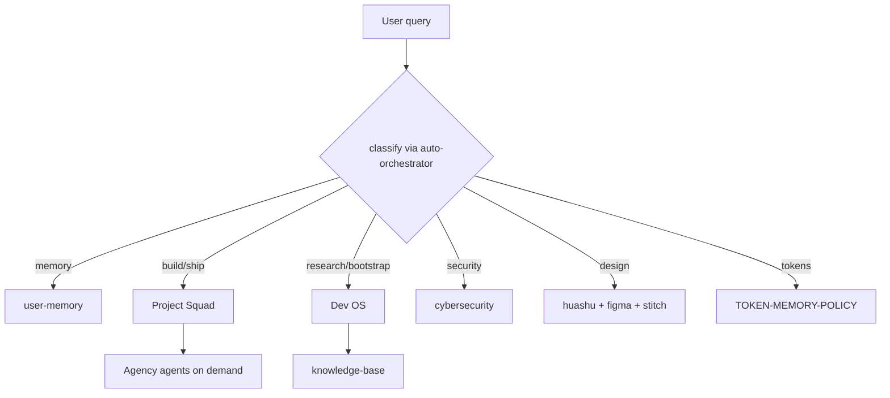

# System Taxonomy — Cursor Agent Hub

Canonical **22-domain** map for routing tasks to skills, MCP, subagents, and external foundations.  
**Registry:** `SYSTEM-REGISTRY.md` · **Tree:** `rules/auto-orchestrator.mdc` · **Foundations:** `docs/knowledge-base/`

> Load this file **on demand** (taxonomy refresh, new skill placement, agency planning). Never mirror full tables into always-on rules.

## Skill lifecycle (Session 2)

See **`ai-tracking/skills-taxonomy-s2.md`** — ACTIVE / ON-DEMAND / ARCHIVE.  
MCP tiers: **`ai-tracking/mcp-plugin-tiers-s2.md`** + `lib/mcp-router/McpTier.ps1`.  
Design candidates: **`ai-tracking/design-replace-candidates-s2.md`** (**installed** 2026-07-16; remotion optional).  
Other domains (SEO, n8n, engineering, content, security) — list only: **`ai-tracking/hub-replace-candidates-other-s2.md`**.

---

## How to read

| Column | Meaning |
|--------|---------|
| **Hub** | What you already have in `C:\Users\Asus\.cursor` |
| **Gap** | Optional add-on (install / MCP / external repo) |
| **Token** | Context cost tier: `L` low · `M` medium · `H` high |

---

## 1. Automation (business + content)

| Trigger | Hub route | Gap |
|---------|-----------|-----|
| n8n workflow JSON | `skills/n8n-workflow` · `n8n-mcp` | [n8n](https://github.com/n8n-io/n8n) self-host |
| Multi-step RPA / QA bots | `plugin-zapier-zapier` | [robotframework](https://github.com/robotframework/robotframework) |
| LLM app builder / RAG UI | `dev-os-research` | [dify](https://github.com/langgenius/dify) |

**Mix:** Zapier MCP for SaaS glue · n8n for owned pipelines · Squad `squad-build` for code nodes.

---

## 2. Security & data protection

| Trigger | Hub route | Gap |
|---------|-----------|-----|
| Repo / CI audit | `cybersecurity` skill (754 playbooks) | [GitHub Code Security](https://docs.github.com/en/code-security) |
| Supply-chain inventory | `docs/knowledge-base/FOUNDATION-REPOS.md` § Bumblebee | [bumblebee](https://github.com/perplexityai/bumblebee) CLI |
| Secrets / vault | cybersecurity → gitleaks chain | [HashiCorp Vault](https://github.com/hashicorp/vault) |
| DB + RLS | `plugin-supabase-supabase` | [supabase](https://github.com/supabase/supabase) |

**Policy:** defensive only · no offensive without explicit authorization · scan before adding third-party skills.

---

## 3. Agent orchestration

| Layer | Hub | External pattern |
|-------|-----|------------------|
| Meta / research | `dev-os` · `dev-os-research` | [ECC](https://github.com/affaan-m/ECC) harness OS |
| Execution | `project-squad` (10 agents) | [agency-agents](https://github.com/msitarzewski/agency-agents) (232 specialists) |
| Frameworks | Task tool fallbacks | [crewAI](https://github.com/joaomdmoura/crewAI) · [langchain](https://github.com/langchain-ai/langchain) · [openclaw](https://github.com/openclaw/openclaw) |

**Rule:** Boss (Opus) → Squad for build/ship · Dev OS for bootstrap · Agency agents **by division** on demand (see `AGENCY-PORTFOLIO-MAP.md`).

---

## 4. Token & cost optimization

| Technique | Where |
|-----------|-------|
| On-demand rules/skills only | `00-agent-orchestrator.mdc` |
| One web provider | Exa primary; no parallel crawl |
| Model tiering | `project-squad/reference/model-map.md` |
| HOT memory cap | `docs/knowledge-base/TOKEN-MEMORY-POLICY.md` |
| Karpathy surgical edits | `rules/karpathy-guidelines.mdc` |
| ECC instincts pattern | optional `~/.cursor/agent-data/` (Cursor boundary) |

**Refs:** [awesome-llm-token-optimization](https://github.com/pleasedodisturb/awesome-llm-token-optimization) · [TokenForge](https://github.com/hoysama/TokenForge) · [GitHub token efficiency blog](https://github.blog/ai-and-ml/github-copilot/improving-token-efficiency-in-github-agentic-workflows/)

---

## 5. Marketing & sales machines

| Trigger | Hub | Gap |
|---------|-----|-----|
| SEO / GEO | `seo-geo` (20 skills) | [seo-automation](https://github.com/itsZENR/seo-automation) |
| Copy / campaigns | `marketingskills` in `~/.agents/skills/` | suvvy.ai · upsale.pro · okocrm.com (CRM ops) |
| Agency personas | `AGENCY-PORTFOLIO-MAP.md` | agency-agents `marketing/` `sales/` `paid-media/` |

**Squad:** `squad-growth` for SEO/perf · spawn agency **Content Strategist** / **Sales Engineer** for deep copy.

---

## 6. Code quality

| Trigger | Hub | Gap |
|---------|-----|-----|
| Review / bugbot | `squad-review` · Task `bugbot` | [ai_repo_analyzer](https://github.com/Flufer/ai_repo_analyzer) |
| Symbol-safe edit | GitNexus impact → edit | [code scanning](https://docs.github.com/en/code-security/code-scanning) |
| Standards | `karpathy-guidelines` · ECC patterns | Codacy (external) |

---

## 7. Agent memory

| Tier | Store | Max inject |
|------|-------|------------|
| HOT | `user-memory` MCP | session facts only |
| WARM | `AGENTS.md` · `ai-tracking/` | project/decisions |
| COLD | Obsidian vault · GitHub | archives, not in every turn |

**Refs:** langchain · llama-index · Pinecone — use when client project needs vector RAG; hub stays MCP-light.

---

## 8A. Creative studio & generative media

| Trigger | Hub | Gap |
|---------|-----|-----|
| HTML motion / decks | `huashu-design` | — |
| UI from registry | `21st-design` + Magic MCP | — |
| Figma / Stitch | `plugin-figma-figma` · `stitch` | — |
| SD / Comfy / video | GenerateImage (Cursor) · `sora` skill | ComfyUI · A1111 · AnimateDiff · Stability |

**Squad:** `squad-design` owns creative stack mix.

---

## 8B. Prompt libraries

| Trigger | Hub | Gap |
|---------|-----|-----|
| Curated prompts | — (on demand) | [prompts.chat](https://github.com/f/prompts.chat) MCP |
| Niche prompts | — | [ai-prompts-library](https://github.com/FilimonovAlexey/ai-prompts-library) |

**Optional MCP** (see `mcp.json.example` § prompts.chat): remote `https://prompts.chat/api/mcp`.

---

## 9. Communication & structured data

| Trigger | Hub | Gap |
|---------|-----|-----|
| Human summaries | Boss default · `humanizer` skill | ECC `chief-of-staff` pattern |
| Validated I/O | client projects | [pydantic](https://github.com/pydantic/pydantic) |

---

## 10. SEO copywriting

Route: `seo-geo` → `seo-content-writer` · `geo-content-optimizer` · `marketingskills/ai-seo`.  
External: [AI_SEO_text_generation](https://github.com/Marrytorichelli/AI_SEO_text_generation).

---

## 11. LLM selection & fine-tuning

| Trigger | Hub | Gap |
|---------|-----|-----|
| Model pick per task | `model-map.md` · auto-orchestrator | — |
| Local LLM | — | [ollama](https://github.com/ollama/ollama) |
| Fine-tune | `dev-os-research` | transformers · LLM-Finetuning repos |

---

## 12. Multi-agent systems & commerce

| Hub | External |
|-----|----------|
| Squad v2 (10) | agency-agents (232) · [squad](https://github.com/bradygaster/squad) · [awesome-ai-agents-2026](https://github.com/caramaschiHG/awesome-ai-agents-2026) |

**Commerce agents:** map agency `sales/` + `product/` to client engagements; hub roster stays 10 (DEC-004).

---

## 13–22. Business verticals (quick route)

| # | Domain | Hub first | Key external |
|---|--------|-----------|--------------|
| 13 | B2B / processes | `dev-os` + agency `strategy/` | VirtoCommerce · fogbender b2b-saaskit · oroinc |
| 14 | Finance / math | Boss verify steps | explicit calculator; never trust mental math |
| 15 | Subscriptions | `plugin-stripe-stripe` | killbill · nextjs-subscription-payments |
| 16 | E-commerce | Squad build | medusa · vercel/commerce |
| 17 | Social | n8n + marketingskills `social` | public-apis · n8n social nodes |
| 18 | Transcription | — | whisper · vibe2text-mcp |
| 19 | Agent visualization | `tools/pixel-office/` | pixel-agents · ai-office · browser-use |
| 20 | Cursor / CI/CD | `cursor-system-refresh` | cursor repo · setup-node |
| 21 | CRM | Squad architect | twenty · idurar-erp-crm · espocrm |
| 22 | Cloud storage | `plugin-supabase-supabase` | minio · analytics portfolios |

---

## Visual: routing stack

---

## Maintenance

- After adding skills/MCP: update this file + `SYSTEM-REGISTRY.md` + run `cursor-system-refresh-quick.cmd`.
- Foundation repo changes: append to `docs/knowledge-base/FOUNDATION-REPOS.md`.
- Decision log: `ai-tracking/DEC-010-foundation-refresh.md`.
