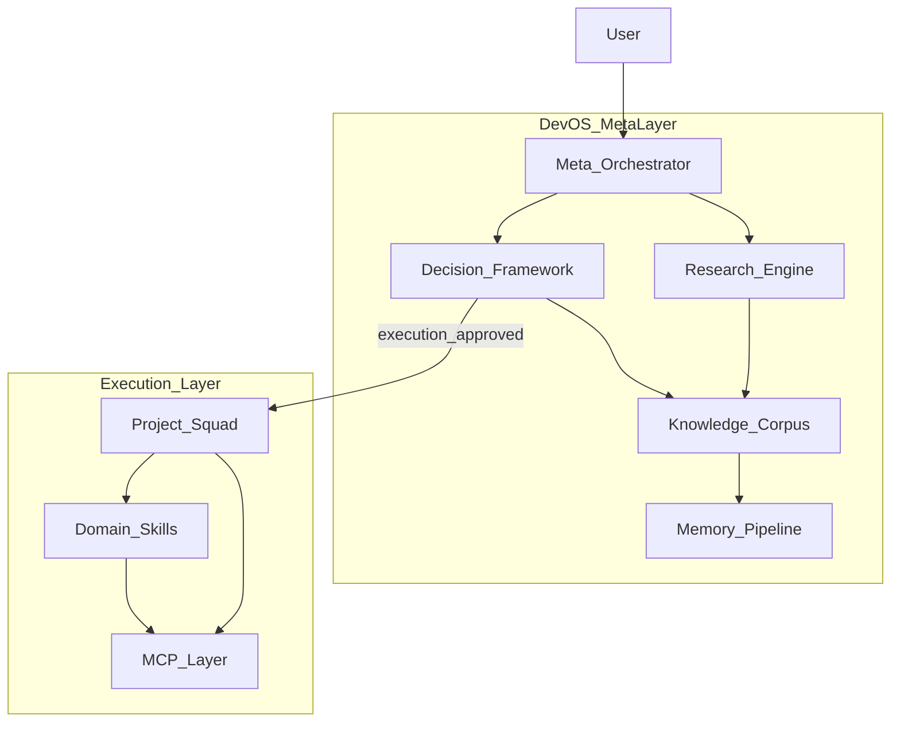

# Dev OS — Structural Emergence (Phase 3)

> **Modules understood, roster not fixed.** Evidence from Sprint 1 (multi-agent, context-engineering, memory-systems). Project Squad remains execution bundle.

## Emergence principle

Per Anthropic simplest-first and Dev OS decision framework: **add agents only when skills + Boss are insufficient**. Phase 3 defines **functional modules** and maps them to hub artifacts. One new agent emerged (`dev-os-research`); all other modules stay skill-orchestrated.

## Module map

| Module | Function | Hub implementation | Dedicated agent? |
|--------|----------|-------------------|----------------|
| **Meta-Orchestrator** | Route meta vs execution; enforce gate; conflict priority | Boss + `skills/dev-os/SKILL.md` + `rules/dev-os.mdc` + orchestrators | No — Boss |
| **Research Engine** | Source discovery (A–G), extraction cards, domain merge, compare | `skills/dev-os/research/` + **`agents/dev-os-research.md`** | **Yes** — complexity-driven |
| **Knowledge Corpus** | Living research memory (MemFS) | `ai-tracking/dev-os/` tiers | No — files |
| **Decision Framework** | Research → Reason → Design(candidates) → Execute | `skills/dev-os/decision/` + `decisions/log.md` | No — Boss + skill |
| **Memory Pipeline** | Validate → compress → promote → conflict check | `skills/dev-os/memory/` + `squad-memory` | No — squad-memory |
| **Execution Bundle** | Build, QA, ship, audit workspace | Project Squad (`agents/squad-*.md`) | Existing roster |

## Why only one new agent emerged

| Check | dev-os-research | Other modules |
|-------|-----------------|---------------|
| Functional need | Domain research ≠ workspace scout; different tools and outputs | Orchestration/decision/memory map to Boss + existing skills |
| Complexity | Long Exa threads + 13-field extraction cards overload main chat | Corpus is file I/O; decisions are episodic |
| Repeating pattern | Sprint 2–5 across 10 domains | One-off per session |

**Rejected for now:** `dev-os-architect`, `dev-os-decision` agents — use Boss + decision skill until pattern repeats across 3+ structural decisions.

## Boundaries (non-negotiable)

| Layer | Owns | Does NOT own |
|-------|------|--------------|
| Dev OS meta | Research, synthesis, structural decisions, gate | Application code, deploy, project builds |
| Project Squad | Workspace audit, build, QA, ship, growth | Dev OS corpus, new agent policy |
| Domain skills | Vertical procedures (n8n, seo-geo, clone) | Hub architecture |

## Routing rules (post Phase 3)

| User intent | Route |
|-------------|-------|
| `@dev-os research <domain>` | dev-os-research agent or research skill |
| `@dev-os decide`, architecture tradeoff | decision skill + Boss |
| `@dev-os status` | dev-os-status.mjs |
| Build / fix / deploy / audit repo | Project Squad |
| Structural change (new agent, always-on rule) | decision log → gate check → implement |

## Emergence triggers (future agents)

Create new `agents/dev-os-*.md` or `agents/squad-*.md` **only when ALL apply**:

1. Decision log entry (DEC-NNN) with evidence
2. Module row shows repeated failure of skill-only approach (≥3 instances)
3. Gate open (`research_complete`) or user override
4. Passes dynamic emergence checklist in `skills/dev-os/emergence/SKILL.md`

**Do not create** agents for: one-off tasks, speculative roles, duplicate Squad coverage.

## Squad relationship (updated)

Project Squad is **execution layer under meta-layer**, not deprecated:

- **Keep** all 10 `squad-*.md` agents unchanged in Phase 3
- **Boss** checks Dev OS routing before Squad for meta tasks
- **Squad scout** = workspace inventory; **dev-os-research** = domain corpus research
- New Squad agents require DEC entry + emergence checklist (same gate)

## Phase 4 handoff — CLOSED (DEC-004)

Candidate A accepted. See [design-candidates.md](design-candidates.md). Phase 5 active.

## Phase 5

Execution + evolution — ongoing research sprints optional; no architecture changes without DEC.

## Evidence

- Sprint 1: [understanding.md](understanding.md), [knowledge-map](../layers/knowledge-map.md)
- DEC-001 (meta-layer), DEC-002 (file memory), DEC-003 (module emergence)
- Sources: anthropic-effective-agents, cursor-subagents, letta-memfs, langchain-patterns
