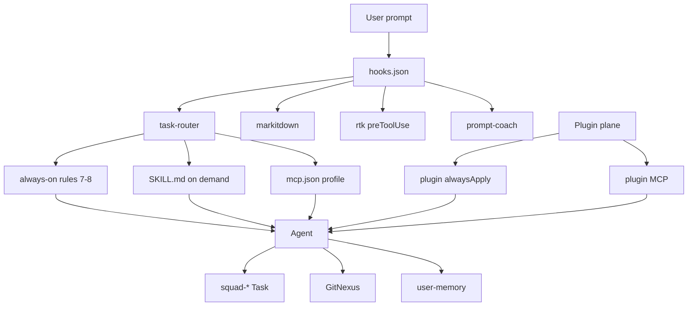

# Current architecture map (research snapshot)

**Date:** 2026-08-24  
**Sources:** phase1-db (2026-08-17) + live drift check + hub-load map.  
**Mode:** research only — no structural changes applied.

## Logical model

```
SYSTEM (Cursor Hub ~/.cursor)
├── BLOCK: Orchestration
│   ├── task-router (hook + routes.json + rules)
│   ├── auto-orchestrator / 00-agent-orchestrator
│   └── mcp-router (profiles core|design|qa|docs|ops|full)
├── BLOCK: Memory & graph
│   ├── user-memory MCP
│   ├── AGENTS.md / CLAUDE.md
│   ├── ai-tracking/ corpus
│   └── GitNexus (linellabot)
├── BLOCK: Token economy
│   ├── RTK (shell hook)
│   ├── Caveman (on demand)
│   └── Ponytail (code YAGNI)
├── BLOCK: Intake / docs
│   ├── MarkItDown (hook, no MCP)
│   └── prompt-coach (capture/stop)
├── BLOCK: Design
│   ├── open-design skill + MCP
│   ├── stitch MCP
│   ├── 21st MCP + skill
│   └── clone-website + browser
├── BLOCK: SEO / GEO / AIO (fragmented today)
│   ├── skills/seo-geo + marketing skills pack
│   ├── agency personas (seo-specialist, ai-citation-strategist, …)
│   ├── commands seo-audit / gsc / pagespeed
│   └── NO single governing block + no content engine orchestration
├── BLOCK: Security
│   ├── security-hub + cybersecurity skills
│   ├── Aikido plugin (alwaysApply)
│   └── scan commands (authorized gates)
├── BLOCK: Squad / agents
│   ├── 16 hub agents (squad-* + impeccable + dev-os-research)
│   └── 29 plugin-bundled agents (not governed)
├── BLOCK: External planes
│   ├── Plugin MCP (Exa, Vercel, Supabase, …) — separate from mcp.json
│   ├── Vercel / Supabase / GitHub (project-level)
│   └── Notion (skill + optional MCP; write gated)
└── QUARANTINE — MISSING (no formal trash plane)
```

## Layer inventory (counts)

| Layer | Count | Where | Who calls | Duplicate / conflict notes |
|-------|------:|-------|-----------|----------------------------|
| Skills on disk | **1806** | hub-top 897 · plugin 376 · od-repo 277 · agents 149 · archive 76 · skills-cursor 20 · codex 11 | task-router / @tag / Agent Decides | Far above 200–400 target; OD templates + plugin copies inflate |
| Slim index | **~86–112** | `skills/_INDEX.md` | humans / refresh | Index ≠ disk load paths |
| Live MCP (user) | **6** | `mcp.json` = **design** | agent + profiles | Docs sometimes still say “core only” |
| MCP store | **21** | `mcp.json.store` | mcp-profile | Store heap still 4096 risk |
| Plugin MCP | **~20** started in logs | plugins/cache | Cursor plugin plane | Timeouts; UI enablement unknown from disk |
| Hub rules always-on | **7–8** | `rules/*.mdc` | every chat | Nested `.cursor/rules` alwaysApply=0 (mirror) |
| Plugin alwaysApply | **9** | plugins/cache | every chat if plugin on | GitLab/Harness noise if UI left on |
| Agency rules | **66** | `rules/agency/` | on-demand / squad | Large but scoped |
| Hooks | **10** entries | `hooks.json` | lifecycle | Plugin hooks.json not merged |
| Commands | **166** | hub 124 + plugin 42 | human / agent | Many one-off ensure-* |
| Subagents | **45** | hub 16 + plugin 29 | Task tool | No single Ecosystem Architect |
| Plugins inventory | **44** | cache | Customize UI | ui_unknown |
| Junk candidates | **21** | npm-cache ~5 GB top | Phase 2 only with approval | |

## Call graph (runtime)



## System vs block mixing (problems)

1. **Two MCP planes** — user `mcp.json` profiles vs plugin MCP; health scripts partially cover both; timeouts dominate logs.
2. **Skills explosion** — active work uses slim index + router, but disk still hosts ~1806 SKILL.md; Agent Decides can still see noise.
3. **SEO/GEO/AIO** — many skills exist (seo-geo, entity-seo, programmatic-seo, agency AEO/GEO personas) but **no BLOCK charter**, quarantine, or content-engine orchestrator.
4. **Subagent zoo** — 45 definitions; MASTER wants one Ecosystem Architect + ephemeral workers.
5. **Docs drift** — `plugin-disable-checklist.md` / some registry lines still imply live MCP = memory+gitnexus only; live is **design ×6**.
6. **No quarantine** — deletes are binary; MASTER wants TRASH plane first.
7. **Graph** — GitNexus indexes code symbols (linellabot), not Customize entities (skills↔rules↔hooks↔MCP). Ecosystem graph ≠ code graph.

## Dangerous / high-load surfaces

| Surface | Risk |
|---------|------|
| Plugin MCP always starting | RAM/CPU + timeout spam |
| `mcp.json.store` heap 4096 | Accidental full profile re-inflates |
| npm-cache ~5 GB | Disk only; safe delete after approval |
| OneDrive `CursorMigrate` copies | Confusion / wrong-repo edits |
| AlwaysApply plugin rules | Context tax if UI plugins left enabled |
| 1806 SKILL.md | Routing/context pressure |

## What already works (keep)

- MCP profiles + store/bak rollback  
- `.cursorignore` / `.gitnexusignore`  
- Task Router + MarkItDown + RTK + Prompt Coach hooks  
- Squad roster + marketing agent wiring (Phase 3 track historically completed)  
- Security-hub front door  
- Open Design / 21st / Stitch as design profile bundle  

## Gaps vs MASTER PROMPT (audit completeness)

| MASTER § | Status |
|----------|--------|
| Full Customize inventory | Done (phase1-db) |
| SYSTEM→BLOCKS map | This file (first pass) |
| Target architecture | Draft next file — needs approval |
| Skills 200–400 + categories CORE/… | Not implemented |
| Quarantine | Missing |
| Ecosystem Architect | Missing |
| Graph of entities | GitNexus insufficient alone |
| SEO+GEO+AIO block | Fragmented skills only |
| Notion video idea pipeline | Not started |
| Sentry MCP | Not installed |
| gstack / ruflo / greptile research | Not started this track |
| Adversarial review automation | Partial (security-hub / aikido), not governance-wide |
| Telegram monitor format | Not wired for Ecosystem Architect |
