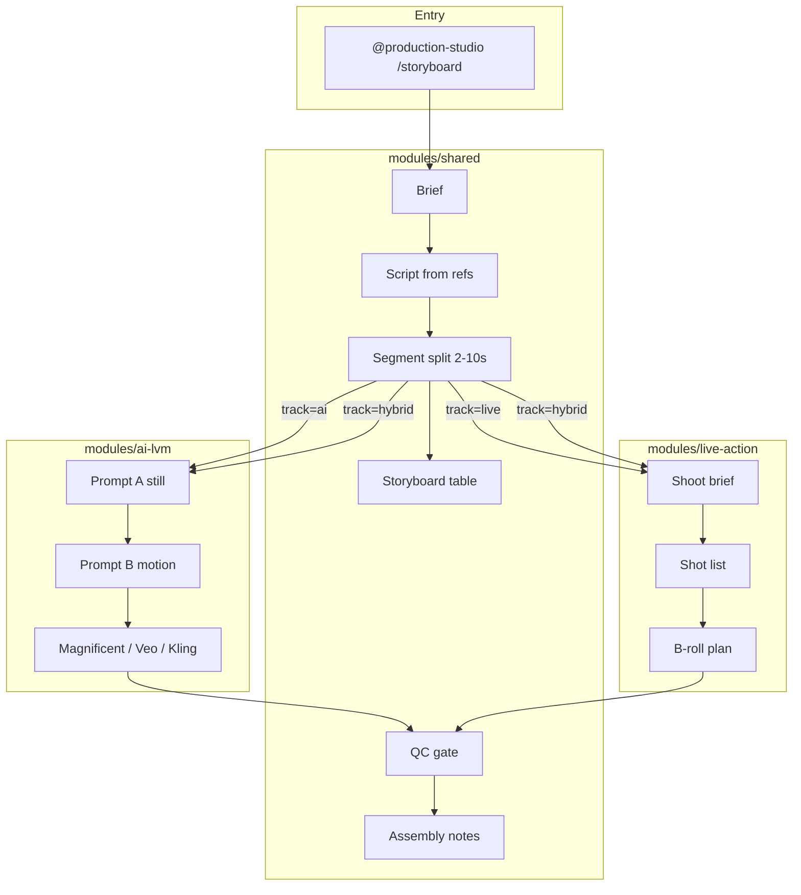

# Production Studio — unified architecture (REQ-049)

**Decision:** [DEC-056](../decisions/DEC-056-unified-production.md) — live + AI unified, splittable modules.

---

## System map



---

## Module contracts

| Module | Owns | Does not own |
|--------|------|--------------|
| **shared** | Script, segments, storyboard, SRT, QC checklist, export notes | Camera rental, API keys |
| **ai-lvm** | JSON still prompt, motion prompt, provider routing, retry | Final render in DaVinci |
| **live-action** | Talent, locations, shot list, B-roll, on-set timing | AI gen parameters |

**Cross-module field:** `track` on each segment — `ai` | `live` | `hybrid`.

---

## File layout (hub)

```
skills/production-studio/
  SKILL.md
  references/
    storyboard-director.md
    segment-splitter.md
    style-lock.md
    live-action-module.md

ai-tracking/production-studio/
  ARCHITECTURE.md          ← this file
  LVM-PIPELINE.md
  GAP-ANALYSIS.md
  MONEYPRINTER-PATTERNS.md
  modules/
    shared/README.md
    ai-lvm/README.md
    live-action/README.md
  refs/                    ← REF-* + USER-*

templates/production-studio/
  project-brief.md
  segment-manifest.json
  storyboard-table.md
  live-shoot-brief.md
  qc-gate.md
```

---

## MCP & tools

| Task | Route |
|------|-------|
| Transcribe plate video | `commands/transcribe-video.ps1` |
| Storyboard slash | `/storyboard` |
| Full studio router | `/production-studio` |
| Video prompt craft | Magnificent MCP |
| Motion gen | gemini / browser Veo |
| Viral structure | `refs/INDEX.md` |

---

## Gap analysis summary

See `GAP-ANALYSIS.md`. **Built for manual test:** docs, templates, commands, 18 refs, DEC-056.  
**Still manual:** first real gen, your USER scripts, DaVinci assembly.

---

## REQ coverage (049–057, 065)

| REQ | Where |
|-----|-------|
| 049 | This arch + GAP-ANALYSIS |
| 050–053 | storyboard-director, style-lock, skill formula |
| 054–055 | refs INDEX + USER slot |
| 056 | DEC-056 + live-action module |
| 057 | segment-splitter.md |
| 058 | OMNI-REEL-ARCHITECTURE |
| 065 | MONEYPRINTER-PATTERNS |
