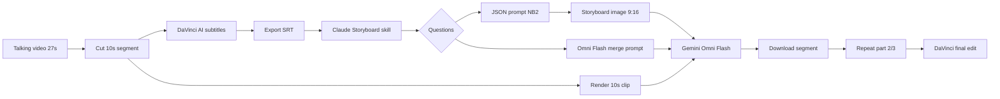

# OMNI REEl — архитектура монтажной системы (REQ-058)

**Источник:** локальный `Downloads/OMNI REEl.mp4` (замена Yandex Disk)  
**Транскрипт:** `ai-tracking/production-studio/OMNI-REEL.txt`  
**Whisper:** model `base`, lang `ru`, ~40 мин CPU  
**Дата:** 2026-07-10

---

## Суть пайплайна (авторский workflow)

Разговорный reel (~27 с) → **нарезка по 10 с** → **AI-субтитры в DaVinci** → **Claude skill «Storyboard»** по SRT → **storyboard-картинка (Nano Banana 2)** + **анимация (Gemini Omni Flash)** → склейка частей в монтажке.

Цель: motion-графика, инфографика и анимированные титры **без** After Effects / Fusion — оператор только закидывает субтитры и 10-сек клипы.

---

## Стек инструментов (из видео)

| Роль | Инструмент | Что делает |
|------|------------|------------|
| Исходник | Снятое talking-head видео | 1 клип ~27 с, монтаж «как обычно» |
| Нарезка + субтитры | **DaVinci Resolve** (Timeline → iTool) | `Create Subtitle from Audio`, export SRT |
| Оркестрация промтов | **Claude** + custom **Storyboard Director skill** | Триггер слово `Storyboard`, вход — SRT |
| Storyboard still | **Nano Banana 2** | JSON-prompt → сетка кадров 9:16 (часто 6 панелей) |
| Анимация B-roll | **Gemini Omni Flash** | storyboard + 10 с клип + промпт → анимированный сегмент |
| Сборка | DaVinci | Повтор для частей 2/3…, финальная склейка |

---

## Пошаговый flow (одна часть из серии)

### 1. Подготовка сегмента
- Оставить **первые 10 с** (или 2/4/6/8/10 — см. REQ-057).
- DaVinci: **Timeline → iTool → Create Subtitle from Audio**.
- Растянуть субтитры на длину сегмента → **Export Subtitles** (SRT).

### 2. Claude Storyboard Director skill
- **Триггер:** одно слово `Storyboard`.
- **Вход:** только что экспортированный SRT.
- **Уточнения skill:**
  - Сколько частей в ролике / какая часть сейчас (пример: «1 из 3» — три чанка по 10 с).
  - Цветовая гамма (у автора своя «стандартная» палитра; опция «другая»).
- **Анализ SRT:** ключевые моменты, где лицо, кружок (PiP), иная композиция.
- **Два выхода:**
  1. **JSON prompt** для Nano Banana 2 — ручное управление генерацией, aspect **9:16**, число панелей storyboard зависит от плотности речи (≈6).
  2. **Prompt для Omni Flash** — склеить storyboard + 10 с видео + анимация/титры.

### 3. Генерация
- Вставить JSON в Nano Banana 2 → сгенерировать storyboard (ошибки возможны → **retry**).
- Параллельно: зарендерить 10 с клип, загрузить в Omni Flash вместе с storyboard.
- Скопировать промпт анимации из Claude → Omni Flash: **9:16**, опция **4K**, «Add request».
- Storyboard — **ориентир для анимации**, лицо на still может не совпадать с автором.

### 4. QC и итерация
- Иногда Omni Flash отказывает («слишком много») — повторить или упростить.
- Удачные варианты скачать (есть бесплатный upscale «Ultra»).
- **~5 мин** на сегмент при готовом skill (без учёта недель доработки skill).

### 5. Серия
- Части 2, 3… — тот же цикл (новый 10 с кусок → subtitles → Storyboard → gen).
- Финал: склейка всех сегментов в DaVinci.

---

## Контракт Storyboard Director skill (для Cursor Production Studio)

| Поле | Значение |
|------|----------|
| Trigger | `Storyboard` (или slash-команда `/storyboard`) |
| Input | SRT/VTT + optional refs + part index `k/N` |
| Config | Color palette preset, panel count heuristic, 9:16 |
| Output A | `storyboard-json.prompt` — structured NB2 / image gen |
| Output B | `omni-flash-merge.prompt` — animation + typography |
| Output C | Optional shot list: face / PiP / full-frame |

**Логика ключевых моментов:** из текста субтитров → визуальные метафоры (пример из видео: «каскад иконок» для фразы про ИИ).

---

## Маппинг на Cursor Hub (`skills/production-studio`)

| Шаг видео | Hub-эквивалент | Статус |
|-----------|----------------|--------|
| SRT export | `commands/transcribe-video.ps1` + DaVinci manual / future iTool doc | Partial |
| Storyboard skill | `skills/production-studio` + future `storyboard-director` sub-skill | Skeleton |
| JSON storyboard | Magnificent MCP / external NB2 | MCP wired (Magnificent) |
| Omni Flash | Google Veo/Omni via gemini MCP / browser | P3 |
| Segment split 2–10 s | REQ-057 in SKILL.md | Documented |
| Viral script refs | `production-studio/refs/` (18 subs) | Done |

---

## Риски и ограничения

- **Нестабильность gen:** storyboard и Omni Flash могут падать — нужен retry + human QC loop.
- **Стоимость:** автор упоминает «немеренные» Claude credits при отладке skill.
- **Зависимость от закрытого skill:** в клубе — готовый skill + шпаргалка; в Hub — воспроизвести контракт локально.
- **Не заменяет съёмку:** pipeline assumes готовый talking-head + нарезка.

---

## Следующие шаги (P3)

1. Черновик **Storyboard Director** SKILL с JSON-schema выхода под NB2/Omni.
2. Шаблон SRT → shot list → dual prompts (A/B).
3. Связка с REQ-057 (2/4/6/8/10 s) и refs vault.
4. Smoke: один 10 с сегмент end-to-end (без клубного skill — MVP prompts).

---

## Связанные REQ

- **REQ-057** — нарезка 2/4/6/8/10 с  
- **REQ-049–056** — Production Studio scope  
- **REQ-058** — этот документ ✓  
- **REQ-059** — okara.ai (параллельный источник паттернов)
