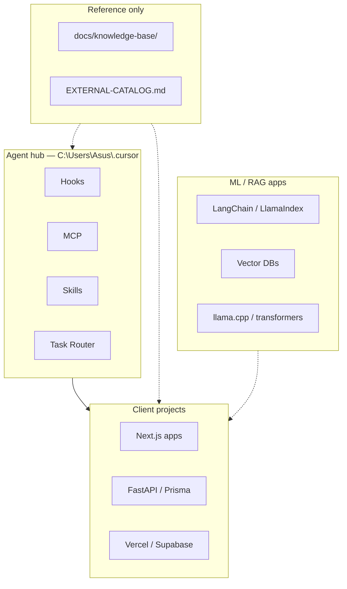

# AI stack map — hub vs project vs reference

Куда ставить инструменты из «топовых» AI-репо. Простой язык: **hub** = Cursor `.cursor`, **project** = клиентский репо, **reference** = только ссылка в knowledge-base.

## 4 слоя

## Hub (ставим и поддерживаем)

| Категория | Инструменты | Squad-роль |
|-----------|-------------|------------|
| Документы | MarkItDown | scout, build |
| Терминал | RTK | build, qa |
| Код-граф | GitNexus | architect, review |
| Память | user-memory MCP | squad-memory |
| Web research | Exa MCP | scout, growth |
| Автоматизация | n8n-mcp, n8n-templates (297) | ship (gated) |
| Промпты | awesome-prompts (659) | growth, design |
| SEO/GEO | seo-geo pack | squad-growth |
| UI clone | clone-website template | squad-design, build |
| Deploy | Vercel MCP (plugin) | squad-ship |

## Project-only (в `C:\Users\Asus\projects\`, не в hub)

| Стек | Когда | Пример |
|------|-------|--------|
| Next.js 16 + shadcn | Сайт клиента | clone-website template |
| FastAPI / Prisma | Backend API | отдельный репо |
| Docker / Terraform | Infra клиента | CI в project repo |
| Stripe / Clerk | Платежи и auth | plugin MCP по задаче |

## Reference-only (не ставить в hub)

| Репо / стек | Причина | Куда смотреть |
|-------------|---------|---------------|
| LangChain, LlamaIndex | Нужен только в Python-приложении | FOUNDATION-REPOS.md |
| Headroom, LeanCTX | Overlap с RTK | TOKEN-OPTIMIZATION-SOURCES.md |
| Chroma, Milvus, Weaviate | Свой RAG | project + EXTERNAL-CATALOG |
| PyTorch, HuggingFace | Training/inference | вне agent-hub |
| React/Next (generic) | Уже в templates | clone-website |

## Связь с squad

| Задача | Маршрут | Стек |
|--------|---------|------|
| Дизайн + UI | squad-design | huashu, 21st, Figma MCP |
| Код | squad-build | Next, karpathy guidelines |
| SEO | squad-growth | seo-geo, Exa |
| Деплой | squad-ship | Vercel MCP (approval) |
| Документы в чате | markitdown route | MarkItDown hook |
| n8n workflow | n8n-automation | n8n-templates match → n8n-mcp |

## Обновление карты

При добавлении инструмента в hub:

1. Запись в `SYSTEM-REGISTRY.md`
2. Строка здесь (hub / project / reference)
3. Если token-related → `TOKEN-OPTIMIZATION-SOURCES.md`
4. Тест `*-test.ps1` или hub-learning-test

См. также: `SYSTEM-TAXONOMY.md`, `FOUNDATION-REPOS.md`, `TOKEN-MEMORY-POLICY.md`.
