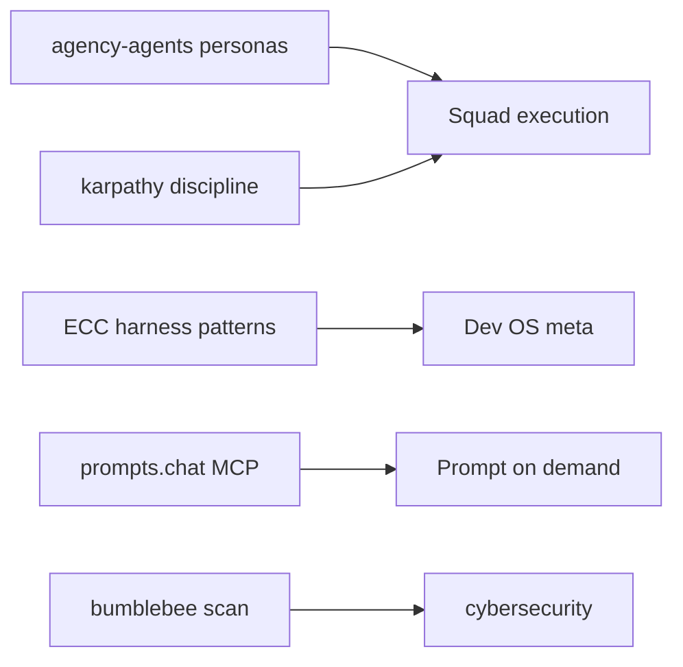

# Foundation Repositories — Analysis & Hub Integration

Sources studied for DEC-010 system refresh (Jul 2026).

---

## 1. [agency-agents](https://github.com/msitarzewski/agency-agents) (127k★)

**What it is:** 232 personality-driven specialists across 16 divisions (engineering, design, marketing, sales, security, finance, game-dev, …). Each agent = identity + workflows + deliverables + success metrics.

**What it adds vs hub:**
| Agency | Hub today | Integration |
|--------|-----------|-------------|
| 232 deep personas | 10 Squad + 1 Dev OS research | **On-demand spawn** by division — do not bulk-install |
| Multi-tool `convert.sh` / `install.sh --tool cursor` | Manual `agents/squad-*.md` | Use installer for **selected divisions** only |
| Marketing/sales/paid-media machines | `marketingskills` + `seo-geo` | Agency fills **voice + process**; hub skills fill **tooling** |
| Whimsy / reality-checker patterns | `huashu-design` | Cross-pollinate motion/UX reviews |

**Install (selective):**
```powershell
C:\Users\Asus\.cursor\commands\install-agency-agents.ps1
# 66 rules → rules/agency/ (marketing, sales, design, product, paid-media)
```

**Status (Jul 2026):** ✅ Installed in hub — see `rules/agency/_INDEX.md`

**Token rule:** Never load full roster. Boss picks ≤2 agency agents per phase. See `AGENCY-PORTFOLIO-MAP.md`.

---

## 2. [andrej-karpathy-skills](https://github.com/multica-ai/andrej-karpathy-skills) (188k★)

**What it is:** Four behavioral principles in one `CLAUDE.md` / skill — Think Before Coding, Simplicity First, Surgical Changes, Goal-Driven Execution.

**What it adds vs hub:**
- Complements GitNexus (graph safety) with **diff discipline**
- Reduces rewrite loops and scope creep
- Already local: `~/.agents/skills/.../karpathy-guidelines/SKILL.md`
- **Hub rule:** `rules/karpathy-guidelines.mdc` (on-demand, not always-on)

**When to activate:** refactors, reviews, multi-file edits, "don't break anything" tasks.

---

## 3. [ECC](https://github.com/affaan-m/ECC) (226k★) — Everything Claude Code

**What it is:** Agent harness OS — 67 subagents, 80+ skills, hooks, instincts (continuous-learning-v2), AgentShield, cost-aware-LLM-pipeline, verification loops.

**What it adds vs hub (adopt patterns, not full clone):**

| ECC concept | Hub adaptation |
|-------------|----------------|
| `continuous-learning-v2` instincts | WARM tier in `ai-tracking/` + squad-memory |
| SessionStart context cap (8000 chars) | `TOKEN-MEMORY-POLICY.md` |
| `search-first` skill | Already in `dev-os` research-first |
| `cost-aware-llm-pipeline` | `model-map.md` tiering |
| AgentShield / `security-scan` | Extend `cybersecurity` + bumblebee |
| Hooks auto-load | **Do not** copy hooks to Cursor — use commands refresh instead |
| Separate `AGENT_DATA_HOME` for Cursor | `~/.cursor/agent-data/` (optional) |

**Selective install:** ECC is Claude Code–centric. For Cursor, cherry-pick skills into `~/.agents/skills/` when needed (`article-writing`, `content-engine`, `investor-materials`, `market-research`).

---

## 4. [prompts.chat](https://github.com/f/prompts.chat) (165k★)

**What it is:** Largest open prompt library + interactive book + MCP server + self-host (PostgreSQL/Neon).

**What it adds vs hub:**
- **Prompt retrieval** without bloating rules
- MCP: `https://prompts.chat/api/mcp` (remote) or `npx prompts.chat mcp` (local)
- Book chapters for agent prompt design

**Integration (Jul 2026):**
- MCP in `mcp.json` (remote `search_prompts`, `improve_prompt`)
- **Local index** from `prompts.csv`: `lib/awesome-prompts/` + `skills/awesome-prompts/` (659 templates, matcher without full repo in context)
- Build: `commands/build-awesome-prompts-index.ps1` · Match: `commands/awesome-prompts-match.ps1`

---

## 5. [bumblebee](https://github.com/perplexityai/bumblebee) (Perplexity)

**What it is:** Read-only supply-chain scanner — NDJSON inventory of npm/pypi/go/MCP configs/editor extensions/skills.lock across dev machines. Exposure catalog matching.

**What it adds vs hub:**
- Scans **`mcp.json`**, `~/.claude.json`, Cursor extension manifests, `skills-lock.json`
- Faster than full SCA for **"is this compromised version on disk?"**
- Complements Anthropic cyber skills (reactive) with **inventory** (proactive)

**Hub command (after `go install`):**
```powershell
bumblebee scan --profile project --root "C:\Users\Asus\.cursor" --root "C:\Users\Asus\projects" > ai-tracking/bumblebee-inventory.ndjson
```

Wire into `cursor-system-refresh.ps1` as optional `-SupplyChainScan` (future).

---

## 6. [crewAI](https://github.com/crewAIInc/crewAI)

**What it is:** Python multi-agent framework — Crews (autonomous role-based teams) + Flows (event-driven production pipelines).

**Hub integration (Jul 2026):** Pattern-only — no Python install in `.cursor`. JSON crew definitions map to Project Squad subagents.

| Crew | Path | Owner |
|------|------|-------|
| Marketing | `lib/crew-ai/crews/marketing-crew.json` | `squad-growth` |
| Production | `lib/crew-ai/crews/production-crew.json` | `squad-design` + `squad-qa` |

CLI: `commands/crew-plan.ps1` · Skill: `skills/crew-ai/SKILL.md`

---

## 7. [babyagi](https://github.com/yoheinakajima/babyagi)

**What it is:** Experimental self-building agent framework (`functionz`). Classic Mar 2023 task-planner archived at [babyagi_archive](https://github.com/yoheinakajima/babyagi_archive).

**Hub integration (Jul 2026):** Classic **creative task loop** only — no Python install.

| Piece | Path |
|-------|------|
| Loop engine | `lib/babyagi/CreativeLoop.ps1` |
| CLI | `commands/creative-loop.ps1` |
| Sessions | `ai-tracking/creative-loop/sessions/` |

Skill: `skills/babyagi/SKILL.md` · Hand off to `crew-ai` when plan crystallizes.

---

## Cross-repo synthesis



**Principle:** Foundations inform **routing docs + selective installs** — not a monolithic rules dump.
