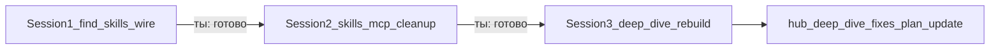

# 3 сессии: hub refactor (skills.sh → cleanup → deep-dive rebuild)

## Распределение объёма

| Сессия | Окно | Цель | Deep-dive plan |
|--------|------|------|----------------|
| **1** | это окно после approve | skills.sh + find-skills проводка | **не трогать** |
| **2** | новое окно после «готово S1» | индекс skills, чистка/замена, MCP 3 tiers, image JSON, полный commit | **не трогать** |
| **3** | новое окно после «готово S2» | доуглубление аудита, canvas fixes, self-audit, **пересборка** [hub-deep-dive-fixes.md](c:\Users\Asus\.cursor\plans\hub-deep-dive-fixes.md) | **финальный шаг** |

Каждая сессия: **свой контекст**, свой todos, режим **Plan → вопросы → approve → Agent/Auto**. Без Parallel выполнения S2/S3 в том же окне.

---

## Session 1 (выполняется после approve этого плана) — wire-only

### Решения (зафиксированы твоими ответами + мой выбор пути)

- CLI: `npx skills` + skill **find-skills** из [vercel-labs/skills](https://github.com/vercel-labs/skills) / каталог [skills.sh](https://www.skills.sh/)
- Install policy: **один AskQuestion со списком → ты «Да» → ставим** (в S1 массовых установок каталога нет)
- Liquidity: ориентир на **высокие installs**; **Design/UI topic** допускаем даже ниже порога
- Trigger: gap-check **обязателен на Plan и крупной задаче (Phase 0)**; не на каждый промпт
- Scope: **только проводка** (install find-skills + route + skill + тест)
- **hooks.json не трогаем**
- Путь установки (выбрал я):
  1. Primary: `npx skills add vercel-labs/skills -s find-skills` → `C:\Users\Asus\.agents\skills\find-skills\`
  2. Hub thin wrapper: [`skills/find-skills/SKILL.md`](skills/find-skills/SKILL.md) (как hub-native entry; читает upstream / вызываен CLI)
  3. Не класть в `skills-cursor/`

### Deliverables Session 1

1. Установить upstream find-skills **без поломки** исходника (`npx skills add … -s find-skills`)
2. Создать hub wrapper + on-demand [`rules/find-skills.mdc`](rules/find-skills.mdc) (`alwaysApply: false`)
3. Route `find-skills` в [`lib/task-router/routes.json`](lib/task-router/routes.json) (keywords: skills.sh, find skill, npx skills, skill catalog)
4. Gap protocol в wrapper + короткая строка в on-demand Dev OS / writing-plans / project-squad reference: на Plan/Phase0 → «стек hub + candidates skills.sh → Ask once»
5. Строка в [`SYSTEM-REGISTRY.md`](SYSTEM-REGISTRY.md)
6. Тесты: `commands/find-skills-test.ps1` + sample в `task-router-test`
7. Smoke: `npx.cmd skills find <query>` (read-only)

### Todos Session 1

1. Install upstream find-skills via npx
2. Write `skills/find-skills/SKILL.md` (protocol: gap → find → ask once → install)
3. Add `rules/find-skills.mdc` on-demand
4. Add route + registry + optional `commands/find-skills.ps1`
5. Add/run `find-skills-test.ps1` + router sample
6. Chat summary: как пользоваться + «Session 1 DONE — следующий промт для S2»

### Не трогать (S1)

- hooks.json, mcp.json secrets, markitdown venv
- agents/*.md model lines, model-map.md
- массовая установка skills из каталога
- [hub-deep-dive-fixes.md](c:\Users\Asus\.cursor\plans\hub-deep-dive-fixes.md)

### Готово когда (S1)

- `npx skills find` работает
- route матчится
- wrapper + rule на месте
- тест PASS
- ты можешь написать «готово / Session 2»

---

## Session 2 (новое окно; старт только после «готово» S1)

**Контекст:** find-skills уже в системе; использовать для замен.

### Блоки (порядок)

1. **Индекс всех skills** — быстрый доскональный audit → манифест (path, last use signal, routes, liquid installs)
2. **Чистка** — кандидаты unused/rare → **AskQuestion** → после approve **авто-удаление** без доп. спроса по выбранным
3. **Замена** — suboptimal but used → найти на skills.sh (ликвидность + Design exception) → AskQuestion → план интеграции → install
4. **Не ломать** core routing (task-router, always-on, squad, markitdown, huashu, design-stack, frontend-design, …)
5. **MCP + plugins** → tiers: **always-on / on-demand / disable-archive** → AskQuestion по иерархии/матрице → после approve применить
6. **Image prompts → JSON** для LVM interop
7. **Финальный: подробный git commit всей системы** (перед аудитом S3)

### Обязательные вопросы в начале S2 (не сейчас)

- Иерархия/матрица **skills** (ACTIVE / ON-DEMAND / ARCHIVE)
- Иерархия/матрица **MCP/plugins** (always / on-demand / archive)
- Что нельзя удалять (sacred list)

### Не трогать (S2)

- Deep-dive plan file
- hooks.json до отдельного OK
- Core skill wiring без миграционного плана

---

## Session 3 (новое окно; после «готово» S2)

1. **Углублённый re-audit** hub (skills, rules, MCP, plugins, hooks, commands) — по разделам, без пропуска классов как было с design
2. **Разбор canvas** Deep Dive: каждый заявленный fix → статус post-S2
3. **Self-audit** окружения / «переинициализация манифеста инструментов»
4. **AskQuestion** (иерархии инструментов + что вошло в P0–P2 после изменений)
5. **Финальный:** пересборка [hub-deep-dive-fixes.md](c:\Users\Asus\.cursor\plans\hub-deep-dive-fixes.md) с учётом S1+S2

---

## Режим работы каждой сессии

1. Plan mode + полный AskQuestion  
2. Approve  
3. Agent/Auto исполнение todos  
4. Stop на границах: commit (S2), hooks, secrets, delete list (S2)  
5. Явный маркер в чате: `SESSION N COMPLETE`

---

## Сейчас после approve этого плана

Только **Session 1 wire-only**. Session 2–3 не запускать в этом окне.