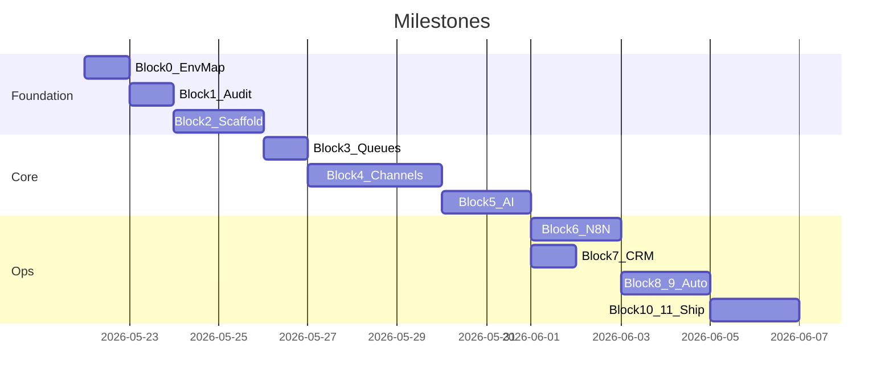

# AI-CHAT-MANAGER-SYSTEM — план реализации

## Решения (подтверждены)

| Вопрос | Выбор |
|--------|--------|
| Размещение | **Заменить** содержимое [`AiManager-project`](c:\Users\Asus\.cursor\AiManager-project) |
| Production | **VPS + Docker** (postgres, n8n, nginx, certbot) |
| Vercel NeoCar | После миграции — архивировать проект `neo-car-ai-manager`; новый стек не деплоится на Vercel |

## Текущее состояние репозитория

Сейчас в корне — **NeoCar / omni-comm** (Next.js 16, Supabase, Gemini, один Telegram-канал):

- Код: [`src/lib/`](c:\Users\Asus\.cursor\AiManager-project\src\lib) (handlers, Gemini, Bitrix в [`src/lib/crm/bitrix.ts`](c:\Users\Asus\.cursor\AiManager-project\src\lib\crm\bitrix.ts))
- Инфра: [`vercel.json`](c:\Users\Asus\.cursor\AiManager-project\vercel.json), [`supabase/migrations/`](c:\Users\Asus\.cursor\AiManager-project\supabase)
- Секреты: `.env.local` (gitignored) — в аудите только **пути**, без значений

Спецификация требует **другой стек** (Express, `pg`, Claude, n8n, 8 каналов). Прямого переноса кода почти нет; ценность NeoCar — **Bitrix REST-паттерн**, рабочие часы, чеклист онбординга первого клиента.

## Целевая архитектура

Спецификация описывает JS-модули с HTTP webhook и n8n-оркестрацию, но `docker-compose` в промпте **не включает Node-сервис**. Без него `channels/*.js` с `POST /webhook/inbound/*` негде исполнять.

```mermaid
flowchart TB
  subgraph ingress [Ingress VPS]
    Nginx[Nginx 80/443]
  end
  subgraph apps [Docker]
    N8N[n8n :5678]
    API[api Express :3000]
    PG[(PostgreSQL 16)]
  end
  subgraph external [External APIs]
    GreenAPI[Green API WA]
    Chat2Desk[Chat2Desk Viber]
    Claude[Anthropic Claude]
    Meta[Meta IG/Messenger]
    TikTok[TikTok Business]
    CRM[CRM webhooks]
  end
  Nginx -->|"/" UI| N8N
  Nginx -->|"/webhook/*" "/api/*"| API
  N8N -->|HTTP Request cron| API
  API --> PG
  API --> GreenAPI
  API --> Chat2Desk
  API --> Claude
  API --> Meta
  API --> TikTok
  API --> CRM
  N8N --> PG
```

**Добавить в compose сервис `api`** (образ `node:24-alpine`, `npm start`, volume кода, `depends_on: postgres healthy`). n8n-воркфлоу вызывают `http://api:3000/internal/...` (не публичные webhook провайдеров).

---

## Блок 0 — Карта среды Cursor

**Цель:** [`docs/cursor_env_map.md`](docs/cursor_env_map.md) — одна таблица MCP / Skills / субагенты / когда что применять.

| Блок | Инструменты |
|------|-------------|
| 0 | Read rules, list `mcps/` |
| 1 | `explore` subagent, Grep (секреты), Shell `git` |
| 2–10 | filesystem, Shell (docker/npm), `generalPurpose` для больших модулей |
| 4–5 | `user-fetch` / browser MCP — только для проверки внешних API docs |
| 6 | n8n JSON вручную + HTTP nodes → api |
| 11 | Shell: `docker compose`, `node tests/smoke_test.js` |
| CRM/DB | `plugin-supabase` **не** для новой БД (локальный Postgres); при отладке — прямой `pg` |

**Не использовать:** GitNexus impact (индекс `.cursor`, не этот проект), массовый скан `skills-cursor/`, Vercel MCP после отказа от Vercel (кроме финального `/status` по запросу).

---

## Блок 1 — Аудит NeoCar и очистка

### 1.1 Анализ (read-only → отчёт)

Сохранить [`docs/audit_report.md`](docs/audit_report.md):

- **Дерево:** Next `src/`, `config/`, `scripts/`, `supabase/`, `public/bot-assets/`
- **Сохранить в отчёт (идеи для новой системы):**
  - Bitrix: [`src/lib/crm/bitrix.ts`](c:\Users\Asus\.cursor\AiManager-project\src\lib\crm\bitrix.ts) → `crm_adapter` bitrix24
  - Рабочие часы: [`src/lib/working-hours.ts`](c:\Users\Asus\.cursor\AiManager-project\src\lib\working-hours.ts) → `automation/night_mode.js`
  - Эскалация/интерес: [`src/lib/escalation.ts`](c:\Users\Asus\.cursor\AiManager-project\src\lib\escalation.ts), [`config/`](c:\Users\Asus\.cursor\AiManager-project\config) → seed `clients/neo-car/` (опционально первый клиент)
- **Удалить (мусор для новой системы):** весь `src/app`, Next config, Supabase migrations, Vercel crons, Gemini, Tailwind, bot PNG assets
- **Секреты (только файлы:строка, без значений):** `.env.local`, `.env.example` (имена переменных), любые hardcoded в TS

### 1.2 Git-архив перед уничтожением

```bash
git branch archive/neocar-telegram-v2
git push -u origin archive/neocar-telegram-v2
```

(Коммит только по явной просьбе пользователя; ветка — обязательный safety net.)

### 1.3 Очистка корня

Удалить: `src/`, `public/`, `config/`, `supabase/`, `next.*`, `vercel.json`, `.vercel/`, `node_modules/`, `.next/`, `postcss.config.mjs`, `eslint.config.mjs`, `tsconfig.json`, старый `package-lock.json`, `.env.local` (реальные ключи).

Оставить до конца блока 2: `.git/`, `.gitignore` (переписать), `.cursor/rules/` (при необходимости обновить под Node-проект).

Обновить `audit_report.md` разделом «выполнено».

---

## Блок 2 — Фундамент

Создать дерево **в корне репозитория** (имя пакета `ai-chat-manager-system` в `package.json`, без вложенной подпапки — репо = проект).

Ключевые артефакты:

| Файл | Содержание |
|------|------------|
| [`docker-compose.yml`](docker-compose.yml) | `postgres`, `n8n`, **`api`**, `nginx`, `certbot`; healthcheck PG; volumes `postgres_data`, `n8n_data`; RO mount `./clients`, `./prompts` |
| [`nginx/nginx.conf`](nginx/nginx.conf) | HTTPS, `proxy_pass` n8n UI; `/webhook/` → api:3000 |
| [`.env.example`](.env.example) | Полный список из спецификации (без значений) |
| [`.env`](.env) | Только `KEY=` плейсхолдеры |
| [`db/schema.sql`](db/schema.sql) | Все таблицы, индексы, триггеры `updated_at`, seed 16 red_flags |
| [`package.json`](package.json) | deps: express, axios, pg, dotenv, js-yaml, node-cron, @anthropic-ai/sdk, telegraf, form-data, multer |
| [`server.js`](server.js) или [`api/index.js`](api/index.js) | Express: mount webhooks, health, internal routes для n8n |

**Общий слой БД:** `lib/db.js` — pool `pg`, helpers insert/update.

**Шаблон клиента:** [`clients/_template/`](clients/_template/) как в спецификации.

---

## Блок 3 — Очереди и WA warmup

- [`queue/wa_warmup.js`](queue/wa_warmup.js) — фазы 1–3, `wa_warmup_log`, интервалы, `shouldFallback` → `system_events`
- [`queue/lead_queue.js`](queue/lead_queue.js) — in-memory + опционально PG для персистентности батчей; Claude throttle 5/2s; 429 backoff; dedupe `(lead_id, client_id, date)`

Интеграция: `lead_queue` вызывается из n8n-01 и internal route `POST /internal/queue/process`.

---

## Блок 4 — Каналы (8 платформ)

Единый контракт `unified message` + [`channels/router.js`](channels/router.js):

**Каскад исходящих:** WA → TG → Viber (Chat2Desk) → Messenger (24h) → SMS; IG только inbound; TikTok — comment bot + lead ads webhook.

| Файл | Webhook / особенности |
|------|----------------------|
| `whatsapp.js` | Green API, HMAC `WEBHOOK_SECRET`, warmup gate |
| `telegram.js` | Bot API only, voice → Whisper hook |
| `viber.js` | Chat2Desk normalize/send, `findOrCreateClient`, notes JSON |
| `instagram.js` | Graph + Manychat bypass |
| `messenger.js` | 24h window, Manychat |
| `tiktok.js` | poll comments + lead ads; **no DM API** |
| `sms.js` | fallback + `storePreContext` |

Каждая попытка → `channel_attempts`; полный провал → `no_channel_available` + Telegram manager alert.

---

## Блок 5 — AI

- [`prompts/system_core.txt`](prompts/system_core.txt) — LOCKED, плейсхолдеры
- [`prompts/tactics_block.txt`](prompts/tactics_block.txt)
- [`ai/prompt_builder.js`](ai/prompt_builder.js), [`claude_client.js`](ai/claude_client.js) (model `claude-sonnet-4-20250514`), [`response_parser.js`](ai/response_parser.js), [`language_detector.js`](ai/language_detector.js), [`red_flag_checker.js`](ai/red_flag_checker.js)

Поток: inbound red_flag **до** Claude; outbound tags `[RED_FLAG]`, `[PROFILE_UPDATE]`, `[RESCHEDULE]` **после**.

---

## Блок 6 — n8n (10 workflow)

Все в [`n8n-workflows/`](n8n-workflows/), `"active": false`, try/catch, логи в `system_events`.

| # | Файл | Триггер | Вызов API |
|---|------|---------|-----------|
| 01 | `01_crm_lead_watcher.json` | cron 5m | CRM → queue → wait 7m → 02 |
| 02 | `02_channel_cascade.json` | sub-workflow | cascade |
| 03 | `03_message_handler.json` | webhook :channel | normalize → 04/05 |
| 04 | `04_ai_orchestrator.json` | sub | prompt + Claude queue |
| 05 | `05_red_flag_detector.json` | sub | manager TG alert / send reply |
| 06 | `06_followup_scheduler.json` | hourly | один follow-up / 24h |
| 07 | `07_crm_updater.json` | sub | note_builder |
| 08 | `08_night_mode_controller.json` | cron | cleanup + prompt age |
| 09 | `09_reengagement.json` | webhook reactivate | full history |
| 10 | `10_auto_diagnostics.json` | monthly + manual | 11 checks |

Импорт в n8n после `docker compose up`; активация **01→10** вручную по [`READY.md`](READY.md).

---

## Блок 7 — CRM

- [`crm/crm_adapter.js`](crm/crm_adapter.js) — bitrix24, amocrm, hubspot, pipedrive, custom; unified lead
- [`crm/note_builder.js`](crm/note_builder.js) — эмодзи-заметка для CRM
- [`clients/_template/client.config.yaml`](clients/_template/client.config.yaml) — все секции из спецификации

Перенос логики Bitrix из NeoCar: webhook POST `crm.webhook_url/{method}` как в текущем `bitrixCall`.

---

## Блок 8 — Stats bot

[`stats/stats_bot.js`](stats/stats_bot.js) — отдельный процесс или `node stats/stats_bot.js` в compose; Telegraf; whitelist `STATS_TELEGRAM_CHAT_ID`; команды `/today`, `/week`, `/channels`, `/hot`, `/flags`, `/status`, `/queue` — SQL к Postgres.

---

## Блок 9 — Автоматика

[`automation/`](automation/) — `followup_engine.js`, `night_mode.js`, `diagnostics.js` (11 проверок incl. Chat2Desk), `prompt_updater.js` (14 дней), `busy_handler.js`.

Cron-эквиваленты NeoCar Vercel → n8n 06/08/10.

---

## Блок 10 — Деплой и онбординг

- [`scripts/deploy.sh`](scripts/deploy.sh) — Ubuntu 22.04, Docker, UFW, certbot
- [`scripts/new_client.sh`](scripts/new_client.sh), [`scripts/rollback_prompt.sh`](scripts/rollback_prompt.sh)
- [`onboarding/CLIENT_CHECKLIST.md`](onboarding/CLIENT_CHECKLIST.md)

Порядок VPS: `.env` → `docker compose up -d` → certbot → n8n import → webhooks Green API / Chat2Desk / Meta → первый клиент `clients/<slug>/`.

---

## Блок 11 — Тесты и финал

[`tests/smoke_test.js`](tests/smoke_test.js) — 12 тестов из спецификации; результаты в [`docs/smoke_test_results.md`](docs/smoke_test_results.md).

[`READY.md`](READY.md) — дерево файлов, чеклист env, порядок активации n8n, Chat2Desk/TikTok setup, ETA до первого лида.

**Верификация:** `npm install`, `docker compose up`, smoke 12/12, `.env` без реальных ключей в git.

---

## Риски и ограничения

1. **Объём:** ~80+ файлов — выполнение **последовательно по блокам** с верификацией после каждого (не один giant commit без тестов).
2. **n8n + Express:** воркфлоу — тонкая оркестрация; бизнес-логика в JS (проще тестировать smoke_test).
3. **Manychat / Meta:** IG+Messenger — временно Manychat; переключение `MANYCHAT_ENABLED=false` без смены кода.
4. **NeoCar production:** до переключения DNS/webhook — не отключать Vercel-бота без готовности VPS.
5. **Секреты:** пользователь предоставляет ключи из раздела «ЧТО НУЖНО ПРЕДОСТАВИТЬ» промпта — без них smoke 3–6 будут SKIP.

## Что нужно от вас до старта исполнения

- Подтвердить план (кнопка в UI)
- Подготовить: `ANTHROPIC_API_KEY`, Green API, 3× Telegram bot, Chat2Desk, VPS IP + домен
- Опционально: экспорт Bitrix field map из NeoCar для `clients/neo-car/client.config.yaml`

## Порядок исполнения после approve



(Календарные даты ориентировочные; фактическая длительность зависит от доступности API-ключей.)
