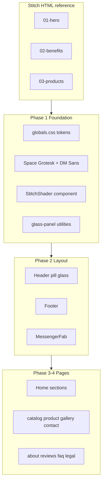

# Применение Stitch-дизайна на production IPOOLGO

## Решения (зафиксированы)

- **Охват:** весь сайт — home, catalog, product, gallery, contact, about, reviews, faq, legal
- **Hero:** Stitch WebGL shader (замена [`WaterHero3D.tsx`](C:\Users\Asus\projects\ipoolgo-landing\apps\web\src\components\home\WaterHero3D.tsx))
- **Подход:** порт HTML → React/Tailwind, **не** встраивание `/stitch-test` iframe

## Источник правды

| Stitch HTML | Назначение |
|-------------|------------|
| [`01-hero.html`](C:\Users\Asus\projects\ipoolgo-landing\apps\web\public\stitch-test\html\01-hero.html) | Hero, pill-nav, loader ring, shader `ANIMATION_2` |
| [`02-benefits.html`](C:\Users\Asus\projects\ipoolgo-landing\apps\web\public\stitch-test\html\02-benefits.html) | Benefits + Drop Stitch diagram, shader `ANIMATION_6` |
| [`03-products.html`](C:\Users\Asus\projects\ipoolgo-landing\apps\web\public\stitch-test\html\03-products.html) | Product carousel cards |
| [`04-catalog.html`](C:\Users\Asus\projects\ipoolgo-landing\apps\web\public\stitch-test\html\04-catalog.html) | Catalog grid |
| [`05-product-detail.html`](C:\Users\Asus\projects\ipoolgo-landing\apps\web\public\stitch-test\html\05-product-detail.html) | Product detail split |
| [`06-gallery.html`](C:\Users\Asus\projects\ipoolgo-landing\apps\web\public\stitch-test\html\06-gallery.html) | Gallery masonry |
| [`07-contact.html`](C:\Users\Asus\projects\ipoolgo-landing\apps\web\public\stitch-test\html\07-contact.html) | Contact form + footer + FAB |

Stitch project: `11481725370368097762` · design system: `assets/11063247503933122056`

---

## Phase 1 — Design foundation

### 1.1 Typography и tokens

Обновить [`globals.css`](C:\Users\Asus\projects\ipoolgo-landing\apps\web\src\app\globals.css):

- Добавить Stitch palette: `brand-deep #03045E`, `surface #000046`, `tertiary #B8FF3C` (сохранить совместимость с `--ocean-*` / `--accent-lime`)
- Порт utility-классов из Stitch: `.glass-panel`, обновлённый `.text-gradient`, keyframes `float`, `pulse-ring`, `scroll-dot`
- Material Symbols (иконки из Stitch nav/cards)

Заменить Manrope в [`layout.tsx`](C:\Users\Asus\projects\ipoolgo-landing\apps\web\src\app\[locale]\layout.tsx) на **Space Grotesk** (display/headline) + **DM Sans** (body) через `next/font/google` — оба с latin+cyrillic для `/ru`.

Обновить [`docs/squad/design-tokens.md`](C:\Users\Asus\projects\ipoolgo-landing\docs\squad\design-tokens.md) → **Stitch v3 (production)**.

### 1.2 WebGL shader component

Создать [`components/visual/StitchShader.tsx`](C:\Users\Asus\projects\ipoolgo-landing\apps\web\src\components\visual\StitchShader.tsx):

- Извлечь inline WebGL из `STITCH_SHADER_START:ANIMATION_2` и `ANIMATION_6` в hero/benefits HTML
- Props: `variant: "hero" | "benefits"`, `className`, `interactive?: boolean`
- `ResizeObserver` + cleanup on unmount
- `prefers-reduced-motion: reduce` → статический gradient fallback (без canvas)

Удалить использование [`WaterHero3D.tsx`](C:\Users\Asus\projects\ipoolgo-landing\apps\web\src\components\home\WaterHero3D.tsx) (файл можно оставить, но не подключать).

### 1.3 Shared UI primitives

Новые/обновлённые компоненты в `components/ui/`:

| Компонент | Назначение |
|-----------|------------|
| `GlassPanel` | glassmorphism wrapper |
| `PillButton` | primary lime / ghost glass CTAs |
| `SectionHeading` | Space Grotesk + lime accent |
| `ProductCard` | доработать под Stitch (lime bar, studio white, dark footer strip) |

---

## Phase 2 — Layout shell

### Header → Stitch pill nav

Переписать [`Header.tsx`](C:\Users\Asus\projects\ipoolgo-landing\apps\web\src\components\layout\Header.tsx):

- Fixed pill: `rounded-full`, `bg-white/10`, `backdrop-blur-xl`, `border-white/20`, max-w-7xl
- Logo italic bold Space Grotesk
- Nav links с lime active state (как в Stitch hero)
- Сохранить: locale switch RO/RU, mute toggle, mobile menu

### Footer + FAB

- [`Footer.tsx`](C:\Users\Asus\projects\ipoolgo-landing\apps\web\src\components\layout\Footer.tsx) — по [`07-contact.html`](C:\Users\Asus\projects\ipoolgo-landing\apps\web\public\stitch-test\html\07-contact.html): tagline, legal links, copyright
- [`MessengerFab.tsx`](C:\Users\Asus\projects\ipoolgo-landing\apps\web\src\components\layout\MessengerFab.tsx) — 3 glass circular FAB (Telegram/WhatsApp/Viber), `@saletoe` links из [`constants.ts`](C:\Users\Asus\projects\ipoolgo-landing\apps\web\src\lib\constants.ts)

---

## Phase 3 — Home page (`/[locale]/`)

Пересобрать секции в [`page.tsx`](C:\Users\Asus\projects\ipoolgo-landing\apps\web\src\app\[locale]\page.tsx) + home components:

| Секция | Файл | Stitch ref |
|--------|------|------------|
| Intro loader | `IntroLoader.tsx` | pulse ring из hero |
| Hero | `HeroSection.tsx` | `01-hero` + `StitchShader variant="hero"` + lime orbs |
| Benefits | `ContentSections.tsx` | `02-benefits` + shader variant benefits |
| Products | `ProductCarousel.tsx` | `03-products`, ваши PNG из [`products.ts`](C:\Users\Asus\projects\ipoolgo-landing\apps\web\src\data\products.ts) |
| Reviews/CTA | `ReviewsSection.tsx` | стилизовать под glass, контент из i18n |

**Сохранить без изменений логики:** `AudioProvider`, `IntroLoader` → `onIntroComplete`, `FadeInView`/Framer где уместно.

**Убрать/упростить:** `TextMarquee`, `MaterialsTechSection`/`AccessoriesSection` — контент слить в Benefits или оставить как compact glass blocks в том же визуальном языке.

---

## Phase 4 — Inner pages (есть Stitch-макеты)

| Route | File | Stitch ref |
|-------|------|------------|
| `/catalog` | [`catalog/page.tsx`](C:\Users\Asus\projects\ipoolgo-landing\apps\web\src\app\[locale]\catalog\page.tsx) | `04-catalog` |
| `/catalog/[slug]` | [`catalog/[slug]/page.tsx`](C:\Users\Asus\projects\ipoolgo-landing\apps\web\src\app\[locale]\catalog\[slug]\page.tsx) | reuse catalog card grid |
| `/products/[slug]` | [`products/[slug]/page.tsx`](C:\Users\Asus\projects\ipoolgo-landing\apps\web\src\app\[locale]\products\[slug]\page.tsx) | `05-product-detail` |
| `/gallery` | [`gallery/page.tsx`](C:\Users\Asus\projects\ipoolgo-landing\apps\web\src\app\[locale]\gallery\page.tsx) | `06-gallery`, ваши PNG |
| `/contact` | [`contact/page.tsx`](C:\Users\Asus\projects\ipoolgo-landing\apps\web\src\app\[locale]\contact\page.tsx) | `07-contact` + существующий [`ContactForm.tsx`](C:\Users\Asus\projects\ipoolgo-landing\apps\web\src\components\forms\ContactForm.tsx) (Telegram API без изменений) |

---

## Phase 5 — Secondary pages (нет Stitch-макета)

Применить те же tokens + `GlassPanel` + `SectionHeading`:

- [`about/page.tsx`](C:\Users\Asus\projects\ipoolgo-landing\apps\web\src\app\[locale]\about\page.tsx)
- [`reviews/page.tsx`](C:\Users\Asus\projects\ipoolgo-landing\apps\web\src\app\[locale]\reviews\page.tsx)
- [`faq/page.tsx`](C:\Users\Asus\projects\ipoolgo-landing\apps\web\src\app\[locale]\faq\page.tsx)
- [`legal/[doc]/page.tsx`](C:\Users\Asus\projects\ipoolgo-landing\apps\web\src\app\[locale]\legal\[doc]\page.tsx)

Копирайт из существующих `messages/ro.json` + `ru.json`; где Stitch дал RO-текст — синхронизировать RO, перевести RU.

---

## Phase 6 — i18n, SEO, cleanup

- Пройти [`messages/ro.json`](C:\Users\Asus\projects\ipoolgo-landing\apps\web\messages\ro.json) / [`ru.json`](C:\Users\Asus\projects\ipoolgo-landing\apps\web\messages\ru.json) — новые строки nav/hero/benefits если появятся
- SEO/JsonLd без регрессий
- `/stitch-test` — оставить локальным sandbox (gitignore), **не** линковать из prod nav
- Убрать `.gitignore` блокировку если решим коммитить prod-изменения (stitch-test HTML по-прежнему не коммитить)

---

## Phase 7 — QA и deploy

- `npm run build` + `npm run lint`
- Smoke: `/ro`, `/ru`, catalog, product, contact form → Telegram
- Проверка shader на mobile + reduced-motion
- Commit + push GitHub + Vercel redeploy (без изменения Telegram secrets)

---

## Риски и mitigations

| Риск | Mitigation |
|------|------------|
| WebGL тяжёлый на слабых телефонах | один shader на viewport, pause off-screen, reduced-motion fallback |
| Stitch HTML ≠ Next.js stack | только reference; классы портируем в Tailwind v4 `@theme` |
| RU локаль без Stitch-макета | те же компоненты + i18n strings |
| Дублирование nav/footer в Stitch HTML | единый Header/Footer в layout, секции без собственного nav |

## Оценка объёма

~18–22 файла затронуто, 1 новый shader module, полный visual refresh без смены backend/API.
