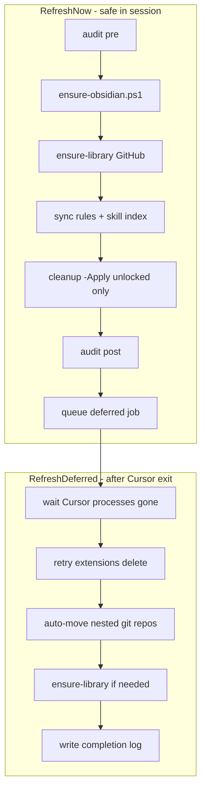

# Автоматизация cursor-system-refresh (deferred cleanup)

## Контекст

После первой пересборки hub ~432 MB, но audit ([`ai-tracking/system-audit-2026-06-12.json`](C:\Users\Asus\.cursor\ai-tracking\system-audit-2026-06-12.json)) всё ещё рекомендует:

- DELETE `extensions/` (~261 MB) — **заблокировано Cursor**
- MOVE 14 nested `.git` → `C:\Users\Asus\projects\`
- Obsidian HTTP 27123 — **не отвечает**
- Cybersecurity library — 372/754 skills, zip удалён

Текущий [`commands/cursor-system-refresh.cmd`](C:\Users\Asus\.cursor\commands\cursor-system-refresh.cmd) делает только sync + index + audit и **не** выполняет cleanup/Obsidian/cyber.

**Выбранная стратегия:** deferred — безопасный прогон сейчас, heavy cleanup фоном после закрытия Cursor.



---

## 1. Новый оркестратор PowerShell

Создать [`commands/cursor-system-refresh.ps1`](C:\Users\Asus\.cursor\commands\cursor-system-refresh.ps1) — единая точка входа.

| Параметр | Поведение |
|----------|-----------|
| (default) | Full safe refresh + queue deferred |
| `-Quick` | Только sync + index + audit (как сейчас) |
| `-Deferred` | Только deferred-фаза (вызывается планировщиком) |
| `-SkipObsidian` | Пропустить Obsidian |
| `-SkipCyber` | Пропустить cybersecurity |

**Фазы (default):**

1. Pre-audit → [`cursor-system-audit.ps1`](C:\Users\Asus\.cursor\commands\cursor-system-audit.ps1)
2. Obsidian → `ensure-obsidian.ps1` (новый)
3. Cybersecurity → `node skills/cybersecurity/scripts/ensure-library.mjs` (с GitHub fallback, см. §4)
4. `python commands/huashu-sync-workspace-rules.py`
5. `node commands/generate-skill-index.mjs`
6. Cleanup **unlocked** → расширенный `cursor-system-cleanup.ps1 -Apply -SkipLocked` (новый флаг)
7. Post-audit
8. Queue deferred → `Register-DeferredRefresh` (новый)

Обновить [`commands/cursor-system-refresh.cmd`](C:\Users\Asus\.cursor\commands\cursor-system-refresh.cmd):

```bat
powershell -NoProfile -ExecutionPolicy Bypass -File "%~dp0cursor-system-refresh.ps1"
```

Добавить [`commands/cursor-system-refresh-quick.cmd`](C:\Users\Asus\.cursor\commands\cursor-system-refresh-quick.cmd) с `-Quick` для лёгкого прогона.

---

## 2. Deferred cleanup (после закрытия Cursor)

Создать [`commands/cursor-system-refresh-deferred.ps1`](C:\Users\Asus\.cursor\commands\cursor-system-refresh-deferred.ps1):

1. Ждать отсутствия процессов `Cursor`, `Cursor Helper` (poll каждые 5s, max 30 min)
2. `cursor-system-cleanup.ps1 -Apply -Force` — удалить `extensions/`, `skills-libraries/`, перенести repos
3. `ensure-library.mjs --force` если skills &lt; 700
4. Финальный audit + log → `ai-tracking/deferred-refresh-YYYY-MM-DD-HHmm.txt`
5. Снять pending-флаг / удалить scheduled task one-shot

**Регистрация задачи** — функция в refresh.ps1:

- Записать pending state: `ai-tracking/.deferred-refresh-pending.json` (timestamp, reason)
- `schtasks /Create /TN "CursorHubDeferredRefresh" /TR "powershell -File ...deferred.ps1" /SC ONLOGON /RL LIMITED /F` **или** one-shot через 2 min + loop wait (предпочтительно **one-shot detached process** без schtasks — проще, без admin):

```powershell
Start-Process powershell.exe -ArgumentList '-WindowStyle Hidden -File ...deferred.ps1' -WorkingDirectory $HubRoot
```

Deferred-скрипт сам ждёт закрытия Cursor — не нужен Task Scheduler.

---

## 3. Расширить cleanup.ps1

Файл: [`commands/cursor-system-cleanup.ps1`](C:\Users\Asus\.cursor\commands\cursor-system-cleanup.ps1)

**Новые параметры:** `-SkipLocked`, `-Force`

**Robust delete для `extensions/`:**

- Retry 3× с паузой 2s
- Fallback: `cmd /c rmdir /s /q` + `takeown /f` + `icacls /grant` (только при `-Force` и deferred)
- Если всё ещё locked и `-SkipLocked` → log `SKIP_LOCKED extensions/` (не fail)

**Auto-discovery embedded repos** (дополнение к `$moveMap`):

- Скан: все каталоги с `.git` под hub, **исключая:**
  - `C:\Users\Asus\.cursor\.git` (hub meta-repo)
  - `projects\c-Users-Asus-cursor\` (MCP descriptors — только metadata)
  - `skills\cybersecurity\library\`
  - `plugins\cache\`
- Для каждого repo-root → `Move-Item` в `C:\Users\Asus\projects\<folderName>`
- Явно включить root-level: `InCruises`, `linellabotprojet`, и т.д.
- **Не переносить** `projects/c-Users-Asus-cursor-*` (это Cursor workspace metadata, не client repos) — только если внутри есть `.git` at unexpected depth

**Temp project dirs:** удалять `projects/C-Users-Asus-AppData-Local-Temp-*` и numeric ids (уже частично есть).

---

## 4. Obsidian auto-start

Создать [`commands/ensure-obsidian.ps1`](C:\Users\Asus\.cursor\commands\ensure-obsidian.ps1):

1. Читать Bearer из [`mcp.json`](C:\Users\Asus\.cursor\mcp.json) (reuse logic from audit)
2. Если `http://127.0.0.1:27123/` OK → exit 0
3. Искать `Obsidian.exe`:
   - `%LOCALAPPDATA%\Programs\Obsidian\Obsidian.exe`
   - `%LOCALAPPDATA\obsidian\Obsidian.exe`
   - Registry `HKCU\Software\Microsoft\Windows\CurrentVersion\Uninstall\Obsidian`
4. `Start-Process` с vault path = hub (`C:\Users\Asus\.cursor`) если нужно
5. Poll health каждые 3s, max 90s
6. Log результат; **не** пытаться перезапустить Cursor MCP из скрипта (нет стабильного API) — вместо этого bump `mcp.json` comment field `# refreshed: ISO8601` чтобы Cursor подхватил при следующем reload

---

## 5. Cybersecurity library — GitHub fallback

Обновить [`skills/cybersecurity/scripts/ensure-library.mjs`](C:\Users\Asus\.cursor\skills\cybersecurity\scripts\ensure-library.mjs):

- Если zip не найден → скачать `https://github.com/mukul975/Anthropic-Cybersecurity-Skills/archive/refs/heads/main.zip` в `skills-libraries/` (recreate dir)
- Распаковать во временную папку; ожидать `Anthropic-Cybersecurity-Skills-main/`
- При `--force` или `countSkills() < 700` — перекачать
- Timeout + progress log (избежать 20-min silent hang)
- Exit 0 если ≥700 skills, warn если 372–699

---

## 6. Обновить registry и docs

- [`SYSTEM-REGISTRY.md`](C:\Users\Asus\.cursor\SYSTEM-REGISTRY.md) — секция Commands: описать `-Quick`, deferred flow
- [`commands/cursor-system-audit.ps1`](C:\Users\Asus\.cursor\commands\cursor-system-audit.ps1) — добавить поле `deferredPending` из pending JSON

---

## 7. Выполнение и верификация (после approve)

1. Implement all scripts
2. Run `commands\cursor-system-refresh.cmd` (safe phase in current session)
3. Verify: Obsidian OK in post-audit, deferred process spawned
4. User closes Cursor → deferred completes extensions delete + repo moves
5. Re-open Cursor → run refresh again → audit should show hub &lt;200 MB, nested git ≈0, Obsidian OK

**Git commit:** orchestrator + ensure-obsidian + cleanup enhancements + ensure-library GitHub fallback + SYSTEM-REGISTRY update.

---

## Ожидаемый результат

| Метрика | Сейчас | После deferred |
|---------|--------|----------------|
| Hub size | ~432 MB | ~150–200 MB |
| extensions/ | ~261 MB locked | deleted |
| nested .git | 14 | 0–1 |
| Obsidian | offline | auto-started |
| Cyber skills | 372 | 700+ (GitHub) |
| Manual steps | 4 команды | **один** `cursor-system-refresh.cmd` |
