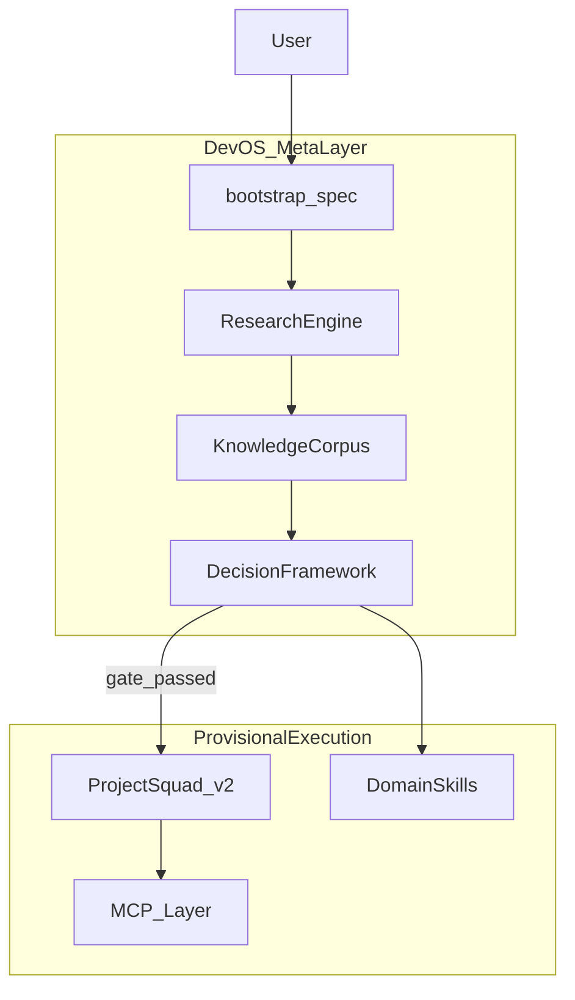

# Cursor AI Dev OS — Bootstrap Plan

## Positioning (user decision)

**Dev OS = meta-layer** над существующим hub. [Project Squad v2](C:/Users/Asus/.cursor/skills/project-squad/SKILL.md) и [agents/squad-*.md](C:/Users/Asus/.cursor/agents/) **не удаляются**, но помечаются как **provisional** — допустимы только для execution после research gate или когда задача явно operational (fix CI, deploy, audit hub).



**Conflict rule** (from spec Part 2/3): safety > quality > adaptability > autonomy > token cost — encoded in decision framework, not in Squad roster.

---

## What we build (no fixed architecture yet)

Создаём **инфраструктуру исследования и принятия решений**, не финальную структуру subagents.

| Artifact | Path | Role |
|----------|------|------|
| Bootstrap canon | [`docs/dev-os/BOOTSTRAP.md`](docs/dev-os/BOOTSTRAP.md) | Parts 1–4 verbatim + hub-specific boundaries |
| Main skill | [`skills/dev-os/SKILL.md`](skills/dev-os/SKILL.md) | Entry: `@dev-os`, lifecycle gates, when to block execution |
| Research skill | [`skills/dev-os/research/SKILL.md`](skills/dev-os/research/SKILL.md) | Phase 1–3 protocols, source classes A–G |
| Decision skill | [`skills/dev-os/decision/SKILL.md`](skills/dev-os/decision/SKILL.md) | Research → Reason → Design(candidates) → Execute |
| Memory skill | [`skills/dev-os/memory/SKILL.md`](skills/dev-os/memory/SKILL.md) | What enters long-term memory; 5-step update rule |
| Command | [`commands/dev-os.md`](commands/dev-os.md) | `/dev-os bootstrap`, `/dev-os research <domain>` |
| On-demand rule | [`rules/dev-os.mdc`](rules/dev-os.mdc) | Triggers `@dev-os`, research-first gate |
| Registry patch | [`SYSTEM-REGISTRY.md`](SYSTEM-REGISTRY.md) | Dev OS layer + relationship to Squad |

**Knowledge corpus** (living outputs — initially empty templates):

```
ai-tracking/dev-os/
├── index.md                 # Knowledge map entry + phase status
├── synthesis/               # Part 1 final: understanding WITHOUT fixed design
│   └── understanding.md     # "ideal Dev OS" hypothesis — explicitly provisional
├── layers/
│   ├── knowledge-map.md     # 5.1 — approaches + links + conflicts
│   ├── best-practices.md    # 5.2
│   ├── anti-patterns.md     # 5.3
│   └── emerging-trends.md   # 5.4
├── research/
│   ├── domains/             # 10 domain folders (4.1–4.10)
│   │   ├── multi-agent/
│   │   ├── context-engineering/
│   │   ├── memory-systems/
│   │   ├── ai-dev-environments/
│   │   ├── mcp-ecosystem/
│   │   ├── automation/
│   │   ├── security/
│   │   ├── prompt-systems/
│   │   ├── creative-systems/
│   │   └── optimization/
│   └── sources/             # Per-source extraction cards
│       └── _template.md
└── decisions/
    └── log.md               # Decisions with evidence links (Part 3 format)
```

Each **source extraction card** (`research/sources/_template.md`) forces "why not what":
- architectural patterns, roles observed, failure modes, limits, scaling, memory/context, orchestration, complexity control, **evidence URL**, confidence (low/med/high).

---

## Research-first engine (executable in Cursor)

### Phase 1 — Global Research

Protocol in [`skills/dev-os/research/SKILL.md`](skills/dev-os/research/SKILL.md):

| Source class | Hub tooling (existing) |
|--------------|------------------------|
| A GitHub / OSS | Exa + `git clone` → `ai-tracking/dev-os/repos/` (shallow) |
| B Production systems | Exa + fetch product/docs |
| C Papers | Exa (`site:arxiv.org`, labs) |
| D Engineering blogs | Exa |
| E Cursor/MCP/N8N | Local hub audit + [n8n-workflow skill](C:/Users/Asus/.cursor/skills/n8n-workflow/SKILL.md) + [SYSTEM-REGISTRY](C:/Users/Asus/.cursor/SYSTEM-REGISTRY.md) |
| F Community | Exa (HN, Reddit, GH discussions) |
| G Creative | huashu-design / stitch / figma skills on-demand |

**Dedup rule** (reuse [mcp-routing.mdc](C:/Users/Asus/.cursor/rules/mcp-routing.mdc)): one web provider per research thread (Exa primary).

### Phase 2 — Knowledge Extraction

Agent fills `_template.md` per source; nightly merge into domain `research/domains/<name>/findings.md`.

### Phase 3 — Comparative Analysis

After ≥3 sources per domain: update `layers/knowledge-map.md` with compare matrix (approach | pros | cons | when | obsolete?).

### Bootstrap gate (critical)

In [`skills/dev-os/SKILL.md`](skills/dev-os/SKILL.md):

```
IF ai-tracking/dev-os/synthesis/understanding.md status != "research_complete"
AND task is NOT in allowlist (hub audit, MCP fix, explicit user override)
THEN block: new subagent definitions, new always-on rules, architecture commits
ALLOW: research, extraction, comparative analysis, memory validation writes
```

**Allowlist** keeps hub operational while Dev OS bootstraps.

---

## Memory model (extends existing stack)

Current: `user-memory` → `AGENTS.md` → `ai-tracking/` ([obsidian-mcp skill](C:/Users/Asus/.cursor/skills/obsidian-mcp/SKILL.md)).

Dev OS adds **tiered research memory**:

| Tier | Location | Content |
|------|----------|---------|
| Working | chat + `ai-tracking/dev-os/research/in-progress/` | Raw notes, hypotheses |
| Project | `ai-tracking/dev-os/research/domains/` | Domain findings |
| Long-term | `user-memory` via **squad-memory** or dedicated remember flow | Only validated patterns (Part 3 §6.1) |
| Skill | `skills/dev-os/`, domain skills | Stable procedures |

**Memory update pipeline** (Part 3): extract → validate (2+ sources or production evidence) → compress → store → conflict check against `layers/anti-patterns.md`.

**Never store**: one-off hypotheses, unverified GitHub README claims, secrets.

---

## Decision framework (Part 3 as code-adjacent spec)

[`skills/dev-os/decision/SKILL.md`](skills/dev-os/decision/SKILL.md) encodes:

1. **Research → Reason → Design(candidates) → Execute**
2. **Dynamic subagent emergence** — checklist before creating any new `agents/*.md`:
   - functional need? repeated pattern? specialization benefit?
   - if no → use Task `explore` / existing Squad role
3. **Model routing** — align with [project-squad model-map](C:/Users/Asus/.cursor/skills/project-squad/reference/model-map.md) until Dev OS synthesis replaces it
4. **Security override** — cybersecurity skill + deploy gates before ship
5. **Decision log format** in `decisions/log.md`: observation, options, evidence, choice, revisit date

---

## Relationship to Project Squad (provisional bundle)

Update [`skills/project-squad/SKILL.md`](skills/project-squad/SKILL.md) with short **Provisional Notice**:

- Squad roster is **pre-research execution shortcut**, not canonical Dev OS architecture
- Boss must check Dev OS gate before spawning new squad agents or changing roster
- `@dev-os` overrides Squad for structural/meta tasks

No deletion of [agents/squad-*.md](C:/Users/Asus/.cursor/agents/) in bootstrap phase.

---

## Orchestrator integration

Patch [`rules/00-agent-orchestrator.mdc`](C:/Users/Asus/.cursor/rules/00-agent-orchestrator.mdc) and [`rules/auto-orchestrator.mdc`](C:/Users/Asus/.cursor/rules/auto-orchestrator.mdc):

```
@dev-os | bootstrap | research-first | architecture study
  → dev-os skill → research skill
  → NO squad spawn unless execution phase + gate open
```

---

## First research sprint (after scaffolding — Phase 1 deliverable)

**Priority order** (10 domains, not parallel all-at-once — token budget):

1. **multi-agent** + **context-engineering** + **memory-systems** (foundation)
2. **ai-dev-environments** + **mcp-ecosystem** (Cursor-native)
3. **optimization** + **security**
4. **automation** (n8n) + **prompt-systems**
5. **creative-systems**

Per domain target: **5–8 high-signal sources**, ≥3 for comparative analysis.

**Seed sources** (first sprint anchors — research must verify, not trust):

| Domain | Starting points |
|--------|-----------------|
| Multi-agent | LangGraph, CrewAI, AutoGen, Cursor subagents docs, Anthropic multi-agent |
| Context | Anthropic context engineering, Karpathy guidelines, RAG patterns |
| Memory | user-memory MCP, mem0, Letta, seo-geo HOT/WARM model |
| AI IDE | Cursor docs, Continue, Windsurf patterns, existing hub |
| MCP | n8n-mcp, modelcontextprotocol.io, existing hub registry |

**Part 1 final output** (after sprint 1–3 domains): populate `synthesis/understanding.md` — **provisional vision** of ideal Dev OS, explicitly **no subagent list**, no folder structure mandate.

---

## Verification (bootstrap "correctly launched")

From spec Part 4 §16:

- [ ] Research corpus exists with extraction cards
- [ ] Knowledge map + 3 layers populated for ≥3 domains
- [ ] `understanding.md` written as hypothesis, not architecture spec
- [ ] Decision log has ≥1 documented tradeoff
- [ ] Squad still works under meta-layer
- [ ] Gate blocks premature `agents/` / always-on rule creation (manual test)

Optional script: [`commands/dev-os-status.mjs`](commands/dev-os-status.mjs) — counts sources, domain coverage, gate status.

---

## Out of scope (this bootstrap)

- Replacing Project Squad roster
- New MCP servers (unless research proves gap)
- Always-on Dev OS rule (stay on-demand to save tokens)
- Committing `mcp.json` secrets
- Full 10-domain exhaustive crawl in one session

---

## Implementation order

1. `docs/dev-os/BOOTSTRAP.md` + empty corpus templates
2. `skills/dev-os/*` + `commands/dev-os.md` + `rules/dev-os.mdc`
3. Registry + orchestrator patches + Squad provisional notice
4. Run **Research Sprint 1** (domains 1–3) → fill layers + synthesis draft
5. `dev-os-status.mjs` + first decision log entry
6. User review of `understanding.md` before any Phase 4 (Structural Emergence) work
