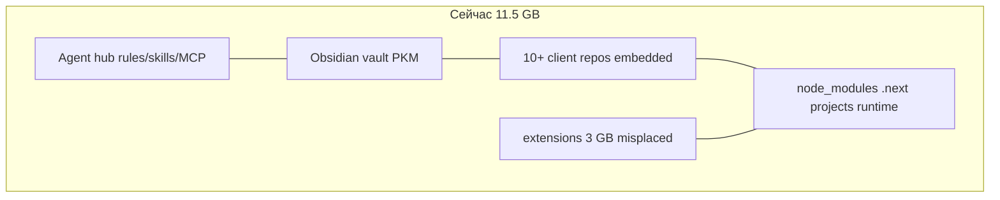
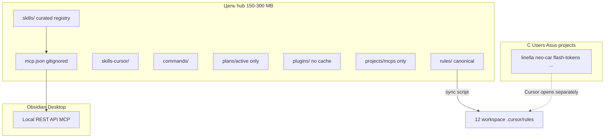
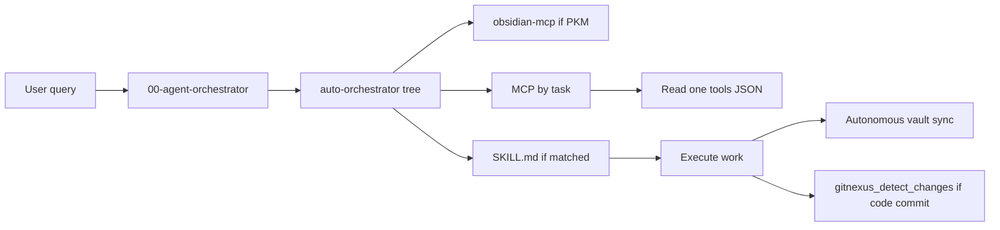

# Полная пересборка системы `.cursor`

## Диагноз (кратко)

Сейчас `C:\Users\Asus\.cursor` совмещает **4 роли**, из‑за чего всё конфликтует:



| Проблема | Масштаб | Эффект |
|----------|---------|--------|
| `extensions/` внутри workspace | **~3 GB** | Не agent-config; засоряет диск и git |
| Вложенные проекты (`neo-car-*`, `flash-tokens-trust`, …) | **~6+ GB** | 27 nested `.git`, конфликт с parent repo |
| Тройной Linella (root + `linellabotprojet/` + `projects/…`) | **~1.4 GB** | Дубликаты `node_modules` |
| `skills/clone-website/template/node_modules` | **~506 MB** | Skill раздувается |
| `skills-libraries/` + `libraries/huashu-design` dup | **~666 MB** | Дубликаты после install |
| 4 web-провайдера (fetch, Exa, Tavily, Firecrawl) | overlap | Агент «дергает всё» |
| 6 always-on rules + GitNexus + Obsidian autonomous | context bloat | Перегруз контекста каждой сессии |
| Broken `cybersecurity` junction | broken skill | Git warning, skill мёртв |
| Obsidian MCP descriptors missing | `user-obsidian` errored | Rule «read descriptor» не работает |
| GitNexus index от 2026-05-08 | stale | Impact/query бесполезны |
| ~50+ untracked skill dirs | drift | Нет единого реестра |
| `plans/` 40 файлов untracked | noise | `git status` нечитаем |

**Obsidian vault = эта же папка** (API `/vault/` возвращает `AGENTS.md`, `neo-car-site/`, …). Перенос проектов **не ломает vault**, если заметки остаются в hub или в `ai-tracking/`.

---

## Целевая архитектура



**Принцип:** `.cursor` = **конфиг агента + PKM**, не хранилище клиентских репо.

---

## Фаза 0 — Автоматический preflight (без ручной работы)

Создать [`commands/cursor-system-audit.ps1`](C:\Users\Asus\.cursor\commands\cursor-system-audit.ps1):

- Скан: размеры top-level, nested `.git`, broken junctions, stale gitnexus, MCP health (`curl` Obsidian), untracked count
- Режимы: `-DryRun` (default) / `-Apply`
- JSON-отчёт → `ai-tracking/system-audit-YYYY-MM-DD.json` (Obsidian) + markdown summary

**Субагенты для выполнения:** `shell` (скрипты), `explore` (инвентарь), `compatibility-scan-review` (agent-compatibility plugin CLI)

---

## Фаза 1 — Очистка и освобождение ~8+ GB

Автоматический скрипт [`commands/cursor-system-cleanup.ps1`](C:\Users\Asus\.cursor\commands\cursor-system-cleanup.ps1) с `-Apply`:

| Действие | Путь | Экономия |
|----------|------|----------|
| DELETE | `extensions/` (misplaced VS Code extensions) | ~3 GB |
| DELETE | `**/node_modules`, `**/.next`, `**/.turbo` under hub (not moved projects) | ~1.5 GB |
| DELETE | `skills/clone-website/template/node_modules` | ~506 MB |
| DELETE | `projects/c-Users-Asus-cursor-linellabotprojet/node_modules` + `.next` | ~410 MB |
| DELETE | `libraries/huashu-design/` (dup of `skills/huashu-design`) | ~31 MB |
| DELETE | `skills-libraries/` (after skills installed) | ~635 MB |
| DELETE | root `_probe*.py`, `_do_*.bat`, `fix.txt`, `skills/Cursor.lnk` | clutter |
| DELETE | `projects/<numeric-id>/` (22 ephemeral session dirs) | varies |
| MOVE | embedded repos → `C:\Users\Asus\projects\<name>` | ~6 GB out of hub |

**Не трогать:** `rules/`, `skills/*/SKILL.md`, `mcp.json`, `.obsidian/`, `ai-tracking/`, tracked root Linella (решение ниже).

**Linella triage:** оставить **одну** копию — либо root tracked app, либо перенести в `C:\Users\Asus\projects\linellabotprojet` и убрать из hub (рекомендуется второе).

**Default (вы пропустили вопрос):** move-out + dry-run сначала, затем `-Apply`.

---

## Фаза 2 — Единый реестр и правила по слоям

Создать **канонический индекс** [`SYSTEM-REGISTRY.md`](C:\Users\Asus\.cursor\SYSTEM-REGISTRY.md) (tracked) — единственная карта системы:

```markdown
## Layers
1. Always-on rules (max 2 local pointers)
2. On-demand rules (by domain)
3. Skills (personal + skills-cursor)
4. MCP user vs plugin
5. Subagents (Task tool)
6. Commands
```

### 2.1 Правила — разделить по слоям

| Слой | Файл | `alwaysApply` | Содержание |
|------|------|---------------|------------|
| **Core routing** | [`rules/00-agent-orchestrator.mdc`](C:\Users\Asus\.cursor\rules\00-agent-orchestrator.mdc) | true | Только таблицы маршрутизации + ссылка на registry |
| **PKM** | [`rules/obsidian-mcp.mdc`](C:\Users\Asus\.cursor\rules\obsidian-mcp.mdc) | true | **Сжать до ~30 строк** — pointer + «autonomous»; детали в skill |
| **MCP detail** | [`rules/mcp-routing.mdc`](C:\Users\Asus\.cursor\rules\mcp-routing.mdc) | false | Web dedup, Obsidian, GitNexus |
| **Design** | `huashu-design`, `21st-design`, `ui-ux-pro-max`, `awesome-design-md` | false | Взаимоисключения уже есть |
| **Domain** | `clone-website`, `cybersecurity`, `seo-geo` (new) | false | По триггеру |
| **Delete local dup** | `.cursor/rules/` in hub | — | Удалить; sync script заполняет в **других** workspaces |

**Plugin always-on trim (Cursor Settings):** отключить или снять `alwaysApply` у `exa-awareness`, `zapier-lifecycle` если не используете ежедневно — они добавляют ~4 plugin rules в каждый чат.

### 2.2 Новое правило — авто-роутинг

Создать [`rules/auto-orchestrator.mdc`](C:\Users\Asus\.cursor\rules\auto-orchestrator.mdc) (`alwaysApply: false`, description rich):

- Decision tree: task type → MCP → skill → subagent
- Примеры: vault→obsidian; web fact→exa OR fetch; UI clone→browser+clone-website; CI→fix-ci skill; refactor indexed repo→gitnexus

Обновить [`AGENTS.md`](C:\Users\Asus\.cursor\AGENTS.md) / [`CLAUDE.md`](C:\Users\Asus\.cursor\CLAUDE.md): единый стиль путей `rules/` (не `.cursor/rules/`), секции для всех 9 rules + top skills.

### 2.3 Skills — консолидация

| Действие | Детали |
|----------|--------|
| **Fix** | `node skills/cybersecurity/scripts/ensure-library.mjs` |
| **Dedupe** | Удалить 21 flat `skills/seo-geo-*` если pack `skills/seo-geo/library/` достаточен |
| **Deprecate** | Пометить `skills/.../obsidian-vault/SKILL.md` → redirect на `obsidian-mcp` |
| **Track or ignore** | Commit curated set OR add `skills/seo-geo/`, `21st-design`, `cybersecurity` OR `.gitignore` bulk untracked |
| **Registry script** | [`commands/generate-skill-index.mjs`](C:\Users\Asus\.cursor\commands\generate-skill-index.mjs) → `skills/_INDEX.md` auto |

### 2.4 MCP — приоритеты (зафиксировать в registry)

**User [`mcp.json`](C:\Users\Asus\.cursor\mcp.json) — always:**

| Server | Роль |
|--------|------|
| obsidian | PKM autonomous |
| gitnexus | Code graph (indexed repos only) |
| memory | Short session facts |
| fetch | Single URL (fallback) |
| @21st-dev/magic | UI components |

**Plugin MCP — enable on demand:**

| When | Server |
|------|--------|
| Deploy | vercel |
| DB | supabase |
| Payments | stripe |
| Auth | clerk |
| Design | figma |
| **Web research (pick ONE primary)** | **exa** (recommended) — disable parallel Tavily/Firecrawl default |
| Browser E2E | cursor-ide-browser (plugin browse) |
| Automation | zapier |

**Fix Obsidian MCP descriptors:** перезапуск Cursor MCP + ensure Obsidian running → populate `projects/c-Users-Asus-cursor/mcps/user-obsidian/tools/`. Update rule text if server id differs.

**Naming map** in orchestrator L52: `gitnexus` ↔ `user-gitnexus`, add `@21st-dev/magic`.

### 2.5 Subagents — таблица в registry

| Task | Subagent |
|------|----------|
| Broad codebase scan | `explore` |
| Shell/git/CI | `shell` |
| CI failure | `ci-investigator` |
| Parallel sections | `best-of-n-runner` |
| Next/Vercel arch | `ai-architect` / `deployment-expert` |
| Post-feature review | `code-reviewer` |
| Repo health | `compatibility-scan-review`, `startup-review` |

---

## Фаза 3 — Зависимости и последовательности (dependency graph)



**Priority order (hardcoded in registry):**

1. User Rules (Cursor settings)
2. `obsidian-mcp` + autonomous sync (after substantive work)
3. Task-specific rule (`clone-website`, `21st-design`, …)
4. Matched `SKILL.md`
5. MCP tool call
6. Subagent delegation (parallel only if independent)
7. GitNexus (only for symbol edits in indexed repos)

---

## Фаза 4 — `.gitignore` и git hygiene

Update [`.gitignore`](C:\Users\Asus\.cursor\.gitignore) managed block:

- Add explicit `!AGENTS.md`, `!CLAUDE.md`, `!SYSTEM-REGISTRY.md`, `!huashu-design-USER-RULES.txt`
- Add `plans/archive/`
- Keep ignoring: `extensions/`, `mcp.json`, `projects/*/terminals/`, `plugins/cache/`
- Add `**/node_modules/` (already global)

**GitNexus:** `npx gitnexus analyze` in hub after cleanup OR delete `.gitnexus/` if meta-repo too noisy for graph.

**Commit batch:** cleanup script results + registry + trimmed rules + skill index + obsidian autonomous (uncommitted).

---

## Фаза 5 — Автоматизация «одной кнопкой»

Создать [`commands/cursor-system-refresh.cmd`](C:\Users\Asus\.cursor\commands\cursor-system-refresh.cmd):

```bat
python commands/huashu-sync-workspace-rules.py
node commands/generate-skill-index.mjs
powershell commands/cursor-system-audit.ps1 -DryRun
REM optional: -Apply cleanup, gitnexus analyze
```

Hook (optional): [`create-hook` skill] — `afterAgentResponse` → lightweight Obsidian sync trigger (only if substantive turn).

---

## Слабые места — простым языком и быстрые fix

| Слабое место | Почему плохо | Fix (роботизировано) |
|--------------|--------------|----------------------|
| **11 GB в config folder** | Cursor тормозит, git бессмысленен | `cursor-system-cleanup.ps1 -Apply` |
| **extensions/ не на месте** | 3 GB мусора | Delete folder; extensions живут в AppData |
| **4 web-search сразу** | Агент путается, тратит токены | Registry: primary=Exa; disable Tavily plugin OR demote Firecrawl skill |
| **2 huge always-on rules** | Каждый чат тяжелее | Сжать obsidian rule; детали в skill |
| **Obsidian MCP errored** | Autonomous vault не работает | Obsidian running + restart MCP in Cursor |
| **Broken cybersecurity skill** | `ensure-library.mjs` | One node command |
| **50+ untracked skills** | Хаос версий | generate-skill-index + commit curated |
| **GitNexus stale** | Impact analysis врёт | `npx gitnexus analyze` |
| **Secrets in mcp.json** | Риск утечки | Already gitignored; rotate keys if ever committed |
| **Triple Linella** | 1.4 GB dup | Move to `~/projects`, delete copies |
| **Plugin always-on (Exa/Zapier)** | Context noise | Cursor Settings → Rules → disable unused |

---

## Порядок выполнения (implementation)

1. **Preflight audit** script + report (read-only, 2 min)
2. **Cleanup** move/delete with log (10–20 min, ~8 GB)
3. **Fix broken** cybersecurity junction + Obsidian MCP reconnect
4. **Rewrite** orchestrator + trim obsidian rule + create SYSTEM-REGISTRY + auto-orchestrator
5. **Generate** skill index + update AGENTS/CLAUDE
6. **gitignore** patch + commit
7. **Sync** rules to 12 workspaces (`huashu-sync-workspace-rules.py`)
8. **GitNexus** reanalyze (optional)
9. **Verify:** Obsidian curl OK, MCP green in Cursor, `git status` clean-ish, hub size <500 MB

---

## Ожидаемый результат

| Метрика | До | После |
|---------|-----|-------|
| Размер hub | ~11.5 GB | ~150–300 MB (+ moved projects external) |
| Always-on local rules | 2 bloated | 2 lean pointers |
| Web MCP providers active | 4+ | 1 primary + fetch fallback |
| Skill discoverability | scattered | `_INDEX.md` + registry |
| Autonomous Obsidian | configured | working MCP + sync |
| Manual steps for you | many | one `cursor-system-refresh.cmd` periodically |
