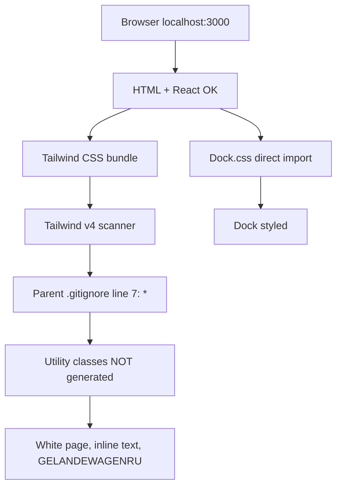

# Исправление «без стилей» на localhost:3000

## Диагноз (подтверждено)



| Симптом на скриншоте | Причина |
|----------------------|---------|
| Белый фон вместо `bg-black` | Классы Tailwind не попали в CSS |
| Текст слева столбиком, CTA слиплись (`diagnosticarea079`) | Нет `flex`, `gap`, `container` |
| Dock внизу стилизован | [`Dock.tsx`](C:\Users\Asus\.cursor\gelentwagen-newlook-site\src\components\react-bits\Dock.tsx) импортирует [`Dock.css`](C:\Users\Asus\.cursor\gelentwagen-newlook-site\src\components\react-bits\Dock.css) напрямую |
| `GET /?lang=ro 200` | Роутинг и dev-сервер в порядке — это не 404 и не `?lang=` |

**Корневая причина:** git root = [`C:\Users\Asus\.cursor`](C:\Users\Asus\.cursor), не папка сайта. В [`.gitignore`](C:\Users\Asus\.cursor\.gitignore) строка `*` игнорирует всё, кроме allowlist `projects/...`. Проект [`gelentwagen-newlook-site`](C:\Users\Asus\.cursor\gelentwagen-newlook-site) **вне** allowlist.

Проверка:
```bash
git check-ignore -v src/components/home-page.tsx
# → .gitignore:7:*  (игнорируется)
```

Tailwind v4 **не сканирует** gitignored файлы → в dev/build CSS почти пустой (только base/theme), утилиты из `className` не генерируются.

---

## План исправления

### 1. Изолировать git-границу проекта (главный фикс)

В [`gelentwagen-newlook-site`](C:\Users\Asus\.cursor\gelentwagen-newlook-site):

```bash
git init
```

Создаётся локальный `.git` → Tailwind использует только [`.gitignore` проекта](C:\Users\Asus\.cursor\gelentwagen-newlook-site\.gitignore) (нормальный, без `*`), сканирование `src/**` снова работает.

Не трогаем родительский репозиторий Cursor.

### 2. Явные `@source` в Tailwind (страховка)

В [`src/app/globals.css`](C:\Users\Asus\.cursor\gelentwagen-newlook-site\src\app\globals.css) после `@import "tailwindcss"`:

```css
@source "../components";
@source "../lib";
@source "../content";
```

Пути относительно `src/app/` — явно включают компоненты, даже если auto-detect снова сломается.

### 3. Dev origins для localhost

В [`next.config.ts`](C:\Users\Asus\.cursor\gelentwagen-newlook-site\next.config.ts) расширить:

```ts
allowedDevOrigins: ["localhost", "127.0.0.1"],
```

Сейчас только `127.0.0.1` — при открытии `localhost:3000` Next может блокировать dev-ресурсы/HMR (видели в логах ранее).

### 4. Перезапуск dev с чистым кешем

```bash
npm run dev:stop
Remove-Item -Recurse -Force .next\dev -ErrorAction SilentlyContinue
npm run dev
```

`predev` уже освобождает порт 3000 ([`scripts/stop-stale-dev.mjs`](C:\Users\Asus\.cursor\gelentwagen-newlook-site\scripts\stop-stale-dev.mjs)).

### 5. Верификация «идеала»

**В браузере (DevTools):**
- `body` → computed `background-color` тёмный (не белый)
- header → `display: flex`, логотип и кнопка **RU** разделены (не `GELANDEWAGENRU`)
- CTA и телефон с отступом (`gap`)

**В терминале:**
```bash
npm run lint
npm run build
npm run test:e2e
```

**Опционально — размер CSS:** после `npm run build` файл в `.next/static/css/*.css` должен быть сотни KB, не пустой.

### 6. README (одна строка)

В runbook [`README.md`](C:\Users\Asus\.cursor\gelentwagen-newlook-site\README.md): если стили пропали — проект должен иметь свой `git init`, иначе Tailwind не сканирует файлы внутри `.cursor`.

---

## Что НЕ меняем

- Логику `?lang=ro` — URL корректен
- `npm run dev --webpack` — нужен для CPU без BMI2
- `output: standalone` — для деплоя

## Ожидаемый результат

После `git init` + `@source` + перезапуска dev: полноценный тёмный hero, типографика, flex-layout, чёрный фон, те же 5/5 e2e.
