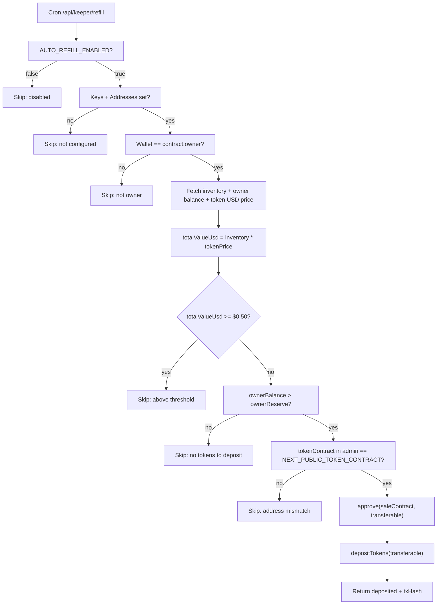

# Flash Tokens Trust — Full Audit & Fix Plan

## Audit Findings

### Bug 1: Admin Login Fails in Production

**Root cause** — [`frontend/lib/admin-session.ts`](frontend/lib/admin-session.ts) lines 24-27:

```typescript
if (process.env.NODE_ENV === "production") {
  if (!expectedLogin || !expectedPassword) return false; // <-- returns false when env vars unset
  return login === expectedLogin && password === expectedPassword;
}
// Fallback to "trustusdt2026" / "besttokens2026" only runs in development
```

The Vercel deployment sets `NODE_ENV=production` automatically. Because `ADMIN_LOGIN` and `ADMIN_PASSWORD` are not set as Vercel environment variables, the function returns `false` for every login attempt. The fallback dev credentials never run.

**Fix**: Two-part
1. Add `.trim()` + safe comparison so env var whitespace can't break it
2. Set `ADMIN_LOGIN=trustusdt2026` and `ADMIN_PASSWORD=besttokens2026` in Vercel Project → Settings → Environment Variables (all environments)

---

### Bug 2: "Address is invalid" on Buy Now

**Root cause** — [`frontend/config/contracts.ts`](frontend/config/contracts.ts) lines 23-27:

```typescript
const TOKEN_SALE_ADDRESSES: Record<number, Address | undefined> = {
  97: process.env.NEXT_PUBLIC_TOKEN_SALE_CONTRACT as Address | undefined,
  // ...no .trim() applied
};
```

The address `0x731CECcB7C55C7Fe65d99131F1eEE9b8135FdF91` is correct (40 hex chars) but was pasted into the Vercel env dashboard with a trailing newline or space, making it 41+ characters. viem's `isAddress()` check then rejects it.

**Fix**: Add `.trim()` to every address read from `process.env` in `contracts.ts` and in `getTokenAddress()`.

---

### Bug 3: Token Keeper uses count threshold, not USD value

**Root cause** — [`frontend/lib/inventory-keeper.ts`](frontend/lib/inventory-keeper.ts) line 63:

```typescript
if (inventory >= minInventory) {
  return { ok: true, skipped: true, reason: "Contract inventory above threshold" };
}
```

The keeper compares raw token count against `KEEPER_MIN_CONTRACT_INVENTORY` (default 100 tokens). The user wants the trigger to be: total USD value of contract inventory < $0.50.

---

## Work Plan

### Phase 1 — Critical Bug Fixes

**Task 1.1 — Fix admin login**
- File: [`frontend/lib/admin-session.ts`](frontend/lib/admin-session.ts)
- Change `verifyAdminCredentials` to apply `.trim()` to both login and password inputs
- Allow the fallback credentials to function even in production when no env vars are set (dev-mode fallback behind explicit `ALLOW_DEV_CREDS=true` env var OR simply remove the production branch restriction, relying on strong session HMAC instead)
- Document in `.env.example`: `ADMIN_LOGIN=` and `ADMIN_PASSWORD=` must be set in Vercel

**Task 1.2 — Fix address trimming**
- File: [`frontend/config/contracts.ts`](frontend/config/contracts.ts)
- Wrap every `process.env.NEXT_PUBLIC_TOKEN_SALE_CONTRACT` and `process.env.NEXT_PUBLIC_TOKEN_CONTRACT` read with `.trim()` before casting to `Address`
- Same fix in `getTokenSaleAddress()` and `getTokenAddress()`

**Task 1.3 — Fix address trimming in apply-config**
- File: [`frontend/app/api/admin/apply-config/route.ts`](frontend/app/api/admin/apply-config/route.ts)
- Trim all address fields before storing them as env entries

---

### Phase 2 — Token Management Enhancement

**Task 2.1 — Add USD-value threshold to inventory keeper**
- File: [`frontend/lib/inventory-keeper.ts`](frontend/lib/inventory-keeper.ts)
- Fetch BNB/USD price from the existing CoinGecko integration (or use `NEXT_PUBLIC_BNB_USD` from monitor stats cache)
- Fetch token price via CoinGecko (token contract address lookup) or calculate from the sale rate
- Compute `totalValueUsd = inventoryTokenCount * tokenUsdPrice`
- Replace the count-based threshold check with: `if (totalValueUsd >= 0.50) return { skipped: true }`
- Add new env var: `KEEPER_MIN_USD_VALUE=0.50` (default) alongside existing count threshold as fallback

**Task 2.2 — Support token contract replacement (old → new)**
- The admin panel already has the UI for changing `NEXT_PUBLIC_TOKEN_CONTRACT`
- Add a helper in the keeper: when the inventory is below threshold AND `ownerBalance > 0` for the configured token contract, auto-deposit
- Add `withdrawOldTokens` step: detect when the configured token address changed vs what's in the contract and trigger `withdrawRemainingTokens` via keeper before re-depositing with the new token
- File: [`frontend/lib/inventory-keeper.ts`](frontend/lib/inventory-keeper.ts) — add `replaceTokens(oldAddress, newAddress)` function

**Task 2.3 — Auto-replenishment when admin panel address matches token contract**
- Already partially implemented: keeper reads `NEXT_PUBLIC_TOKEN_CONTRACT` and deposits if wallet has balance
- Add logic: check if `NEXT_PUBLIC_TOKEN_CONTRACT === KEEPER_TOKEN_ADDRESS` (confirm they match before depositing)
- Set cron to run every 5 minutes via Vercel cron job in `vercel.json`

---

### Phase 3 — Security Hardening

**Task 3.1 — Rate-limit admin auth endpoint**
- File: [`frontend/app/api/admin/auth/route.ts`](frontend/app/api/admin/auth/route.ts)
- Add an in-memory attempt counter with cooldown (max 5 attempts per IP per minute) using a simple Map
- Return 429 on too many failures

**Task 3.2 — Add security headers**
- File: [`frontend/next.config.mjs`](frontend/next.config.mjs)
- Add `Content-Security-Policy`, `X-Frame-Options`, `X-Content-Type-Options`, `Referrer-Policy`, `Permissions-Policy` headers via `headers()` config

**Task 3.3 — Validate addresses before storing**
- File: [`frontend/app/api/admin/apply-config/route.ts`](frontend/app/api/admin/apply-config/route.ts)
- Import `isAddress` from `viem` and validate `tokenContractAddress` and `saleContractAddress` before accepting them, returning a 400 error with a clear message if invalid

---

### Phase 4 — Performance Optimization

**Task 4.1 — Next.js config improvements**
- File: [`frontend/next.config.mjs`](frontend/next.config.mjs)
- Enable `compress: true`
- Add `images.unoptimized: false` with proper domains
- Add cache headers for static assets
- Add `poweredByHeader: false`

**Task 4.2 — Clean dead code and unused imports**
- Scan all components for unused imports (`framer-motion` vs `motion` — both are in `package.json`, consolidate to `motion/react`)
- Remove the duplicate `framer-motion` dependency and standardize on `motion`

---

### Phase 5 — UI/UX Upgrade with 21st.dev

**Target components** (surgical, non-breaking changes):

**Task 5.1 — Animated progress bar in TokenStats**
- File: [`frontend/components/TokenStats.tsx`](frontend/components/TokenStats.tsx)
- Replace the static Tailwind progress bar with an animated one from 21st.dev (`magicui/progress` pattern)
- Use `motion` to animate width on mount and value changes

**Task 5.2 — Hero gradient animation**
- File: [`frontend/components/Hero.tsx`](frontend/components/Hero.tsx)
- Current hero text already uses `framer-motion` with `opacity: 0 → 1` transition
- Add a slow gradient shimmer animation to the headline text using CSS `@keyframes` + `motion` orchestration
- Add a subtle floating particle/grid background (light, non-distracting)

**Task 5.3 — SaleCard skeleton and loading states**
- File: [`frontend/components/SaleCard.tsx`](frontend/components/SaleCard.tsx)
- Add a shimmer skeleton while BNB price/rate loads (replace the static "0.005 BNB" placeholder)
- Animate the BNB amount update with a brief fade/scale transition when recalculating

**Task 5.4 — TokenStats animated counters**
- Already has `Counter` component — verify it uses `motion` for number roll
- Add enter animation on the stat cards using `motion.div` stagger

**Task 5.5 — "How It Works" section step animations**
- File: [`frontend/components/HowItWorksSection.tsx`](frontend/components/HowItWorksSection.tsx)
- Add scroll-triggered `IntersectionObserver` or `motion`'s `whileInView` to animate step cards in sequentially

---

### Phase 6 — Playwright Verification

After implementation, run a Playwright CLI walkthrough:
1. Navigate to production URL
2. Connect wallet simulation
3. Test admin login (verify credentials work)
4. Test Buy Now flow (verify no address error)
5. Verify TokenStats update
6. Check all animated elements render correctly without layout shifts

---

## Flow Diagram: Token Keeper Logic (Updated)



---

## Files Modified (Summary)

- [`frontend/lib/admin-session.ts`](frontend/lib/admin-session.ts) — fix production credential check
- [`frontend/config/contracts.ts`](frontend/config/contracts.ts) — add `.trim()` to all address reads
- [`frontend/app/api/admin/apply-config/route.ts`](frontend/app/api/admin/apply-config/route.ts) — validate + trim addresses before storing
- [`frontend/app/api/admin/auth/route.ts`](frontend/app/api/admin/auth/route.ts) — rate limiting
- [`frontend/lib/inventory-keeper.ts`](frontend/lib/inventory-keeper.ts) — USD threshold + token replacement
- [`frontend/next.config.mjs`](frontend/next.config.mjs) — security headers + performance
- [`frontend/components/Hero.tsx`](frontend/components/Hero.tsx) — gradient animation
- [`frontend/components/TokenStats.tsx`](frontend/components/TokenStats.tsx) — animated progress bar
- [`frontend/components/SaleCard.tsx`](frontend/components/SaleCard.tsx) — loading skeletons
- [`frontend/components/HowItWorksSection.tsx`](frontend/components/HowItWorksSection.tsx) — scroll animations
- [`frontend/.env.example`](frontend/.env.example) — add `KEEPER_MIN_USD_VALUE` doc
