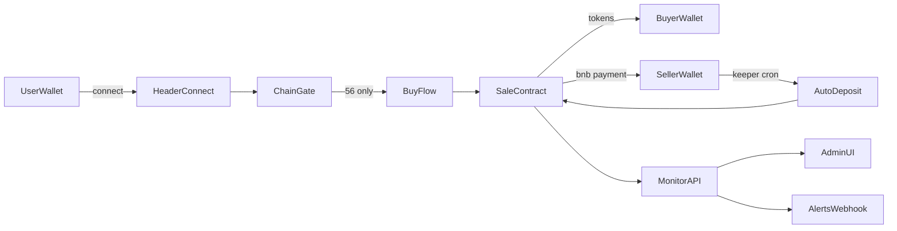

# Полный аудит и восстановление проекта (Web + Smart Contract + Deploy)

## Зафиксированные решения

- Scope смарт-контракта: **full contract upgrade** (с миграцией).
- Режим доставки: **full autoship** (фиксы + тесты + коммит + автоматизированный деплой).
- Авто-пополнение: **off-chain keeper на Vercel cron** с owner private key на сервере.

## Контекст проблем (по коду + вашим скринам)

- Wallet connect в mobile часто остаётся на Ethereum из-за логики в [`frontend/components/Header.tsx`](frontend/components/Header.tsx) (stale `chainId` и deep-link без chain hint).
- Покупка и UI не валидируют сеть достаточно жёстко в [`frontend/components/SaleCard.tsx`](frontend/components/SaleCard.tsx) и [`frontend/hooks/useTokenSale.ts`](frontend/hooks/useTokenSale.ts).
- Admin/monitor несовпадения: `owner wallet`, `VERCEL_TOKEN missing`, min/rate display, address UX, источник `Available`.
- Жалоба «токены приходят, BNB не списывается/не приходит» вероятно смесь UX+observability; нужен полный recheck on-chain и update контракта/интерфейса.

## Инструментальная рамка (обязательно в исполнении)

- **Структурный/код-аудит и качество:** `game-studios-multiagent` как orchestration-фрейм + обязательные проверки через subagent `thermo-nuclear-code-quality-review` на каждый крупный блок изменений.
- **UI/UX исправления:** только по правилам `huashu-design` + `ui-ux-pro-max` + `21st-design` (где уместно компонентные улучшения).
- **E2E и ручной путь пользователя:** `playwright` (CLI workflow + headed проверки мобильного/desktop флоу).
- **MCP/плагины:** использовать Vercel tooling для env/deploy/status; при необходимости GitHub/доп. MCP только по задаче.
- **GitNexus guardrail:** перед правкой символов запускать impact-анализ и фиксировать blast radius; перед финальным коммитом `gitnexus_detect_changes()`.

---

## Фаза 1 — Глубокий аудит и воспроизведение (без правок)

1. Полный replay пользовательских сценариев (mobile Trust browser, mobile Chrome→Trust, desktop extension) через Playwright + ручные проверки.
2. Контрактный и RPC аудит (mainnet/testnet routing, chain guards, write/read chain consistency).
3. Сопоставление вашего промта с фактическим состоянием кода и прода; итог — матрица `ожидалось vs фактически`.
4. Отдельный thermo-nuclear review текущего diff/архитектуры как baseline quality gate.

Артефакты:
- `docs/audit/deep-audit-report.md`
- `docs/audit/repro-matrix.md`
- `output/playwright/*.png|json`

---

## Фаза 2 — Wallet/Network и Connect UX (mobile+desktop)

Целевые файлы:
- [`frontend/components/Header.tsx`](frontend/components/Header.tsx)
- [`frontend/config/rainbow.ts`](frontend/config/rainbow.ts)
- [`frontend/config/chains.ts`](frontend/config/chains.ts)
- [`frontend/components/SaleCard.tsx`](frontend/components/SaleCard.tsx)
- [`frontend/hooks/useTokenSale.ts`](frontend/hooks/useTokenSale.ts)

Работы:
1. Исправить post-connect chain detection (реальный chain после connect, не stale hook).
2. Принудительный switch/add chain на BNB (56) с fallback UX.
3. Исправить deep-link Chrome→Trust (оптимальный путь для мобильного пользователя).
4. Блокировать buy при wrong network; корректные подсказки в UI.

Quality gate:
- thermo-nuclear review по этому блоку.
- Playwright smoke на 3 сценария сети.

---

## Фаза 3 — UI/UX правки из вашего списка

Целевые файлы:
- [`frontend/components/AdminPanel.tsx`](frontend/components/AdminPanel.tsx)
- [`frontend/app/api/admin/apply-config/route.ts`](frontend/app/api/admin/apply-config/route.ts)
- [`frontend/components/SaleCard.tsx`](frontend/components/SaleCard.tsx)
- [`frontend/components/TokenInfoSection.tsx`](frontend/components/TokenInfoSection.tsx)
- [`frontend/components/TokenStats.tsx`](frontend/components/TokenStats.tsx)
- [`frontend/hooks/useMonitorStats.ts`](frontend/hooks/useMonitorStats.ts)

Работы:
1. Owner wallet default = `0x4e8cef391d4b1b06e1a643765cc7bbdef6f28953`; убрать friction с `VERCEL_TOKEN missing` (явный UX и серверная валидация).
2. Default amount = 500; min text = 500; если <500 — красный UI state (только UX-слой, как запросили).
3. Rate Management UX: редактирование через «стоимость 500 токенов в BNB» + конвертация в on-chain rate.
4. Контрактный адрес в токен-блоке: `0x327D...68888` + click-to-copy.
5. Блок `Available`: показывать inventory sale-контракта как primary, плюс корректный realtime refresh.

Design gate:
- Правки строго по `huashu-design` + `ui-ux-pro-max` + `21st-design`.
- thermo-nuclear review UI diff.

---

## Фаза 4 — Контракт и платёжная логика (full upgrade)

Целевые файлы:
- [`smart-contract/contracts/TokenSale.sol`](smart-contract/contracts/TokenSale.sol)
- [`smart-contract/scripts/deploy.ts`](smart-contract/scripts/deploy.ts)
- [`smart-contract/scripts/deposit.ts`](smart-contract/scripts/deposit.ts)
- [`smart-contract/hardhat.config.ts`](smart-contract/hardhat.config.ts)
- [`frontend/config/contracts.ts`](frontend/config/contracts.ts)
- [`frontend/app/api/monitor/route.ts`](frontend/app/api/monitor/route.ts)

Работы:
1. Перепроверить и усилить payment semantics (token transfer ↔ BNB payment observability и гарантии).
2. Обновить контракт/события/валидации для прозрачного учёта оплаты (buyer paid, seller received).
3. Реализовать безопасный auto-refill контур: keeper cron + owner key (server-only) + пороги + idempotency + fail-safe.
4. Миграция: deploy нового sale-контракта, обновление env/адресов, перенос inventory, пост-миграционный smoke buy.

Security gate:
- thermo-nuclear review контракта и keeper pipeline.
- Полный прогон hardhat tests + новые тесты на auto-refill и edge cases.

---

## Фаза 5 — E2E в роли реального пользователя

Через `playwright` (headed + mobile emulation):
1. Connect wallet (desktop extension).
2. Connect wallet (mobile Trust browser).
3. Chrome→Trust handoff.
4. Buy flow (мин/макс, wrong chain, success path).
5. Admin critical actions + monitor refresh + alerts.

Артефакты:
- `docs/audit/playwright-user-journeys.md`
- `output/playwright/full-regression-*.json`

---

## Фаза 6 — SEO + performance optimization (после полной стабилизации)

Только после закрытия функциональных багов:
1. Performance optimization строго по указаниям `performance-optimizer` (Vercel guidance).
2. SEO/GEO блок через `/seo-geo` (технический SEO + metadata/schema/internal links где релевантно).
3. Проверка Core Web Vitals и регрессий после оптимизации.

Артефакты:
- `docs/audit/performance-optimization-report.md`
- `docs/audit/seo-geo-report.md`

---

## Фаза 7 — Финализация, коммит и автоматизированный деплой

1. Финальный thermo-nuclear review всего итогового diff.
2. Проверки: lint/typecheck/tests/e2e/build.
3. `gitnexus_detect_changes()` и валидация blast radius.
4. Подробный пошаговый commit (чистые логические группы).
5. Автоматизированный deploy на Vercel (prod), post-deploy smoke (`/`, `/api/monitor`, `/api/monitor/cron`, admin auth).
6. Финальный release report + rollback notes.

---

## Критерии «идеально чисто»

- Все сценарии из вашего списка воспроизводятся как **исправленные** на mobile и desktop.
- Нет критических ошибок в логике оплаты, сети, connect, admin, monitor.
- Контракт+frontend конфиги синхронизированы с mainnet.
- SEO/performance выполнены после функциональной стабилизации.
- Прод деплой успешен и подтверждён smoke+мониторингом.