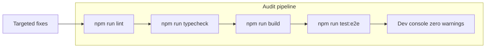

# GELANDEWAGEN — полный аудит и доводка до production-ready

## Текущий статус

Проект **уже реализован** в [`c:\Users\Asus\.cursor\gelentwagen-newlook-site`](c:\Users\Asus\.cursor\gelentwagen-newlook-site): Next.js 16, 121 hero-кадра, все секции, RO/RU, SEO, Playwright (5/5 при последнем прогоне).

При `npm run dev` в терминале зафиксированы **реальные проблемы**, которые нужно закрыть:

| Симптом | Источник | Серьёзность |
|--------|----------|-------------|
| `Encountered two children with the same key, G` | [`why-section.tsx`](c:\Users\Asus\.cursor\gelentwagen-newlook-site\src\components\sections\why-section.tsx) — `key={item.letter}` при двух буквах **G** в GWAGEN | High |
| `Base UI: ... expected native <button>` | [`OverlayContent.tsx`](c:\Users\Asus\.cursor\gelentwagen-newlook-site\src\components\animation\OverlayContent.tsx), [`background-paths.tsx`](c:\Users\Asus\.cursor\gelentwagen-newlook-site\src\components\ui\background-paths.tsx) — `Button` + `render={<a />}` | High (a11y) |
| Invalid HTML `<ol>` → `<div>` → `<li>` | [`process-section.tsx`](c:\Users\Asus\.cursor\gelentwagen-newlook-site\src\components\sections\process-section.tsx) | Medium |
| `prefers-reduced-motion` вычисляется при render | [`ScrollAnimationSection.tsx`](c:\Users\Asus\.cursor\gelentwagen-newlook-site\src\components\animation\ScrollAnimationSection.tsx) — риск hydration mismatch | Medium |
| Playwright: `next start` + `output: standalone` | [`next.config.ts`](c:\Users\Asus\.cursor\gelentwagen-newlook-site\next.config.ts), [`playwright.config.ts`](c:\Users\Asus\.cursor\gelentwagen-newlook-site\playwright.config.ts) | Medium |
| Turbopack root / lockfile warning | родительский `C:\Users\Asus\.cursor\package-lock.json` | Low (уже частично: `turbopack.root`) |
| План: `design-tokens.ts`, `SplitText` в hero | файл не создан, SplitText не подключён | Low (gap vs plan) |
| `?lang=ru` не обновляется при toggle | [`i18n.tsx`](c:\Users\Asus\.cursor\gelentwagen-newlook-site\src\lib\i18n.tsx) | Low |
| Stats: CountUp + Counter дублируют одно число | [`stats-section.tsx`](c:\Users\Asus\.cursor\gelentwagen-newlook-site\src\components\sections\stats-section.tsx) | Low (UX) |



---

## Фаза 1 — Диагностика (read-only, затем фиксы)

Запустить в [`gelentwagen-newlook-site`](c:\Users\Asus\.cursor\gelentwagen-newlook-site):

```bash
npm run lint
npm run typecheck
npm run build
npm run test:e2e
```

Зафиксировать все ошибки/предупреждения в чеклист. Не трогать [`c:\Users\Asus\.cursor\plans\gelandewagen_site_build_cdfac8d5.plan.md`](c:\Users\Asus\.cursor\plans\gelandewagen_site_build_cdfac8d5.plan.md).

---

## Фаза 2 — Критические runtime / React исправления

### 2.1 Дублирующиеся React keys (GWAGEN)

В [`why-section.tsx`](c:\Users\Asus\.cursor\gelentwagen-newlook-site\src\components\sections\why-section.tsx) заменить:

```tsx
key={item.letter}  // ломается на двух "G"
```

на стабильный ключ: `key={`${item.letter}-${item.title}`}` или `key={i}`.

### 2.2 Кнопки-ссылки (Base UI warning)

Создать маленький компонент [`src/components/ui/cta-link.tsx`](c:\Users\Asus\.cursor\gelentwagen-newlook-site\src\components\ui\cta-link.tsx) — стилизованный `<a>` через `buttonVariants()` (без `Button` + `render={<a />}`).

Заменить во всех местах:

- [`OverlayContent.tsx`](c:\Users\Asus\.cursor\gelentwagen-newlook-site\src\components\animation\OverlayContent.tsx)
- [`background-paths.tsx`](c:\Users\Asus\.cursor\gelentwagen-newlook-site\src\components\ui\background-paths.tsx)

Альтернатива: `nativeButton={false}` на `ButtonPrimitive` — менее предсказуемо; предпочтительнее явный `CtaLink`.

### 2.3 Семантика process section

В [`process-section.tsx`](c:\Users\Asus\.cursor\gelentwagen-newlook-site\src\components\sections\process-section.tsx):

- Убрать `<ol>` с `<div>` внутри, **или**
- Сделать `AnimatedContent` обёрткой с `className` на `<li>` (передать `as="li"` / render prop), чтобы DOM был `ol > li`.

Рекомендация: `ul`/`div` grid с `role="list"` и `role="listitem"` — проще и валидно.

### 2.4 Hero + reduced motion

В [`ScrollAnimationSection.tsx`](c:\Users\Asus\.cursor\gelentwagen-newlook-site\src\components\animation\ScrollAnimationSection.tsx):

- `reducedMotion` через `useState` + `useEffect` + `matchMedia` (не при первом client render).
- При `prefers-reduced-motion: reduce`: загружать **только frame-0001** (новая функция в [`FrameLoader.ts`](c:\Users\Asus\.cursor\gelentwagen-newlook-site\src\components\animation\FrameLoader.ts)), скрыть loader после 1 кадра, отключить scroll-scrubbing, `section` height ≈ `100dvh` вместо `400vh`.

### 2.5 Синхронизация frame count

Читать `frameCount` из [`public/frames/manifest.json`](c:\Users\Asus\.cursor\gelentwagen-newlook-site\public\frames\manifest.json) в [`constants.ts`](c:\Users\Asus\.cursor\gelentwagen-newlook-site\src\lib\constants.ts) или импорт JSON — убрать хардкод `121` в трёх местах.

---

## Фаза 3 — i18n, SEO, конфигурация

### 3.1 Язык и URL

В [`i18n.tsx`](c:\Users\Asus\.cursor\gelentwagen-newlook-site\src\lib\i18n.tsx) при `setLang` / `toggleLang`:

- обновлять `history.replaceState` с `?lang=ro|ru` (без перезагрузки);
- сохранять совместимость с `alternates` в [`layout.tsx`](c:\Users\Asus\.cursor\gelentwagen-newlook-site\src\app\layout.tsx).

### 3.2 Playwright + standalone

В [`playwright.config.ts`](c:\Users\Asus\.cursor\gelentwagen-newlook-site\playwright.config.ts):

```ts
webServer: { command: "npm run dev", ... }
```

или для CI после build:

```ts
command: "node .next/standalone/server.js"
```

`output: "standalone"` в [`next.config.ts`](c:\Users\Asus\.cursor\gelentwagen-newlook-site\next.config.ts) **оставить** для деплоя; dev/e2e — через `next dev`.

### 3.3 Мелкие пробелы плана

| Элемент | Действие |
|--------|----------|
| [`lib/design-tokens.ts`](c:\Users\Asus\.cursor\gelentwagen-newlook-site\src\lib\design-tokens.ts) | Добавить токены Apple/BMW (accent, surfaces) и использовать в `globals.css` CSS variables |
| SplitText в hero | Опционально: subtitle через [`SplitText.tsx`](c:\Users\Asus\.cursor\gelentwagen-newlook-site\src\components\react-bits\SplitText.tsx) в overlay intro |
| [`app/loading.tsx`](c:\Users\Asus\.cursor\gelentwagen-newlook-site\src\app\loading.tsx) | Skeleton для LCP до загрузки client hero |
| Stats UI | Оставить CountUp **или** Counter, не оба ([`stats-section.tsx`](c:\Users\Asus\.cursor\gelentwagen-newlook-site\src\components\sections\stats-section.tsx)) |

### 3.4 Галерея (если есть исходники)

Если появятся файлы из чата в `projects/.../assets/`, скопировать в `public/images/` и перезапустить `node scripts/prepare-gallery.mjs`. Сейчас gallery — кадры из hero (рабочий fallback).

---

## Фаза 4 — Очистка кеша (только безопасное)

**Удалить:**

- `.next/`
- `test-results/`, `playwright-report/` (если есть)
- `node_modules/.cache/` (если есть)

**Не удалять:**

- `node_modules/`, `public/frames/`, `public/images/`, `src/`, `package-lock.json`

После очистки:

```bash
npm run build
npm run dev
```

---

## Фаза 5 — Структурная уборка (без ломки проекта)

Оставить шаблон clone-website (Docker, README) — не удалять, если не мешает. Опционально обновить [`package.json`](c:\Users\Asus\.cursor\gelentwagen-newlook-site\package.json) `description` и добавить короткий [`README`](c:\Users\Asus\.cursor\gelentwagen-newlook-site\README.md) секцию «GELANDEWAGEN runbook» (dev, frames rebuild, e2e).

Проверить [`home-page.tsx`](c:\Users\Asus\.cursor\gelentwagen-newlook-site\src\components\home-page.tsx): порядок секций = план; `SiteDock` не перекрывает CTA на mobile (`pb-28` уже есть).

---

## Фаза 6 — Критерии «без единой ошибки»

- DevTools Console на `http://localhost:3000` — **0 React warnings** (keys, Base UI)
- `npm run lint` — 0 errors
- `npm run typecheck` — 0 errors  
- `npm run build` — success
- `npm run test:e2e` — 5/5 green
- HTML: валидная вложенность в process, один H1, landmarks (`header`, `main`, `footer`)
- Hero: scroll вперёд/назад; reduced-motion — статичный кадр
- RO/RU toggle + `?lang=` в URL
- Contact: Criuleni 82, 2× `tel:`, Maps iframe + Rută

---

## Порядок выполнения (todos)

Выполнять последовательно: диагностика → критические фиксы → i18n/config → cache clean → полная верификация.
