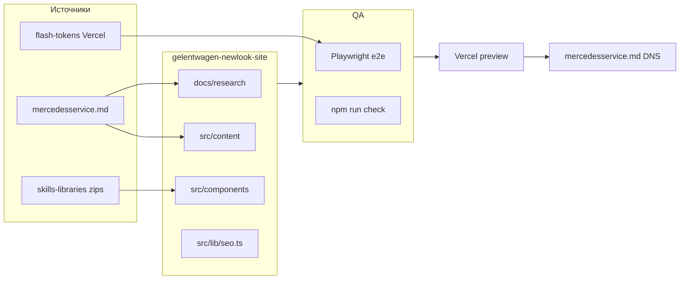

# GELANDEWAGEN — мастер-план переработки лендинга

## Аудит вашего промпта (что реально, что скорректировано)

| Запрос | Оценка | Решение в плане |
|--------|--------|----------------|
| 15+ zip-скиллов «всё сразу» | Перегруз контекста и токенов | **Фазы 0–8** с жёстким порядком; скилл подключается только на своей фазе |
| Pixel-perfect clone + full rebrand | Конфликт | **Ребренд** (ваш выбор); [clone-website](c:\Users\Asus\.cursor\gelentwagen-newlook-site\.claude\skills\clone-website\SKILL.md) — только для **контента/структуры** legacy, не для копирования старого UI |
| Playwright на всём цикле | Верно | `@playwright/test` уже в [package.json](c:\Users\Asus\.cursor\gelentwagen-newlook-site\package.json), но **e2e-тестов нет** — создать в Phase 6 |
| «Первым в Google» | Не гарантируется кодом | SEO-фаза: техника + local SEO + контент; позиции — внешний фактор |
| Anthropic-Cybersecurity | Избыточно для статического лендинга | Только если появятся формы/API/секреты |
| deer-flow / hermes-agent zips | Не в списке задачи | **Не подключать** (экономия токенов) |

**Текущее состояние репозитория (уже есть):**
- Next.js 16 + React 19 + Tailwind v4 + shadcn, GSAP/motion, react-bits компоненты
- i18n RO/RU через `?lang=` + localStorage ([src/lib/i18n.tsx](c:\Users\Asus\.cursor\gelentwagen-newlook-site\src\lib\i18n.tsx))
- Контент в [src/content/ro.ts](c:\Users\Asus\.cursor\gelentwagen-newlook-site\src\content\ro.ts) / [ru.ts](c:\Users\Asus\.cursor\gelentwagen-newlook-site\src\content\ru.ts)
- Scroll-hero на ~120 кадрах `public/frames/` ([ScrollAnimationSection.tsx](c:\Users\Asus\.cursor\gelentwagen-newlook-site\src\components\animation\ScrollAnimationSection.tsx)) — **будет заменён на видео** (ваш выбор)
- Деплой-прототип: https://flash-tokens-trust.vercel.app/?lang=ru
- Legacy-источник текста: https://www.mercedesservice.md/
- Целевой домен в коде: `NEXT_PUBLIC_SITE_URL` → `https://mercedesservice.md` ([constants.ts](c:\Users\Asus\.cursor\gelentwagen-newlook-site\src\lib\constants.ts))



---

## Phase 0 — Bootstrap скиллов и памяти (один раз)

**Распаковка** (только нужные zip из `C:\Users\Asus\.cursor\skills-libraries\`):

| Zip | Назначение | Куда |
|-----|------------|------|
| playwright-main | CLI + e2e паттерны | `~/.agents/skills/playwright/` или `C:\Users\Asus\.codex\skills\playwright\` (уже есть — сверить версию) |
| ai-website-cloner-template-master | Инспекция/артефакты | сверить с локальным [AGENTS.md](c:\Users\Asus\.cursor\gelentwagen-newlook-site\AGENTS.md) |
| skills-main | Кодинг-стандарты | `~/.agents/skills/` + выборочные правила в `.cursor/rules/` |
| skills-main (remotion) | Hero video pipeline | отдельная папка remotion |
| humanizer-main, marketingskills-main | Копирайт + CRO/SEO copy | `~/.agents/skills/` |
| seo-geo-claude-skills-main | Technical + geo SEO | `~/.agents/skills/` |
| ui-ux-pro-max, taste, awesome-design-md, huashu-design, 21st, react-bits | Дизайн-референсы | `docs/design-libraries/<name>/` — **не** импортировать весь репо в контекст |
| agentmemory-main | Трекинг фаз/метрик | `docs/project-memory/` + skill |
| Claude-Code-Game-Studios-main | Оркестрация subagents | правила worktree/merge в AGENTS |
| andrej-karpathy-skills-main | Debug/review чеклисты | Phase 7 only |

**Память проекта** (`agentmemory-main`):
- `docs/project-memory/STATE.md` — фазы, решения, URL, метрики
- `docs/project-memory/CONTENT-WIREFRAME.md` — полный текстовый макет (RO + RU)
- `docs/project-memory/DESIGN-DIRECTION.md` — выбранная философия ребренда

**Экономия токенов:** читать SKILL.md фазы, не whole zip; design libs — только релевантные markdown/чеклисты.

---

## Phase 1 — Аудит legacy + прототипа (readonly → артефакты)

### 1.1 Legacy [mercedesservice.md](https://www.mercedesservice.md/)
- Playwright CLI: full-page screenshot mobile/tablet/desktop
- Извлечь: секции, H1–H3, услуги (6), GWAGEN-блок, телефоны, адрес, trust-маркеры «с 1996»
- Записать в `docs/research/mercedesservice-md/CONTENT-INVENTORY.md`

### 1.2 Прототип [flash-tokens-trust.vercel.app](https://flash-tokens-trust.vercel.app/?lang=ru)
- Playwright: snapshot accessibility tree, perf hints (LCP, CLS), broken links
- Сравнить с локальным `npm run dev` — parity checklist
- `docs/research/vercel-prototype/AUDIT.md` — design/motion/tech gaps

### 1.3 clone-website pipeline (контент, не UI)
- Следовать [INSPECTION_GUIDE](docs/research/INSPECTION_GUIDE.md) если есть; иначе создать
- Design tokens из **нового** направления, не со старого сайта

---

## Phase 2 — Дизайн-направление (full rebrand)

**Вход:** taste + ui-ux-pro-max + huashu-design + awesome-design-md.

**Выход:** `docs/design-references/DESIGN-DIRECTION.md` с:
- Палитра oklch (Mercedes premium: тёмный graphite, silver, accent — один акцент, не «AI slop»)
- Типографика (1 display + 1 body, кириллица/латиница)
- Сетка секций: Hero → Trust → About → Services → Why/GWAGEN → Process → Stats → Gallery → CTA → Contact → Footer
- Motion rules: hero video loop muted; section reveals; `prefers-reduced-motion` → static poster
- Компонентная карта: что из **21st** / **react-bits** (уже частично в [src/components/react-bits/](c:\Users\Asus\.cursor\gelentwagen-newlook-site\src\components\react-bits\))

**Удалить/заменить после video-hero:**
- `public/frames/` + `ScrollAnimationSection` + `FrameLoader` + `CanvasRenderer` (или оставить lazy fallback poster)
- Лишние CSS/JS от scroll-canvas

---

## Phase 3 — Контент и humanize (метрики сохранить)

**Источник правды:** legacy тексты + текущие [ro.ts](c:\Users\Asus\.cursor\gelentwagen-newlook-site\src\content\ro.ts) / [ru.ts](c:\Users\Asus\.cursor\gelentwagen-newlook-site\src\content\ru.ts).

**Обязательные метрики (не терять):**
- Mercedes-Benz only, с 1996, Chișinău, str. Criuleni 82
- Телефоны: 079 43 77 73, 079 46 08 06
- 6 услуг (диагностика, электрика/SBC, двигатель/масло, АКПП, кондиционер, ходовая)
- GWAGEN-акроним (G/W/A/G/E/N)
- Trust: честность, сертифицированный подбор деталей, зона ожидания

**humanizer-main:** переписать lead/paragraphs без «AI-штампов», сохранить факты.

**marketingskills-main:** CTA, urgency без агрессии, social proof framing.

**Язык:** RO default, RU toggle (подтверждено).

---

## Phase 4 — Реализация в коде (основная работа Agent mode)

### 4.1 Hero video (Remotion)
- `remotion/` или `scripts/remotion/`: 8–15s loop, WebM + MP4 + poster `.webp`
- `HeroVideoSection` вместо `ScrollAnimationSection`
- `next/video` или `<video>` с `preload="metadata"`, poster, playsInline

### 4.2 Design system
- Обновить [globals.css](c:\Users\Asus\.cursor\gelentwagen-newlook-site\src\app\globals.css), [design-tokens.ts](c:\Users\Asus\.cursor\gelentwagen-newlook-site\src\lib\design-tokens.ts)
- Пересобрать секции в [src/components/sections/](c:\Users\Asus\.cursor\gelentwagen-newlook-site\src\components\sections\) под новую сетку
- Header/Footer/Dock: единая навигация, tel: клики, skip-link

### 4.3 UI из 21st + react-bits
- Аудит существующих react-bits; добавить 2–4 паттерна (cards, glare, dock) — **не** копировать весь react-bits repo
- shadcn: только нужные primitives

### 4.4 Очистка «мусора»
- Удалить `public/frames/` после деплоя video
- `.next/`, `test-results/`, дубликаты — в `.gitignore` уже есть
- Проверить неиспользуемые deps после удаления canvas hero

### 4.5 skills-main + Game-Studios orchestration
- Параллельные subagents по секциям (worktree): Hero, Services, Contact, SEO
- Merge + `npm run check`

---

## Phase 5 — SEO + performance (seo-geo + marketingskills)

Файлы: [seo.ts](c:\Users\Asus\.cursor\gelentwagen-newlook-site\src\lib\seo.ts), [robots.ts](c:\Users\Asus\.cursor\gelentwagen-newlook-site\src\app\robots.ts), [sitemap.ts](c:\Users\Asus\.cursor\gelentwagen-newlook-site\src\app\sitemap.ts), [layout.tsx](c:\Users\Asus\.cursor\gelentwagen-newlook-site\src\app\layout.tsx).

| Задача | Действие |
|--------|----------|
| Core Web Vitals | video hero lazy, `next/image` sizes, font subset |
| Local SEO | LocalBusiness JSON-LD (уже есть — расширить `openingHours` если дадите часы) |
| hreflang | `ro` / `ru` alternate links |
| OG/Twitter | `public/seo/og.jpg` 1200×630 |
| Canonical | `NEXT_PUBLIC_SITE_URL` |
| Google | Search Console + Business Profile (организационно — вам) |

**После стабилизации на Vercel:** `NEXT_PUBLIC_SITE_URL=https://mercedesservice.md`, redeploy, DNS.

---

## Phase 6 — Playwright QA (visual + functional)

Создать:
- `playwright.config.ts`
- `e2e/landing.spec.ts` — загрузка, lang switch, якоря, tel links, no console errors
- `e2e/visual.spec.ts` — screenshots ro/ru, mobile/desktop
- `npm run test:e2e` в CI опционально

Debug pass: **andrej-karpathy-skills** чеклист — гидрация, hydration mismatch, 404 assets, layout shift.

---

## Phase 7 — Финальный прогон и Vercel

1. `npm run check`
2. `npm run test:e2e`
3. Lighthouse (mobile) ≥ 90 performance target (реалистично с video: ≥ 85)
4. Deploy preview → вы approve → production
5. DNS mercedesservice.md → Vercel

---

## Мастер PROMPT для Cursor (режим Plan → затем Agent)

Скопируйте в новый чат Plan/Agent:

```
Контекст: репозиторий gelentwagen-newlook-site (Next.js 16). Цель: полный ребренд лендинга GELANDEWAGEN (Mercedes service Chișinău). Сначала production-quality на Vercel (flash-tokens-trust), затем DNS на mercedesservice.md.

Решения заказчика:
- RO default, RU ?lang=ru
- Full rebrand (taste, ui-ux-pro-max, huashu) — НЕ копировать старый UI mercedesservice.md
- Hero: заменить scroll-frames на короткое video (Remotion), poster + reduced-motion fallback
- Сохранить все бизнес-метрики: 1996, Mercedes-only, 6 услуг, GWAGEN, адрес, 2 телефона

Фазы (строго по порядку):
0) Распаковать скиллы из C:\Users\Asus\.cursor\skills-libraries\ (список в docs/project-memory/) — не грузить whole repos в контекст
1) Playwright аудит mercedesservice.md + flash-tokens → docs/research/
2) CONTENT-WIREFRAME.md + humanizer + marketingskills → обновить src/content/ro.ts, ru.ts
3) DESIGN-DIRECTION.md → tokens + секции
4) Код: HeroVideo, секции, react-bits/21st точечно, удалить frames/canvas hero
5) seo-geo: metadata, hreflang, OG, sitemap, perf
6) playwright e2e + visual + fix
7) npm run check, deploy Vercel, чеклист DNS

Ограничения: минимизировать токены; skills только по фазе; не трогать cybersecurity без форм/API; commits только по запросу.

Артефакты: docs/project-memory/STATE.md обновлять после каждой фазы.
```

---

## Что нужно от вас (минимум, пошагово)

Автоматизируем максимум (скачивание с legacy, генерация OG из hero poster). **Желательно от вас:**

1. **Логотип** — SVG или PNG прозрачный → `public/seo/logo.svg`
2. **Hero video** (если есть съёмка сервиса/авто) — MP4 1920×1080, 8–15 сек, без звука — **иначе** агент сгенерирует через Remotion из gallery
3. **5–10 реальных фото** мастерской/работ (WebP) → `public/images/workshop-*.webp` — заменят stock gallery
4. **Часы работы** (пн–сб?) — для LocalBusiness schema
5. **Favicon pack** (опционально) — или сгенерировать из лого
6. **OG баннер** 1200×630 (опционально) — или auto из hero poster
7. **Google Maps short link** / подтверждение GBP — для local SEO (вне кода)

**Не нужно:** 3D модели, большие архивы, дубликаты кадров scroll — удаляем.

Положить файлы: `public/images/incoming/` → агент оптимизирует и раскладывает.

---

## Риски и как их закрываем

| Риск | Митигация |
|------|-----------|
| Video ухудшает LCP | poster first, WebM, lazy below fold on mobile |
| Полный ребренд ломает узнаваемость | сохранить GWAGEN + телефоны + «с 1996» prominently |
| 120 frame assets в git | удалить после video migration |
| SEO «№1 в Google» | техника + local + контент; без гарантии позиций |

---

## После утверждения плана (следующее сообщение от агента)

1. Распаковка скиллов Phase 0
2. Playwright-аудиты + `CONTENT-WIREFRAME.md`
3. Уточняющие вопросы **по ходу** (часы работы, есть ли своё video/фото)
4. Реализация Phases 4–7 до `npm run check` green

Ответы в чате — в стиле humanizer (живой русский, без штампов), по вашему запросу.
