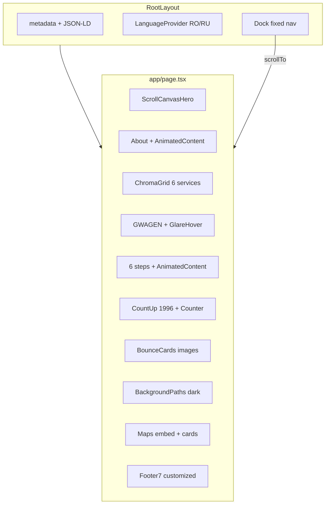
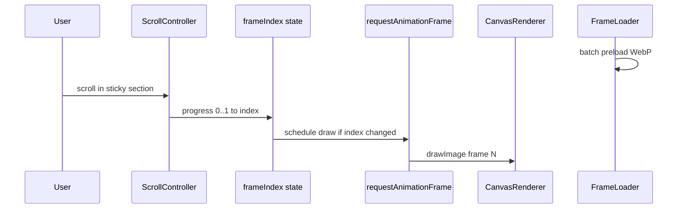

# GELANDEWAGEN — план полной сборки сайта

## Текущее состояние

- Рабочая папка [`c:\Users\Asus\.cursor\gelentwagen-newlook-site`](c:\Users\Asus\.cursor\gelentwagen-newlook-site) **пустая** — кода нет.
- Hero-кадры готовы: **241 JPG** в [`C:\Users\Asus\Downloads\_extract_ezgif-7e5497231344c7da-jpg`](C:\Users\Asus\Downloads\_extract_ezgif-7e5497231344c7da-jpg) (`ezgif-frame-001.jpg` … `241`).
- Референс-изображения Mercedes — в workspace assets (пути из чата); при bootstrap скопировать в `public/images/`.
- Подтверждённые решения: **контакты из SEO-макета**, **Maps embed без API key**, **RO + RU**.

---

## Референс-анализ (Apple + Mercedes-Benz MD)

### Apple.com — что берём

Из [`awesome-design-md-main/design-md/apple/DESIGN.md`](C:\Users\Asus\Downloads\_extract_awesome-design-md-main\awesome-design-md-main\design-md\apple\DESIGN.md):

| Принцип | Применение на GELANDEWAGEN |
|--------|----------------------------|
| Photography-first, UI «исчезает» | Hero = canvas-анимация + крупная типографика, минимум chrome |
| Чередование light/dark секций | Hero/CTA/контакты — тёмные; «О компании»/процесс — светлые |
| Один акцент (#0066cc → адаптируем) | CTA «Записаться на диагностику» — холодный silver-blue, не «AI purple» |
| SF Pro Display: tight tracking, 56px hero | `Geist` / `Inter` с `tracking-tighter`, `clamp()` для responsive |
| Без декоративных градиентов на chrome | Glass только в overlay hero, не на всём сайте |

### Mercedes-Benz.md — что берём

С публичной структуры [mercedes-benz.md](https://www.mercedes-benz.md/):

- Hero-centric промо-блоки и **карусель моделей** → секция **BounceCards** + опционально горизонтальный model strip.
- Trust/dealer tone (официальный, премиум) → trust-line, годы опыта, **CountUp/Counter** «с 1996».
- Чёткая сетка услуг/офферов → **ChromaGrid** для 6 услуг.
- Footer с юридическими ссылками → адаптированный **Footer7**.

### Синтез дизайн-системы (скиллы)

| Источник | Роль |
|----------|------|
| [`ui-ux-pro-max`](C:\Users\Asus\.cursor\ui-ux-pro-max) | Product **Automotive/Car Dealership** + pattern **Scroll-Triggered Storytelling**; палитра вручную: dark OLED + silver + один accent (не pink из автоподбора) |
| [`taste-skill`](C:\Users\Asus\Downloads\_extract_taste-skill-main\taste-skill-main\skills\taste-skill\SKILL.md) | `min-h-[100dvh]`, split/asymmetric hero, anti-AI-purple, client-only для motion, batch frame loading |
| [`awesome-design-md`](C:\Users\Asus\Downloads\_extract_awesome-design-md-main\awesome-design-md-main\design-md) apple+bmw | Токены типографики/цвета в `lib/design-tokens.ts` |
| [`npxskillui`](C:\Users\Asus\Downloads\_extract_npxskillui-main\npxskillui-main) | На этапе setup: `npx skillui --url https://www.apple.com` и `--url https://www.mercedes-benz.md` → `design-md/` для сверки токенов |
| [`playwright`](C:\Users\Asus\Downloads\_extract_playwright-main\playwright-main) | E2E smoke: hero load, dock nav, CTA tel:, maps iframe, RO/RU toggle |

**Целевая палитра:** `#000000` / `#121212` фон hero, `#F5F5F7` светлые секции, текст `#FFFFFF` / `#1D1D1F`, accent CTA `#2997FF` или silver `#C0C0C0`, Mercedes star — только как логотип GELANDEWAGEN (без нарушения trademark guidelines в UI-copy).

---

## Архитектура страницы (одностраничник)



### Карта секций → компоненты

| # | Блок (SEO-макет) | Компоненты |
|---|------------------|------------|
| 1 | Hero — H1 «Mercedes Service Chișinău» | `ScrollAnimationSection`, `CanvasRenderer`, `FrameLoader`, `SplitText`/`BlurText`, glass overlay, scroll progress bar |
| 2 | О компании | `AnimatedContent`, `ContainerScroll` (опционально фото сервиса) |
| 3 | Услуги (6) | `ChromaGrid` с кастомными items + `GlareHover` на карточках |
| 4 | Почему мы (G-W-A-G-E-N) | 6 `GlareHover` / grid + `AnimatedContent` |
| 5 | Как проходит обслуживание | 6 шагов + `AnimatedContent` stagger |
| 6 | Trust stats | `CountUp` (30+ лет с 1996), `Counter` для цифр |
| 7 | Галерея Mercedes | `BounceCards` — 5–6 изображений из assets |
| 8 | CTA | `BackgroundPaths` (тёмный фон как на референсе) + кнопки |
| 9 | Контакты | Google Maps **iframe embed** + карточка NEOCAR-style (но данные GELANDEWAGEN) |
| 10 | Footer | `Footer7` — навигация по якорям, телефоны, copyright |
| Global | Навигация | **`Dock` (обязательно)** — якоря: Acasă, Despre, Servicii, Proces, Contact |

---

## Технический стек и bootstrap

1. **Инициализация проекта** (пустая папка):

```bash
node C:\Users\Asus\.cursor\skills\clone-website\scripts\init-clone-project.mjs C:\Users\Asus\.cursor\gelentwagen-newlook-site
```

Шаблон: Next **16.2.1**, React **19**, Tailwind **v4**, shadcn — см. [`skills/clone-website/template/package.json`](C:\Users\Asus\.cursor\skills\clone-website\template\package.json).

2. **Зависимости** (после проверки `package.json`):

- `gsap`, `@gsap/react` — AnimatedContent, BounceCards, ChromaGrid, SplitText
- `motion` (или `framer-motion` — единый пакет для Dock, CountUp, Counter, ContainerScroll, BackgroundPaths)
- `react-icons` — Footer7, Dock icons
- `@radix-ui/react-slot`, `class-variance-authority` — shadcn Button
- dev: `@playwright/test`

3. **Структура каталогов** (создать после init):

```
app/layout.tsx, page.tsx, globals.css, sitemap.ts, robots.ts
components/animation/{ScrollAnimationSection,CanvasRenderer,FrameLoader,ScrollController,OverlayContent}.tsx
components/react-bits/{AnimatedContent,BounceCards,ChromaGrid,CountUp,Counter,Dock,GlareHover,SplitText,BlurText}+.css
components/ui/{button,container-scroll-animation,background-paths,footer-7}.tsx
components/sections/{SiteHeader,HeroSection,AboutSection,...}.tsx
content/{ro.ts,ru.ts}
lib/{i18n.tsx,seo.ts,design-tokens.ts,constants.ts}
public/frames/frame-####.webp
public/images/{gallery...}
scripts/{build-hero-frames.ps1,verify-seo.mjs}
tests/e2e/smoke.spec.ts
```

---

## Hero: scroll-controlled canvas pipeline



**Шаги реализации:**

1. Скопировать 241 JPG → `public/frames-src/`.
2. **FFmpeg** (если нет — установить или использовать каждый 2-й кадр): ~120–150 кадров, resize ~1640×1264 → WebP q=80.
3. Именование: `frame-0001.webp` … `frame-0150.webp`.
4. `FrameLoader`: батчи по 12–16, progress UI, `decode()` перед интерактивом.
5. Секция: `height: 400vh`, inner `sticky`, canvas centered, `object-fit: contain`.
6. Scroll: `passive` listener → только `setFrameIndex`; отрисовка в `useEffect` + rAF; `prefers-reduced-motion` → статичный кадр 1.
7. Overlay: RO/RU тексты H1, подзаголовок, trust chips, CTA — по scroll ranges (0–0.2 intro, 0.5 mid, 0.85 CTA).

---

## Контент и i18n (RO + RU)

- Файлы [`content/ro.ts`](content/ro.ts) и [`content/ru.ts`](content/ru.ts) — все блоки из SEO-макета (H1–H2, услуги, GWAGEN, процесс, CTA, контакты).
- `LanguageProvider` + переключатель в header (флаги/RO|RU), `localStorage` + `html lang`.
- SEO: `title`/`description` на румынском (primary), `alternate` hreflang для RU через query `?lang=ru` или path — **рекомендация:** query `?lang=ru` без второй страницы (сохраняем one-pager).
- Телефоны (канон): `+373 79 43 77 73`, `+373 79 46 08 06`; адрес: `Moldova, Chișinău, str. Criuleni 82`.

---

## Google Maps (embed only)

Без API key:

- Geocode **str. Criuleni 82, Chișinău** → lat/lng (проверить в браузере при реализации).
- `iframe` Maps Embed URL + кнопки:
  - «Google Maps» → `https://www.google.com/maps/search/?api=1&query=...`
  - «Маршрут» / «Rută» → `https://www.google.com/maps/dir/?api=1&destination=...`
- UI как на референсе: карта сверху, тёмная карточка снизу (имя **GELANDEWAGEN**, адрес, 2 tel: ссылки `tel:`).

---

## SEO и производительность

| Задача | Реализация |
|--------|------------|
| Title / Description | Из макета в `app/layout.tsx` `metadata` |
| H1–H2 иерархия | Строго по разделу 5 макета; один H1 на странице |
| JSON-LD | `AutoRepair` + `LocalBusiness` + `WebSite` в layout (адрес, tel, geo, `foundingDate: 1996`) |
| Open Graph | `og:image` — кадр hero или G-Class из gallery |
| Alt-тексты | Описательные RO (+ RU в `aria-label` при переключении) |
| Core Web Vitals | `next/image` для gallery; lazy frames; `loading.tsx`; без `<video>` в hero |
| Sitemap / robots | `app/sitemap.ts`, `app/robots.ts` |
| Lighthouse target | LCP: poster frame + preload frame-0001; CLS: фикс. высоты секций |

**Entity keywords** в copy (RO): Mercedes-Benz, Chișinău, Moldova, diagnoză computerizată, motor, cutie automată, SBC, suspensie, climatizare.

---

## Верификация (Playwright + manual)

Из [`playwright-main`](C:\Users\Asus\Downloads\_extract_playwright-main\playwright-main) — consumer E2E, не fork Playwright:

- `npx playwright install chromium`
- Тесты: загрузка hero loader → canvas visible; Dock клики → scroll to section; `tel:` href; maps iframe `src` contains google; lang toggle меняет H1; reduced-motion fallback.

Команда проверки: `npm run build && npx playwright test`.

---

## Порядок работ (фазы)

### Фаза 0 — Bootstrap и ассеты
- `init-clone-project.mjs`, `npm install`, shadcn `button`
- Скрипт FFmpeg → WebP frames
- Копирование gallery images в `public/images/`

### Фаза 1 — Design foundation
- `globals.css` tokens (dark/light sections)
- `content/ro.ts`, `content/ru.ts`, i18n provider
- `metadata` + JSON-LD

### Фаза 2 — Animation core
- Scroll canvas pipeline (5 компонентов)
- Установка react-bits + ui components (Dock, AnimatedContent, …)

### Фаза 3 — Секции страницы
- Сборка всех 10 блоков в `page.tsx`
- Dock wiring

### Фаза 4 — Maps + Footer + SEO polish
- Embed maps + contact card
- Footer7 кастомизация
- sitemap, alt, hreflang

### Фаза 5 — QA
- Playwright smoke
- `npm run build` / Lighthouse
- Mobile 375px / desktop 1440px

---

## Риски и митигация

| Риск | Митигация |
|------|-----------|
| 241 frames × ~200KB = тяжёлый LCP | Downsample до ~120 WebP, CDN/Vercel, preload batch 1 only |
| GSAP + motion дублирование | Один scroll lib для canvas; GSAP только для bits |
| Tailwind v4 vs v3 syntax | Сверять с template postcss (`@tailwindcss/postcss`) |
| Mercedes trademark | «Mercedes-Benz» как описание услуги; логотип — GELANDEWAGEN |
| Google share links недоступны | Используем подтверждённый SEO-макет + geocode Criuleni 82 |

---

## Критерии готовности («без единой ошибки»)

- `npm run build` — exit 0
- `npx playwright test` — green
- Все перечисленные React Bits + Dock + ContainerScroll + BackgroundPaths + Footer7 — на странице
- Hero scroll canvas работает вперёд/назад
- RO/RU переключение всех ключевых текстов
- Контакты: Criuleni 82, оба телефона, maps + rută
- SEO: title, description, H1, JSON-LD в HTML
