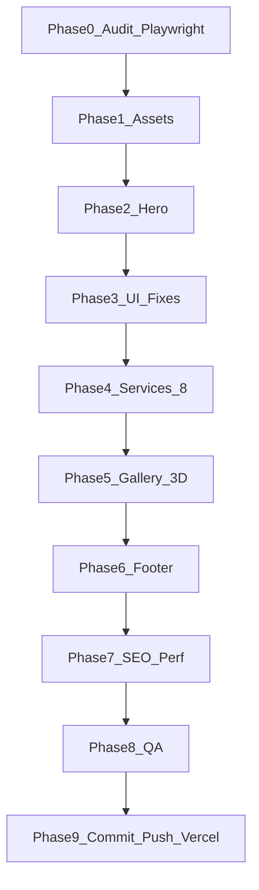

# GELANDEWAGEN — UI, 3D, SEO и деплой

## Контекст и цели

| Источник | URL / путь |
|----------|------------|
| Live | https://flash-tokens-trust.vercel.app |
| Репо | [gelentwagen-newlook-site](c:\Users\Asus\.cursor\gelentwagen-newlook-site) |
| Hero video | `C:\Users\Asus\Downloads\untitled_Seedance V1.5 Pro_2026-05-28_20-55-31.mp4` |
| GLB модели | 3 файла в `Downloads\Meshy_AI_*.glb` |

**Оркестрация:** [game-studios-multiagent/SKILL.md](c:\Users\Asus\.cursor\skills\game-studios-multiagent\SKILL.md) — фазы с чекпоинтами; валидация через Playwright + [mattpocock-skills](c:\Users\Asus\.cursor\skills\mattpocock-skills\SKILL.md); UI — [ui-ux-pro-max](c:\Users\Asus\.cursor\skills\ui-ux-pro-max\SKILL.md), [awesome-design-md](c:\Users\Asus\.cursor\skills\awesome-design-md\SKILL.md), [21st-design](c:\Users\Asus\.cursor\skills\21st-design\SKILL.md).



---

## Phase 0 — Аудит (readonly → чеклист)

1. Playwright: скриншоты RO/RU desktop+mobile live vs local (`npm run audit:sites`, e2e).
2. Зафиксировать в `docs/project-memory/UI-AUDIT.md`:
   - Hero: poster вместо видео (`NEXT_PUBLIC_HERO_VIDEO_ENCODED=false`)
   - Contact: телефоны `text-[#2997ff]` ([contact-section.tsx](c:\Users\Asus\.cursor\gelentwagen-newlook-site\src\components\sections\contact-section.tsx) L55)
   - Dock: jitter — `dock-outer` меняет `height` при hover ([Dock.tsx](c:\Users\Asus\.cursor\gelentwagen-newlook-site\src\components\react-bits\Dock.tsx) L100–108)
   - Services: 6 карточек, дубли gallery images
   - Gallery: BounceCards ([gallery-section.tsx](c:\Users\Asus\.cursor\gelentwagen-newlook-site\src\components\sections\gallery-section.tsx))
   - CTA: отдельная секция ([cta-section.tsx](c:\Users\Asus\.cursor\gelentwagen-newlook-site\src\components\sections\cta-section.tsx)) — перенос в hero

---

## Phase 1 — Ассеты

### 1.1 Hero video
- Скопировать MP4 → `public/videos/hero.mp4`
- Скрипт [scripts/generate-hero-video.mjs](c:\Users\Asus\.cursor\gelentwagen-newlook-site\scripts\generate-hero-video.mjs): poster WebP + опционально WebM (ffmpeg)
- Обновить [constants.ts](c:\Users\Asus\.cursor\gelentwagen-newlook-site\src\lib\constants.ts): `HERO_VIDEO.encoded = true` после появления файлов
- Vercel env: `NEXT_PUBLIC_HERO_VIDEO_ENCODED=true`

### 1.2 Service images (8 шт.)
Скопировать из прикреплённых референсов в `public/images/services/`:

| # | Услуга | Файл |
|---|--------|------|
| 1 | Диагностика | `service-01-diagnostics.webp` |
| 2 | Электрика/SBC | `service-02-electrics.webp` |
| 3 | Двигатель/масло | `service-03-engine.webp` |
| 4 | АКПП | `service-04-at.webp` |
| 5 | Кондиционер | `service-05-ac.webp` |
| 6 | Ходовая | `service-06-suspension.webp` |
| 7 | Тормоза | `service-07-brakes.webp` |
| 8 | Развал-схождение | `service-08-alignment.webp` |

### 1.3 GLB (обязательно R3F)
- `public/models/mercedes-s-class.glb`, `brabus-g-class.glb`, `mercedes-s-texture.glb`
- Установить: `three`, `@react-three/fiber`, `@react-three/drei`
- Прозрачный фон: `alpha: true`, `gl.setClearColor(0,0)`, материалы без непрозрачного environment box; при необходимости — `meshBasicMaterial` / toneMapped off

---

## Phase 2 — Hero (Image 1–3)

**Файл:** [hero-video-section.tsx](c:\Users\Asus\.cursor\gelentwagen-newlook-site\src\components\sections\hero-video-section.tsx)

### Layout (lg+)
```
┌─────────────────────────────────────────────┐
│  [video bg + gradient]                      │
│  ┌──────────────────┬─────────────────────┐ │
│  │ H1, subtitle,    │ CTA panel (from     │ │
│  │ lead, chips      │ old CtaSection)     │ │
│  │ (NO diag btn,    │ Записаться /        │ │
│  │  NO phone btn)   │ Позвонить           │ │
│  └──────────────────┴─────────────────────┘ │
└─────────────────────────────────────────────┘
```

- Убрать из hero: `h.cta` кнопку «Записаться на диагностику» и `PHONES[0]` кнопку
- Оставить: chips, trust, scroll/nav якоря при необходимости
- Новый компонент `HeroCtaPanel` — стили как [background-paths.tsx](c:\Users\Asus\.cursor\gelentwagen-newlook-site\src\components\ui\background-paths.tsx) (заголовок `cta.h2`, текст `cta.text`, кнопки `cta.book` → `#contact`, `cta.call` → `tel:`)
- Удалить `<CtaSection />` из [home-page.tsx](c:\Users\Asus\.cursor\gelentwagen-newlook-site\src\components\home-page.tsx); `SECTION_IDS.cta` убрать из dock scroll или заменить на `#contact`

---

## Phase 3 — Точечные UI-фиксы

### 3.1 Contact — белые телефоны (Image 1)
В [contact-section.tsx](c:\Users\Asus\.cursor\gelentwagen-newlook-site\src\components\sections\contact-section.tsx): `text-white hover:text-white/80` вместо `text-[#2997ff]`.

### 3.2 Dock jitter (Image 4–5)
**Причина:** `motion.div` у `.dock-outer` анимирует `height` при hover → весь fixed-bar прыгает.

**Fix в** [Dock.tsx](c:\Users\Asus\.cursor\gelentwagen-newlook-site\src\components\react-bits\Dock.tsx) + [Dock.css](c:\Users\Asus\.cursor\gelentwagen-newlook-site\src\components\react-bits\Dock.css):
- Фиксированная высота `dock-outer` (не spring height)
- `overflow: visible`; labels `position: absolute; bottom: 100%` без сдвига layout
- Снизить `magnification` или отключить height spring на panel

### 3.3 About (Image 5)
- Проверить контраст light section: заменить hardcoded `#333` на tokens
- [ContainerScroll](c:\Users\Asus\.cursor\gelentwagen-newlook-site\src\components\ui\container-scroll-animation.tsx): убедиться что на mobile нет overflow/серого артефакта; при необходимости упростить до static `Image` без scroll-transform на `< md`

---

## Phase 4 — Services: 8 карточек (Image 6)

1. Расширить `services.items` в [ro.ts](c:\Users\Asus\.cursor\gelentwagen-newlook-site\src\content\ro.ts) / [ru.ts](c:\Users\Asus\.cursor\gelentwagen-newlook-site\src\content\ru.ts):

**Карточка 7 (RO/RU):**
- Тормозная система / Sistem de frânare
- Замена колодок, дисков, жидкости; ремонт суппортов

**Карточка 8:**
- Развал-схождение / Geometrie roți
- 3D-настройка углов колёс

2. [services-section.tsx](c:\Users\Asus\.cursor\gelentwagen-newlook-site\src\components\sections\services-section.tsx): 8 `SERVICE_IMAGES`, 8 `SERVICE_STYLES`; сетка `grid-cols-2 md:grid-cols-4` вместо только ChromaGrid ИЛИ ChromaGrid с 8 items + фиксированная высота (ChromaGrid на 8 может быть тяжёлым — рассмотреть grid карточек с тем же visual language).

3. Playwright: 8 карточек видны, тексты RO/RU.

---

## Phase 5 — Gallery → 3 glow + 3D (Image 7)

1. Удалить BounceCards из gallery.
2. Добавить [animated-glow-card.tsx](c:\Users\Asus\.cursor\gelentwagen-newlook-site\src\components\ui\animated-glow-card.tsx) + CSS (адаптировать под dark theme, без Twitter dummy).
3. `ModelViewer3D.tsx` — client component, `dynamic(..., { ssr: false })`, `useFrame` rotation Y only, normalized scale.
4. `gallery-section.tsx` — 3 колонки: CardCanvas > Card > ModelViewer3D.
5. **Не** использовать XCard/Twitter demo — только glow border + 3D.

---

## Phase 6 — Footer

1. Новый [footer-section.tsx](c:\Users\Asus\.cursor\gelentwagen-newlook-site\src\components\ui\footer-section.tsx) на базе шаблона пользователя.
2. Персонализация:
   - Links: Acasă, Despre, Servicii, Contact (`#about`, `#services`, `#contact`)
   - TikTok: https://www.tiktok.com/@gelandewagen.md
   - Убрать placeholder «Tailark Mist»
   - Copyright: GELANDEWAGEN, Chișinău
3. Заменить [site-footer.tsx](c:\Users\Asus\.cursor\gelentwagen-newlook-site\src\components\site-footer.tsx) или встроить новый компонент.

---

## Phase 7 — SEO + Performance

По [seo-geo skill-index](c:\Users\Asus\.cursor\skills\seo-geo\skill-index.md):

| Задача | Файлы / действия |
|--------|------------------|
| Meta/OG | [layout.tsx](c:\Users\Asus\.cursor\gelentwagen-newlook-site\src\app\layout.tsx), keywords RO/RU Mercedes Chișinău |
| Schema | [seo.ts](c:\Users\Asus\.cursor\gelentwagen-newlook-site\src\lib\seo.ts) — AutoRepair, sameAs TikTok |
| Sitemap/hreflang | [sitemap.ts](c:\Users\Asus\.cursor\gelentwagen-newlook-site\src\app\sitemap.ts) |
| CWV | video poster priority, `next/image` sizes, dynamic import R3F, `loading="lazy"` below fold |
| Bundle | analyze `@next/bundle-analyzer` optional; GLB Draco если >500KB |

**Реалистично:** «№1 в Google» — техника + local SEO + контент; не гарантируется кодом.

Vercel performance-optimizer agent: Lighthouse mobile после деплоя.

---

## Phase 8 — QA

1. `npm run check`
2. `npm run test:e2e` — обновить specs: нет `#cta`, hero CTA panel, 8 services, contact phones white
3. Playwright visual RO/RU
4. thermo-nuclear-code-quality-review на diff
5. Ручной чеклист из Image 1–7

---

## Phase 9 — Git + Push + Vercel

Структурированные коммиты (после green QA):

| # | Message | Scope |
|---|---------|--------|
| 1 | `feat(hero): Seedance video and split CTA panel` | video, hero layout, remove cta section |
| 2 | `fix(ui): dock hover jitter and contact phone colors` | Dock, contact |
| 3 | `feat(services): eight service cards with dedicated art` | content, services-section, images |
| 4 | `feat(gallery): three rotating GLB models in glow cards` | three, r3f, gallery |
| 5 | `feat(footer): personalized footer with TikTok` | footer |
| 6 | `perf(seo): metadata, schema, and asset optimization` | seo, next config |
| 7 | `test: update e2e for new layout` | e2e |

```powershell
git push origin main
npx.cmd vercel env add NEXT_PUBLIC_HERO_VIDEO_ENCODED production  # true
npx.cmd vercel --prod --yes
```

Smoke: https://flash-tokens-trust.vercel.app/ + `?lang=ru`, hero video plays, no dock jitter, `/sitemap.xml` 200.

---

## Риски

| Риск | Митигация |
|------|-----------|
| GLB тяжёлые | Draco compress; `dynamic` import; Suspense fallback |
| Video LCP | poster + `preload=metadata` |
| ChromaGrid 8 items perf | Grid cards вместо magnifier |
| Env newline (прошлый деплой) | `echo -n` при `vercel env add` |

## После деплоя (вам)

- Подтвердить часы работы для schema
- При миграции на mercedesservice.md — сменить `NEXT_PUBLIC_SITE_URL` + DNS
