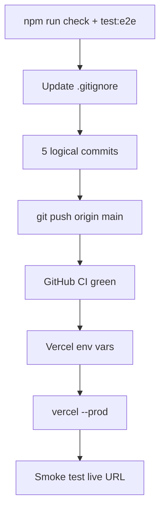

# Коммит, push и деплой на Vercel

## Текущее состояние

- Ветка: `main`, синхрон с `origin/main` ([ArtyCry12/flash-tokens-trust](https://github.com/ArtyCry12/flash-tokens-trust))
- ~150 изменённых файлов: ребренд, удаление `public/frames/*`, hero video, e2e, docs
- **Не коммитить:** [`docs/design-libraries/`](c:\Users\Asus\.cursor\gelentwagen-newlook-site\docs\design-libraries) (~13 MB распакованных zip), `.clinerules/`, `test-results/`, `.env*`, `.vercel/`
- **Не коммитить:** [`public/videos/frames-list.txt`](c:\Users\Asus\.cursor\gelentwagen-newlook-site\public\videos\frames-list.txt) (временный артефакт ffmpeg)
- CI на push в `main`: lint + typecheck + build ([`.github/workflows/ci.yml`](c:\Users\Asus\.cursor\gelentwagen-newlook-site\.github\workflows\ci.yml)) — e2e в CI нет

## Preflight (перед любым коммитом)

```powershell
cd c:\Users\Asus\.cursor\gelentwagen-newlook-site
npm run check
npm run test:e2e
```

Оба должны пройти без ошибок (уже проходили в прошлой сессии; перепроверим перед push).

## Шаг 0 — Уточнить `.gitignore`

Добавить в [`.gitignore`](c:\Users\Asus\.cursor\gelentwagen-newlook-site\.gitignore):

```
docs/design-libraries/
public/videos/frames-list.txt
```

`.claude/` — коммитить только если нужен skill в репо; иначе оставить локально (в плане — **не включать**, чтобы не раздувать diff).

## Шаг 1 — Структурированные коммиты (5 логических, по порядку)

Каждый коммит: `git add` только релевантные пути → `git commit` с HEREDOC-сообщением.

| # | Scope | Файлы | Сообщение |
|---|--------|--------|-----------|
| 1 | `chore` | `.gitignore`, `.env.example`, `eslint.config.mjs`, `tsconfig.json`, `package.json` | `chore: tighten gitignore and tooling for rebrand pipeline` |
| 2 | `refactor(hero)` | удаление `public/frames/`, `src/components/animation/*`, `scripts/generate-hero-video.mjs`, `public/videos/hero-poster.webp`, `src/components/sections/hero-video-section.tsx`, `trust-strip.tsx`, `home-page.tsx`, `constants.ts`, `layout.tsx` | `refactor(hero): replace scroll-frame canvas with video poster hero` |
| 3 | `feat` | `src/app/globals.css`, `design-tokens.ts`, секции, `site-header`, `i18n.tsx`, `content/ro.ts`, `ru.ts`, `seo.ts`, `public/og-poster.webp`, `public/seo/` | `feat: premium rebrand, humanized RO/RU copy, and local SEO schema` |
| 4 | `test` | `playwright.config.ts`, `e2e/*`, `scripts/audit-sites.mjs` | `test: add Playwright e2e and external site audit script` |
| 5 | `docs` | `docs/DEPLOY.md`, `docs/project-memory/`, `docs/design-references/`, `docs/research/` (скриншоты + json), `public/images/incoming/.gitkeep` | `docs: deploy runbook, research audits, and project memory` |

**Исключения из всех коммитов:** `docs/design-libraries/`, `.claude/`, `.clinerules/`.

## Шаг 2 — Push

```powershell
git push -u origin main
```

- Один push после всех 5 коммитов (оптимально для CI)
- Дождаться зелёного GitHub Actions `CI` на `main`

## Шаг 3 — Vercel production (flash-tokens-trust)

Проект уже связан (есть `.vercel/` локально).

**Env на Vercel (Production):**

| Variable | Value |
|----------|--------|
| `NEXT_PUBLIC_SITE_URL` | `https://flash-tokens-trust.vercel.app` |
| `NEXT_PUBLIC_HERO_VIDEO_ENCODED` | `false` (пока нет webm/mp4) |

```powershell
npx.cmd vercel env ls
# при необходимости:
npx.cmd vercel env add NEXT_PUBLIC_SITE_URL production
npx.cmd vercel env add NEXT_PUBLIC_HERO_VIDEO_ENCODED production

npm run check
npx.cmd vercel --prod --yes
```

Альтернатива: push в `main` триггерит Vercel Git integration (если подключена) — тогда `--prod` дублирует; предпочтём **явный `vercel --prod`** для контроля лога.

## Шаг 4 — Пост-деплой проверка

1. Открыть https://flash-tokens-trust.vercel.app/ и `?lang=ru`
2. Hero: постер без 404 в Network
3. `tel:` ссылки, якоря `#contact`, переключатель RO/RU
4. `/robots.txt`, `/sitemap.xml` — 200

```powershell
npm run audit:sites   # опционально, сравнение с live
```

## Риски и митигация

| Риск | Действие |
|------|----------|
| CI падает на push | смотреть Actions log; чинить до повторного push |
| Vercel build fail | локальный `npm run build`; проверить env |
| Большой push (удаление 120 frames) | нормально; git LFS не нужен |
| `vercel` не авторизован | `npx.cmd vercel login` один раз |



## После выполнения (вам)

- Когда будете готовы к **mercedesservice.md**: сменить `NEXT_PUBLIC_SITE_URL`, redeploy, DNS на Vercel
- Опционально: `npm run hero:video` + ffmpeg → `NEXT_PUBLIC_HERO_VIDEO_ENCODED=true`
