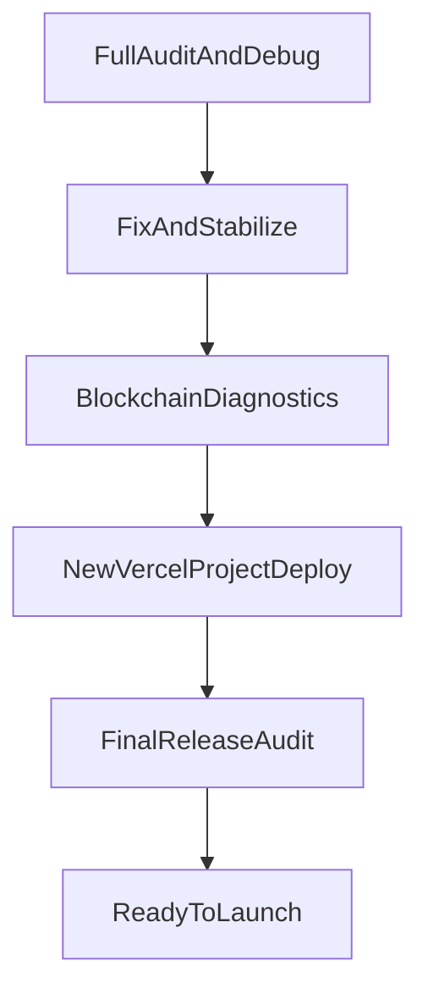

# Финальный план: аудит, стабилизация, релиз

## Зафиксированные решения
- Деплой в **новый Vercel-проект** (автоматически).
- Секреты использовать **как есть сейчас**.
- Финальный запуск сразу в **BSC Mainnet (56)**.
- Минимум покупки оставить **1 токен**.

## Что уже подтверждено в проекте
- Mainnet deployment записан в [smart-contract/deployed-contract.json](smart-contract/deployed-contract.json).
- Минимум покупки = 1 в [smart-contract/contracts/TokenSale.sol](smart-contract/contracts/TokenSale.sol).
- Cron в Vercel сейчас daily (`0 0 * * *`) в [frontend/vercel.json](frontend/vercel.json) из-за лимита Hobby.
- Админ-панель и серверные admin API уже есть: [frontend/components/AdminPanel.tsx](frontend/components/AdminPanel.tsx), [frontend/app/api/admin/auth/route.ts](frontend/app/api/admin/auth/route.ts), [frontend/app/api/admin/apply-config/route.ts](frontend/app/api/admin/apply-config/route.ts).

## Этап 1 — Полный технический аудит (read-only + debug)
- Проверить структуру и критические контуры:
  - frontend runtime/SSR API, кошелёк, sale flow, monitor flow.
  - smart-contract инварианты покупки, лимитов, owner-операций.
- Проверить ключевые риски недопонимания:
  - Available с owner-кошелька vs фактический inventory контракта.
  - Совпадение chainId, адресов, decimals, rate и max.
  - Поведение при пустом inventory, pause, invalid input, stale env.
- Результат: consolidated debug-отчёт с приоритетами P0/P1/P2 и конкретными правками.

## Этап 2 — Исправления и стабилизация
- Устранить найденные P0/P1 проблемы в логике и конфигурации.
- Дочистить только безопасный мусор (кэш/артефакты), не затрагивая рабочие данные.
- Синхронизировать env/адреса для mainnet через [scripts/sync-frontend-env.mjs](scripts/sync-frontend-env.mjs).
- Проверить, что UI и API показывают непротиворечивые метрики.

## Этап 3 — Полная диагностика блокчейн-контура
- Локально:
  - hardhat tests,
  - контрактные read-проверки в mainnet,
  - проверка admin-операций (безопасно, без лишних tx).
- E2E:
  - автоматический Playwright-аудит,
  - ручной чеклист Trust Wallet для подписания критичных транзакций (owner approve/deposit и 1 тест-покупка).
- Подтвердить:
  - покупка проходит,
  - BNB списывается,
  - токены приходят,
  - метрики обновляются без NaN/расхождений.

## Этап 4 — Новый Vercel-проект и деплой
- Создать новый проект в Vercel CLI и привязать root к [frontend](frontend).
- Применить env (runtime + build) и перепроверить cron/авторизацию cron endpoint.
- Сделать production deploy, проверить:
  - `/` отвечает 200,
  - `/api/monitor` отвечает 200,
  - админ-auth работает,
  - mainnet-адреса и chainId корректны.
- Если включена Deployment Protection, настроить доступ, чтобы вы видели сайт публично.

## Этап 5 — Финальный release-аудит перед handoff
- Повторный полный прогон:
  - lint/test/build,
  - Playwright,
  - мониторинг/cron,
  - smoke mainnet flow.
- Финальные коммиты по логическим блокам (поэтапно, без секретов и без лишних артефактов).
- Подготовить короткий запускной пакет:
  - production URL,
  - final contract addresses,
  - что делать вам только при необходимости (1-2 ручных шага в Trust Wallet).

## Данные, которые могу запросить по ходу (если обнаружу блокер)
- Только если реально потребуется: подтверждение owner-транзакции в Trust Wallet или дополнительный RPC endpoint при нестабильном публичном RPC.
- Все остальные шаги выполняю самостоятельно и автоматически.