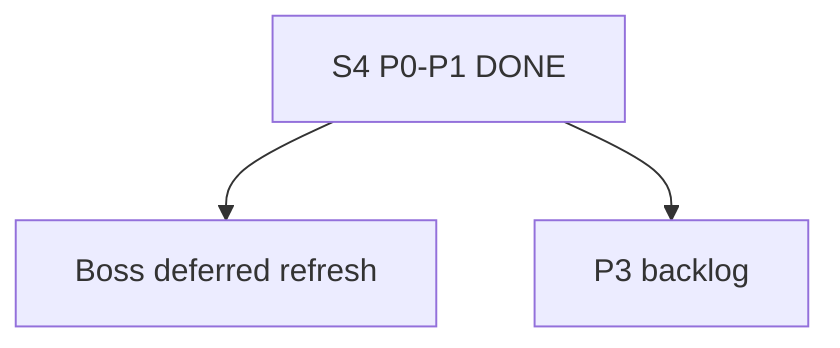

# Hub Deep Dive — план (S4 executed P0–P1)

**Роль:** канон deep-dive. S4 закрыл P0–P1; **P3** и **deferred-boss** открыты.

**Не трогать:** `hooks.json` · mcp secrets · markitdown · `agents/*.md` model lines / model-map (`trust_manual`).

---

## S4 deliverables (DONE)

| Todo | Artifact |
|------|----------|
| `s4-reaudit` | `ai-tracking/SESSION-4-REAUDIT.md` |
| `canvas-full-sync` | canvas `v4.0 · 16.07.2026 S4` |
| `stale-markers` | SESSION-3 SUPERSEDED banner + COMPLETE updated |
| `index-dedupe` | `generate-skill-index.mjs` skip nested; `_INDEX` 1× frontend-design (118) |
| `gate-smoke` | `ai-tracking/GATE-SMOKE-S4.md` |
| `taxonomy-refresh` | post-S3 notes in taxonomy + mcp tiers |
| `s3-plan-close` | `3_sessions_hub_refactor_*.plan.md` todos completed |

Tests: `task-router-test` PASS · `find-skills-test` PASS.

---

## Справка S1–S3 (не чинить)

find-skills · taxonomy · MCP tiers · design matrix · route echo · cleanup · dual review · digest · agency off · LVM JSON.

---

## Ещё открыто

### P1 — Boss

**`deferred-boss`** (только ты):

1. Закрыть Cursor  
2. `powershell -File commands/cursor-system-refresh-deferred.ps1`  
3. Reload Window — только если меняли hooks (**не меняли**)

### P3 backlog

- **`design-refs`** — 3 URL в canvas  
- **`budget-notion-models`** — budget · Notion · model-map unlock после снятия lock  

---

## Design matrix (канон)

`rules/design-stack.mdc` + `agents/squad-design.md` — без переписи в S4.

---

## Готово когда (S4)

1. SESSION-4-REAUDIT — **есть**  
2. Canvas ≥ v4.0 — **есть**  
3. Stale markers — **есть**  
4. `_INDEX` без дубля frontend-design — **есть**  
5. P0–P1 completed; P3 + deferred pending — **да**  
6. Boss reminder deferred — **ниже в чате**
