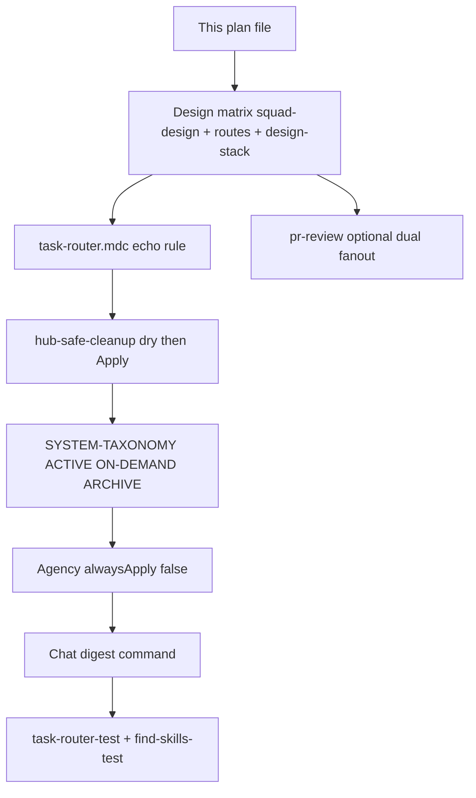

# Hub Deep Dive Fixes — финальная единая версия (2026-07-16)

Единственный актуальный план. Объединяет: исходный deep-dive sprint (P0–P3) · статусы после S1–S3 · канон Session 3 · самопроверку router.

**Связанные артефакты (не дубли планов):**
- Re-audit: [`ai-tracking/SESSION-3-REAUDIT.md`](../ai-tracking/SESSION-3-REAUDIT.md)
- Markers: [`SESSION-2-COMPLETE.md`](../ai-tracking/SESSION-2-COMPLETE.md) · [`SESSION-3-COMPLETE.md`](../ai-tracking/SESSION-3-COMPLETE.md)
- Canvas: `projects/c-Users-Asus-cursor/canvases/hub-deep-dive-audit.canvas.tsx`
- Taxonomy: `ai-tracking/skills-taxonomy-s2.md` · MCP: `ai-tracking/mcp-plugin-tiers-s2.md` · `lib/mcp-router/McpTier.ps1`
- Design replace / other: `ai-tracking/design-replace-candidates-s2.md` · `ai-tracking/hub-replace-candidates-other-s2.md`

---

## Что уже сделал Boss до sprint (не чинить заново)

- Settings → Models (10 ON)
- Explore Subagent → Composer 2.5
- Модели субагентов в UI → **`agents/*.md` model-строки не править** (`trust_manual` / `model-map.md` lock)

---

## Приоритеты (простыми словами)

| Уровень | Смысл | В sprint |
|--------|--------|----------|
| **P0** | Ломает качество прямо сейчас | Design gate, route echo, safe cleanup |
| **P1** | Стабильность | Dual review, Boss guide, router tests |
| **P2** | Порядок / токены | Taxonomy, agency on-demand, chat digest, deferred refresh, AskQuestion policy |
| **P3** | Вне sprint | Design-ref сайты, budget, Notion, model-map unlock |

---

## Контекст после S1–S3 (статус-сводка)

| Слой | Статус | Доказательство |
|------|--------|----------------|
| find-skills / skills.sh wire | **DONE** | S1 `e0548fc`; `skills/find-skills/`, `rules/find-skills.mdc`, tests PASS |
| Skills taxonomy + archive cleanup | **DONE** | `skills-taxonomy-s2.md`; game-studios → `_archive`; batch-A; obsidian hard-delete |
| MCP tiers | **DONE** | `McpTier.ps1`: always memory+gitnexus; keep firecrawl; disableArchive tavily/browse/obsidian |
| Design skills install + routes | **DONE** | `127dd79`: guidelines, shadcn, stitch-shadcn-ui, taste, impeccable |
| Other Complement installs + routes | **DONE** | `40e8c44` + substitutes (см. ниже) |
| LVM image JSON | **DONE** | `lib/lvm/image-prompt.schema.json` + production-studio protocol |
| Agency alwaysApply off | **DONE** | 66/66 `alwaysApply: false` |
| Route echo | **DONE** | `rules/task-router.mdc` — «Подключил: …»; маркер `[TASK ROUTE]` / `[TASK ROUTE - auto-detected]` |
| Design matrix sync | **DONE** | `rules/design-stack.mdc` + `agents/squad-design.md` (routing only) |
| Cleanup Apply | **DONE** | markitdown sacred (`-IncludeMarkitdownCache` opt-in); Apply post-S3 |
| Dual-review protocol | **DONE** | `skills/pr-review/SKILL.md` + `agents/squad-review.md` (optional fanout) |
| Chat digest | **DONE** | `commands/chat-digest.ps1` → `ai-tracking/chat-digests/` |
| Router minScore fixes | **DONE** | shadcn + secret-scanning phrases (`0f9d098`, `319be5c`) |
| Canvas ACTION_ITEMS | **OPEN** | optional polish |
| P3 | **BACKLOG** | см. ниже |

### S2 install misses → substitutes

| Miss | Substitute / note |
|------|-------------------|
| `growth-funnel` | `entity-seo` |
| aidoc `n8n` | нет skill в пакете; hub: `n8n-workflow-automation` / `n8n-workflow-architect` |
| `firestore-security-rules-auditor` | нет в firebase package; есть `firebase-security-rules-auditor` |
| jwynia `secrets-scan` | `github/awesome-copilot@secret-scanning` → hub `secret-scanning` |

---

## Не трогать (жёстко)

- `hooks.json` (digest / route **без** hooks)
- `mcp.json` secrets
- markitdown venv / `.cache/markitdown` (кроме явного `-IncludeMarkitdownCache`)
- `agents/*.md` **model** lines / `skills/project-squad/reference/model-map.md`
- Клиентские репо вне hub
- Fable / Settings UI Models (уже ок)

**Confirm перед (исторический контракт Agent):** Apply cleanup; массовая смена agency; если digest потребует `hooks.json` — стоп.

---

## Полный реестр фиксов → todos

### P0

1. **Design matrix (главный gate)** — артефакт → skill/MCP в:
   - `agents/squad-design.md` (routing/gate; **model не менять**)
   - `lib/task-router/routes.json`
   - `rules/design-stack.mdc`
   - Manifest: `docs/knowledge-base/DESIGN-STACK-MANIFEST.md`

   **Полная матрица:**

   | Слой | Что | Когда |
   |------|-----|--------|
   | **Mock primary** | Google **Stitch** MCP (`user-stitch`; `commands/ensure-stitch.ps1`, `commands/stitch-mcp.md`) + `skills/stitch-shadcn-ui` | Быстрые UI mockups → потом код |
   | **Компоненты** | **`skills/shadcn`** CLI/registry first; fallback `skills/21st-design` + `@21st-dev/magic` | Web app / blocks |
   | **Figma** | `plugin-figma-figma` / `user-figma` + `commands/figma-mcp.md` | Авто-создание file/workspace если MCP живой |
   | **Anti-slop web** | `skills/frontend-design` (**required**) | Любой web UI / landing / dashboard |
   | **Taste depth** | `skills/design-taste-frontend` | Landings / portfolios |
   | **Polish / critique** | `skills/impeccable` | Craft / audit / polish |
   | **Guidelines / a11y** | `skills/web-design-guidelines` | Vercel Web Interface Guidelines |
   | **Стек React / CRO** | `skills/design-stack` + DESIGN-STACK-MANIFEST | Tailwind/shadcn/fonts/CRO |
   | **Deck / HTML / PPTX / motion HTML** | `skills/huashu-design` | Не React-код |
   | **Clone landing** | `skills/clone-website` + browser | Копия сайта |
   | **UX checklist** | `skills/ui-ux-pro-max` | Audit UX до handoff |
   | **DESIGN.md / briefs** | `skills/awesome-design-md` | Design system docs |
   | **Video motion** | `skills/remotion`, `skills/production-studio` (+ LVM JSON) | Motion/Reels/carousel |
   | **Copy** | humanizer (`rules/humanizer-writing.mdc`) | Клиентский RU |
   | **Personas (max 1)** | agency `@ui-designer` / `@brand-guardian` / `@whimsy-injector` | Глубина, не весь набор |
   | **Icons / docs** | iconify MCP, context7 | По design-stack |

   **Обязательный handoff до Build:** строка `Applied: [skill1, skill2, …]` + anti-slop checklist:
   1. Aesthetic direction (одно предложение)
   2. Typography (display + body, не Inter/Roboto/Arial default)
   3. Palette (CSS variables; без purple-gradient-on-white)
   4. Motion (один hero-момент)
   5. Differentiation (один запоминающийся элемент)

2. **Route echo (rule only)** — в `rules/task-router.mdc`: если есть `[TASK ROUTE]` / `[TASK ROUTE - auto-detected]`, первый блок ответа Boss =  
   `Подключил: <skill> · <MCP> · <subagent>` (2–4 строки). **Без** правок `hooks.json`.

3. **Safe cleanup** — `commands/hub-safe-cleanup.ps1`:
   - dry-run → показать отчёт → `-Apply`
   - markitdown cache **KEEP** по умолчанию; удаление только с `-IncludeMarkitdownCache`
   - не трогать secrets, клиентские репо

### P1

4. **Optional dual review** — `skills/pr-review/SKILL.md` + `agents/squad-review.md` (протокол; **model не менять**): optional fanout GPT + Sonnet; merge; confidence ≥80 (или consensus / ≥90).

5. **Boss / Auto guide** — см. секцию ниже (не отдельный agent).

6. **Проверка routes** — `commands/task-router-test.ps1` (+ `find-skills-test.ps1`). Регрессии после S2: `seo-audit-ms` vs `seo-geo`; `playwright-e2e` vs `browser-e2e`; `shadcn init` / `secret scanning` ≥ minScore.

7. **Canvas ACTION_ITEMS** (optional) — отметить done: models-trim, explore; sync post-S2. Только canvas.

### P2

8. **Taxonomy** — `SYSTEM-TAXONOMY.md` + `ai-tracking/skills-taxonomy-s2.md`: ACTIVE / ON-DEMAND / ARCHIVE. Периодический refresh; следить за дублями в `_INDEX.md`.

9. **Agency always-on → on-demand** — `rules/agency/*.mdc` → `alwaysApply: false` / `@tag`. Personas не удалять. **DONE** 66/66.

10. **Chat digest** — `commands/chat-digest.ps1` пишет короткий `.md` в `ai-tracking/chat-digests/` (не полный transcript; **без** markitdown venv; **без** hooks.json).

11. **Deferred refresh** — после сессии Boss: закрыть Cursor → `commands/cursor-system-refresh-deferred.ps1`.

12. **AskQuestion compliance** — политика уже в `rules/user-profile.mdc`: до крупной задачи полный список вопросов с вариантами.

---

## Поток исполнения (как было в исходном плане)

S1–S3 прошли этот поток; повтор не нужен, кроме optional canvas / P3.

---

## Status board (итог)

| Priority | Item | Status |
|----------|------|--------|
| P0 | Design matrix | **DONE** |
| P0 | Route echo | **DONE** |
| P0 | Safe cleanup Apply | **DONE** |
| P1 | Dual review optional | **DONE** |
| P1 | Boss/Auto guide | **DONE** |
| P1 | Router tests | **PASS** |
| P2 | Taxonomy | **DONE** |
| P2 | Agency on-demand | **DONE** |
| P2 | Chat digest | **DONE** |
| P2 | Deferred checklist | **DONE** |
| P2 | AskQuestion policy | **DONE** (user-profile) |
| Optional | Canvas ACTION_ITEMS | **OPEN** |
| P3 | Design refs / budget / Notion / model-map | **BACKLOG** |

---

## Boss / Auto checklist

| Тип задачи | Mode |
|------------|------|
| Plan / architecture / risky refactor | Opus thinking xhigh (вручную) |
| Routine build / docs | Auto / Sonnet |
| Explore codebase | Composer 2.5 (UI Explore) |
| Избегать | Два High на одних и тех же файлах |

---

## Deliverables контракта (исходный Agent contract)

**Сделано**
- Этот единый plan-файл с полной design-матрицей + Boss checklist + статусы todos
- Правки: `squad-design.md` (routing), `routes.json`, `task-router.mdc`, `design-stack.mdc`, `pr-review` + review protocol, taxonomy, agency, digest command
- Cleanup dry + Apply (markitdown protected)
- Tests зелёные

**Порядок был:** plan skeleton → design matrix + routes → route echo → cleanup → dual review → taxonomy + agency → digest → tests (+ optional canvas)

---

## Deferred refresh (Boss после сессии)

1. Закрыть Cursor  
2. `powershell -File commands/cursor-system-refresh-deferred.ps1`  
3. Reload Window, если меняли hooks (S3 **не** трогал `hooks.json`)

---

## P3 backlog

- 3 design-ref сайта в canvas  
- Budget $/mo  
- Notion publish уроков  
- Sync model-map ↔ agents, когда Boss снимет `trust_manual`

---

## Готово когда

1. Этот файл — **единственный** план deep-dive fixes  
2. P0–P2 закрыты или зафиксированы здесь  
3. Тесты: `task-router-test`, `find-skills-test` PASS  
4. Маркер `SESSION 3 COMPLETE` в `ai-tracking/SESSION-3-COMPLETE.md`
