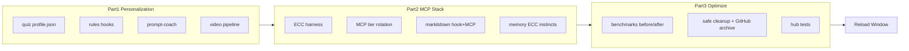

# Hub Phase C-D-E — персонализация, MCP-стек, бенчмарки

## Статус квизов (проверено)

Все 3 квиза **пришли** в hub:

| Квиз | Источник | Дата | Файл |
|------|----------|------|------|
| profile | ecosystem-audit-localhost | 2026-07-11 | [`ai-tracking/user-profile/quiz-responses.jsonl`](ai-tracking/user-profile/quiz-responses.jsonl) |
| automation | ecosystem-audit-localhost | 2026-07-11 | тот же |
| fixes | ecosystem-audit-localhost | **2026-07-13** | тот же |

Слитый профиль: [`ai-tracking/user-profile/profile.json`](ai-tracking/user-profile/profile.json)

**Ключевые выводы из квизов:**
- Роль: босс ИИ-агентства, русский plain language, plan-first, confirm-writes
- Боль: router 2/5, coach 2/5, MCP ротация, squad маркетинг, «вода» в промптах
- Авто: read/lint/docs/tests OK; commit/push/deploy/delete — всегда спрашивать
- Top fix: **Task Router, Squad, Skills**
- Reload Window: OK

**Технический долг:** `profile.json` содержит mojibake (UTF-8 прочитан как Latin-1) — исправить при Phase 1.



---

## Часть 1 — Персонализация после квизов (приоритет #1)

### 1.1 Профиль → runtime rules

Создать/обновить артефакты:

| Артефакт | Действие |
|----------|----------|
| [`ai-tracking/user-profile/profile.json`](ai-tracking/user-profile/profile.json) | Пересохранить UTF-8, нормализовать entrepreneur/automationPrefs |
| [`rules/user-profile.mdc`](rules/user-profile.mdc) | **Новый** always-on: plain RU, вопросы ДО старта, не в середине прота |
| [`hooks/autopilot.ps1`](hooks/autopilot.ps1) | Инжект `automationPrefs` + «вопросы только до старта / на критичных развилках» |
| [`hooks/task-router.ps1`](hooks/task-router.ps1) | При неясном интенте → route `clarify-first` с AskQuestion-стилем |
| [`lib/task-router/routes.json`](lib/task-router/routes.json) | Новый route `clarify-first`; усилить squad/marketing/skills keywords |

### 1.2 Prompt Coach (A+B+C вместе)

По твоему ответу — все три сразу:

- **Humanizer strict** — расширить [`rules/humanizer-writing.mdc`](rules/humanizer-writing.mdc) + coach rule
- **TTS озвучка** — `commands/prompt-lesson-tts.ps1` (edge-tts или существующий huashu voiceover skill)
- **Notion publish** — авто-черновик урока в Notion hub (с флагом `alwaysAsk.mcpWrite` — показывать preview, публиковать без лишних вопросов если `!auto`)

Файлы: [`lib/prompt-coach/PromptCoach.ps1`](lib/prompt-coach/PromptCoach.ps1), [`commands/prompt-lesson-notion.ps1`](commands/prompt-lesson-notion.ps1)

### 1.3 Notion задачи

- Skill-обёртка: `skills/notion-tasks/SKILL.md`
- При промпте с Notion URL → быстрый проход: что сделано / не сделано / галочки / цвета
- Интеграция с `profile.automationPrefs.alwaysAsk` для write

### 1.4 Video learning pipeline

| Шаг | Реализация |
|-----|------------|
| Route | `video-learning` в task-router |
| Skill | `skills/video-learning/SKILL.md` |
| Flow | URL → transcript (fetch/Exa) → MarkItDown → сводка → урок в `ai-tracking/learning/` + опционально Notion |

### 1.5 Squad / маркетинг

- Расширить [`skills/project-squad/SKILL.md`](skills/project-squad/SKILL.md) + `squad-growth` кейсами (landing copy, reels brief)
- Humanizer на все client-facing тексты
- Шаблон: `templates/marketing/landing-brief.md`

### 1.6 Критерий готовности Part 1

- `profile.json` читается по-русски без кракозябр
- `hub-learning-test.ps1` — 0 FAIL
- Новый `commands/personalization-test.ps1` — проверка profile routes + coach + humanizer flag

---

## Часть 2 — MCP, ECC, память, репозитории

### 2.1 ECC как MVP harness ([affaan-m/ECC](https://github.com/affaan-m/ECC.git))

Shallow clone → `lib/ecc-src/` (gitignored)

Адаптировать паттерны ECC в hub (не слепой fork):

| ECC концепт | Hub артефакт |
|-------------|--------------|
| Instincts | `ai-tracking/instincts/` + hook inject (≤6, confidence ≥0.7) |
| Session caps | уже в [`docs/knowledge-base/TOKEN-MEMORY-POLICY.md`](docs/knowledge-base/TOKEN-MEMORY-POLICY.md) — расширить |
| Skills/hooks | `skills/ecc-harness/SKILL.md` + `commands/ensure-ecc.ps1` |
| Security | связка с `rules/cybersecurity.mdc` |
| Research-first | bridge к `skills/dev-os/` |

### 2.2 MarkItDown: hook + MCP always-on

Твой выбор: **hook + MCP**

| Слой | Роль |
|------|------|
| Hook [`hooks/markitdown-intake.ps1`](hooks/markitdown-intake.ps1) | Авто на промпт/вложения (уже есть) |
| MCP `markitdown-mcp` | `npx -y markitdown-mcp` в [`mcp.json`](mcp.json) — always-on tier |
| Фон | `commands/markitdown-drain.ps1` для очереди больших файлов |
| Удалить лишнее | Нет — hook остаётся; MCP дополняет URL/`file://` |

`commands/ensure-markitdown.ps1` — добавить установку markitdown-mcp в venv.

### 2.3 MCP починить и tier-ротация

**Always-on (не ротировать):**
- `memory`, `gitnexus`, `markitdown-mcp`, hooks (router, autopilot, coach, markitdown, RTK)

**Task-router tier (контекст «включи X»):**
- exa, fetch, n8n-mcp, playwright, chrome-devtools, cursor-ide-browser, stitch, figma

**Plugin/on-demand:**
- tavily, vercel, supabase, zapier, apify

Новые файлы:
- [`lib/mcp-router/McpTier.ps1`](lib/mcp-router/McpTier.ps1) — классификация + health
- [`commands/mcp-health.ps1`](commands/mcp-health.ps1) — тест всех серверов
- [`commands/ensure-mcp-stack.ps1`](commands/ensure-mcp-stack.ps1) — оркестратор установки
- Обновить [`rules/mcp-routing.mdc`](rules/mcp-routing.mdc)

**Починить конкретно:**

| MCP | Действие |
|-----|----------|
| **fetch** | `npx @modelcontextprotocol/server-fetch` + descriptor sync |
| **tavily** | Remote: `npx mcp-remote https://mcp.tavily.com/mcp/?tavilyApiKey=KEY` ([tavily-mcp](https://github.com/tavily-ai/tavily-mcp)) — **нужен ключ**, напомнить в финале |
| **playwright** | `@playwright/mcp` в mcp.json + `commands/ensure-playwright-mcp.ps1` |
| **chrome-devtools** | `chrome-devtools-mcp` + route browser-debug |
| **n8n** | `ensure-n8n.ps1` (JWT есть) |

**Browser routing** (все три):
- E2E тесты → Playwright MCP
- DOM/debug/perf → Chrome DevTools MCP  
- Быстрый smoke в IDE → cursor-ide-browser

### 2.4 Память (усилить текущий стек)

Без mem0/LlamaIndex в hub (по твоему выбору):

- Расширить `user-memory` протокол: prune, entity types, handoff template
- ECC instincts → hot cache
- `squad-memory` triggers из quiz profile
- Опционально позже: `codebase-memory-mcp` как tier-2 (не в этой фазе)

### 2.5 Репозитории из вложений — индекс

Проиндексировать uploads в `docs/knowledge-base/REPO-INTAKE-INDEX.md`:

| Репо | Решение |
|------|---------|
| [ECC](https://github.com/affaan-m/ECC.git) | **install** — Part 2.1 |
| [playwright-mcp](https://github.com/microsoft/playwright-mcp.git) | **install** MCP |
| [markitdown](https://github.com/microsoft/markitdown.git) | hook + MCP |
| [chrome-devtools-mcp](https://github.com/ChromeDevTools/chrome-devtools-mcp.git) | **install** MCP |
| [Understand-Anything](https://github.com/Egonex-AI/Understand-Anything.git) | **complement** GitNexus — skill + on-demand |
| [ruflo](https://github.com/ruvnet/ruflo.git) | **patterns** → squad bridge doc |
| [vllm](https://github.com/vllm-project/vllm.git) | **reference-only** |

### 2.6 Критерий готовности Part 2

- `mcp-health.ps1` — все always-on зелёные; rotatable — documented
- `markitdown-test.ps1` + MCP smoke `convert_to_markdown`
- `ensure-ecc.ps1` exit 0
- `SYSTEM-REGISTRY.md` обновлён

---

## Часть 3 — Бенчмарки, RAM/диск, финал

### 3.1 Слабые оси (приоритет)

| Ось | Сейчас | Цель | Действия |
|-----|--------|------|----------|
| ai-tracking | 6.0 | 8.0 | prune logs, secrets scan, archive cold |
| Тесты hub | 6.8 | 8.0 | `hub-gate.ps1` — один прогон всех *-test.ps1 |
| Ясность !auto | 6.2 | 8.5 | user-profile.mdc + autopilot contract из quiz |
| Цена токенов | 6.5→7.8 | 8.5 | agency rules on-demand; plugin rules compress |

Снимок **до**: `ai-tracking/benchmark-snapshot-before.json`  
Снимок **после**: `ai-tracking/benchmark-snapshot-after.json`  
Обновить [`docs/ecosystem-audit/index.html`](docs/ecosystem-audit/index.html) графики

### 3.2 Очистка RAM/диск (A + C)

**A — безопасно (сразу):**
- `cursor-system-refresh-deferred.ps1` — extensions cache, locked skip
- `.cache/markitdown/`, `plugins/cache` старые версии, `node_modules` в hub
- `ai-tracking/` — ротация логов >30d в `ai-tracking/archive/`

**C — GitHub archive (private):**
- Инвентарь embedded repos в hub → `ai-tracking/archive-inventory.json`
- Push в private GitHub → удалить локальные копии после verify
- **Не трогать:** skills, rules, hooks, mcp.json, `.venv-*`, активные проекты

Новый: `commands/hub-archive-to-github.ps1` + `commands/hub-disk-audit.ps1`

### 3.3 Финальные тесты

```powershell
commands/hub-gate.ps1          # все тесты
commands/mcp-health.ps1
commands/personalization-test.ps1
commands/hub-learning-test.ps1
```

### 3.4 Что останется тебе

1. **Reload Window** в Cursor (hooks.json + mcp.json изменятся)
2. **Опционально:** Tavily API key → вставить в mcp.json (напомню в отчёте)
3. Проверить http://localhost:8765 — обновлённые бенчмарки

---

## Порядок выполнения (!auto)

1. Part 1 полностью → тесты
2. Part 2 полностью → mcp-health
3. Part 3 cleanup → benchmark after → обновить landing
4. Sync rules (`huashu-sync-workspace-rules.py`) + skill index
5. user-memory: записать итоговый профиль
6. Отчёт: что сделано, какие ключи ещё нужны, **Reload Window**

## Риски

| Риск | Митигация |
|------|-----------|
| MCP нельзя выключить программно в Cursor | Tier через router + рекомендации; не грузить все descriptor сразу |
| MarkItDown hook + MCP дубль | Hook = prompt path; MCP = agent tool + URL |
| GitHub archive удалит нужное | inventory + dry-run + push verify before delete |
| RAM не освободится от hub cleanup | Deferred cleanup после закрытия Cursor; extensions — главный потребитель |

## API ключи — напомнить в финале если нет

- **Tavily** — https://tavily.com (для tavily-mcp remote)
- Остальное: Notion OAuth, n8n JWT, Exa plugin — **используем что есть**
