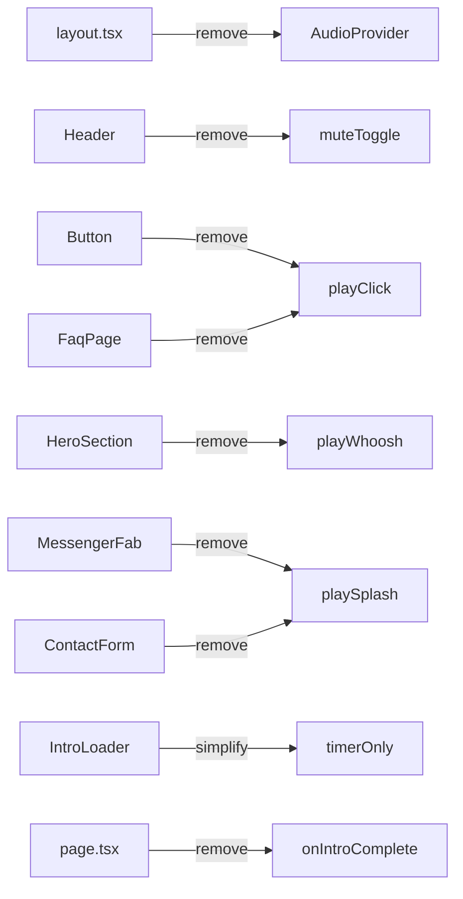

# IPOOLGO — контент, каталог nkids, без звука, Stitch v2 (non-hero)

## Подтверждённые решения

- **Цены:** не показываем (консультация, как сейчас)
- **Viber:** убрать полностью из FAB, CTA-текстов и README
- **Hero визуал:** не трогаем (shader + pill-nav остаются); меняем только **главный текст** (п.4)

---

## Phase 1 — Каталог nkids.md (14 товаров)

Источник: [nkids.md IpoolGo](https://nkids.md/ru/brand/ipoolgo) + [page 2](https://nkids.md/ru/brand/ipoolgo?page=2)

### Новый ассортимент

| # | Товар | Slug (предложение) | Категория |
|---|--------|-------------------|-----------|
| 1 | 4,6 × 1,2 м | `ipoolgo-46x12` | pool-round |
| 2 | 2,0 × 0,5 м | `ipoolgo-20x05` | ice-bath / plunge |
| 3 | 3,0 × 1,5 м | `ipoolgo-30x15` | pool-round |
| 4 | 3,7 × 1,2 м | `ipoolgo-37x12` | pool-round |
| 5 | 5,0 × 1,0 м | `ipoolgo-50x10` | pool-round |
| 6 | 5,0 × 1,5 м | `ipoolgo-50x15` | pool-round |
| 7 | 6,0 × 1,0 м | `ipoolgo-60x10` | pool-round |
| 8 | 6,4 × 1,3 м | `ipoolgo-64x13` | pool-round (есть PNG) |
| 9 | 6,7 × 1,1 м | `ipoolgo-67x11` | pool-round (есть PNG) |
| 10 | 7,0 × 1,2 м | `ipoolgo-70x12` | pool-round (есть PNG) |
| 11 | Лестница 1,62 м | `ladder-162` | ladder-regular |
| 12 | Лестница 132 см | `ladder-132` | ladder-regular |
| 13 | Песочный фильтр | `filter-sand-2300` | filter-sandy |
| 14 | Электронасос DC | `pump-dc-6000` | pump-electro |

**Удалить из каталога** (нет в nkids): `ipoolgo-24x1`, `ipoolgo-3x2x12`, `ipoolgo-6x1`, `ipoolgo-6x15`, `ipoolgo-5x15` (заменён на 5×1.5), `ipoolgo-7x12` → переименовать slug в `ipoolgo-70x12`.

### Файлы

- Переписать [`apps/web/src/data/products.ts`](C:\Users\Asus\projects\ipoolgo-landing\apps\web\src\data\products.ts): 14 записей, `type: "pool" | "accessory"`, specs без голого «500 kg»
- Обновить [`categories.ts`](C:\Users\Asus\projects\ipoolgo-landing\apps\web\src\data\categories.ts): активные категории **Бассейны**, **Лестницы**, **Фильтры**, **Насосы** (+ остальные slug для совместимости, но без пустых карточек)
- [`generateStaticParams`](C:\Users\Asus\projects\ipoolgo-landing\apps\web\src\app\[locale]\products\[slug]\page.tsx) — новый список slug
- **Изображения:** для 8 существующих PNG — маппинг по ближайшему размеру; для новых — generic placeholder `public/products/placeholder-pool.png` + иконки аксессуаров (Stitch/CSS). Опционально: одноразовый скрипт скачивания превью с nkids **только для локального использования** (не hotlink в prod)

---

## Phase 2 — Copy: hero, −20°, купель, 500 кг

### Hero (только текст)

[`messages/ru.json`](C:\Users\Asus\projects\ipoolgo-landing\apps\web\messages\ru.json) / [`ro.json`](C:\Users\Asus\projects\ipoolgo-landing\apps\web\messages\ro.json):

| Ключ | RU | RO |
|------|----|----|
| `hero.title` | **Премиум бассейны по доступной цене** | **Piscine premium la preț accesibil** |
| `hero.subtitle` | Drop Stitch, −20°…+80°C, подходит и как **купель** | Drop Stitch, −20°…+80°C, pot fi folosite și ca **cada rece** |

### Product card specs (вместо «500 kg»)

Единый шаблон chips в [`products.ts`](C:\Users\Asus\projects\ipoolgo-landing\apps\web\src\data\products.ts):

```
["−20°…+80°", "8 ani", "Drop Stitch"]
```

Для `ipoolgo-20x05` добавить chip **«Купель» / «Cadă rece»** + строка под карточкой из i18n `products.plungeHint`.

### Stat counters в Benefits

[`ContentSections.tsx`](C:\Users\Asus\projects\ipoolgo-landing\apps\web\src\components\home\ContentSections.tsx) — заменить ряд `500 kg | 8 ani | 80°` на:

```
−20°  |  8 ani  |  +80°
```

+ подпись: «Подходит для купели / Ideal și ca cadă rece»

### Где ещё правим «500 кг»

| Место | Действие |
|-------|----------|
| `benefits.items[1]` | → «Борт выдерживает до 500 кг» / «Bordul suportă până la 500 kg» |
| `marquee.items` | убрать «500 КГ БОРТ» → «−20°C» или «CADA RECE» |
| [`faq.ts`](C:\Users\Asus\projects\ipoolgo-landing\apps\web\src\data\faq.ts) | «выдерживает нагрузку до 500 кг на борт», не «вес 500 кг» |
| `cta.subtitle`, Footer | убрать упоминание Viber |

**Правило:** голая надпись «500 kg» на карточках и счётчиках **не показываем**; там, где нагрузка важна — только с глаголом «выдерживает / suportă».

---

## Phase 3 — Убрать звук полностью



- Удалить [`AudioProvider.tsx`](C:\Users\Asus\projects\ipoolgo-landing\apps\web\src\components\providers\AudioProvider.tsx) и обёртку в [`layout.tsx`](C:\Users\Asus\projects\ipoolgo-landing\apps\web\src\app\[locale]\layout.tsx)
- [`IntroLoader.tsx`](C:\Users\Asus\projects\ipoolgo-landing\apps\web\src\components\motion\IntroLoader.tsx): только pulse ring ~2.5s → `onComplete()`, без audio gate
- [`Header.tsx`](C:\Users\Asus\projects\ipoolgo-landing\apps\web\src\components\layout\Header.tsx): убрать кнопку mute
- Очистить все `useAudio()` импорты (6 файлов)
- README: убрать «Web Audio API»

---

## Phase 4 — Viber

- [`MessengerFab.tsx`](C:\Users\Asus\projects\ipoolgo-landing\apps\web\src\components\layout\MessengerFab.tsx): оставить Telegram, WhatsApp, Call (3 FAB)
- [`constants.ts`](C:\Users\Asus\projects\ipoolgo-landing\apps\web\src\lib\constants.ts): удалить `viberUrl` (или оставить неиспользуемым — лучше удалить)

---

## Phase 5 — Stitch MCP: макеты всех non-hero страниц

**Project:** `11481725370368097762` · **Design system:** `assets/11063247503933122056`

Hero **не** генерируем заново. Для каждого экрана: `generate_screen_from_text` (DESKTOP + MOBILE) → `get_screen` → HTML в `public/stitch-test/html/v2/` → порт в React.

### Экраны для генерации

| Screen ID | Страница / секция | Ключевые блоки |
|-----------|-------------------|----------------|
| S1 | Home (below hero) | Originality glass + Benefits grid + stat −20°/8y/+80° + plunge callout + product carousel + reviews + CTA |
| S2 | Catalog | Фильтр категорий, grid 3-col, lime bar cards, без цен |
| S3 | Product detail | Split: studio image + specs chips + plunge note + Telegram CTA |
| S4 | Gallery | Masonry, hover scale, category tags |
| S5 | Contact | Glass form + contact panel + map-style accent |
| S6 | About | Story + benefits reuse + wholesale CTA |
| S7 | Reviews | Glass review cards + inline form |
| S8 | FAQ | Lime accordion, search optional |
| S9 | Legal | Minimal doc layout in GlassPanel |

**Единый design brief для Stitch:** brand-deep `#03045E`, lime `#B8FF3C`, Space Grotesk, glass-panel, **no prices**, specs: −20°/8y/Drop Stitch, RO primary + RU notes in prompt.

### Применение в код

Порт HTML → существующие компоненты (не iframe):

- [`ContentSections.tsx`](C:\Users\Asus\projects\ipoolgo-landing\apps\web\src\components\home\ContentSections.tsx), [`ProductCarousel.tsx`](C:\Users\Asus\projects\ipoolgo-landing\apps\web\src\components\home\ProductCarousel.tsx), [`ReviewsSection.tsx`](C:\Users\Asus\projects\ipoolgo-landing\apps\web\src\components\home\ReviewsSection.tsx)
- Все [`page.tsx`](C:\Users\Asus\projects\ipoolgo-landing\apps\web\src\app\[locale]) routes (9 файлов)
- Новые shared blocks при необходимости: `CatalogFilter`, `ProductSpecChips`, `PlungeCallout`, `PageHeroBand` (subpage header strip — **не** home hero)

**Логика страниц** (Telegram form, i18n, JsonLd, routing) — без изменений.

---

## Phase 6 — QA и deploy

- `npm run build` + `npm run lint`
- Smoke: `/ro`, `/ru`, catalog 14 items, product detail, contact → Telegram
- **Deploy:** `npx vercel --prod --yes` из `apps/web` (автодеплой с GitHub ненадёжен — ручной prod как в прошлый раз)
- Commit + push

---

## Риски

| Риск | Mitigation |
|------|------------|
| Нет PNG для 6 новых бассейнов | Placeholder + reuse ближайших размеров; позже заменить реальными фото |
| Stitch generation slow | По 1 экрану, poll `get_screen` каждые 30s |
| Старые URL `/products/ipoolgo-6x15` | 301 redirects в `next.config` или `middleware` на новые slug |
