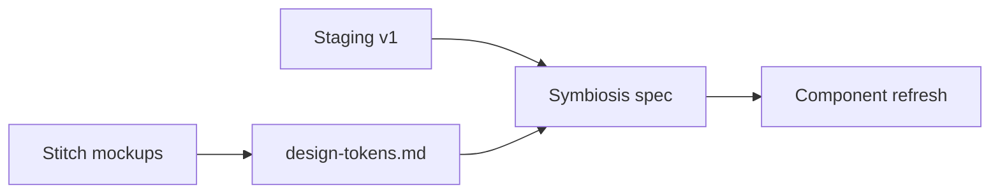
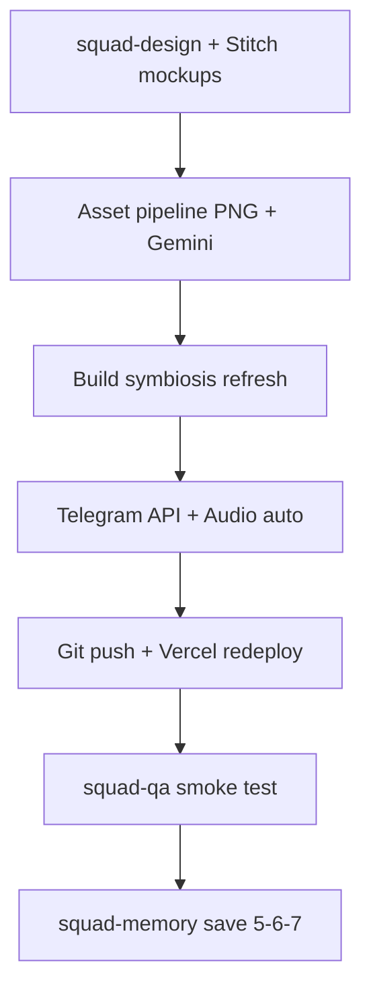

# IPOOLGO — финальная доводка под ключ

## Текущее состояние

| Компонент | Статус |
|-----------|--------|
| Staging | [web-wine-nine-64.vercel.app/ro](https://web-wine-nine-64.vercel.app/ro) |
| Код | [`C:\Users\Asus\projects\ipoolgo-landing`](C:\Users\Asus\projects\ipoolgo-landing) — локальный commit, **не запушен** |
| GitHub | [ArtyCry12/ipoolgo-landing](https://github.com/ArtyCry12/ipoolgo-landing) — **пустой** |
| Форма | [`apps/web/src/app/api/contact/route.ts`](C:\Users\Asus\projects\ipoolgo-landing\apps\web\src\app\api\contact\route.ts) — только `console.log` |
| Аудио | [`AudioProvider.tsx`](C:\Users\Asus\projects\ipoolgo-landing\apps\web\src\components\providers\AudioProvider.tsx) — `muted: true` по умолчанию |
| Продукты | webp/jpg с ipoolgoo.ru, не ваши PNG |

**Ваши 8 PNG** (workspace):  
`kirill-bassiki/assets/c__Users_Asus_...photo_592013968383063*.png` → скопировать в [`apps/web/public/products/`](C:\Users\Asus\projects\ipoolgo-landing\apps\web\public\products) с маппингом slug.

---

## Phase A — Design (squad-design + Stitch MCP)

**Stitch MCP** (`stitch.googleapis.com`, в [`mcp.json`](C:\Users\Asus\.cursor\mcp.json)) — **приоритет #1**, несмотря на fallback-правила squad-design.

### A1. Stitch: макеты всех экранов
Создать через Stitch (desktop + mobile) для RO-версии:

1. Hero + loader
2. Benefits + Drop Stitch diagram
3. Product carousel / catalog grid
4. Product detail
5. Gallery masonry
6. Reviews + contact form
7. Footer + FAB messengers

**Brief для Stitch:** палитра Coolors (`#03045E`→`#CAF0F8`, accent `#B8FF3C`), premium pool brand, не минимализм — glass, gradients, motion hints. Референс: текущий staging + Sui Awwwards.

### A2. Симбиоз Stitch ↔ код
- squad-design: таблица «Stitch token → Tailwind/CSS var» в [`docs/squad/design-tokens.md`](C:\Users\Asus\projects\ipoolgo-landing\docs\squad\design-tokens.md)
- Build: точечный refresh компонентов (не переписывать с нуля):
  - [`HeroSection.tsx`](C:\Users\Asus\projects\ipoolgo-landing\apps\web\src\components\home\HeroSection.tsx) — layout/typography из Stitch
  - [`ProductCarousel.tsx`](C:\Users\Asus\projects\ipoolgo-landing\apps\web\src\components\home\ProductCarousel.tsx) — новые card frames
  - [`ContentSections.tsx`](C:\Users\Asus\projects\ipoolgo-landing\apps\web\src\components\home\ContentSections.tsx) — benefits cards
  - [`catalog/page.tsx`](C:\Users\Asus\projects\ipoolgo-landing\apps\web\src\app\[locale]\catalog\page.tsx) — grid cards
- Сохранить: i18n, motion stack (Framer/GSAP/Lenis/R3F), SEO, FAB, контакты MD/RO



---

## Phase B — Assets (ваши PNG + Gemini)

**Режим:** replace_all — везде ваши PNG + Gemini studio cards (белый фон).

### B1. Маппинг 8 PNG → slug

| Slug | Модель |
|------|--------|
| ipoolgo-67x11 | 6,7 × 1,1 m |
| ipoolgo-24x1 | 2,4 × 1 m jacuzzi |
| ipoolgo-64x13 | 6,4 × 1,3 m |
| ipoolgo-6x15 | 6 × 1,5 m |
| ipoolgo-3x2x12 | 3 × 2 × 1,2 m rect |
| ipoolgo-6x1 | 6 × 1 m |
| ipoolgo-5x15 | 5 × 1,5 m |
| ipoolgo-7x12 | 7 × 1,2 m |

Скрипт `scripts/copy-product-assets.mjs`: copy PNG → `public/products/{slug}.png`, обновить [`.asset-manifest.json`](C:\Users\Asus\projects\ipoolgo-landing\.asset-manifest.json) и [`products.ts`](C:\Users\Asus\projects\ipoolgo-landing\apps\web\src\data\products.ts).

### B2. Gemini image gen (studio cards)
- Скрипт `scripts/generate-product-cards.mjs` через Google AI Studio API (ключ из env, **не в git**)
- Input: каждый PNG → prompt «premium product card, white studio background, soft shadow, IPOOLGO pool, e-commerce hero card, no text overlay»
- Output: `public/products/cards/{slug}-card.webp` (оптимизированные)
- Использовать в carousel, catalog grid, product pages (replace_all)

---

## Phase C — Audio: автозапуск SFX

Изменить [`AudioProvider.tsx`](C:\Users\Asus\projects\ipoolgo-landing\apps\web\src\components\providers\AudioProvider.tsx):

- `muted: false` по умолчанию
- На mount: `AudioContext.resume()` + старт ambient (низкая громкость ~15%)
- SFX (click/splash/whoosh) — без проверки `muted` для interaction sounds
- Intro loader: при завершении — fade-in ambient
- **Mute toggle остаётся** (opt-out, a11y)
- `prefers-reduced-motion: reduce` → отключить ambient и heavy SFX

**Ограничение браузера:** Chrome/Safari могут заблокировать звук до первого клика. Fallback: auto-unmute на первом `pointerdown`/`keydown` на странице (невидимо для пользователя после loader skip).

---

## Phase D — Telegram Bot (@PoolsMd_bot)

### D1. Env vars (Vercel + `.env.local`, **never commit**)

```
TELEGRAM_BOT_TOKEN=8700144686:AAG...  # только Vercel Secrets
TELEGRAM_CHAT_ID=8873079079
TELEGRAM_BOT_USERNAME=PoolsMd_bot
```

**Security:** токен был в чате — после деплоя **рекомендуется rotate** через [@BotFather](https://t.me/BotFather) и обновить Vercel env.

### D2. API route [`/api/contact`](C:\Users\Asus\projects\ipoolgo-landing\apps\web\src\app\api\contact\route.ts)

```typescript
// POST → validate → format → sendMessage
await fetch(`https://api.telegram.org/bot${token}/sendMessage`, {
  method: 'POST',
  headers: { 'Content-Type': 'application/json' },
  body: JSON.stringify({
    chat_id: TELEGRAM_CHAT_ID,
    parse_mode: 'HTML',
    text: formattedMessage,
  }),
});
```

**Формат уведомления:**
```
🏊 IPOOLGO — Cerere nouă

👤 Nume: ...
📞 Telefon: ...
📦 Produs: ...
💬 Mesaj: ...

🕐 2026-07-01 14:30
🌐 ipoolgo-landing / ro
```

- Honeypot field (скрытое) против спама
- Zod validation (уже есть в [`ContactForm.tsx`](C:\Users\Asus\projects\ipoolgo-landing\apps\web\src\components\forms\ContactForm.tsx))
- Error handling: 500 + user-friendly message если Telegram недоступен

### D3. Что нужно от вас (единственное действие)

**После деплоя:** открыть [@PoolsMd_bot](https://t.me/PoolsMd_bot) и нажать **/start** с аккаунта `8873079079`. Без этого бот не сможет присылать сообщения.

**Больше ничего не нужно** — токен, chat_id, username вы уже дали.

---

## Phase E — GitHub + Vercel (автоматически)

1. `git remote add origin https://github.com/ArtyCry12/ipoolgo-landing.git`
2. `git push -u origin master` (или `main`)
3. Vercel: link repo OR redeploy с env vars
4. Переименование project → `ipoolgo-landing-staging` — **отложено** (пункт 6 в памяти)
5. `NEXT_PUBLIC_SITE_URL` — **отложено** (пункт 5 в памяти)
6. Custom domain — **отложено** (пункт 7 в памяти)

**Память (user-memory):** сохранить напоминание про пункты 5–7 для будущей сессии.

---

## Phase F — QA + handoff

- Build + lint pass
- Smoke: форма → Telegram (после вашего /start)
- Проверка `/ro` и `/ru` после redesign
- Обновить [`README.md`](C:\Users\Asus\projects\ipoolgo-landing\README.md) — env vars, bot setup

---

## Финальные вопросы (задам после выполнения, если останутся)

1. Rotate bot token после теста? (рекомендую да)
2. Нужен ли второй получатель (группа/канал) кроме `8873079079`?
3. Готовы ли к привязке домена (пункт 7 из отложенных)?
4. Устраивает ли громкость ambient/SFX или подкрутить?
5. Подтверждение «сдача клиенту» — staging URL достаточно или нужен prod-домен?

---

## Squad execution order



**Gates:** commit + push + Vercel deploy — с вашего полного разрешения (дано). Токен — только в Vercel Secrets, не в git.
