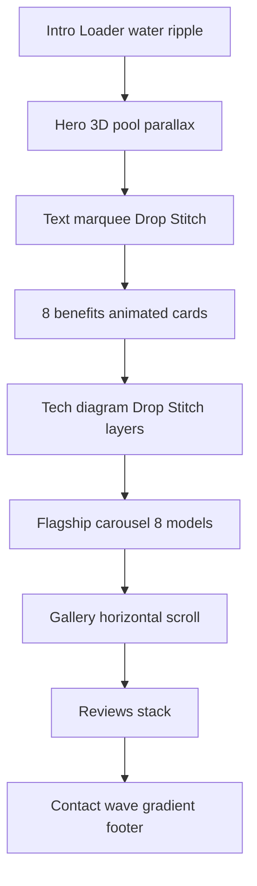

# IPOOLGO — Motion Landing (MD/RO) — Squad Plan

## Phase 0 — Squad Brief

| Параметр | Решение |
|----------|---------|
| **Цель** | Продающий motion-лендинг с WOW-эффектом, SEO, lead-gen (звонок / мессенджеры / заявка), **без цен** |
| **Рынок** | Молдова / Румыния — **RO + RU**, контакты: `079689028`, Viber / WhatsApp / Telegram `@saletoe` |
| **Референсы** | [ipoolgoo.ru](https://ipoolgoo.ru) (контент), [Sui Awwwards SOTD](https://www.awwwards.com/sites/sui) (motion/loader/gradients/hover), палитра [Coolors](https://coolors.co/03045e-023e8a-0077b6-0096c7-00b4d8-48cae4-90e0ef-ade8f4-caf0f8) |
| **Проект** | Изолированный репозиторий `ipoolgo-landing/` — **не смешивать** с `.cursor` hub |
| **Deploy** | Новый GitHub repo + **Vercel preview** (staging); `ipoolgoo.ru` не трогаем |
| **Gates** | Commit/deploy staging — **после вашего явного OK** на каждый этап |

### Агенты и модели (Project Squad)

```mermaid
flowchart LR
  Boss[Boss Opus] --> Scout[squad-scout Composer]
  Scout --> Architect[squad-architect Sonnet]
  Architect --> Design[squad-design Sonnet]
  Design --> Build[squad-build Codex]
  Build --> Review[squad-review GPT5.5]
  Review --> QA[squad-qa Sonnet]
  QA --> Growth[squad-growth Sonnet]
  Growth --> Ship[squad-ship gated]
  Ship --> Memory[squad-memory Haiku]
```



---

## Аудит текущего ipoolgoo.ru (ключевое)

**Стек:** WordPress + кастомная тема `iplg_theme`, Rank Math, CF7, ACF, Yandex Metrika.

**Контент для переноса (тексты, адаптация под RO/RU):**
- Главная: оригинальность, Drop Stitch, 8 преимуществ, материалы/технологии, аксессуары, отзывы (10+), CTA «Где купить»
- Каталог: 21 категория (бассейны, купели, мебель EGC, насосы, фильтры, джакузи и т.д.)
- ~34 SKU в `/option/` — **показываем без цен**, CTA «Consultați / Консультация»
- Галерея, О компании, FAQ, Отзывы, Контакты
- Юридические: оферта, privacy, доставка (упростить под MD/RO)

**Критичные проблемы старого сайта (не повторяем):**
- Sitemap 500, debug `$isExistColorType2`, дубли `/catalog/` vs `/product/`, нет checkout
- Сырые URL галереи на главной, даты отзывов в будущем, Московский адрес (убираем)

**Ваши 8 product renders** (hero-каталог): 6.7×1.1, 2.4×1 (джакузи), 6.4×1.3, 6×1.5, 3×2×1.2, 5×1.5, 7×1.2, 6×1 (уточнить высоту 1 vs 1.5 м на макете).

---

## Архитектура нового проекта

### Расположение и изоляция

```
C:/Users/Asus/projects/ipoolgo-landing/   ← новый корень (или sibling к kirill-bassiki)
├── apps/web/          ← Next.js 15 App Router
├── content/           ← RO/RU тексты (MDX/JSON), кэш контента с ipoolgoo.ru
├── packages/ui/       ← shadcn + motion-компоненты
├── scripts/           ← scrape-content.mjs, asset-upload.mjs
├── .asset-manifest.json  ← URL облачных ассетов (не бинарники в git)
└── docs/squad/        ← design tokens, sitemap, SEO brief
```

**Git:** `github.com/<user>/ipoolgo-landing` (новый repo).  
**Vercel:** отдельный project `ipoolgo-landing-staging`.

### Tech stack

| Слой | Выбор | Зачем |
|------|-------|-------|
| Framework | **Next.js 15** (App Router, RSC) | SSG/ISR, SEO, Vercel |
| i18n | **next-intl** | RO (default) + RU |
| Styling | **Tailwind v4** + CSS variables | Палитра Coolors |
| Motion | **Framer Motion** + **GSAP ScrollTrigger** + **Lenis** | Sui-like scroll, sections |
| 3D / WOW | **R3F + drei** (water shader hero) | «Объект веб-дизайна» |
| UI | **shadcn/ui** + **21st** (cards, dialogs) | Быстрые блоки |
| Audio | **Howler.js** | Ambient + SFX, mute toggle |
| Forms | **React Hook Form** + Resend / webhook | Lead без backend |
| SEO | metadata API, JSON-LD, sitemap.ts | MD/RO keywords |
| Analytics | Plausible или GA4 (на staging — опционально) | Без Yandex для MD/RO |

### MCP и креативный пайплайн

| Инструмент | Роль | Примечание |
|------------|------|------------|
| **Stitch MCP** (`stitch.googleapis.com`) | Wireframes / screen mockups по секциям | В `mcp.json` есть, но **не в активной сессии** — включить в Cursor Settings → MCP перед Phase 3 |
| **user-gemini** | Тексты RO, UI-иконки, lifestyle-фоны из ваших PNG, TTS для voice-over | `analyze_image` + `generate_text`; image gen через API если доступно |
| **plugin-exa-exa** | Конкуренты MD/RO, SEO keywords | Однократный research |
| **Vercel Blob / Cloudinary** | Хранение тяжёлых ассетов | Локально только manifest + thumbnails |

**Кэширование (экономия токенов):**
1. `scripts/scrape-content.mjs` — один раз вытягивает тексты с ipoolgoo.ru → `content/cache/*.json`
2. `content/translations/` — RO перевод (Gemini batch, сохранить в файлы — не перегенерировать)
3. `.asset-manifest.json` — SHA → cloud URL; gitignore для `*.mp3`, `*.webm`, full-res PNG
4. Stitch/Gemini outputs → upload → manifest; в коде только URL
5. `next/image` + CDN transforms для responsive

---

## Информационная архитектура (все страницы)

### Навигация (sticky + mobile drawer, Sui-style)

| Route | RO slug | Содержание |
|-------|---------|------------|
| `/` | Acasă | WOW hero, loader, преимущества, технология, продукты-teaser, отзывы, CTA |
| `/catalog` | Catalog | 21 категория — карточки без цен |
| `/catalog/[category]` | e.g. `/catalog/piscine-rotunde` | Описание категории + grid SKU |
| `/products/[slug]` | e.g. `/products/ipoolgo-67x11` | 8 flagship + ключевые SKU из WP; specs, gallery, lead CTA |
| `/gallery` | Galerie | Masonry + lightbox, ваши фото + lifestyle gen |
| `/about` | Despre noi | Drop Stitch, материалы, опт (B2B teaser) |
| `/reviews` | Recenzii | Карусель отзывов + форма (без модерации WP) |
| `/faq` | Întrebări | Accordion |
| `/contact` | Contact | Форма + `@saletoe` + floating messengers |
| `/legal/[doc]` | Termeni, Confidențialitate | Упрощённые MD/RO legal |

**Убрано:** `/cart`, `/checkout`, `/price`, оплата VTB, московский самовывоз.

### Homepage — секции и motion (Sui-inspired)



**WOW-элементы:**
- Intro loader (2–3 s, skip button)
- Gradient mesh transitions между секциями (как Sui)
- Scroll-linked pool scale / water caustics (WebGL hero)
- Hover magnetic buttons + ripple SFX
- Stat counters (500 kg, 8 ani, -20°/+80°)
- Interactive footer с particle water
- Sticky FAB: Viber / WhatsApp / Telegram / Call

**Не минимализм:** layered gradients, glass cards, animated diagrams (Drop Stitch cross-section), decorative blobs `#48CAE4`–`#CAF0F8`.

---

## Дизайн-система

### Цвета (CSS variables)

```
--ocean-950: #03045E  → фоны, footer
--ocean-800: #023E8A  → headings
--ocean-600: #0077B6  → primary buttons
--ocean-500: #0096C7  → links
--ocean-400: #00B4D8  → accents
--ocean-300: #48CAE4  → highlights
--ocean-200: #90E0EF  → borders
--ocean-100: #ADE8F4  → cards bg
--ocean-50:  #CAF0F8  → sections alt
--accent-lime: #B8FF3C  → rim accent с продуктовых фото
```

### Типографика
- Display: **Clash Display** или **Satoshi** (premium feel)
- Body: **Inter** / **Manrope**
- RO + RU: Latin + Cyrillic subsets

### Stitch workflow (Phase 3)
1. `create_screen` — Hero, Catalog grid, Product detail, Contact (mobile + desktop)
2. Export tokens → Tailwind config
3. Build реализует 1:1 с motion-слоем поверх

---

## Аудио

| Тип | Источник | Поведение |
|-----|----------|-----------|
| Ambient | Gemini TTS / royalty-free loop (water, soft pads) | Autoplay **muted**, unmute по клику |
| SFX | Короткие clicks, splash, whoosh (gen или библиотека) | На hover/click/scroll milestones |
| A11y | Кнопка mute в header + `prefers-reduced-motion` отключает heavy motion и ambient |

---

## SEO / Growth (MD/RO)

- **Default locale:** `ro-MD` (hreflang `ro`, `ru`, `x-default`)
- Title pattern: `{Produs} Drop Stitch \| IPOOLGO Moldova`
- JSON-LD: `Organization`, `Product` (без `offers.price`), `FAQPage`, `Review`
- OG images: product renders + generated lifestyle
- Keywords: piscină gonflabilă, drop stitch, jacuzzi, cadă hidromasaj, бассейн дропстич
- Performance: LCP hero WebP/AVIF, lazy WebGL, `loading="lazy"` gallery
- `sitemap.ts` + `robots.ts` — без 500 ошибки старого WP

---

## Lead-gen и контакты

**Floating dock (always visible):**
- Phone: `+373 79 689 028` (формат уточним при сборке)
- Viber / WhatsApp: deep links на тот же номер
- Telegram: `https://t.me/saletoe`

**CTA copy:** «Sună acum» / «Scrie pe Telegram» / «Позвонить» / «Написать»

**Формы:** имя, телефон, продукт (select), сообщение → Resend email + optional Telegram webhook.

---

## Фазы исполнения (после approve плана)

### Phase 1 — Scout (done)
Контент-инвентарь, sitemap, слабые места — зафиксировано выше.

### Phase 2 — Architect
- Scaffold `ipoolgo-landing` monorepo
- `scrape-content.mjs` → JSON cache
- i18n routing, component tree, asset manifest schema

### Phase 3 — Design (Stitch + Gemini)
- 6 Stitch screens (desktop/mobile)
- Gemini: RO translations, 4–6 lifestyle backgrounds from product PNGs
- Motion storyboard (loader → hero → sections)
- Audio brief + first ambient loop

### Phase 4 — Build
- Homepage + layout + FAB messengers
- Catalog + 8 flagship product pages (ваши PNG)
- Остальные страницы из content cache
- WebGL hero, GSAP sections, Howler SFX
- Forms + SEO metadata

### Phase 5 — Review + Phase 6 — QA
- Lighthouse, a11y, mobile, reduced-motion
- Playwright smoke: nav, i18n switch, CTAs, forms

### Phase 7 — Growth
- hreflang audit, structured data validator
- Core Web Vitals pass

### Phase 8 — Ship (staging, gated)
- `git init` → new GitHub repo
- Vercel project, env vars (Resend, Blob)
- Preview URL в отчёте

### Phase 9 — Memory
- `user-memory` + `AGENTS.md` в repo (не в hub)

---

## Риски и митигация

| Риск | Митигация |
|------|-----------|
| Stitch MCP offline | Fallback: Figma MCP или huashu-design HTML prototype |
| Gemini без image-gen в MCP | `@google/generative-ai` script + Blob upload |
| WebGL perf на слабых телефонах | `prefers-reduced-motion` + static hero fallback |
| Autoplay audio blocked | Muted by default + explicit unmute |
| Объём 21+34 страниц | Phase 4a: 8 flagship + catalog hub; Phase 4b: остальные SKU из cache |

---

## Deliverables

1. Рабочий staging URL на Vercel
2. Новый GitHub repository `ipoolgo-landing`
3. RO/RU сайт без цен, с motion + audio
4. 8 flagship product pages с вашими renders
5. SEO: sitemap, meta, JSON-LD
6. Документация: deploy, env vars, asset manifest
