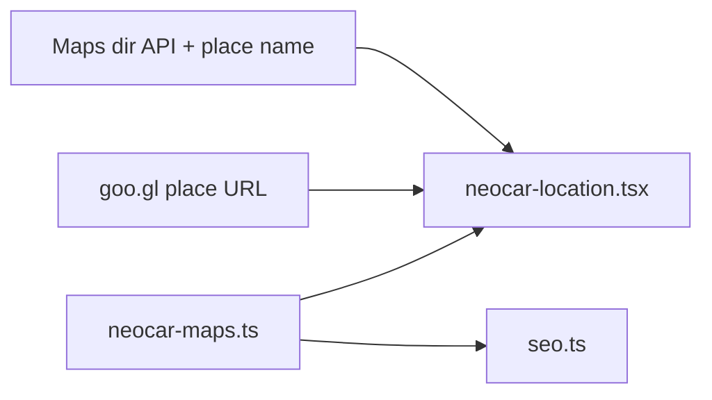

# Карта NEOCAR + мягкий фон 3D (Screen blend)

## Диагностика

### Карта — почему ведёт не туда
Сейчас в [`web/components/ui/neocar-location.tsx`](web/components/ui/neocar-location.tsx) кнопки строятся так:

```ts
const NEOCAR_COORDS = { lat: 47.0245, lng: 28.8325 };
// Маршрут / Google Maps → query по этим координатам
```

По вашей ссылке [maps.app.goo.gl/PM3knYPhtZS8Dsjw7](https://maps.app.goo.gl/PM3knYPhtZS8Dsjw7) открывается **бизнес-точка Google**:

`NEOCAR, str. Voluntarilor 3, MD-2037, Chișinău` (place id `…0x40c97bf38757a483:0xd9f0ebeec9228bd2`).

Координаты `47.0245, 28.8325` смещены относительно этой точки (~несколько км) — маршрут уезжает на другое место на улице/в районе. Текст адреса в i18n (`str. Voluntarilor 3, MD-2037`) в целом верный, ошибка именно в **destination по lat/lng**, а не в подписи.

### 3D — чёрный фон
В [`web/components/hero/HeroCanvas.tsx`](web/components/hero/HeroCanvas.tsx):
- у Canvas уже `gl={{ alpha: true }}`, но задан `<color attach="background" args={["#0a0a0a"]} />` — сплошная чёрная подложка;
- GLB из Meshy часто с **запечённым чёрным фоном** в текстурах.

Вы выбрали: **Screen blend** (чёрное «гасится», техника остаётся), без жёсткого хромакея.

---

## 1. Единый источник правды для карты

Создать [`web/lib/neocar-maps.ts`](web/lib/neocar-maps.ts):

| Константа | Значение |
|-----------|----------|
| `NEOCAR_GOOGLE_PLACE_URL` | `https://maps.app.goo.gl/PM3knYPhtZS8Dsjw7` |
| `NEOCAR_GOOGLE_SHARE_URL` | `https://share.google/FZOMZmoPht6J8vfY0` (для `sameAs` / справки) |
| `NEOCAR_MAP_LABEL` | `NEOCAR, str. Voluntarilor 3, MD-2037, Chișinău` |
| `NEOCAR_COORDS` | извлечь при реализации из redirect URL (или `destination=NEOCAR_MAP_LABEL` без неточных coords) |

**Кнопки (главное исправление):**
- **Google Maps** → `NEOCAR_GOOGLE_PLACE_URL` (ваша короткая ссылка, как в Google)
- **Маршрут** → `https://www.google.com/maps/dir/?api=1&destination=${encodeURIComponent(NEOCAR_MAP_LABEL)}`  
  (маршрут к **названию места NEOCAR**, не к старым координатам)

**iframe embed** (карта в блоке контактов):
- `q=${encodeURIComponent(NEOCAR_MAP_LABEL)}` вместо только `Contact.address` — чтобы пин совпадал с карточкой NEOCAR на скрине.

Обновить потребители:
- [`neocar-location.tsx`](web/components/ui/neocar-location.tsx) — все URL из `neocar-maps.ts`
- [`web/lib/seo.ts`](web/lib/seo.ts) — `geo.latitude/longitude` + при необходимости `hasMap` / `sameAs` с share-ссылкой
- [`web/app/[locale]/page.tsx`](web/app/[locale]/page.tsx) — JSON-LD `address` (оставить `str. Voluntarilor 3`, MD-2037)
- [`web/messages/{ru,ro,en}.ts`](web/messages/ru.ts) — при необходимости уточнить отображаемый `Contact.address` (например префикс «NEOCAR»), **без** смены почтового индекса MD-2037 (как в Google)



---

## 2. 3D: Screen blend + прозрачный canvas

Файлы: [`HeroCanvas.tsx`](web/components/hero/HeroCanvas.tsx), при необходимости [`HeroMiniCanvas.tsx`](web/components/hero/HeroMiniCanvas.tsx).

| Шаг | Действие |
|-----|----------|
| 1 | Убрать `<color attach="background" … />` у `<Canvas>` — фон hero просвечивает |
| 2 | На обёртку canvas: `className="… mix-blend-screen"` (desktop hero) |
| 3 | Родитель hero-слоя: `isolation-auto` / без лишних opaque слоёв, чтобы blend шёл с градиентом секции |
| 4 | Проверить контраст погрузчика; при лёгком «засвете» — слегка снизить `directionalLight` или добавить тонкий `brightness()` только на обёртке (только если нужно) |

**Мобильную ветку** (`HeroMobileHeroVideo`) **не трогать**.

**MiniCanvas** (плавающая модель): по возможности тот же `mix-blend-screen`, иначе останется чёрный квадрат — проверить на preview.

Ограничение Screen blend: очень тёмные части техники могут чуть подсветиться — вы это приняли; при необходимости позже можно перейти на soft-mask shader.

---

## 3. Проверка и выкладка

1. `cd web` → `npm run lint`, `typecheck`, `build`
2. Ручная проверка:
   - «Google Maps» и «Маршрут» → та же точка, что [goo.gl/PM3knYPhtZS8Dsjw7](https://maps.app.goo.gl/PM3knYPhtZS8Dsjw7)
   - Hero desktop: нет чёрной «плашки», плавный переход в градиент
3. Один коммит: `fix(web): correct NEOCAR map links; screen-blend hero 3D background`
4. `git push origin master` → деплой Vercel из **корня репо** (как раньше: `npx.cmd vercel deploy --prod --yes --scope monolithh`), проект `neocar-site-main`

---

## Что не делаем

- Не пересохраняем GLB и не режем хромакей по пикселям
- Не трогаем `.cursor/`, raw 37 MB GLB
- Не меняем mobile hero video
