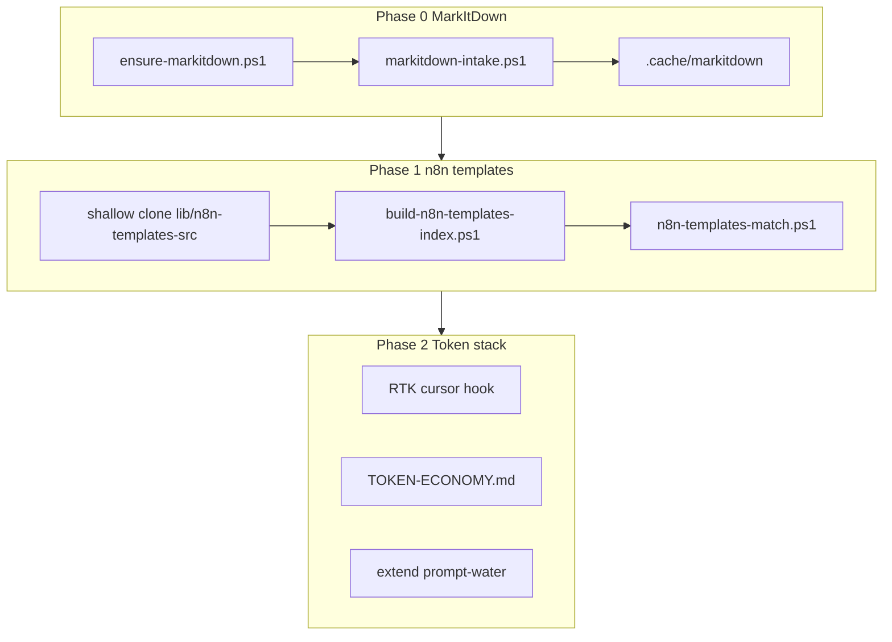

# MarkItDown + n8n templates + token economy

## Текущее состояние (важно)

| Компонент | Есть | Не хватает |
|-----------|------|------------|
| **MarkItDown** | [`skills/markitdown/SKILL.md`](skills/markitdown/SKILL.md), [`scripts/convert_to_md.py`](skills/markitdown/scripts/convert_to_md.py) | Нет `ensure-*`, нет hook, нет route, нет rule, не проверена установка Python/pip |
| **n8n** | [`skills/n8n-workflow/`](skills/n8n-workflow/), MCP `n8n-mcp`, route `n8n-automation` | Нет каталога 280+ шаблонов из [awesome-n8n-templates](https://github.com/enescingoz/awesome-n8n-templates) |
| **Token economy** | prompt-coach, `Measure-PromptWater`, graphify, **gitnexus** | Нет RTK, нет единой карты «что ставим / что лишнее» |

MarkItDown упоминается в squad-roster, но **не подключён к hooks** — агент должен помнить скилл вручную. Это против твоего требования «на каждый запрос».

---

## Phase 0 — MarkItDown (первым, установить и протестировать)

### 0.1 Установка и health-check

Создать [`commands/ensure-markitdown.ps1`](commands/ensure-markitdown.ps1):

- Проверить Python **3.10+** (`py -3.12` на Windows)
- `pip install "markitdown[all]"` в venv хаба: `C:\Users\Asus\.cursor\.venv-markitdown\` (изолированно, не ломает систему)
- Прогон smoke: PDF/DOCX/HTML тест-файл → `.cache/markitdown/test.md`
- Выход: JSON/md отчёт `ai-tracking/markitdown-health.json`

Добавить в [`commands/cursor-system-refresh.cmd`](commands/cursor-system-refresh.cmd) вызов `ensure-markitdown.ps1` (как `ensure-n8n`).

### 0.2 Always-on hook (каждый промпт, с исключениями)

Новый [`hooks/markitdown-intake.ps1`](hooks/markitdown-intake.ps1) + запись в [`hooks.json`](hooks.json) **после** `repo-intake.ps1`:

**Детектировать в промпте:**
- Пути к файлам: `.pdf`, `.docx`, `.pptx`, `.xlsx`, `.html`, `.epub`, `.msg`, `.zip`, изображения, аудио
- Cursor uploads: `uploads/*.md` с бинарными вложениями, `@C:\path\file.pdf`
- URL на документы (опционально, только trusted)

**Действие:**
1. Конвертировать через `skills/markitdown/scripts/convert_to_md.py` (кэш по hash/mtime — не конвертировать повторно)
2. Inject `additionalContext`: пути к `.md`, размер, «читай md, не бинарник»

**Исключения (не трогать):**
- Промпт < 20 символов без путей
- Только код/текст без document extensions
- Уже есть `.cache/markitdown/*.md` для того же файла в контексте
- Явный флаг: `skip-markitdown`, `raw pdf`
- Noise patterns из [`lib/prompt-coach/CoachConfig.json`](lib/prompt-coach/CoachConfig.json)

Timeout hook: **8–15s** (конвертация тяжёлых PDF может быть долгой; для таймаута — defer в фон).

### 0.3 Фоновый режим

Два уровня (оба лёгкие):

1. **Кэш + mtime** — при hook не блокировать чат: если файл большой, писать в `ai-tracking/markitdown-queue.json`, фоновый [`commands/markitdown-drain.ps1`](commands/markitdown-drain.ps1) догоняет
2. **Опционально позже:** `markitdown-mcp` на localhost (только trusted) — не в Phase 0, если hook+кэш проходят тесты

### 0.4 Правила и маршрутизация

| Файл | Роль |
|------|------|
| [`rules/markitdown.mdc`](rules/markitdown.mdc) | Компактное always-on правило: «документ → md → Read/Grep чанками» |
| Route в [`lib/task-router/routes.json`](lib/task-router/routes.json) | `id: markitdown`, keywords: pdf, docx, convert, markitdown, экономия токенов |
| [`commands/markitdown-test.ps1`](commands/markitdown-test.ps1) | Автотест: install + convert + hook dry-run |
| [`SYSTEM-REGISTRY.md`](SYSTEM-REGISTRY.md) | Секция MarkItDown |

### 0.5 Критерий «готово» Phase 0

- `markitdown-test.ps1` exit 0
- Hook на тестовом промпте с `file.pdf` возвращает путь к `.md`
- Reload Window после `hooks.json`
- Документировать в [`ai-tracking/FULL-SYSTEM-AUDIT.md`](ai-tracking/FULL-SYSTEM-AUDIT.md): ось «Цена токенов» +1

**Только после зелёных тестов** — Phase 1 и 2.

---

## Phase 1 — awesome-n8n-templates

Паттерн как [`commands/build-awesome-prompts-index.ps1`](commands/build-awesome-prompts-index.ps1) + [`skills/awesome-prompts/`](skills/awesome-prompts/):

### 1.1 Источник (без раздувания hub)

- Shallow clone в `lib/n8n-templates-src/` (gitignored, ~280 JSON)
- Индекс **без** загрузки полных workflow в контекст

### 1.2 Индекс и matcher

| Артефакт | Содержимое |
|----------|------------|
| `lib/n8n-templates/template-index.json` | id, category, title, nodes[], triggers, keywords |
| `lib/n8n-templates/template-corpus.jsonl` | полный JSON по id (on-demand) |
| [`commands/build-n8n-templates-index.ps1`](commands/build-n8n-templates-index.ps1) | Парсинг папок README + `*.json` |
| [`commands/n8n-templates-match.ps1`](commands/n8n-templates-match.ps1) | Top 3 по задаче пользователя |
| [`skills/n8n-templates/SKILL.md`](skills/n8n-templates/SKILL.md) | Match → load one → adapt → deploy via `n8n-mcp` |

### 1.3 Связка с существующим n8n

- Расширить route `n8n-automation`: skill `n8n-templates` + `n8n-workflow`
- [`rules/n8n-workflow.mdc`](rules/n8n-workflow.mdc): ссылка на matcher шаблонов
- Тест: `n8n-templates-match.ps1 -Query "telegram AI bot"` → 3 результата

---

## Phase 2 — Token optimization: что ставим, что лишнее

### Ставим в hub (практическая польза)

| Инструмент | Зачем | Как |
|------------|-------|-----|
| **MarkItDown** | PDF/Office → md, −60–80% токенов на документах | Phase 0 |
| **RTK** | Сжатие вывода `git`, `test`, `grep` в терминале | `rtk init --agent cursor` + merge с существующим [`hooks.json`](hooks.json); [`commands/ensure-rtk.ps1`](commands/ensure-rtk.ps1) |
| **tiktoken** (лёгкий) | Точный подсчёт токенов в prompt-coach | Python util в `lib/prompt-coach/` |
| **awesome-llm-token-optimization** | Список стратегий | `docs/knowledge-base/TOKEN-OPTIMIZATION-SOURCES.md` (ссылки, не runtime) |

### Уже есть — не дублировать

| Запрошенное | Уже в hub |
|-------------|-----------|
| JCodeMunch / code RAG | **GitNexus** (`user-gitnexus`) + graphify |
| Context selection | **task-router** (35 routes, max 2), on-demand rules |
| Prompt trimming | **prompt-coach** + `Measure-PromptWater` |
| Local prompt templates | **awesome-prompts** index |

### Отложить / не ставить в hub

| Инструмент | Почему |
|------------|--------|
| **LangChain, LlamaIndex** | Python app frameworks; hub = Cursor hooks/MCP/skills, не отдельное Python-приложение |
| **Microsoft Guidance** | DSL для генерации; редко нужен в Cursor agent flow |
| **Headroom, LeanCTX, Openwolf** | Оценить **после RTK**; риск overlap + ещё один proxy слой |
| **Chroma/Milvus/Weaviate/FAISS** | Нужны только при своём RAG-приложении; hub использует Exa + memory |
| **PyTorch/transformers/llama.cpp** | ML training/inference — вне scope agent-hub |
| **React/Next/FastAPI/Prisma/Docker/Terraform** | Уже в project templates (clone-website) или в client projects, не в `.cursor` |

### Большой список «топовых» репо

Не устанавливать всё. Создать [`docs/knowledge-base/AI-STACK-MAP.md`](docs/knowledge-base/AI-STACK-MAP.md):

- 4 слоя: UI, API, ML/RAG, Agent-hub
- Для каждого репо: **hub** / **project-only** / **reference-only**
- Связь с squad-ролями (design → Next, ship → Vercel, growth → SEO)

Текст — простой русский + humanizer ([`rules/humanizer-writing.mdc`](rules/humanizer-writing.mdc)).

---

## Phase 3 — Документация и тесты

- Обновить [`SYSTEM-REGISTRY.md`](SYSTEM-REGISTRY.md), [`ai-tracking/ISSUES-INDEX.md`](ai-tracking/ISSUES-INDEX.md)
- Новые тесты: `markitdown-test.ps1`, `n8n-templates-test.ps1`, расширить hub-learning-test
- **Reload Window** после любых правок `hooks.json`
- Запомнить в user-memory: markitdown always-on, plain language

---

## Риски и как их закрыть

| Риск | Митигация |
|------|-----------|
| Hook chain > 5s timeout | Кэш + async drain для больших файлов |
| RTK конфликт с текущими hooks | Backup `hooks.json`, merge вручную, тест autopilot/router |
| n8n-templates 280 JSON раздувают git | `lib/n8n-templates-src/` в `.gitignore`, в git только index |
| MarkItDown без Python 3.12 | `ensure-markitdown` с явной ошибкой и ссылкой на установку |

---

## Порядок выполнения (строго)

1. **Phase 0** — markitdown: ensure → test → hook → rule → registry → **зелёные тесты**
2. **Phase 1** — n8n-templates index + matcher + skill
3. **Phase 2** — RTK + TOKEN docs + tiktoken в coach
4. **Phase 3** — knowledge-base AI-STACK-MAP, audit refresh

Коммит — только по твоей просьбе.
