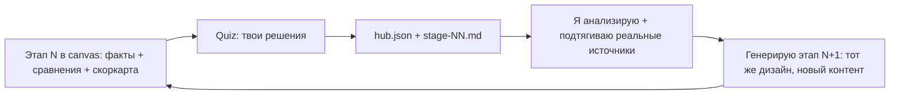

# Micro-SaaS Studio: интерактивная проработка идеи (Молдова, AI)

## Что делаем и зачем
Строим рабочую студию идеи в формате, который ты просил: **красивый интерактивный лендинг-quiz**, который живёт рядом с чатом, и **hub** (файлы состояния), куда стекаются твои решения. Идём от широкого диапазона к узкому за 5 этапов, пока не получим одну финальную идею + архитектуру под разработку в одиночку (~18 ч/нед, MVP за 14-31 день).

## Формат подачи (дефолт — можно переопределить на 1-м экране)
- **Vehicle:** Cursor Canvas — один файл `microsaas-studio.canvas.tsx` в `.../c-Users-Asus-cursor-projects-Fast-Money/canvases/`. Открывается сбоку от чата, дизайн-структура фиксирована, между этапами меняется только контент (ровно как ты описал).
- **Hub (состояние):** `ai-tracking/microsaas/hub.json` + по файлу на этап (`stage-01-landscape.md` ...). Здесь фиксируются твои выборы, скоринг и решения — источник правды для генерации следующего этапа.
- **Петля:** этап отрисован в canvas (факты, сравнения, прямые примеры, скоркарта) → ты проходишь встроенный quiz (решения) → я пишу выбор в hub → анализирую → генерирую следующий этап, обновляя тот же canvas.
- Публичный задеплоенный лендинг-quiz (Next.js + сбор ответов реальных людей) — не сейчас, а как отдельное расширение на этапе 4+, если захочешь валидацию рынком.

## Этапы (broad -> narrow)
- **Этап 1 — Широкое поле.** 6-8 направлений (микро-автоматизации SMB; upskilling a-la Duolingo для сложных сфер; MD AI-новости/лента; апгрейд ресейл-маркетплейса поверх 999.md/TG-барахолок; платформа тин-джобов; «невидимые AI-утилиты»-бандл). Каждое оценено по рубрике. Реальные данные по Молдове (налоги, платёжеспособность, урбан-концентрация Кишинёв, RU/RO язык, миграция) через Exa/Tavily. Итог: топ-3.
- **Этап 2 — Deep-dive топ-3.** По каждому: ICP, JTBD, «клин» входа, монетизация, TTP, тех-затраты и ежемесячка, ров/защита, MD-риски, рычаг MELO. Прямое сравнение → выбор 1 (+ запасная).
- **Этап 3 — Финальная идея.** Позиционирование, границы MVP под 14-31 день, ценообразование, GTM через каналы MELO (TG/WA/SMB-клиенты), план «скачка популярности» на старте + удержание, roadmap расширения (РФ/Румыния, переток в сеть).
- **Этап 4 — Архитектура и план сборки.** Дешёвый стек и интеграции, модель данных, вехи под соло-темп 18 ч/нед, деплой. Опционально: превращение quiz в публичный валидационный лендинг.

## Скоринг-рубрика (веса — интерактивные слайдеры в canvas)
Критерии: TTP (скорость до денег), тех-затраты+ежемесячка, рычаг MELO, потолок роста/переток, платёжеспособность аудитории (B2B), дешёвый/вирусный маркетинг. По умолчанию выше вес у TTP, затрат, рычага MELO и B2B; двигаешь слайдеры — рейтинг направлений пересобирается вживую.

## Ориентир по стоимости/стеку (для этапов 3-4)
- Фронт/деплой: Next.js на Vercel (free/hobby старт).
- Данные/авто: Supabase (free tier) или лёгкий бэкенд; интеграции через готовые API/n8n.
- AI: тонкий слой на существующих LLM API (оплата по факту), без своей инфраструктуры.
- Цель: near-zero ежемесячка на старте, масштаб расходов только с выручкой.

## Границы
- Плановый режим: пока только исследование и этот план. После твоего подтверждения — собираю Этап 1 (canvas + hub) и запускаю петлю.
- Идею не фиксируем заранее: тизер-гипотезы идут в общий скоринг наравне с остальными.
- Язык интерфейса и материалов — русский.