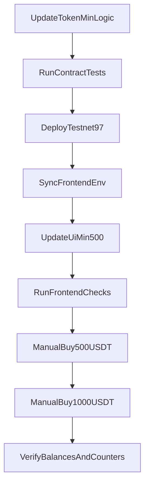

# План: минимум 500 USDT + тест покупки

## Что фиксируем
- Минимальная покупка считается **в токенах**, не в BNB.
- Порог: **500 USDT**.
- Вносим это и в **смарт-контракт**, и в **frontend**.
- Проверяем 2 кейса покупки: **500 USDT** и **1000 USDT**.

## 1) Обновление on-chain логики
- Изменить контракт так, чтобы минимальный порог проверялся в токенах (500 USDT в `18` decimals).
- Обновить связанные view/валидации, чтобы UI мог получать корректный лимит.
- Обновить тесты в `smart-contract/test`:
  - кейс `499.99 USDT` → revert,
  - кейс `500 USDT` → success,
  - кейс `1000 USDT` → success.

Основные файлы:
- [smart-contract/contracts/TokenSale.sol](smart-contract/contracts/TokenSale.sol)
- [smart-contract/test/TokenSale.test.ts](smart-contract/test/TokenSale.test.ts)

## 2) Redeploy testnet и синхронизация
- Деплой в BSC testnet с новым bytecode/логикой.
- Проверка `deployed-contract.json` и on-chain значений лимитов.
- Синхронизация frontend переменных из deploy-результата.

Основные файлы/скрипты:
- [smart-contract/scripts/deploy-testnet.ps1](smart-contract/scripts/deploy-testnet.ps1)
- [scripts/sync-frontend-env.mjs](scripts/sync-frontend-env.mjs)
- [smart-contract/deployed-contract.json](smart-contract/deployed-contract.json)

## 3) Обновление frontend валидации и текстов
- В `SaleCard` оставить ввод в токенах и проверку минимума как `500 USDT`.
- Сообщения ошибки и helper-тексты привести к новой бизнес-логике.
- Проверить, что расчёт BNB для `500` и `1000` USDT корректен.

Основные файлы:
- [frontend/components/SaleCard.tsx](frontend/components/SaleCard.tsx)
- [frontend/hooks/useTokenSale.ts](frontend/hooks/useTokenSale.ts)
- [frontend/lib/constants.ts](frontend/lib/constants.ts)

## 4) Регрессия
- Смарт-контракты: `hardhat test` (и при необходимости coverage).
- Frontend: `npm run lint`, `npm run test`, `npm run build`.
- Проверка, что wallet-подключение не деградировало после правок.

## 5) Ручной тест покупки (testnet)
- Кейсы:
  - `500 USDT` (минимум) — должна пройти,
  - `<500 USDT` — должна блокироваться/ревертиться,
  - `1000 USDT` — должна пройти.
- Для успешных кейсов подтвердить:
  - списание BNB в кошельке,
  - начисление USDT,
  - обновление `Total quantity purchased`, `Sold`, `Available`.

## Итоговый результат
- Минимальная покупка on-chain и в UI = **500 USDT**.
- Покупки на `500` и `1000` USDT проходят корректно в testnet.
- Метрики и балансы обновляются корректно после транзакций.