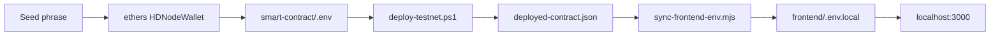

# Настройка .env из сид-фразы и завершение testnet deploy

## Контекст

- [`smart-contract/.env`](c:\Users\Asus\.cursor\flash-tokens-trust\smart-contract\.env) сейчас пустой для `PRIVATE_KEY` и `BSCSCAN_API_KEY`.
- `ethers` уже установлен в [`smart-contract/package.json`](c:\Users\Asus\.cursor\flash-tokens-trust\smart-contract\package.json) (`^6.11.0`) — отдельная установка не нужна.
- Предыдущие base64-строки **не являются** EVM private key; сид-фраза — корректный источник.

## Безопасность (обязательно)

- Сид-фраза и private key **не коммитятся** (уже в [`.gitignore`](c:\Users\Asus\.cursor\flash-tokens-trust\.gitignore): `smart-contract/.env`).
- Сид-фраза была в чате — после тестов рекомендуется **новый testnet-кошелёк** для production/mainnet.
- В ответах не печатать полный `PRIVATE_KEY` / сид — только адрес deployer и статус.

---

## Шаг 1 — Извлечь PRIVATE_KEY через `node -e` (ethers)

Выполнить из [`smart-contract/`](c:\Users\Asus\.cursor\flash-tokens-trust\smart-contract):

```powershell
cd c:\Users\Asus\.cursor\flash-tokens-trust\smart-contract
node -e "const {HDNodeWallet}=require('ethers'); const phrase='cook situate citizen soldier negative west share license useful virtual depart total'; for(let i=0;i<5;i++){ const w=HDNodeWallet.fromPhrase(phrase,'m/44\'/60\'/0\'/0/'+i); console.log('index',i,'address',w.address); }"
```

Затем для каждого индекса `0..4` проверить **BSC Testnet balance** через RPC и выбрать адрес с `balance > 0` (тот, куда вы пополняли test BNB). Trust Wallet / MetaMask для EVM обычно используют путь `m/44'/60'/0'/0/0`, но при нескольких аккаунтах индекс может быть `1`, `2`, …

Если баланс только на `index 0` — взять `w.privateKey` (формат `0x` + 64 hex).

---

## Шаг 2 — Обновить [`smart-contract/.env`](c:\Users\Asus\.cursor\flash-tokens-trust\smart-contract\.env)

Полностью заменить содержимое на:

```env
PRIVATE_KEY=0x<64_hex_из_шага_1>
BSCSCAN_API_KEY=FHQRUCB5TJPU7YQIDMZ6WHBEV42AEF3AQQ
TOKEN_ADDRESS=0x327D87678A2f1d67048b34a048Bb6D68e6168888
USE_MOCK_TOKEN=true
DEPOSIT_AMOUNT=1000000
```

- Удалить любые старые/битые значения `PRIVATE_KEY` (base64, точки, пустые строки).
- `BSCSCAN_API_KEY` — тот, что вы подтвердили.

---

## Шаг 3 — Testnet deploy (BSC, chain 97)

```powershell
cd c:\Users\Asus\.cursor\flash-tokens-trust\smart-contract
.\scripts\deploy-testnet.ps1
```

Ожидаемый результат:

- `MockERC20` + `TokenSale` задеплоены
- `1_000_000` токенов внесены в sale contract
- [`smart-contract/deployed-contract.json`](c:\Users\Asus\.cursor\flash-tokens-trust\smart-contract\deployed-contract.json) с `chainId: 97`, адресами `token` / `tokenSale`
- BscScan verify (опционально; при ошибке verify продажа всё равно работает)

При ошибке `insufficient funds` — сообщить адрес deployer и попросить пополнить именно его.

---

## Шаг 4 — Синхронизация frontend

```powershell
cd c:\Users\Asus\.cursor\flash-tokens-trust
node scripts/sync-frontend-env.mjs
```

Обновит [`frontend/.env.local`](c:\Users\Asus\.cursor\flash-tokens-trust\frontend\.env.local):

- `NEXT_PUBLIC_TOKEN_SALE_CONTRACT` — реальный testnet адрес (вместо заглушки `0x...0001`)
- `NEXT_PUBLIC_TOKEN_CONTRACT` — MockERC20 на testnet
- `NEXT_PUBLIC_CHAIN_ID=97`

---

## Шаг 5 — Перезапуск dev-сервера

- Остановить процесс на порту 3000 (если запущен)
- `cd frontend && npm run dev -- --port 3000`
- URL: **http://localhost:3000**

---

## Шаг 6 — Smoke-проверка (до «успешного старта»)

| Проверка | Критерий успеха |
|----------|-----------------|
| RPC / контракт | `getTokenBalance()` > 0, `getRate()` читается |
| Frontend build | `npm run build` без ошибок (уже исправлен `indexedDB`) |
| Wallet | Connect на BSC Testnet (97) |
| Buy | 0.005 BNB → tx success |
| Admin | Pause блокирует buy; Unpause восстанавливает |



---

## Если ни один индекс 0..4 не имеет testnet BNB

Остановиться и запросить:

- **адрес (0x...)**, который вы пополнили на faucet, или
- номер аккаунта в Trust Wallet (Account 1 / 2 / 3)

Тогда подберём правильный derivation path / index.

---

## Что не делаем в этой задаче

- Vercel / mainnet deploy
- Git commit файлов с секретами
