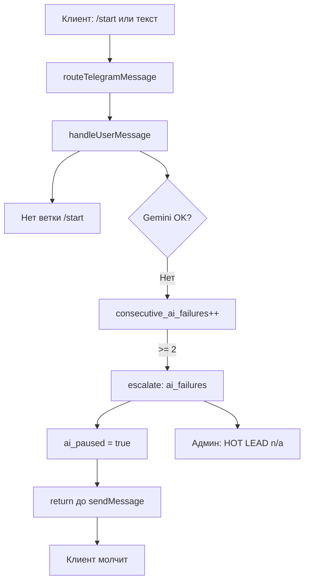
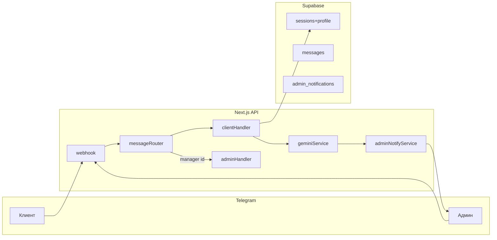

# NeoCar Bot v2 — план реализации

## Анализ предыдущего диагноза (подтверждён кодом)

Диагноз **корректен**. Цепочка сбоя на скриншотах:

Ключевые места в коде:
- Нет `/start`: [`handleUserMessage`](c:\Users\Asus\.cursor\AiManager-project\src\lib\conversation-service.ts) обрабатывает любой текст одинаково.
- При `ai_failures >= 2` — пауза и выход: [`escalation.ts`](c:\Users\Asus\.cursor\AiManager-project\src\lib\escalation.ts) + строки 311–355 в `conversation-service.ts`.
- При ошибке Gemini — `return` без ответа клиенту: строки 365–374.
- Админ-команды для всех: [`setBotCommands`](c:\Users\Asus\.cursor\AiManager-project\src\lib\telegram.ts) без `BotCommandScope`.
- Name без @username: [`notifyManager`](c:\Users\Asus\.cursor\AiManager-project\src\lib\conversation-service.ts) использует только `contact_name`.

**Инфраструктура:** production на https://neo-car-ai-manager.vercel.app, Supabase OK, webhook/setup уже настроены. Проблема — **логика и UX**, не деплой.

---

## Соответствие вашему запросу (аудит требований)

| Требование | v1.0 | v2 (цель) |
|------------|------|-----------|
| Приветствие на `/start` | Нет | Мгновенное + 3 языка (RU/RO/EN) |
| Ответы на каждое сообщение | Ломается при сбое AI | Всегда fallback + Gemini |
| Админ-меню только для `MANAGER_TELEGRAM_ID` | Нет | `setMyCommands` + scope |
| Клиентское меню `/` | Нет | `/help`, `/menu`, `/language`, `/contact` |
| Повторный `/start` + картинка | Нет | Навигация + `welcome-menu.png` |
| Username в Name | Нет | `@username` + имя |
| Цель в алерте | После 2 msg | После каждого extract (Gemini JSON) |
| 5 стадий интереса + картинки | Нет | `interest_stage` + `sendPhoto` |
| Тихие / громкие push | Нет | `disable_notification` по стадии |
| Reply-to, сводки, без спама | Нет | Digest + reply на сообщения |
| Проактив cold-клиенту | Нет | Cron + шаблоны |
| Память клиента | Только messages | `client_profile` jsonb + transcript |

**Языки UI:** Русский / Română / English (сохраняем в БД; AI остаётся мультиязычным).

**Стадии интереса:** `cold` → `curious` → `warm` → `hot` → `ready_to_buy`.

**Ассеты:** сначала **placeholder PNG** в `public/bot-assets/`; вы замените файлы с теми же именами.

---

## Куда вставлять свои изображения (кратко)

Замените файлы **с тем же именем** в папке проекта — redeploy на Vercel не обязателен для статики в `public/` (достаточно нового deploy или cache-bust).

| Файл | Назначение | Кто видит |
|------|------------|-----------|
| [`public/bot-assets/onboarding/welcome-menu.png`](c:\Users\Asus\.cursor\AiManager-project\public\bot-assets\onboarding\welcome-menu.png) | Повторный `/start` — меню с кнопками | Клиент |
| [`public/bot-assets/interest/cold.png`](c:\Users\Asus\.cursor\AiManager-project\public\bot-assets\interest\cold.png) | Холодный лид | Админ (тихо) |
| `curious.png` | Любопытство | Админ (тихо) |
| `warm.png` | Тёплый интерес | Админ (тихо) |
| `hot.png` | Горячий | Админ (со звуком) |
| `ready_to_buy.png` | Готов к сделке | Админ (со звуком) |

Маппинг в коде: [`config/interest-assets.json`](c:\Users\Asus\.cursor\AiManager-project\config\interest-assets.json) (создать) — путь к файлу и `silent: true/false`.

Видео/аудио (опционально позже): `public/bot-assets/media/`.

---

## Архитектура v2

Рефакторинг: разбить монолит [`conversation-service.ts`](c:\Users\Asus\.cursor\AiManager-project\src\lib\conversation-service.ts) на модули (`client-handler`, `admin-handler`, `onboarding`, `interest`, `callbacks`).

---

## Фазы реализации

### Фаза 0 — Срочно: бот снова отвечает (блокер)

**Цель:** клиент всегда получает текст; админ не получает ложный HOT LEAD при сбое AI.

1. **Gemini:** `GEMINI_MODEL` в env (default `gemini-2.0-flash`); логировать ошибку в Vercel.
2. **Fallback клиенту** при ошибке API: нейтральное сообщение NeoCar на языке UI сессии.
3. **Эскалация:** `ai_failures` **не** ставит `ai_paused` и **не** шлёт HOT LEAD; отдельный тип `TECH_ALERT` админу (тихо, раз в N часов).
4. **HOT LEAD** только при: score >= 7, keyword, manager_request, after_hours (без ai_failures).
5. **Миграция Supabase** [`002_bot_v2.sql`](c:\Users\Asus\.cursor\AiManager-project\supabase\migrations\002_bot_v2.sql): новые поля (см. фаза 4).
6. Deploy + smoke: клиент пишет → ответ в течение секунд.

### Фаза 1 — Онбординг и разделение ролей

**Клиент `/start` (первый раз):**
- Приветствие NeoCar (тексты в [`config/copy/`](c:\Users\Asus\.cursor\AiManager-project\config\copy\) по `ui_language`).
- Inline keyboard: `RU` | `RO` | `EN` → callback `lang:ru|ro|en`.
- Сохранить `ui_language`, `onboarding_done = true`.

**Клиент `/start` (повторно):**
- `sendPhoto` + caption + inline keyboard:
  - Консультация | Аренда | Сервис | Запчасти | Связаться с менеджером
- Callbacks ведут в сценарии (подставляют контекст в следующий промпт AI).

**Команды Menu (scope default — все клиенты):**
- `/help`, `/menu`, `/language`, `/contact`

**Админ (scope chat — только `MANAGER_TELEGRAM_ID`):**
- `/leads`, `/hot`, `/reply`, `/pause`, `/resume`, `/stats`, `/digest`
- Перерегистрация в [`setup/route.ts`](c:\Users\Asus\.cursor\AiManager-project\src\app\api\telegram\setup\route.ts): два вызова `setMyCommands` с разными scope.

**Callback router:** новый [`src/lib/telegram-callbacks.ts`](c:\Users\Asus\.cursor\AiManager-project\src\lib\telegram-callbacks.ts); webhook обрабатывает `callback_query` и `message`.

### Фаза 2 — Интерес, алерты админу, цель

1. После **каждого** сообщения клиента — `extractClientInsight` (Gemini JSON): `goals[]`, `interest_stage`, `summary_line`.
2. Обновить `sessions.client_profile`, `interest_stage`, `detected_goals`.
3. **notifyAdmin** по правилам:
   - `cold/curious/warm` → digest или тихое уведомление (`disable_notification: true`) + картинка стадии.
   - `hot/ready_to_buy` → звук + картинка + reply_to на последнее сообщение клиента (если есть `message_id` в БД).
4. Формат алерта: Name = `@username` + display name; Цель = из extract; Стадия = human label; Score если есть.
5. Анти-спам: не чаще 1 push / 15 мин на сессию для cold/warm; hot — сразу.

### Фаза 3 — Память и проактив

1. `client_profile` jsonb: техника, бренд, срочность, предпочтения, последняя цель.
2. Промпт AI: блок «Память о клиенте» + transcript.
3. Cron (daily на Hobby): [`/api/cron/client-nudges`](c:\Users\Asus\.cursor\AiManager-project\src\app\api\cron\client-nudges\route.ts) — cold без ответа 24h → «Что-то подсказать?» (шаблон по языку).
4. Cron admin digest: сводка лидов за день (одно сообщение вместо десятков).

### Фаза 4 — БД, ассеты, конфиг

**Миграция `002_bot_v2.sql`:**
- `ui_language` text default 'ru'
- `onboarding_done` boolean default false
- `interest_stage` text default 'cold'
- `telegram_username` text
- `client_profile` jsonb default '{}'
- `last_admin_notify_at`, `last_client_nudge_at` timestamptz
- `last_client_message_id` bigint (для reply)
- Таблица `admin_notifications` (optional audit)

**Файлы:**
- `public/bot-assets/**` — placeholder PNG (простые цветные карточки + подпись стадии)
- [`config/interest-assets.json`](c:\Users\Asus\.cursor\AiManager-project\config\interest-assets.json)
- [`config/client-menu.json`](c:\Users\Asus\.cursor\AiManager-project\config\client-menu.json) — кнопки повторного /start
- [`config/copy/*.json`](c:\Users\Asus\.cursor\AiManager-project\config\copy\) — RU/RO/EN тексты

**Env (добавить в `.env.example`):**
- `GEMINI_MODEL=gemini-2.0-flash`
- `APP_PUBLIC_URL` (alias для NEXT_PUBLIC_APP_URL)

### Фаза 5 — Тест и Deployed Successful

| # | Проверка |
|---|----------|
| 1 | Клиент `/start` → приветствие + 3 языка |
| 2 | Выбор RU → ответ на вопрос по погрузчикам |
| 3 | Клиент Menu — только клиентские команды |
| 4 | Админ Menu — только админские |
| 5 | Повторный `/start` → фото + 5 кнопок |
| 6 | Админ: cold = тихо + картинка; hot = звук |
| 7 | Name содержит @username |
| 8 | Цель заполняется после 1–2 сообщений |
| 9 | Нет HOT LEAD при падении Gemini |
| 10 | `npm run build` + Vercel deploy |

---

## Параллельная работа (после подтверждения плана)

| Subagent / поток | Задача |
|------------------|--------|
| Agent core | Фаза 0 + webhook callbacks |
| Agent UX | Фаза 1 copy + placeholders |
| Agent admin | Фаза 2 notify + interest |
| Debug | Build, lint, Vercel logs, E2E checklist |

MCP: Vercel (deploy/logs), Supabase (migration) по необходимости.

---

## Ограничения (честно)

- **Vercel Hobby cron** — только 1 раз/день на job; client nudges и digest — daily, не hourly (как сейчас в [`vercel.json`](c:\Users\Asus\.cursor\AiManager-project\vercel.json)).
- **Reply-to в Telegram** — нужно хранить `message_id` входящих сообщений.
- **Полный «идеал»** из одного промпта — 2–3 итерации deploy; фазы 0–2 дают рабочий бот для клиентов.

---

## После подтверждения плана

Переключение в **Agent mode** → выполнение **Фаза 0 → 1 → 2** подряд → deploy → блок «Напоминание» (webhook, setup, тест бота).

**Команда для старта:** `Выполни NeoCar Bot v2 — фазы 0-2`
