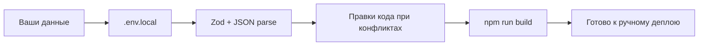

# План: ваши данные → автонастройка → проверка → коммит

## Что уже есть в репозитории

Код OMNI-COMM v1.0 уже реализован: Telegram webhook, Gemini, квалификация, эскалация, CRM (Bitrix/Amo webhook), cron, команды менеджера. Схема env зафиксирована в [`src/env.ts`](c:\Users\Asus\.cursor\AiManager-project\src\env.ts), шаблон — [`.env.example`](c:\Users\Asus\.cursor\AiManager-project\.env.example). Файлы `.env*` в [`.gitignore`](c:\Users\Asus\.cursor\AiManager-project\.gitignore) — **секреты в git не попадут**.

---

## Что прислать в следующем сообщении (одним блоком)

Скопируйте шаблон ниже и заполните. **Используйте новые ключи**, если старые светились в чате.

```text
# === ОБЯЗАТЕЛЬНО ===
CLIENT_NAME=
TELEGRAM_BOT_TOKEN=          # @BotFather → API Token
TELEGRAM_BOT_USERNAME=       # username бота без @ (опционально, но желательно)
GOOGLE_GEMINI_API_KEY=       # Google AI Studio → API key
CRM_TYPE=bitrix24            # или amocrm
CRM_WEBHOOK_URL=             # Bitrix: .../rest/1/СЕКРЕТ/ ; Amo: URL вашего webhook-приёмника
MANAGER_TELEGRAM_ID=         # @userinfobot или getUpdates — числовой id
AI_AGENT_NAME=
AI_SYSTEM_PROMPT=            # многострочный текст — в кавычках или отдельным блоком
FAQ_TEXT=                    # JSON одной строкой (как в CONFIG TABLE)
WORKING_HOURS=09:00-20:00
LANGUAGE=auto
ESCALATION_KEYWORDS=         # JSON одной строкой
SUPABASE_URL=                # Supabase → Project Settings → API → Project URL
SUPABASE_SERVICE_ROLE_KEY=   # service_role (не anon!)

# === ДЛЯ ПРОДА / CRON (желательно сразу) ===
NEXT_PUBLIC_APP_URL=         # https://ваш-проект.vercel.app (или ngrok при локальном тесте)
CRON_SECRET=                 # любая длинная случайная строка (вы придумываете)
TELEGRAM_WEBHOOK_SECRET=     # опционально: та же или другая случайная строка
BUSINESS_TIMEZONE=Europe/Chisinau
AFTER_HOURS_MESSAGE=         # опционально; если пусто — дефолт из кода

# === УТОЧНЕНИЯ ДЛЯ АГЕНТА (не в .env) ===
SUPABASE_MIGRATION_DONE=yes|no   # выполняли ли SQL из supabase/migrations/001_omni_comm.sql
DEPLOY_TARGET=vercel|local-only    # куда ориентируемся после настройки
ALLOW_COMMIT=yes                   # подтверждение коммита без push
```

### Откуда кратко брать каждое значение

| Поле | Где взять |
|------|-----------|
| Telegram token / username | [@BotFather](https://t.me/BotFather) |
| Manager Telegram ID | [@userinfobot](https://t.me/userinfobot) или лог `from.id` в getUpdates |
| Gemini key | [Google AI Studio](https://aistudio.google.com/apikey) |
| Bitrix webhook | Bitrix24 → Приложения → Вебхуки → входящий → URL `.../rest/1/.../` |
| Supabase | Dashboard → Project Settings → API |
| FAQ / ESCALATION | ваш CONFIG TABLE (валидный JSON) |
| CRON / WEBHOOK secret | сгенерировать: `openssl rand -hex 32` или любой генератор |

**Не присылайте** пароли от аккаунтов — только API-ключи и URL из таблицы.

---

## Что сделает агент после вашего сообщения (фаза 1 — Agent)



1. **Создать** [`c:\Users\Asus\.cursor\AiManager-project\.env.local`](c:\Users\Asus\.cursor\AiManager-project\.env.local) — все переменные из списка; многострочный `AI_SYSTEM_PROMPT` и JSON экранировать корректно.
2. **Проверить** парсинг `FAQ_TEXT` и `ESCALATION_KEYWORDS` (как в [`src/lib/config-json.ts`](c:\Users\Asus\.cursor\AiManager-project\src\lib\config-json.ts)).
3. **Согласовать** опциональные поля: если нет `NEXT_PUBLIC_APP_URL` — предупредить; для cron в проде он нужен.
4. **Доработать код**, если найдутся конфликты: неверный формат часов, дубли CRM-push, cron auth под Vercel, модель Gemini, join-запросы Supabase.
5. **Не коммитить** `.env.local` (уже в gitignore).

Если `SUPABASE_MIGRATION_DONE=no` — агент напомнит выполнить SQL из [`supabase/migrations/001_omni_comm.sql`](c:\Users\Asus\.cursor\AiManager-project\supabase\migrations\001_omni_comm.sql) в Supabase SQL Editor (автоматически без вашего access token агент в облачный Supabase не зайдёт).

---

## Фаза 2 — Debug (тотальная проверка без деплоя)

Агент перейдёт в режим отладки и прогонит:

| Проверка | Действие |
|----------|----------|
| TypeScript / сборка | `npm run build` |
| Линтер | `npm run lint` (если есть ошибки — исправить по делу) |
| Env | загрузка через `getEnv()`, нет хардкода секретов в `src/` |
| Логика WF1–WF8 | просмотр [`conversation-service.ts`](c:\Users\Asus\.cursor\AiManager-project\src\lib\conversation-service.ts), escalation, working hours, CRM switch |
| API routes | webhook, setup, cron + [`vercel.json`](c:\Users\Asus\.cursor\AiManager-project\vercel.json) |
| Безопасность | `.env*` не в индексе git; service_role только на сервере |

**Ограничение:** полный E2E в Telegram/Bitrix/Gemini без вашего деплоя и webhook агент не завершит — только статическая проверка + build. После деплоя вы один раз прогоните тест-сценарий из плана (3 сообщения + `/reply`).

---

## Фаза 3 — Agent: коммит без push

При `ALLOW_COMMIT=yes`:

1. `git status` / `git diff` — только осмысленные изменения кода (не `.env.local`).
2. Один коммит с сообщением в духе: `chore: finalize OMNI-COMM v1.0 config and deployment readiness`.
3. **Без** `git push` (как вы просили).
4. Сообщение вам: **«Проект готов к деплою»** + короткий чеклист того, что остаётся **только у вас вручную** (см. ниже).

---

## Что останется у вас после коммита (агент не сделает без облака)

Эти шаги **не входят** в автокоммит, но нужны для реальной работы бота:

1. **Vercel** — импорт репо, те же env-переменные, что в `.env.local` (кроме локальных-only).
2. **Supabase** — миграция SQL, если ещё не сделана.
3. **Telegram** — `setWebhook` на `https://<домен>/api/telegram/webhook` (+ `secret_token` = `TELEGRAM_WEBHOOK_SECRET`, если задан).
4. **Один раз** — `POST /api/telegram/setup` с заголовком `x-setup-secret: <CRON_SECRET>`.
5. **Vercel Cron** — Authorization `Bearer <CRON_SECRET>` для `/api/cron/*`.
6. **Проверка в Telegram** — сценарий из плана (консультация → 2-е сообщение → «встретиться» → алерт → `/reply` → сделка в Bitrix).

---

## Как будет работать система (для ориентира)

- **Где работает:** облако (Vercel) + Supabase + внешние API (Telegram, Gemini, Bitrix).
- **Интерфейс клиента:** чат в Telegram с ботом.
- **Интерфейс менеджера:** Telegram-команды `/leads`, `/hot`, `/reply`, `/pause`, `/resume`, `/stats`.
- **Сайт `/`:** только справочная страница; основная логика — API.

---

## Как запустить у себя после настройки

**Локально:** `npm install` → `npm run dev` → для Telegram нужен HTTPS-туннель на `/api/telegram/webhook`.

**Прод:** деплой на Vercel; процесс всегда «включён» на стороне хостинга, отдельно `npm start` не нужен.

---

## Как начать следующий шаг

В **следующем сообщении** вставьте заполненный блок «Что прислать» (можно без `ALLOW_COMMIT`, тогда спросим подтверждение перед коммитом). Напишите явно: **«Выполни план handoff»** или **«Переходи в agent»** — тогда агент выполнит фазы 1–3 по этому документу.
