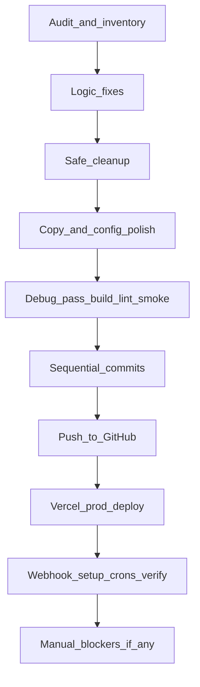

# NeoCar — полный аудит, исправления и доводка до production

## Текущее состояние (baseline)

- **Код v2** разбит на модули ([`client-handler.ts`](c:\Users\Asus\.cursor\AiManager-project\src\lib\client-handler.ts), [`admin-handler.ts`](c:\Users\Asus\.cursor\AiManager-project\src\lib\admin-handler.ts), [`admin-notify.ts`](c:\Users\Asus\.cursor\AiManager-project\src\lib\admin-notify.ts), [`onboarding.ts`](c:\Users\Asus\.cursor\AiManager-project\src\lib\onboarding.ts), [`telegram-callbacks.ts`](c:\Users\Asus\.cursor\AiManager-project\src\lib\telegram-callbacks.ts)); [`conversation-service.ts`](c:\Users\Asus\.cursor\AiManager-project\src\lib\conversation-service.ts) — тонкий роутер (~17 строк), не монолит.
- **Git:** много незакоммиченных изменений на `master` (v2 + ассеты в [`public/bot-assets/`](c:\Users\Asus\.cursor\AiManager-project\public\bot-assets)); remote: `https://github.com/ArtyCry12/NeoCar-AI-Manager.git`.
- **Production:** https://neo-car-ai-manager.vercel.app (деплой был, но репозиторий отстаёт от локального кода).
- **Риск №1:** миграция [`002_bot_v2.sql`](c:\Users\Asus\.cursor\AiManager-project\supabase\migrations\002_bot_v2.sql) может быть **не применена** в Supabase — без неё бот падает на полях `onboarding_done`, `interest_stage`, и т.д.

---

## Фаза 1 — Аудит структуры и логики (read-only, затем правки)

### 1.1 Карта зависимостей и «что трогать / что не трогать»

| Сохранить | Можно упростить/объединить |
|-----------|---------------------------|
| `client-handler`, `admin-handler`, `session-repo`, `gemini`, `escalation` | `conversation-service` → переименовать в `message-router.ts` или оставить как facade (не удалять роутинг) |
| `config/copy/*`, `interest-assets.json`, `client-menu.json` | Дублирование digest: вынести общий `buildDailyDigest()` в `src/lib/digest.ts` |
| `public/bot-assets/**` (реальные PNG пользователя) | Placeholder-скрипт оставить, не перезаписывать ассеты при deploy |
| CRM (`src/lib/crm/*`), cron followups/queue-flush | `resetEnvCache`, неиспользуемый `TechAlertReason` — удалить |
| `supabase/migrations/001` + `002` | `assets/c__Users_*` в workspace — удалить после копирования (мусор Cursor) |

### 1.2 Критические логические конфликты (обязательно исправить)

**A. Дублирование HOT LEAD**

[`runBusinessEscalation`](c:\Users\Asus\.cursor\AiManager-project\src\lib\client-handler.ts) вызывается **дважды** (строки ~319 и ~385). `ensureEscalation` не блокирует повторный `notifyHotLead` — админ может получить 2 одинаковых алерта за одно сообщение.

**Исправление:**
- Вернуть из `ensureEscalation` флаг `created: boolean` (новая эскалация vs уже открытая).
- Вызывать `notifyHotLead` **только если** `created === true` **или** причины изменились (опционально: `last_hot_notify_at` на сессии).
- Убрать второй вызов `runBusinessEscalation` после AI **или** заменить на «post-qualification only» (только если `lead_score` вырос после `runQualification` в этом же turn).

**B. After-hours + AI одновременно**

После `queued_leads` (строки 301–317) поток **не прерывается** — клиент получает и after-hours текст, и ответ Gemini.

**Исправление (по плану v2):**
- После after-hours: `return` без AI **или** только fallback без Gemini.
- HOT LEAD по `after_hours` — без `ai_paused` (уже так), но без дублирующего AI-ответа.

**C. `reply_to_message_id` в чате админа**

[`admin-notify.ts`](c:\Users\Asus\.cursor\AiManager-project\src\lib\admin-notify.ts) ~101: `last_client_message_id` — ID сообщения **в чате клиента**, не в чате менеджера. Telegram может игнорировать/ошибаться.

**Исправление:** убрать `reply_to_message_id` для admin `sendPhoto`/`sendMessage` (оставить только caption + link).

**D. `AI_CANNOT_ANSWER` = tech failure**

Сейчас инкрементирует `consecutive_ai_failures` как API-сбой → ложный TECH_ALERT.

**Исправление:** отдельная ветка — не увеличивать `consecutive_ai_failures` для `AI_CANNOT_ANSWER`; опционально мягкая эскалация keyword-only без tech alert.

**E. Onboarding gate**

`!onboarding_done` в `handleClientUserText` снова шлёт first-start — ок; убедиться, что `/start` и `lang:*` согласованы (callback уже ставит `onboarding_done`).

### 1.3 Несочетаемости env / скриптов

| Проблема | Действие |
|----------|----------|
| `check-supabase.mjs` не проверяет колонки v2 | Добавить `select` по `onboarding_done`, `interest_stage`; проверка таблицы `admin_notifications` |
| `apply-migration-002.mjs` требует `pg`, не в dependencies | Либо `npm i -D pg`, либо только SQL Editor + чёткая инструкция в README |
| `GEMINI_MODEL`, `APP_PUBLIC_URL` не в `generate-env-local.mjs` | Добавить в генератор и `.env.example` |
| `validate-env.mjs` не проверяет `CRON_SECRET` для prod | Предупреждение при `NODE_ENV=production` |

### 1.4 Тексты (RU/RO/EN)

Пройти [`config/copy/ru.json`](c:\Users\Asus\.cursor\AiManager-project\config\copy\ru.json), `ro.json`, `en.json`:
- единый тон NeoCar, без дублей с `AFTER_HOURS_MESSAGE` в env;
- проверить ключи меню vs [`client-menu.json`](c:\Users\Asus\.cursor\AiManager-project\config\client-menu.json);
- labels в [`interest-assets.json`](c:\Users\Asus\.cursor\AiManager-project\config\interest-assets.json) совпадают с текстом на картинках (Холодный / Заинтересованный / Тёплый-Средний / Горячий / Готовый 100%).

---

## Фаза 2 — Безопасная уборка (без поломки архитектуры)

**Удалить / не коммитить:**
- `assets/c__Users_*` (временные копии из Cursor workspace) — только если файлы уже скопированы в `public/bot-assets/`.
- Дублирующий `.vercel` в `.gitignore` (строка 44).
- Неиспользуемые экспорты: `resetEnvCache`, `TechAlertReason`, deprecated `setBotCommands` → оставить thin wrapper или удалить с обновлением imports.

**Не удалять:**
- `admin_notifications` (audit trail), `start_count` (можно использовать позже), CRM, все cron routes.
- Старые cron `followups` / `queue-flush` — они нужны для v1 flows.

**Рефакторинг (опционально, малый):**
- Общий модуль `src/lib/digest.ts` для `/digest` и cron `admin-digest`.
- Webhook: импорт `routeTelegramMessage` напрямую из router-файла.

---

## Фаза 3 — Debug-режим: полная проверка кода

После подтверждения плана — **переключение в Debug/Agent** и автоматический прогон:

1. `npm run env:validate`
2. `npm run check:supabase` (расширенный)
3. `npm run lint`
4. `npm run build`
5. Локальный smoke (node scripts):
   - `node scripts/telegram-setup.mjs`
   - ручной POST webhook test (mock update) — опционально
6. Проверка URL ассетов: `{APP_PUBLIC_URL}/bot-assets/interest/cold.png` → HTTP 200
7. Vercel logs после deploy — ошибки Gemini / Supabase column missing

**Чеклист E2E из плана v2** (10 пунктов) — прогнать в Telegram с тестовым клиентом и админом `MANAGER_TELEGRAM_ID`.

---

## Фаза 4 — Supabase и инфраструктура (до push)

1. **Применить** [`002_bot_v2.sql`](c:\Users\Asus\.cursor\AiManager-project\supabase\migrations\002_bot_v2.sql) в Supabase SQL Editor (если `check:supabase` v2 падает).
2. Убедиться на Vercel: `GEMINI_MODEL`, `NEXT_PUBLIC_APP_URL` / `APP_PUBLIC_URL`, `CRON_SECRET`, `TELEGRAM_WEBHOOK_SECRET`, все ключи из `.env.local` (`node scripts/sync-vercel-env.mjs` уже выполнялся — пересинк после правок).
3. **Cron Hobby:** 4 job в [`vercel.json`](c:\Users\Asus\.cursor\AiManager-project\vercel.json) — разное время (7:00, 7:15, 7:30, 7:45 UTC); при ошибке лимита Vercel — объединить nudges+digest в один route.

---

## Фаза 5 — Поочерёдные коммиты и push

Логическая цепочка (6 коммитов, сообщения на английском в стиле репо):

| # | Commit | Содержимое |
|---|--------|------------|
| 1 | `feat(bot): add v2 session schema and migration 002` | `supabase/migrations/002_bot_v2.sql` |
| 2 | `feat(bot): modular handlers, onboarding, interest notify` | `src/lib/*`, webhook, setup, types |
| 3 | `feat(bot): config copy, menus, interest assets mapping` | `config/**` |
| 4 | `feat(bot): add bot-assets images for onboarding and stages` | `public/bot-assets/**` |
| 5 | `fix(bot): dedupe escalation, after-hours flow, admin notify` | правки логики фазы 1.2 |
| 6 | `chore: scripts, env example, supabase check, vercel crons` | `scripts/*`, `.env.example`, `package.json`, `vercel.json` |

Затем: `git push origin master` (без force).

**Не коммитить:** `.env.local`, секреты, `.vercel`, мусор `assets/c__Users_*`.

---

## Фаза 6 — Deploy и автозапуск процессов

1. `npx vercel deploy --prod --yes`
2. `node scripts/telegram-setup.mjs` — client + admin commands
3. Webhook (если не менялся URL):
   - `setWebhook` → `https://neo-car-ai-manager.vercel.app/api/telegram/webhook` + secret header
4. Smoke production: клиент `/start` → язык → вопрос; админ не видит `/leads` в клиентском чате
5. Опционально: trigger cron с `Authorization: Bearer $CRON_SECRET` для digest (проверка 200)

---

## Что потребует вашего участия (если автоматика не сработает)

Краткий список для финального отчёта агента:

1. **Миграция 002** — если нет `SUPABASE_DB_URL` / доступа к SQL: вставить SQL вручную в Supabase Dashboard.
2. **Supabase service role / Gemini API key** — если ключи невалидны, бот ответит fallback, CRM не запишется.
3. **Vercel cron limits** — на Hobby возможен лимит числа cron jobs; сообщить, если deploy отклонит `vercel.json`.
4. **Права GitHub push** — если `git push` отклонён (auth), нужен токен/SSH у вас локально.
5. **Bitrix24 webhook** — CRM push тестируется только с реальным `CRM_WEBHOOK_URL`.

---

## Критерий «проект доведён до конца»

- `npm run build` и `lint` без ошибок
- `check:supabase` подтверждает v2 schema
- E2E 10/10 в Telegram
- GitHub `master` содержит v2 + ассеты
- Production deploy Ready, setup 200, клиент не молчит, нет ложного HOT LEAD на `ai_failures`
- Админ получает картинки стадий с корректными подписями и `@username`
