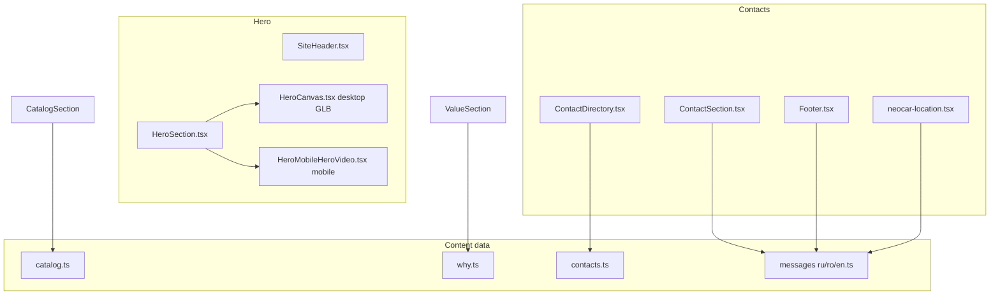

# План правок NEOCAR site

## Обзор архитектуры



---

## 1. Hero: дубль логотипа, интервал слайдов, desktop GLB

### Удалить центральную карточку NEOCAR
В [`web/components/hero/HeroSection.tsx`](web/components/hero/HeroSection.tsx) удалить блок **строки 65–78** (`absolute inset-x-0 top-5 …` с `neocar-logo-hero.png` и текстом NEOCAR). Это единственный источник дубля поверх hero.

### Интервал карусели текстов → 6000 ms
В том же файле изменить константу:

```ts
const CAROUSEL_MS = 6000; // было 4500
```

`HeroStageCopy` и тексты слайдов **не трогать**.

### Новая desktop-модель (mobile не трогать)
- Скопировать `Meshy_AI_Toyota_Forklift_0523121640_texture.glb` с рабочего стола/Downloads в **`web/public/models/Meshy_AI_Toyota_Forklift_0523121640_texture.glb`** (папку `public/models` создать при необходимости).
- Обновить дефолт desktop URL в [`web/components/hero/HeroCanvas.tsx`](web/components/hero/HeroCanvas.tsx):

```ts
const DESKTOP_HERO_GLB_URL =
  process.env.NEXT_PUBLIC_HERO_GLB_URL ??
  "/models/Meshy_AI_Toyota_Forklift_0523121640_texture.glb";
```

- Тот же путь в preload [`web/app/layout.tsx`](web/app/layout.tsx) (`<link rel="preload" …>`) и в [`web/components/hero/HeroMiniCanvas.tsx`](web/components/hero/HeroMiniCanvas.tsx) (плавающая мини-модель на desktop).
- **`MOBILE_HERO_GLB_URL`**, `HeroMobileHeroVideo`, ветку `isMobile ? … : HeroCanvas` в `HeroSection` — **без изменений**.
- После подключения проверить масштаб/позицию: при необходимости подкрутить только `DESKTOP_HERO_MODEL_TARGET` в `HeroCanvas.tsx` (сейчас `3.25`), не трогая mobile-константы.

---

## 2. Навбар: логотип по центру X, Y без изменений

Файл: [`web/components/layout/SiteHeader.tsx`](web/components/layout/SiteHeader.tsx).

Текущая разметка: `flex justify-between` — логотип слева, `LocaleSwitcher` справа.

**Подход:** трёхколоночная сетка на всю ширину шапки — логотип в средней колонке по центру viewport, переключатель языка справа, вертикальные отступы `py-3` сохранить:

```tsx
<div className="mx-auto grid max-w-6xl grid-cols-[1fr_auto_1fr] items-center px-4 py-3 md:px-8">
  <div aria-hidden />
  <Link href="/" className="flex items-center justify-center gap-2">…</Link>
  <div className="flex justify-end">
    <LocaleSwitcher />
  </div>
</div>
```

Логотип остаётся на той же высоте (`top-0` + `py-3`), смещается только по горизонтали.

---

## 3. «Почему выбирают» — сравнение и блок «Опыт»

Файл: [`web/components/sections/ValueSection.tsx`](web/components/sections/ValueSection.tsx).

- Удалить компонент `WhyComparisonMini` и сетку `lg:grid-cols-3` (**строки 8–38 и 58–77**).
- Сетку преимуществ (`whyRows`, `columns-1 sm:columns-2 lg:columns-3`) **не менять**.

Файл: [`web/content/why.ts`](web/content/why.ts) — только 5-я запись («Опыт»):

| locale | `advantage` | `description` |
|--------|-------------|---------------|
| ru | Опыт | Работаем в Молдове с 2004 года — более 22 лет истории! |
| ro | Experiență | Lucrăm în Moldova din 2004 — peste 22 de ani de istorie! |
| en | Experience | Operating in Moldova since 2004 — over 22 years of history! |

Рендер `{advantage} · {description}` даст строку как в ТЗ. При переполнении — слегка уменьшить `text-sm` / `leading` только для этого `<li>` (через условный класс по `r.advantage === "Опыт"` и аналогам RO/EN).

Неиспользуемые ключи `Why.v1Typical` … `Why.v3Us` в i18n можно оставить (не мешают) или удалить заодно — опционально.

---

## 4. Каталог техники — тексты и сетка

### Данные
Переписать [`web/content/catalog.ts`](web/content/catalog.ts) — **7 карточек**, порядок и RU-тексты строго по ТЗ:

| # | RU title | RU body (кратко) |
|---|----------|------------------|
| 1 | Вилочные погрузчики (Дизель / Бензин / Газ / Электро / бензин-газ) | …склад, производство и открытые площадки… |
| 2 | Ричтраки | …узкие проходы… |
| 3 | Гидротележки | …паллет внутри склада… |
| 4 | Штабелеры | …укладки грузов на стеллажи |
| 5 | Мини-погрузчики Bobcat | …строительства, благоустройства… |
| 6 | Телескопические погрузчики | …на высоте и в труднодоступных местах |
| 7 | Экскаваторы | …земляных и строительных работ. Аренда и продажа. |

Для **ro** и **en** — эквивалентные переводы (смысл 1:1, не дословный машинный RU).

Карточка 2 меняется с «Электро-погрузчики» на «Ричтраки» — это ожидаемое изменение по ТЗ.

### Центрирование «Экскаваторы» в 3-м ряду
В [`web/components/sections/CatalogSection.tsx`](web/components/sections/CatalogSection.tsx) при рендере последней карточки добавить `lg:col-start-2` (при `lg:grid-cols-3`). Стили карточки (`rounded-3xl`, градиент, border) не менять.

**Иконки:** в текущем `CatalogSection` иконок нет (только заголовок + текст). ТЗ «оставь или подбери» — **ничего не добавлять**, если в коде иконок нет (как на одном из скриншотов без emoji).

---

## 5. Глобально: телефон офиса → Facebook + TikTok; удалить info@neocar.md

### Константы (новый файл)
[`web/lib/social-links.ts`](web/lib/social-links.ts):

```ts
export const NEOCAR_FACEBOOK_URL = "https://www.facebook.com/neocarmd/";
export const NEOCAR_TIKTOK_URL =
  "https://www.tiktok.com/@neocar.md?_r=1&_t=ZS-96bMRf5cH03";
```

### i18n ([`web/messages/ru.ts`](web/messages/ru.ts), [`ro.ts`](web/messages/ro.ts), [`en.ts`](web/messages/en.ts))
- Удалить `Contact.phoneOffice` и `Contact.email`.
- Добавить `Contact.socialFacebook: "Facebook"` / `Contact.socialTikTok: "TikTok"` (и RO/EN аналоги).
- В `Privacy.sections` убрать упоминания `info@neocar.md` и `+373 22 479 545`; для контакта контролёра оставить адрес + мобильный `phoneMobile` (или формулировку «контакты на сайте»).
- Удалить/очистить `Location.globeHint`, `Location.backToGlobe`, `Location.openMapAria` (после удаления глобуса).

### UI-компоненты (единый паттерн ссылок как у `neocar.md` в ContactSection)

| Файл | Изменение |
|------|-----------|
| [`ContactSection.tsx`](web/components/sections/ContactSection.tsx) | Убрать `tel:phoneOffice` и `mailto:email`; вместо office — два `<a target="_blank" rel="noopener noreferrer" className="hover:text-white">` |
| [`Footer.tsx`](web/components/layout/Footer.tsx) | Убрать email `<li>`; вместо office phone — Facebook + TikTok |
| [`neocar-location.tsx`](web/components/ui/neocar-location.tsx) | В карточке под адресом: убрать `phoneOffice`, добавить соцссылки; mobile `phoneMobile` оставить |

### SEO / JSON-LD
- [`web/app/[locale]/page.tsx`](web/app/[locale]/page.tsx): в `organizationJsonLd.contactPoint` — `telephone: "+373-69-555-888"`, убрать `email`; добавить `sameAs` с Facebook/TikTok.
- [`web/lib/seo.ts`](web/lib/seo.ts): `telephone` → mobile; `sameAs` расширить соцсетями.

Других вхождений `479 545` / `info@neocar` в `web/` по обходу агента нет (кроме `design/` — эталоны, не прод).

---

## 6. Козмик Марин — email

[`web/content/contacts.ts`](web/content/contacts.ts) — для записи Marin во всех локалях:

```ts
email: "marin@neocar.md",
```

[`ContactDirectory.tsx`](web/components/contact/ContactDirectory.tsx) уже рендерит `person.email` с иконкой `Mail` — доп. правок UI не нужно.

---

## 7. Контакты: убрать глобус, сразу карта

Файл: [`web/components/ui/neocar-location.tsx`](web/components/ui/neocar-location.tsx).

- Удалить `useState(showMap)`, импорт `Globe`, слой с кнопкой/глобусом и `globeHint`, кнопку «Назад к глобусу».
- Оставить и показывать сразу блок с iframe + карточкой адреса + кнопками Google Maps / Маршрут (как на референс-скриншоте).
- Адрес: уже `Contact.address` = `str. Voluntarilor 3, MD-2037, Chișinău` — **соответствует ТЗ**.
- Координаты: сейчас `NEOCAR_COORDS = { lat: 47.0245, lng: 28.8325 }`. При реализации один раз открыть [`https://share.google/AX3KgTANwaOqRNPj4`](https://share.google/AX3KgTANwaOqRNPj4) и сверить lat/lng; при расхождении — обновить константу и `geo` в `seo.ts`.
- Embed URL оставить через `encodeURIComponent(tc("address"))` — поведение как сейчас после клика по глобусу.

`globe.tsx` можно не удалять из репо (мёртвый импорт исчезнет); опционально — удалить файл позже.

---

## Порядок реализации

1. Hero overlay + carousel interval + GLB (с копированием файла)
2. SiteHeader centering
3. ValueSection + why.ts
4. catalog.ts + CatalogSection centering
5. social-links + i18n + Contact/Footer/Location + SEO
6. contacts.ts (Marin email)
7. neocar-location refactor (map always visible)
8. Локальный прогон: `cd web && npm run build` (или dev) — desktop hero, контакты, футер, каталог

---

## Риски / проверки

| Риск | Митигация |
|------|-----------|
| GLB слишком большой / не в git | Копировать локально; при деплое на Vercel — убедиться, что файл в `public/models` |
| Новая модель «плывёт» по масштабу | Подкрутить `DESKTOP_HERO_MODEL_TARGET` только на desktop |
| Privacy без email | Юридический текст обновить на mobile/адрес без info@ |
| Share.google недоступен из CI | Координаты вручную при первом открытии ссылки |
