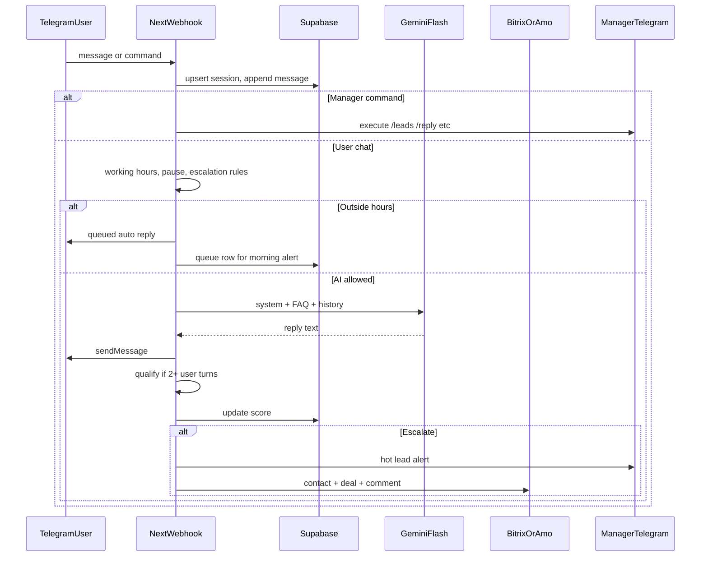

# OMNI-COMM TEST v1.0 — Next.js delivery plan

## Security first (non-negotiable)

You pasted **live secrets** in chat (Telegram bot token, Gemini API key, Bitrix webhook URL). Treat them as **compromised**: **revoke/rotate** the Telegram token, **regenerate** the Gemini key, and **reissue** the Bitrix inbound webhook in the Bitrix admin **before** any production deploy. The codebase will read **only** from environment variables; **never** commit `.env.local` or embed values in source.

---

## Why Supabase (recommended) despite “memory” in WF1

Vercel serverless instances are **stateless** and **ephemeral**. In-memory `Map` breaks across invocations, so WF6 (24h/48h), WF7 (queue until 09:00), WF8 (`/stats`, `/leads`), and reliable CRM pushes need **durable storage**. Your stack already includes Supabase — use it for `sessions`, `messages`, `leads`, `escalations`, and `manager_state` (pause flags). WF1’s “memory” is then implemented as **session rows** (logical in-memory model, physical Postgres).

---

## CONFIG TABLE → environment contract

Single source of truth: **all** runtime values from `process.env`, validated once at startup with **Zod** (fail fast on boot / first request).

| CONFIG key | Env var | Notes |
|------------|---------|--------|
| CLIENT_NAME | `CLIENT_NAME` | |
| TELEGRAM_BOT_TOKEN | `TELEGRAM_BOT_TOKEN` | |
| GOOGLE_GEMINI_API_KEY | `GOOGLE_GEMINI_API_KEY` | |
| CRM_TYPE | `CRM_TYPE` | enum: `bitrix24` \| `amocrm` |
| CRM_WEBHOOK_URL | `CRM_WEBHOOK_URL` | Bitrix: full `.../rest/1/SECRET/` base; Amo: document as **custom webhook receiver URL** you own, or extend schema later with dedicated Amo tokens |
| MANAGER_TELEGRAM_ID | `MANAGER_TELEGRAM_ID` | numeric string |
| AI_AGENT_NAME | `AI_AGENT_NAME` | metadata / logs |
| AI_SYSTEM_PROMPT | `AI_SYSTEM_PROMPT` | long string |
| FAQ_TEXT | `FAQ_TEXT` | **JSON string** (escaped in `.env`) — parse in loader |
| WORKING_HOURS | `WORKING_HOURS` | `HH:mm-HH:mm` |
| LANGUAGE | `LANGUAGE` | `auto` → instruct Gemini to mirror user language |
| ESCALATION_KEYWORDS | `ESCALATION_KEYWORDS` | JSON string → parsed triggers |

Add operational env vars not in your table but required for production:

- `TELEGRAM_WEBHOOK_SECRET` — optional path token for webhook URL hardening.
- `NEXT_PUBLIC_APP_URL` — canonical URL for Vercel + webhook registration.
- `CRON_SECRET` — Bearer for [`/api/cron/*`](c:/Users/Asus/.cursor/AiManager-project/src/app/api/cron/) routes (Vercel Cron sends this header).
- `TZ` or explicit `BUSINESS_TIMEZONE` (default **Europe/Chisinau** for NeoCar) — needed for WF7/WF4 “outside hours”.

Deliverables: [`.env.example`](c:/Users/Asus/.cursor/AiManager-project/.env.example) listing every variable **without secrets**, and [`src/env.ts`](c:/Users/Asus/.cursor/AiManager-project/src/env.ts) (or `src/lib/env.ts`) with Zod schema.

---

## High-level architecture

---

## Workflow mapping (implementation)

### WF1 — Telegram intake

- Route: [`src/app/api/telegram/webhook/route.ts`](c:/Users/Asus/.cursor/AiManager-project/src/app/api/telegram/webhook/route.ts) (POST).
- Verify update integrity (optional: secret path segment).
- Normalize `contact_id` = `chat.id`, `name` from `from.first_name` / username, `channel = telegram`, store `messages` row + touch `sessions`.

### WF2 — AI response (Gemini)

- Package: `@google/generative-ai`, model **`gemini-1.5-flash`** (or current stable alias if SDK names differ — pin in one module).
- Prompt assembly: `AI_SYSTEM_PROMPT` + serialized `FAQ_TEXT` + recent transcript (cap tokens).
- `LANGUAGE=auto`: instruction block “Respond in the same language as the latest user message.”
- Skip AI if session `ai_paused` (WF4/WF8) or if you choose to skip when manager has taken over.

### WF3 — Lead qualification (after 2+ exchanges)

- Trigger: **user message count ≥ 2** (aligns with your test: message 1 + message 2 enables qualification after second user turn; tune if you prefer “2 full rounds”).
- One Gemini call with **JSON schema / structured output** (or strict JSON-in-markdown) returning: `name`, `need`, `budget_signal`, `timeline`, `contact_method`, plus three integers 1–10: `need_clarity`, `urgency`, `engagement`.
- Score: `(need_clarity + urgency + engagement) / 3` → store on `leads` or `sessions`.

### WF4 — Escalation

Evaluate after each inbound user message (and after qualification updates score):

| Condition | Implementation |
|-----------|------------------|
| a) Score ≥ 7 | numeric compare |
| b) Keyword buckets | flatten `ESCALATION_KEYWORDS.escalation_triggers` → case-insensitive substring match on user text |
| c) “менеджер” / “звоните” | extra regex / literals |
| d) AI unable 2× | track `consecutive_ai_failures` when Gemini errors, empty reply, or model returns a sentinel phrase you define in prompt (“I cannot answer”) |
| e) Outside `WORKING_HOURS` | shared `isWithinWorkingHours(now)` helper |

Actions: set `ai_paused=true`, `sendMessage` to `MANAGER_TELEGRAM_ID` with score, name, need, **deep link** `https://t.me/<bot_username>?start=chat_<chatId>` (or store internal dashboard URL if you add one later), persist `escalations` row. “Wait for manager reply” = no auto-AI until `/resume` or manager sends a reply through `/reply` flow.

### WF5 — CRM push (dual)

- **bitrix24**: use `CRM_WEBHOOK_URL` as REST base — `crm.contact.add`, `crm.deal.add`, `crm.timeline.comment.add` (transcript), tags via `crm.deal.update` / UF fields as available on portal (document assumption: standard fields; adjust field map per portal).
- **amocrm**: first implementation — **POST JSON** to `CRM_WEBHOOK_URL` if it’s your own receiver; document that native Amo requires **subdomain + access token** (add env later). Keeps `CRM_TYPE` switch without lying about unsupported server-side OAuth in v1.

Trigger: on **qualification complete** (structured fields present) **and/or** on escalation (your spec says “qualification complete”; recommend **also** push on escalation** so WF8 test “Deal created” fires on hot path).

### WF6 — 24h follow-up

- [`src/app/api/cron/followups/route.ts`](c:/Users/Asus/.cursor/AiManager-project/src/app/api/cron/followups/route.ts) (GET) guarded by `CRON_SECRET`.
- Query `escalations` where `manager_last_reply_at` is null: if `now - escalated_at > 24h` → soft Telegram reminder to manager; if `> 48h` → `sendMessage` to user with your template + mark sent.

### WF7 — After-hours queue

- On inbound message: if outside hours → send auto-reply string (from constant next to CONFIG or env `AFTER_HOURS_MESSAGE`), insert `queued_lead` with `notify_at = next 09:00` in local TZ.
- Morning cron: process queue → manager alert “Queued overnight leads”.

### WF8 — Manager Telegram panel

Same webhook: if `from.id == MANAGER_TELEGRAM_ID`, parse commands:

| Command | Behavior |
|---------|----------|
| `/leads` | Aggregate today’s leads from DB |
| `/hot` | List score ≥ 7 with inline buttons or numbered list + `chat_id` hints |
| `/reply [name] [message]` | resolve name → latest matching session; `sendMessage` to that `chat_id` |
| `/pause [name]` / `/resume [name]` | toggle `ai_paused` |
| `/stats` | week aggregates: count leads, “converted” if you add `deal_won` flag later — v1 can stub **converted** as `crm_deal_id IS NOT NULL` or manual flag |

Use Telegram `setMyCommands` in a one-off bootstrap script or [`src/app/api/telegram/setup/route.ts`](c:/Users/Asus/.cursor/AiManager-project/src/app/api/telegram/setup/route.ts) (dev-only, protected).

---

## “Apply all installed plugins” (interpretation for this repo)

With your choice of **Next.js**, map “plugins” to **first-party integrations** you already use in Cursor stack, not every MCP server:

- **Vercel**: `vercel.json` cron entries for follow-ups + queue flush.
- **Supabase**: schema + RLS (service role from server only).
- Optional later: **Zapier** as external notifier — not required for v1.0 pass criteria.

---

## Key files to add (greenfield)

- [`package.json`](c:/Users/Asus/.cursor/AiManager-project/package.json) — Next 15+, React 19, `@google/generative-ai`, `@supabase/supabase-js`, `zod`.
- [`src/env.ts`](c:/Users/Asus/.cursor/AiManager-project/src/env.ts) — Zod-validated env.
- [`src/lib/telegram.ts`](c:/Users/Asus/.cursor/AiManager-project/src/lib/telegram.ts) — `sendMessage`, typing helpers.
- [`src/lib/gemini.ts`](c:/Users/Asus/.cursor/AiManager-project/src/lib/gemini.ts) — chat + qualification.
- [`src/lib/working-hours.ts`](c:/Users/Asus/.cursor/AiManager-project/src/lib/working-hours.ts) — parse `WORKING_HOURS` + TZ.
- [`src/lib/escalation.ts`](c:/Users/Asus/.cursor/AiManager-project/src/lib/escalation.ts) — keyword + composite rules.
- [`src/lib/crm/index.ts`](c:/Users/Asus/.cursor/AiManager-project/src/lib/crm/index.ts) — `CRM_TYPE` switch.
- [`supabase/migrations/001_omni_comm.sql`](c:/Users/Asus/.cursor/AiManager-project/supabase/migrations/001_omni_comm.sql) — tables + indexes.
- Webhook + cron routes under [`src/app/api/`](c:/Users/Asus/.cursor/AiManager-project/src/app/api/).

---

## TEST SCENARIO (manual acceptance)

Run through your scripted dialogue in Telegram staging bot:

1. User: “Нужна консультация” → expect WF1+WF2 log + reply.
2. Second user message → WF3 runs → score (e.g. 6) persisted.
3. User: “Когда можно встретиться?” → keyword + score path → WF4 alert to manager chat.
4. Manager `/reply ...` → user receives text (WF8 + WF4 handoff).
5. Confirm Bitrix contact/deal created (WF5) in Bitrix UI.
6. Simulate `escalated_at` in DB or temp clock override → cron dry-run for WF6.
7. Send message with clock mocked or real night window → WF7 auto-reply + queued row.
8. Manager `/leads`, `/hot`, `/stats` → WF8.

Record checklist results in your deployment ticket (no need for a new doc file unless you want one).

---

## SELF-CHECK / Definition of done

- All customer-specific strings and secrets from **env only** (Zod).
- Gemini integrated with **`gemini-1.5-flash`** + FAQ injection.
- `CRM_TYPE` branches implemented (Bitrix real; Amo stub/webhook POST documented).
- All 8 workflows have **code paths** + manual test notes above.
- Manager commands registered + parsed.
- Language auto via prompt.
- Scoring formula implemented exactly as `(a+b+c)/3`.
- Escalation: all five conditions wired (d) needs explicit failure semantics in prompt + code).
- Final status line you can paste: **`READY TO DEPLOY`** (after secrets rotated and webhook set on Vercel URL).

---

## Implementation order

1. `create-next-app` + TypeScript + Tailwind (App Router).
2. Supabase migration + typed DB access layer.
3. Env schema + `.env.example`.
4. Telegram webhook + `sendMessage` loopback test.
5. Gemini reply path (WF2).
6. Qualification + scoring (WF3).
7. Escalation + manager alerts (WF4).
8. CRM Bitrix adapter + Amo branch (WF5).
9. Cron routes for WF6 + WF7.
10. Manager commands (WF8) + `setMyCommands`.
11. Manual test scenario + fix gaps.
