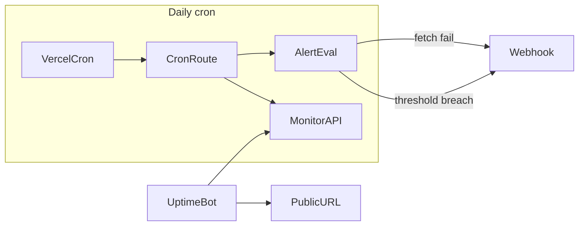

# Post-launch hardening checklist + alerts

## Контекст

- **Production:** [https://flash-tokens-trust-mainnet-20260528.vercel.app](https://flash-tokens-trust-mainnet-20260528.vercel.app)
- **Cron:** daily `0 0 * * *` → [`frontend/app/api/monitor/cron/route.ts`](frontend/app/api/monitor/cron/route.ts) (сейчас только fetch `/api/monitor`, без алертов)
- **Метрики:** [`frontend/app/api/monitor/route.ts`](frontend/app/api/monitor/route.ts) — `availableUsdt`, `contractInventoryUsdt`, `totalPurchases`, …
- **P0:** секреты (`VERCEL_TOKEN`, `ADMIN_PASSWORD`, `CRON_SECRET`, `ADMIN_SESSION_SECRET`) были в чате → **считать скомпрометированными**



---

## Deliverable 1: документ-чеклист

Создать [`docs/post-launch-hardening-checklist.md`](docs/post-launch-hardening-checklist.md) — **1 страница**, три блока с чекбоксами и командами проверки.

### A. Ротация токенов/паролей (P0, ~15 мин)

| Секрет | Где ротировать | После ротации |
|--------|----------------|---------------|
| `VERCEL_TOKEN` | Vercel → Account → Tokens (revoke старый) | Обновить локально + CI; **не** в `NEXT_PUBLIC_*` |
| `ADMIN_PASSWORD` | Vercel env Production | Перелогин в `/admin` |
| `CRON_SECRET` | Vercel env + [`frontend/vercel.json`](frontend/vercel.json) cron auth | Redeploy; проверить cron 401→200 |
| `ADMIN_SESSION_SECRET` | Vercel env | Invalidate admin sessions |
| `DEPLOYER_PRIVATE_KEY` | Только локально/Hardhat; **не** в Vercel frontend | Если светился — перевести hot wallet / ограничить баланс |

**Порядок:** сгенерировать новые значения → обновить Vercel Production env (`--value`, без trailing newline) → redeploy → revoke старые токены → smoke:

```powershell
curl -s -o NUL -w "%{http_code}" https://flash-tokens-trust-mainnet-20260528.vercel.app/
curl -s https://flash-tokens-trust-mainnet-20260528.vercel.app/api/monitor
curl -s -X POST https://.../api/admin/auth -H "Content-Type: application/json" -d "{\"login\":\"...\",\"password\":\"...\"}"
```

### B. Финальная проверка domain alias (~10 мин)

1. **Канонический URL:** задать `NEXT_PUBLIC_APP_URL` = финальный домен (сейчас cron берёт его для self-fetch — см. cron route).
2. **Vercel → Project → Settings → Domains:**
   - Primary: `flash-tokens-trust-mainnet-20260528.vercel.app` (или custom domain)
   - Если нужен старый alias `flash-tokens-trust.vercel.app` — **отвязать от чужого проекта** (Mercedes) и привязать к `flash-tokens-trust-mainnet-20260528`
3. **Deployment Protection:** Production → Off (или только Preview), иначе публичный 401.
4. **Проверки:**
   - `GET /` → 200, Trust Wallet connect
   - `GET /api/monitor` → 200, `chainId: 56`
   - `www` / apex redirect (если custom domain)
   - SSL valid

### C. Мониторинг и алерты (~15 мин)

**Встроенные (код):** см. Deliverable 2.

**Vercel (без кода):**
- Settings → Notifications: Failed Deployment, Deployment Promoted
- Logs → при cron error смотреть `[monitor-alert]` (после внедрения)

**Внешний uptime (рекомендуется, бесплатно):**
- UptimeRobot / Better Stack: ping `GET /` каждые 5 мин
- Второй monitor: `GET /api/monitor` — alert если не 200 или `contractInventoryUsdt < порог`

**On-chain ops (ручной чеклист, ссылка на [`docs/manual-trust-wallet-checklist.md`](docs/manual-trust-wallet-checklist.md)):**
- Inventory контракта пополнен (`depositTokens`)
- Owner wallet funded для `availableUsdt`
- Перед маркетингом: вернуть min purchase 500 (напоминание из [`docs/production-deploy-status.md`](docs/production-deploy-status.md))

---

## Deliverable 2: минимальные алерты в проекте

Без обязательного Resend/Slack SDK — **generic webhook** (Discord/Telegram Bot API/Slack incoming webhook / Zapier catch hook).

### Новые env (server-only)

Добавить в [`frontend/.env.example`](frontend/.env.example) и [`docs/production-secrets.template.txt`](docs/production-secrets.template.txt):

```
ALERT_WEBHOOK_URL=
ALERT_MIN_CONTRACT_INVENTORY=100
ALERT_MIN_OWNER_BALANCE=50
```

### Новый модуль

[`frontend/lib/monitor-alerts.ts`](frontend/lib/monitor-alerts.ts):

- `evaluateMonitorAlerts(payload)` → `{ alerts: Alert[] }` по порогам:
  - `contractInventoryUsdt < ALERT_MIN_CONTRACT_INVENTORY`
  - `availableUsdt < ALERT_MIN_OWNER_BALANCE`
- `sendAlertWebhook(alerts, context)` → `POST ALERT_WEBHOOK_URL` с JSON `{ severity, message, metrics, monitoredAt, appUrl }` (no-op если URL пуст)
- Fail-safe: ошибка webhook **не ломает** cron (log + continue)

### Расширить cron route

[`frontend/app/api/monitor/cron/route.ts`](frontend/app/api/monitor/cron/route.ts):

- После успешного fetch payload → `evaluateMonitorAlerts` → webhook при alerts
- При `!response.ok` или exception → webhook с `severity: critical` («monitor unreachable»)
- Response JSON: `{ ok, monitoredAt, payload, alertsSent: number }`

### Документация в чеклисте

Пример настройки Discord webhook + ручной smoke:

```powershell
curl -H "Authorization: Bearer $CRON_SECRET" https://.../api/monitor/cron
```

Ожидание: 200 + при низком inventory — сообщение в webhook.

---

## Файлы к изменению

| Файл | Действие |
|------|----------|
| [`docs/post-launch-hardening-checklist.md`](docs/post-launch-hardening-checklist.md) | **create** — короткий чеклист |
| [`frontend/lib/monitor-alerts.ts`](frontend/lib/monitor-alerts.ts) | **create** — пороги + webhook |
| [`frontend/app/api/monitor/cron/route.ts`](frontend/app/api/monitor/cron/route.ts) | **edit** — вызов алертов |
| [`frontend/.env.example`](frontend/.env.example) | **edit** — 3 env vars |
| [`docs/production-secrets.template.txt`](docs/production-secrets.template.txt) | **edit** — 3 env vars |

**Не трогаем:** контракты, UI, admin auth logic (кроме env docs).

---

## Verification (после implement)

1. Unit-style: локально mock payload → alerts массив корректен
2. Cron smoke с Bearer `CRON_SECRET`
3. Чеклист в docs — все пункты actionable, без секретов в git
