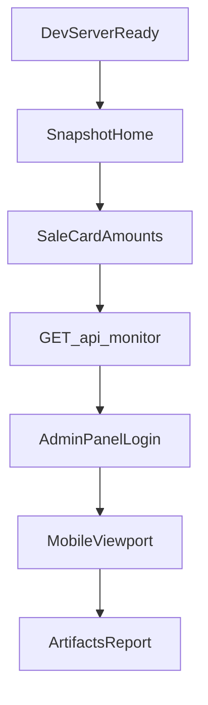
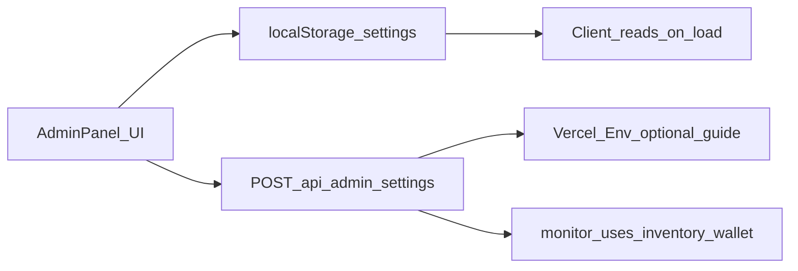

# Production audit, admin personalization, commits, mainnet + Vercel

## Допущения (вопросы пропущены — подтвердите в чате или вставкой в блок ниже)

| Тема | Допущение по умолчанию |
|------|------------------------|
| Сеть | **BSC Mainnet (56)** для финального релиза; testnet остаётся для отладки |
| Токен | У вас **уже есть BEP-20** — вы дадите `TOKEN_ADDRESS` + decimals |
| Available USDT | **Баланс кошелька-склада** = `owner()` TokenSale **или** отдельный адрес из админки (настраиваемо) |
| Min purchase (prod) | **500 tokens** в контракте + UI перед mainnet deploy |
| Коммиты | **Логические группы** (~15–25 коммитов), не 1 файл = 1 commit (слишком шумно); по запросу можно ужать до 1 release |
| Private key в UI | **Да, в админке** — хранение: `localStorage` (только браузер) + опционально копия в **Vercel env** через guided save; явное предупреждение о риске |
| Playwright | UI + `/api/monitor` локально и на **Vercel preview/prod**; on-chain tx — **полуавтомат** (вы подписываете в Trust) |
| Vercel | Новый или существующий project; домен `*.vercel.app` если не укажете свой |

---

## Блок для вставки (заполните перед стартом исполнения)

Скопируйте, заполните и отправьте **одним сообщением** (можно приложить скрины Trust/BscScan отдельно):

```txt
# === СЕТЬ И КОНТРАКТЫ (MAINNET) ===
BSC_MAINNET_RPC=https://bsc-dataseed.binance.org/
TOKEN_CONTRACT_ADDRESS=0x...
TOKEN_DECIMALS=18
TOKEN_SALE_CONTRACT_ADDRESS=   # пусто = задеплоим TokenSale
DEPLOYER_PRIVATE_KEY=0x...     # только для Hardhat deploy, НЕ коммитить

# === КОШЕЛЁК СКЛАДА / Available USDT ===
INVENTORY_WALLET_ADDRESS=0x... # если пусто — используем owner() sale-контракта

# === ПАРАМЕТРЫ ПРОДАЖИ ===
INITIAL_RATE_TOKENS_PER_BNB=1000000
MAX_TOKENS_PER_TX=1000000
MIN_TOKENS_PER_PURCHASE_PROD=500
DEPOSIT_AMOUNT_TOKENS=1000000   # сколько перевести на sale после deploy

# === FRONTEND / VERCEL ===
VERCEL_TOKEN=
VERCEL_ORG_ID=
VERCEL_PROJECT_ID=
NEXT_PUBLIC_APP_URL=https://your-app.vercel.app
CUSTOM_DOMAIN=                  # optional

# === МОНИТОРИНГ / CRON ===
BSC_MAINNET_RPC=                # same as above if one RPC
COINGECKO_API_KEY=              # optional
CRON_SECRET=                    # random string for /api/monitor/cron

# === АДМИН UI ===
ADMIN_LOGIN=
ADMIN_PASSWORD=

# === WALLETCONNECT (optional, Trust injected primary) ===
NEXT_PUBLIC_WALLET_CONNECT_PROJECT_ID=

# === ПРОЧЕЕ ===
BSCSCAN_API_KEY=                # verify contract
GITHUB_REPO_URL=                # if push needed
NOTES=                          # любые уточнения
```

Файлы/скрины: приложите к ответу изображения revert, tx hash, текущую админку — если есть проблемы.

---

## Фаза 0 — Playwright-аудит (постепенно, CLI-first)

Используем skill **playwright** (`$CODEX_HOME/skills/playwright/scripts/playwright_cli.sh` или расширение [`frontend/scripts/playwright-e2e-debug.mjs`](frontend/scripts/playwright-e2e-debug.mjs)).



**Шаги аудита (чеклист):**

1. **Smoke UI** — главная, поля 1 / 500 / 1000, «К оплате», BNB+USD, без `NaN%`.
2. **API** — `/api/monitor` 200, поля `availableUsdt`, `totalPurchases`, `bnbUsd`, адреса контрактов.
3. **Конфликты chain** — `NEXT_PUBLIC_CHAIN_ID` vs RPC в monitor (сейчас testnet-only RPC — **баг**).
4. **Admin** — логин, owner-only кнопки, personalization fields.
5. **Regression** — `hardhat test`, `npm run lint|test|build`.
6. **Артефакты** — `frontend/output/playwright/` (screenshots, JSON report, optional trace).

**Доработки скрипта:** добавить проверку monitor JSON, admin flow, error cases (0 tokens, below min), npm script `e2e:audit`.

---

## Фаза 1 — Найденные конфликты и исправления (до mainnet)

| # | Проблема | Файлы | Действие |
|---|----------|-------|----------|
| 1 | **Invalid `vercel.json`** — два JSON root | [`frontend/vercel.json`](frontend/vercel.json) | Объединить в один объект: `framework`, `buildCommand`, `crons` |
| 2 | Monitor RPC только testnet | [`frontend/app/api/monitor/route.ts`](frontend/app/api/monitor/route.ts) | `BSC_RPC` по `chainId` (97/56), `BSC_MAINNET_RPC` / `BSC_TESTNET_RPC` |
| 3 | Min purchase = 1 на prod | [`TokenSale.sol`](smart-contract/contracts/TokenSale.sol), constants, tests | `MIN = 500 ether` для prod deploy; testnet profile через env или отдельный deploy flag |
| 4 | Available: owner vs contract vs custom | monitor + TokenStats | Параметр `INVENTORY_WALLET_ADDRESS` / admin override; подпись в UI «склад продаж» |
| 5 | Admin не сохраняет настройки | [`AdminPanel.tsx`](frontend/components/AdminPanel.tsx) | Persist + apply (см. фаза 2) |
| 6 | Hardcoded admin password | AdminPanel + env | `ADMIN_LOGIN` / `ADMIN_PASSWORD` server-side check для sensitive API |
| 7 | Cron без auth | [`cron/route.ts`](frontend/app/api/monitor/cron/route.ts) | Header `Authorization: Bearer ${CRON_SECRET}` |
| 8 | `sync-frontend-env` затирает mainnet | [`scripts/sync-frontend-env.mjs`](scripts/sync-frontend-env.mjs) | Поддержка `deployed-contract.mainnet.json` или флаг `--network` |
| 9 | Dead hooks | `useTokenBalance`, `useContractBalance` | Удалить или подключить; в admin показать **оба**: склад + contract inventory |
| 10 | Progress bar misleading | [`TokenStats.tsx`](frontend/components/TokenStats.tsx) | Явные метрики: «на складе», «в контракте sale», «продано сегодня» |

---

## Фаза 2 — Админка: персонализация BSC / BEP-20 / Trust

Цель: менять **token address**, **sale address**, **inventory wallet**, **rate/max**, **private key** (для deploy/deposit скриптов) из UI.

**Архитектура (безопасный компромисс под ваш запрос «ключ в UI»):**



- **Вкладка «Персонализация»:** token, sale, inventory wallet, chainId, decimals, rate, max, deposit hint.
- **Private key:** поле в UI → `localStorage` (encrypted optional AES with user passphrase) + кнопка «Скопировать команду deploy»; **никогда** в git.
- **Server route** `POST /api/admin/settings` — только для **не-секретных** полей (addresses, chainId); секреты — инструкция `vercel env add`.
- **Кнопка «Применить»** — перезагрузка runtime config (context/provider), без rebuild где возможно.
- **Available USDT** — `balanceOf(inventoryWallet)`; если поле пустое → `sale.owner()`.

Файлы: [`AdminPanel.tsx`](frontend/components/AdminPanel.tsx), новый `frontend/lib/runtime-config.ts`, `frontend/app/api/admin/settings/route.ts`, обновить [`monitor/route.ts`](frontend/app/api/monitor/route.ts).

---

## Фаза 3 — Mainnet deploy (контракты)

**Порядок (Hardhat, [`smart-contract/scripts/deploy.ts`](smart-contract/scripts/deploy.ts)):**

1. `USE_MOCK_TOKEN=false`, `TOKEN_ADDRESS` = ваш BEP-20.
2. Deploy `TokenSale` на **bscMainnet** с `MIN_TOKENS = 500`.
3. `deposit.ts` — перевод токенов на sale contract.
4. Verify на BscScan (API v2 key).
5. Записать `deployed-contract.mainnet.json`.
6. `node scripts/sync-frontend-env.mjs --network mainnet`.

**Env frontend:** `NEXT_PUBLIC_CHAIN_ID=56`, `NEXT_PUBLIC_TOKEN_SALE_CONTRACT_MAINNET`, `NEXT_PUBLIC_TOKEN_CONTRACT`.

---

## Фаза 4 — Vercel production deploy

1. Исправить [`frontend/vercel.json`](frontend/vercel.json).
2. Root directory = `frontend` (или monorepo config).
3. Env в Vercel (Production): все `NEXT_PUBLIC_*`, `BSC_MAINNET_RPC`, `INVENTORY_WALLET_ADDRESS`, `CRON_SECRET`, `ADMIN_*`, `NEXT_PUBLIC_APP_URL`.
4. `vercel deploy --prod` (или push → Git integration).
5. Проверить Cron в Vercel dashboard (`/api/monitor/cron` каждые 5 мин).
6. Playwright против **production URL**.

Skills: **vercel-cli**, **deployments-cicd**, **env-vars**, **nextjs**.

---

## Фаза 5 — Git: поэтапные коммиты

Рекомендуемая последовательность (логические коммиты, история читаемая):

1. `fix(vercel): merge invalid vercel.json`
2. `fix(monitor): mainnet RPC + inventory wallet + cron auth`
3. `feat(admin): runtime personalization + settings API`
4. `feat(metrics): clarify available vs contract inventory`
5. `chore(contracts): prod min 500 + mainnet deploy artifact`
6. `test(contracts): update min purchase tests`
7. `test(e2e): playwright audit script + npm script`
8. `docs: production handoff + env template`
9. `chore: sync env examples`

**Исключить из git:** `.env`, `.env.local`, `external-libs/`, keys, `frontend/output/playwright/*.png` (добавить в `.gitignore`).

Если нужен буквально **1 commit = 1 file** — выполним по запросу после подтверждения (сотни коммитов).

---

## Фаза 6 — Финальная верификация

- [ ] Trust Wallet → BSC Mainnet → connect → buy 500 tokens
- [ ] BscScan: tx success, balances
- [ ] Available обновился (inventory wallet)
- [ ] `/api/monitor` на prod
- [ ] Cron срабатывает
- [ ] Playwright report зелёный
- [ ] Reminder: min 500 на prod зафиксирован

Документ: обновить [`docs/debug-handoff-checklist.md`](docs/debug-handoff-checklist.md) → `docs/production-release-checklist.md`.

---

## Риски (обязательно прочитать)

- **Private key в UI** — риск XSS/фишинга; для production лучше только Trust + owner wallet для on-chain admin.
- **Mainnet BNB** — реальные комиссии; ошибка rate/deposit необратима без owner actions.
- **Первый deploy на mainnet** без вашего `TOKEN_ADDRESS` и ключа **невозможен** — нужен блок вставки выше.
- **Available ≠ contract inventory** — покупатели видят склад owner; в sale должны лежать токены через `depositTokens`.

---

## Что нужно от вас сейчас

1. Заполнить **блок вставки** (секция выше) одним сообщением.
2. (Опционально) Ответить в чате на 3 критичных пункта, если допущения неверны:
   - A) Mainnet only или testnet+mainnet?
   - B) Inventory wallet = owner или отдельный адрес?
   - C) Коммиты: логические группы или 1 файл = 1 commit?

После подтверждения плана и данных — переходим в Agent mode и выполняем фазы 0→6.
