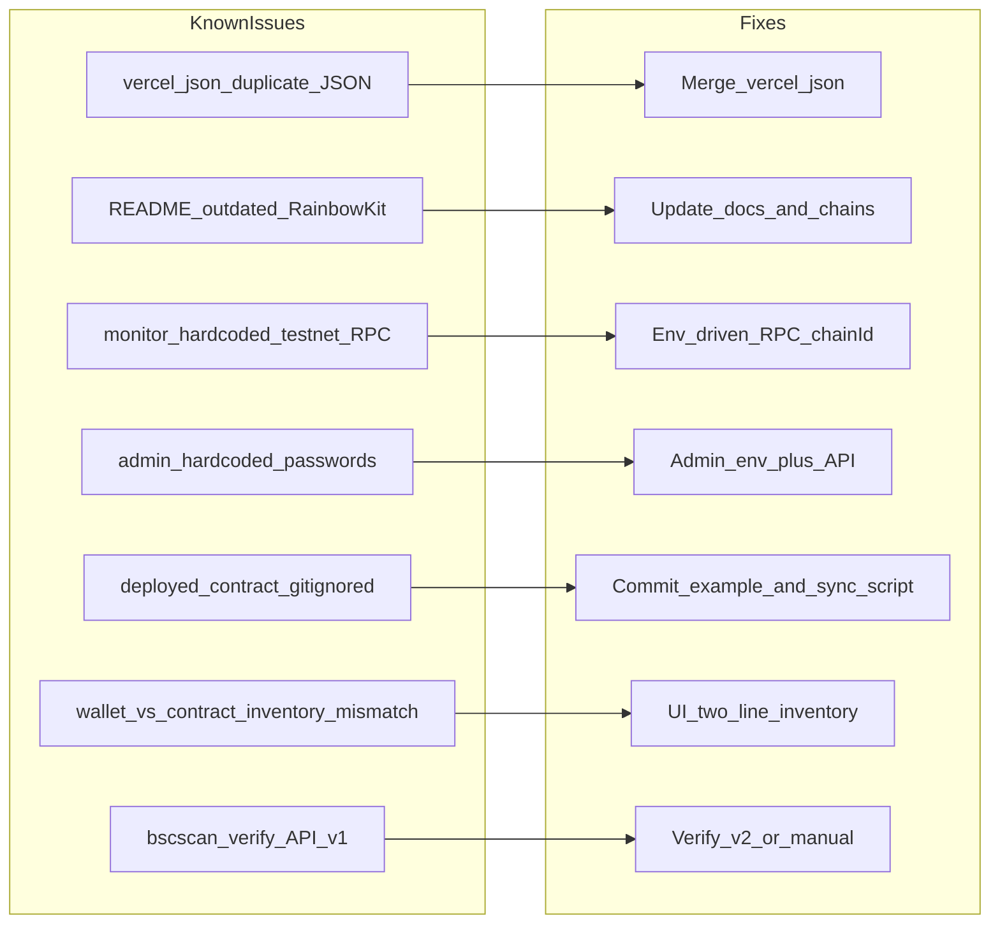

# Production release: аудит, админка, коммиты, Vercel + BSC Mainnet

## Ваши решения (зафиксированы)

| Тема | Выбор |
|------|--------|
| Сети | Testnet (97) → затем Mainnet (56) |
| Токен | Custom BEP-20 (адрес дадите ниже) |
| Available USDT | Баланс **owner-кошелька** (как сейчас в [`frontend/app/api/monitor/route.ts`](frontend/app/api/monitor/route.ts)) |
| Min покупка | **1 USDT** (временно; перед mainnet-релизом напомним про 500) |
| Private key | **Только server**: UI → one-time POST → Vercel Secrets, **не** localStorage |
| Vercel | **Новый проект** |
| Git | Логичные коммиты, **без** `external-libs/` |
| Playwright | Авто UI/API + **чеклист** 1–3 покупок в Trust Wallet (вы подписываете) |
| Домен | `*.vercel.app` |

---

## Шаг 0 — Вставьте данные одним блоком (обязательно перед выполнением)

Скопируйте, заполните и отправьте **одним сообщением** в чат (можно приложить скрин/файл с адресами):

```txt
# === CUSTOM TOKEN (mainnet) ===
TOKEN_CONTRACT_ADDRESS=
TOKEN_DECIMALS=18
TOKEN_SYMBOL=          # например USDT / TWT / MYTOKEN

# === WALLETS ===
OWNER_WALLET_ADDRESS=  # кошелёк продавца (Available USDT берём отсюда)
DEPLOYER_PRIVATE_KEY=  # только для деплоя контракта (0x...)
# Опционально: отдельный ключ для cron/серверных tx — если не тот же

# === RPC ===
BSC_TESTNET_RPC=https://data-seed-prebsc-1-s1.binance.org:8545
BSC_MAINNET_RPC=https://bsc-dataseed.binance.org

# === BscScan (verify контрактов) ===
BSCSCAN_API_KEY=

# === Vercel (новый проект) ===
VERCEL_TOKEN=
VERCEL_TEAM_ID=        # optional
VERCEL_PROJECT_NAME=flash-tokens-trust

# === Admin (заменить хардкод trustusdt2026) ===
ADMIN_LOGIN=
ADMIN_PASSWORD=
CRON_SECRET=           # случайная строка для /api/monitor/cron

# === Sale params ===
INITIAL_RATE_TOKENS_PER_BNB=120728760000000000000000
MAX_TOKENS_PER_TX=20000000000000000000000
DEPOSIT_AMOUNT=        # сколько токенов внести в контракт после деплоя (wei или human)

# === Optional ===
COINGECKO_API_KEY=
NEXT_PUBLIC_APP_URL=   # после первого деплоя: https://xxx.vercel.app
```

**Важно про Available:** on-chain покупка списывает токены с **баланса контракта** [`TokenSale.buyTokens`](smart-contract/contracts/TokenSale.sol) (после `depositTokens`). На витрине показываем **owner wallet** — это запас продавца; если контракт пуст, покупка упадёт с `insufficient inventory`. В UI добавим пояснение + опционально вторую строку «В продаже (контракт)».

---

## Обнаруженные риски и конфликты (исправим в ходе работ)



| # | Проблема | Файл | Действие |
|---|----------|------|----------|
| 1 | **Невалидный `vercel.json`** — два JSON-объекта подряд | [`frontend/vercel.json`](frontend/vercel.json) | Объединить в один: `framework`, `crons` |
| 2 | Monitor всегда testnet RPC | [`frontend/app/api/monitor/route.ts`](frontend/app/api/monitor/route.ts) | `BSC_RPC` + `CHAIN_ID` из env |
| 3 | Админ-логин в коде | [`frontend/components/AdminPanel.tsx`](frontend/components/AdminPanel.tsx) | `ADMIN_LOGIN` / `ADMIN_PASSWORD` (server) |
| 4 | Private key только snippet | AdminPanel | API `POST /api/admin/apply-config` → Vercel env API |
| 5 | `deployed-contract.json` в `.gitignore` | [`.gitignore`](.gitignore) | Коммитить `deployed-contract.example.json`; реальный — только локально |
| 6 | README про RainbowKit modal | [`README.md`](README.md) | Trust-only, актуальный flow |
| 7 | Mainnet не в default chain | [`frontend/config/chains.ts`](frontend/config/chains.ts), env | `NEXT_PUBLIC_CHAIN_ID=56` на production |
| 8 | Playwright без wallet sign | [`frontend/scripts/playwright-e2e-debug.mjs`](frontend/scripts/playwright-e2e-debug.mjs) | Расширить + `playwright-cli` по skill |

---

## Фаза 1 — Playwright-аудит (постепенный, `/playwright` skill)

**Инструмент:** `C:\Users\Asus\.codex\skills\playwright\scripts\playwright_cli.sh` (через `npx.cmd` на Windows).

**Этапы (каждый — snapshot → действие → артефакт в `frontend/output/playwright/`):**

1. **Smoke:** `open http://localhost:3000` → snapshot → скрин главной.
2. **SaleCard:** ввод `1`, `500`, `1000` USDT; проверка «К оплате» + `≈ $`; locale `0,005` vs `0.005`.
3. **API:** `fetch /api/monitor` — поля `availableUsdt`, `totalPurchases`, `bnbUsd`, без 500.
4. **Admin:** логин → поля адресов → копирование env-snippet (без отправки реального PK в лог).
5. **Wallet UI:** кнопка Trust (без подписи в headless) — наличие, нет RainbowKit QR.
6. **Ошибки:** 0 токенов, > max, paused contract (если есть testnet pause).
7. **Mobile viewport** 390×844 — скрин SaleCard.

**Параллельно (subagents):**
- `explore` — frontend hooks/wagmi/env расхождения.
- `explore` — smart-contract invariants + mainnet deploy script gaps.
- `deployment-expert` — Vercel root directory = `frontend`, cron auth.

**Deliverable:** `docs/playwright-audit-report.md` + JSON в `frontend/output/playwright/`.

---

## Фаза 2 — Админка и персонализация

**Цель:** менять token/sale/owner адреса и **один раз** отправить private key на сервер → Vercel env (без хранения в браузере).

| Компонент | Изменение |
|-----------|-----------|
| [`AdminPanel.tsx`](frontend/components/AdminPanel.tsx) | Секции: Addresses, Apply to Vercel, Inventory hint, Rate/Max/Pause |
| `frontend/app/api/admin/apply-config/route.ts` | **NEW** — проверка admin session, вызов Vercel API (`VERCEL_TOKEN`), set env: contracts, RPC, keys |
| `frontend/app/api/admin/auth/route.ts` | **NEW** — httpOnly cookie / bearer после `ADMIN_*` |
| Monitor | `OWNER_WALLET_ADDRESS` override если задан, иначе `sale.owner()` |

**Security:** private key только в теле POST → сразу в Vercel encrypted env; не логировать; не `NEXT_PUBLIC_*`.

---

## Фаза 3 — Контракты и сети (testnet → mainnet)

1. **Testnet (97):** redeploy `TokenSale` с вашим custom token (или mock если тестовый токен отдельно) → `node scripts/sync-frontend-env.mjs` → `depositTokens`.
2. **Ручной чеклист (вы):** Trust Wallet, BSC Testnet, покупки 1 / 500 / 1000 USDT, tx hash, обновление метрик.
3. **Mainnet (56):** `npx.cmd hardhat run scripts/deploy.ts --network bscMainnet` с `TOKEN_ADDRESS` = ваш контракт, **без** `USE_MOCK_TOKEN`.
4. **Verify** BscScan (API v2 / manual если v1 deprecated).
5. **Production env** на Vercel: `NEXT_PUBLIC_CHAIN_ID=56`, mainnet RPC, адреса mainnet-контрактов.

**Контракт:** min остаётся `1` по вашему выбору; в [`docs/debug-handoff-checklist.md`](docs/debug-handoff-checklist.md) — жирный reminder про 500 перед «боевым» маркетингом.

---

## Фаза 4 — Git (логичные коммиты, app only)

Порядок (примерно 6–8 коммитов, **без** секретов и `node_modules`):

1. `fix(vercel): merge invalid vercel.json`
2. `feat(api): mainnet-aware monitor + cron secret`
3. `feat(admin): secure config API + env-driven auth`
4. `feat(frontend): inventory UX + chain switching`
5. `chore(contracts): mainnet deploy scripts + min purchase docs`
6. `test: playwright audit scripts + report`
7. `docs: production deploy + manual wallet checklist`

**Не коммитить:** `frontend/.env.local`, `smart-contract/.env`, `external-libs/`, `.next/`, `output/playwright/*.png` (опционально только JSON report).

---

## Фаза 5 — Vercel deploy (новый проект)

1. `vercel link` / `vercel project add` с root **`frontend/`**.
2. Env (Production + Preview): все ключи из блока Шаг 0.
3. `vercel deploy --prod` после green build локально.
4. Cron [`/api/monitor/cron`](frontend/app/api/monitor/cron/route.ts) + header `Authorization: Bearer ${CRON_SECRET}`.
5. Smoke: prod URL → `/api/monitor` 200, главная 200.

**MCP:** `plugin-vercel-vercel` для проверки deployment logs при ошибках.

---

## Фаза 6 — Финальная приёмка

| Проверка | Команда / критерий |
|----------|-------------------|
| Contracts | `npx.cmd hardhat test` (30/30) |
| Frontend | `npm run lint`, `npm run test`, `npm run build` |
| Playwright | audit script + отчёт |
| On-chain | mainnet contract funded + 1 test purchase |
| Monitor | cron 5 min, метрики без NaN |

**Handoff:** обновить [`docs/debug-handoff-checklist.md`](docs/debug-handoff-checklist.md) с prod URLs и mainnet addresses.

---

## Минимальное участие с вашей стороны

1. **Один раз** — вставить блок Шаг 0 (адрес токена + ключи + Vercel token).
2. **Trust Wallet** — 1–3 подписи на testnet (и при желании 1 на mainnet).
3. **Подтверждение** — что custom token уже задеплоен на BSC mainnet и owner может `approve` + `depositTokens`.

Всё остальное (аудит, правки, коммиты, Vercel CLI, деплой контрактов) выполняет агент после подтверждения плана.
