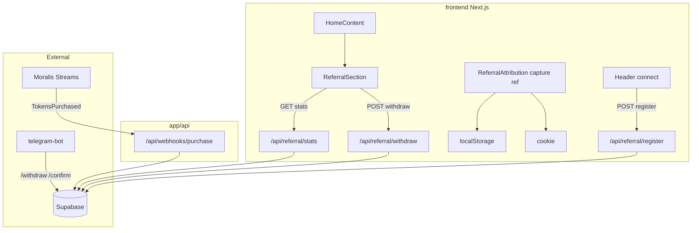

# План: реферальная система на лендинге

## Допущения (вопросы были пропущены)

| Решение | Значение по умолчанию |
|---------|------------------------|
| Размещение | **Секция на главной** под [`TokenInfoSection`](frontend/components/TokenInfoSection.tsx) в [`HomeContent.tsx`](frontend/components/HomeContent.tsx) (строка 34 → вставка перед `footer`) |
| Язык UI | **Русский** (как `HowItWorksSection` / `TokenInfoSection`); копирайт брать из [`docs/promo/referral-page-test-content.md`](docs/promo/referral-page-test-content.md) с переводом |
| Scope | **Фаза A:** UI + shadcn/21st + видео; **Фаза B:** Supabase + API; **Фаза C:** Moralis webhook; **Фаза D:** Telegram + Vercel env + Playwright |
| Видео | MP4 → `frontend/public/promo/referral-seedance.mp4`, в секции **autoplay muted loop** (как в 21st checklist) |
| Telegram | **Новая папка** `telegram-bot/` в репо (в коде бота сейчас **нет**) |
| USD для 10% | `bnbAmount` из `TokensPurchased` × BNB/USD (Moralis или CoinGecko на сервере); идемпотентность по `tx_hash` |

Если нужен отдельный маршрут `/referrals` или английский UI — уточните до старта Agent; план легко расширяется.

---

## Аудит текущего проекта vs спецификация

### Уже есть (не трогать ядро продажи)

- Главная: [`frontend/app/page.tsx`](frontend/app/page.tsx) → [`HomeContent.tsx`](frontend/components/HomeContent.tsx)
- Кошелёк: [`Header.tsx`](frontend/components/Header.tsx) — `useAccount`, `connectAsync`
- Дизайн-токены: [`globals.css`](frontend/app/globals.css) — `#0a0a0a`, `#00ffa3`, `.glass`, `shadow-glow`
- Карточки: [`components/ui/Card.tsx`](frontend/components/ui/Card.tsx)
- Motion: `motion/react` уже в [`HowItWorksSection.tsx`](frontend/components/HowItWorksSection.tsx)
- Контракт: `TokensPurchased(buyer, bnbAmount, tokenAmount, timestamp)` в [`TokenSale.sol`](smart-contract/contracts/TokenSale.sol)
- Prod: `tokenSale` `0x2DA99FcE826B657CD2Dda2ec58ef7C2085Bd797B` — [`deployed-contract.json`](smart-contract/deployed-contract.json)
- Деплой/env: [`scripts/refresh-vercel-production-env.mjs`](scripts/refresh-vercel-production-env.mjs), `npm run audit:playwright`

### Отсутствует (greenfield по промпту)

- Любой `referral` / Supabase / Moralis / Telegram в репо
- `components.json` (shadcn) — **нужен `shadcn init`** перед установкой 21st-компонента
- `telegram-bot/` — создать с нуля по промпту

### Контент и motion (готово к использованию)

- Тексты и маппинг API: [`docs/promo/referral-page-test-content.md`](docs/promo/referral-page-test-content.md)
- Seedance storyboard: [`docs/promo/referral-motion-seedance.md`](docs/promo/referral-motion-seedance.md)
- Исходное видео (скопировать в репо): `c:\Users\Asus\Downloads\untitled_Seedance 2.0_2026-06-01_20-41-34.mp4`

---

## Целевая архитектура



**Бизнес-правила (из промпта):**

- `ref_code` = `wallet.slice(2, 10).toLowerCase()`
- Ссылка: `{NEXT_PUBLIC_SITE_URL}/?ref={code}`
- Attribution: `localStorage` + cookie 30 дней; `referred_by` только при **первой** регистрации
- Комиссия **10%** рефереру; вывод от **$5**; токен `WD-xxxxxxxx`, TTL **24h**

---

## Фаза A — UI на лендинге (21st + motion + видео)

### A1. Подготовка shadcn / 21st

1. В `frontend/`: `npx shadcn@latest init` (стиль dark, алиас `@/components`, совместимость с Tailwind 3.4)
2. Установка по [`/21st-design`](C:/Users/Asus/.cursor/skills/21st-design/SKILL.md):

```bash
npx shadcn@latest add "https://21st.dev/r/ravikatiyar162/onboarding-checklist"
```

3. Адаптация под проект:
   - Заменить demo-тексты на RU-копирайт из `referral-page-test-content.md`
   - Цвета: `border-white/10`, `bg-white/5`, акцент `#00ffa3`, CTA gradient как на сайте
   - Убрать лишние зависимости от светлой темы shadcn

### A2. Компоненты (новые файлы)

| Файл | Назначение |
|------|------------|
| [`frontend/components/referral/ReferralSection.tsx`](frontend/components/referral/ReferralSection.tsx) | Обёртка секции: заголовок, onboarding layout, видео-колонка |
| `ReferralDashboard.tsx` | Чеклист 4 шага + прогресс |
| `ReferralStats.tsx` | 4 stat cards (Invited / Available / …) |
| `ReferralLink.tsx` | Ссылка + copy |
| `WithdrawButton.tsx` | Glow при `availableBalance >= 5` (`motion` pulse) |
| `WithdrawModal.tsx` | WD-токен, команда для бота |
| `ReferralVideo.tsx` | `<video>` + `prefers-reduced-motion` fallback (poster frame) |

### A3. Вставка в страницу

В [`HomeContent.tsx`](frontend/components/HomeContent.tsx) после `<TokenInfoSection />`:

```tsx
<ReferralSection />
```

Секция: `mx-auto mt-8 max-w-5xl px-4` — шире token card при двух колонках (чеклист + видео), как у [21st checklist](https://21st.dev/community/components/ravikatiyar/onboarding-checklist/default).

### A4. Видео и Remotion

- **Обязательно для лендинга:** скопировать MP4 в `frontend/public/promo/referral-seedance.mp4` (опционально WebM для веса)
- **Remotion** ([`/remotion`](C:/Users/Asus/.cursor/skills/remotion/SKILL.md)): **не блокер** для первого релиза; опционально `promo/remotion/` для будущего рендера/вариантов — **не** использовать CSS transitions в Remotion; для страницы — только HTML5 video

### A5. Mock-режим (до ключей Supabase)

`ReferralSection` читает `NEXT_PUBLIC_REFERRAL_MOCK=true` → данные из константы (persona из test-content) чтобы UI можно было смотреть без бэкенда.

---

## Фаза B — Supabase + API

### B1. Схема

Создать [`supabase/migrations/001_referral_system.sql`](supabase/migrations/001_referral_system.sql) — таблицы из промпта: `ref_users`, `ref_purchases`, `ref_earnings`, `ref_withdrawals` + индексы.

RLS: публичный read **запрещён**; все операции через **service role** в API routes.

### B2. Библиотека

```
frontend/lib/referral/
  supabase.ts    # createClient service role (server only)
  referral.ts    # registerUser, getStats, creditPurchase, createWithdrawal, ...
  types.ts
  attribution.ts # read/write ref cookie + localStorage helpers (client)
```

Зависимость: `@supabase/supabase-js` в `frontend/package.json`.

### B3. API routes (App Router)

| Route | Метод | Логика |
|-------|-------|--------|
| `app/api/referral/register/route.ts` | POST | `{ wallet }` + optional `ref` from body; идемпотентная регистрация |
| `app/api/referral/stats/route.ts` | GET | `?wallet=0x…` — stats + earnings + pendingWithdrawal |
| `app/api/referral/withdraw/route.ts` | POST | Проверка balance ≥ 5, нет open withdrawal → `WD-…` |
| `app/api/webhooks/purchase/route.ts` | POST | Verify Moralis signature → parse `TokensPurchased` → credit 10% |

### B4. Интеграция с кошельком (минимальные правки)

- Новый клиентский хук `useReferralRegister.ts`: при `isConnected && address` → `POST /api/referral/register` с `referred_by` из attribution
- Вызов из [`Header.tsx`](frontend/components/Header.tsx) или отдельный `ReferralProvider` в `Providers` — **одна** точка, без дублирования
- Новый [`components/referral/ReferralAttribution.tsx`](frontend/components/referral/ReferralAttribution.tsx) в [`app/layout.tsx`](frontend/app/layout.tsx): парсинг `?ref=` → cookie + localStorage

**GitNexus:** перед правкой `Header` / `Providers` — `gitnexus_impact` на символы; риск LOW если только добавить вызов register.

---

## Фаза C — Moralis Streams

1. Документ [`docs/referral/MORALIS_SETUP.md`](docs/referral/MORALIS_SETUP.md):
   - Contract: `tokenSale` из `deployed-contract.json`
   - Event: `TokensPurchased(address,uint256,uint256,uint256)`
   - Webhook URL: `https://<prod>/api/webhooks/purchase`
2. Handler: verify `MORALIS_WEBHOOK_SECRET`, dedupe `tx_hash`, resolve buyer → `referred_by` → начисление
3. USD: `Number(bnbAmount) / 1e18 * bnbUsd` (источник — env `BNB_USD_PRICE_URL` или Moralis metadata)

---

## Фаза D — Telegram bot

Создать [`telegram-bot/`](telegram-bot/) (Node + `telegraf` или `grammy`):

- `/withdraw WD-…` — validate token, status → `pending_payment`, notify admin
- `/confirm WD-…` — admin only (`TELEGRAM_ADMIN_ID`) → `completed`, update balances
- Cron/edge: expire `pending_claim` после 24h

Деплой бота — **вне Vercel** (Railway/Fly/VM) или serverless webhook; описать в [`docs/referral/TELEGRAM_SETUP.md`](docs/referral/TELEGRAM_SETUP.md).

---

## Фаза E — Env, деплой, QA

### Переменные (добавить в `frontend/.env.example` и Vercel)

```
NEXT_PUBLIC_SUPABASE_URL=
NEXT_PUBLIC_SUPABASE_ANON_KEY=          # только если понадобится client read; иначе не использовать
SUPABASE_SERVICE_ROLE_KEY=              # server only
MORALIS_WEBHOOK_SECRET=
TELEGRAM_BOT_TOKEN=
TELEGRAM_ADMIN_ID=
NEXT_PUBLIC_BOT_USERNAME=
NEXT_PUBLIC_SITE_URL=https://flash-tokens-trust-mainnet-20260528.vercel.app
NEXT_PUBLIC_REFERRAL_MOCK=false
```

Секреты: пользователь заполняет `.env.local` / Vercel; агент **не коммитит** значения. После ответов — `user-memory` MCP при необходимости сохранить **только** имена переменных, не значения.

### Верификация

1. `npm run build` в `frontend/`
2. Расширить [`frontend/scripts/playwright-production-audit.mjs`](frontend/scripts/playwright-production-audit.mjs): скролл к реферальной секции, snapshot, опционально mock API
3. `plugin-vercel-vercel` или `refresh-vercel-production-env.mjs` — новые env на preview → prod
4. Регрессия: monitor API + покупка (существующий audit `ok: true`)

---

## Рекомендуемый стек инструментов для Agent

| Задача | Инструмент |
|--------|------------|
| UI checklist | **@21st-design** + `shadcn add` [onboarding-checklist](https://21st.dev/community/components/ravikatiyar/onboarding-checklist/default) |
| Анимации в React | **motion/react** (уже в проекте) |
| Промо-видео (опционально) | **/remotion** — отдельная папка, не блокирует релиз |
| Supabase SQL/проверка | **plugin-supabase-supabase** MCP |
| Деплой/env | **plugin-vercel-vercel** + [`scripts/refresh-vercel-production-env.mjs`](scripts/refresh-vercel-production-env.mjs) |
| Impact перед правками | **user-gitnexus** (`gitnexus_impact` на `Header`, `Providers`) |
| Карта кода | **Task** `explore` (medium) при необходимости |
| Визуальная проверка | **plugin-browse-browser** на preview URL |
| E2E | `npm run audit:playwright` |
| Дизайн-полировка (по желанию) | `.agents/skills/design-taste-frontend` |

**Не использовать** для этой задачи: Stripe, Clerk, Webflow, Figma (если нет макета).

---

## Порядок коммитов (предложение)

1. `feat(referral): promo assets + ReferralSection UI (mock)`
2. `feat(referral): supabase schema + lib + register/stats/withdraw API`
3. `feat(referral): wallet attribution + register hook`
4. `feat(referral): moralis purchase webhook`
5. `feat(referral): telegram bot + setup docs`
6. `chore(referral): env example, playwright, vercel env`

Коммиты — **только по запросу пользователя**.

---

## Риски и ограничения

- **Нет shadcn** → первая установка может добавить `components/ui/*` — не конфликтовать с существующими [`Button.tsx`](frontend/components/ui/Button.tsx) / `Card.tsx` (merge paths в `components.json`)
- **Telegram вне репо** — без токена фаза withdraw — только UI + API генерации токена
- **Промпт утверждает «бот есть»** — в `flash-tokens-trust` не найден; нужен путь к внешнему боту или новая реализация
- **Язык:** site RU / doc EN — перевод обязателен при копировании строк
- **Не ломать продажу:** не менять `SaleCard`, `buyTokens`, pricing logic; только additive hooks

---

## Ключи — что вставить вам (после старта Agent)

Агент запросит по одному в чат **или** вы заполните `frontend/.env.local`:

1. `NEXT_PUBLIC_SUPABASE_URL`
2. `SUPABASE_SERVICE_ROLE_KEY`
3. `MORALIS_WEBHOOK_SECRET`
4. `TELEGRAM_BOT_TOKEN`
5. `TELEGRAM_ADMIN_ID`
6. `NEXT_PUBLIC_BOT_USERNAME` (без @)
7. Подтверждение `NEXT_PUBLIC_SITE_URL` (prod vs custom domain)

До получения ключей — работать с `NEXT_PUBLIC_REFERRAL_MOCK=true`.
