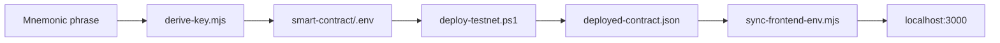

# Сид-фраза → testnet deploy → локальный тест

## Решения (подтверждены)

- **Деплой:** BSC Testnet (chain 97) — да; Vercel/mainnet — нет.
- **Целевой адрес deployer:** `0x4e8cef391d4b1b06e1a643765cc7bbdef6f28953` (подберём derivation path по сид-фразе).
- **BSCSCAN_API_KEY:** восстановить `FHQRUCB5TJPU7YQIDMZ6WHBEV42AEF3AQQ` (сейчас в [`.env`](c:\Users\Asus\.cursor\flash-tokens-trust\smart-contract\.env) поле пустое).

## Безопасность

- Сид-фраза и private key **только** в gitignored [`smart-contract/.env`](c:\Users\Asus\.cursor\flash-tokens-trust\smart-contract\.env) — **не коммитить**, не печатать в чат.
- После тестов рекомендую не использовать эту сид-фразу в открытых чатах; для mainnet — отдельный кошелёк.

---

## Фаза 1 — Извлечение PRIVATE_KEY из mnemonic

Добавить одноразовый скрипт (не коммитить сид в репо):

[`smart-contract/scripts/derive-key.mjs`](c:\Users\Asus\.cursor\flash-tokens-trust\smart-contract\scripts\derive-key.mjs)

- Использовать `ethers` v6: `Mnemonic.fromPhrase()` + `HDNodeWallet.fromMnemonic(mnemonic, path)`.
- Перебор путей: `m/44'/60'/0'/0/{i}` для `i = 0..20` (стандарт Trust/MetaMask).
- Остановиться, когда `wallet.address.toLowerCase() === 0x4e8cef391d4b1b06e1a643765cc7bbdef6f28953`.
- Проверить баланс BNB на BSC testnet через RPC (должен быть > 0 после вашего пополнения).
- Записать в `.env` только `PRIVATE_KEY=0x<64 hex>`.

Если адрес не найден за 20 индексов — расширить поиск или запросить уточнение (другой coin type / path).

**Обновить [`smart-contract/.env`](c:\Users\Asus\.cursor\flash-tokens-trust\smart-contract\.env):**

```env
PRIVATE_KEY=0x...          # derived, never committed
BSCSCAN_API_KEY=FHQRUCB5TJPU7YQIDMZ6WHBEV42AEF3AQQ
TOKEN_ADDRESS=0x327D87678A2f1d67048b34a048Bb6D68e6168888
USE_MOCK_TOKEN=true
DEPOSIT_AMOUNT=1000000
```

---

## Фаза 2 — Деплой BSC Testnet

```powershell
cd c:\Users\Asus\.cursor\flash-tokens-trust\smart-contract
.\scripts\deploy-testnet.ps1
```

Ожидаемый результат в [`deployed-contract.json`](c:\Users\Asus\.cursor\flash-tokens-trust\smart-contract\deployed-contract.json) (gitignored):

- `network: bscTestnet`, `chainId: 97`
- `tokenSale`, `token` (MockERC20)
- deposit 1_000_000 USDT в контракт продажи

При ошибке verify — деплой не блокирует тест UI; verify повторим отдельно.

---

## Фаза 3 — Синхронизация frontend

```powershell
cd c:\Users\Asus\.cursor\flash-tokens-trust
node scripts/sync-frontend-env.mjs
```

Обновит [`frontend/.env.local`](c:\Users\Asus\.cursor\flash-tokens-trust\frontend\.env.local):

- `NEXT_PUBLIC_TOKEN_SALE_CONTRACT` — реальный testnet адрес (вместо заглушки `0x...0001`)
- `NEXT_PUBLIC_TOKEN_CONTRACT` — MockERC20 testnet
- `NEXT_PUBLIC_CHAIN_ID=97`

---

## Фаза 4 — Полный аудит (повторный)

| Область | Команды | Критерий |
|---------|---------|----------|
| Contracts | `hardhat clean`, `hardhat test`, `hardhat coverage` | 27 tests pass, TokenSale 100% lines |
| Frontend | `npm run lint`, `npm run test`, `npm run build` | без ошибок, без `indexedDB` |
| On-chain | read `getRate`, `getTokenBalance`, `isPaused` | inventory > 0, rate корректен |

Дополнительно: убедиться, что последние фиксы (Providers в `HomeContent`, BigInt в `SaleCard`, `force-dynamic` page) сохранены.

---

## Фаза 5 — Git: поэтапные коммиты (только код)

Уже есть 3 коммита; после аудита — закоммитить **незакоммиченные** изменения (сейчас есть modified files в `git status`), **без** `.env` / `.env.local` / `deployed-contract.json`:

Предлагаемая структура (если есть новые правки):

1. `chore: add mnemonic derive script and env docs` — `derive-key.mjs`, README/env notes
2. `fix: wallet SSR and bigint validation` — frontend fixes (если ещё не в истории)
3. `chore: sync deployment helpers` — scripts/README updates

Перед каждым коммитом: `hardhat test` + `npm run build` в frontend.

---

## Фаза 6 — Локальная тестовая версия (без Vercel)

- Перезапустить `npm run dev` в [`frontend/`](c:\Users\Asus\.cursor\flash-tokens-trust\frontend) на порту **3000**
- URL: **http://localhost:3000**

### Чеклист для вас

1. Trust Wallet → сеть **BSC Testnet (97)**
2. Connect на сайте
3. **TokenStats:** Available > 0
4. **Buy:** 0.005 BNB → USDT на кошелёк
5. **Admin** (адрес `0x4e8c...8953`): Pause → buy blocked → Unpause
6. При необходимости: Update Rate / Max Limit / Withdraw



---

## Что не делаем

- Vercel deploy
- BSC Mainnet deploy
- Коммит секретов (.env, mnemonic, private key)

## После вашего ОК

По отдельной команде: Vercel preview и/или mainnet (реальный `TOKEN_ADDRESS`, без mock).
