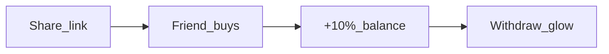

# Seedance 2.0 — промпт для Referral motion (5s, 16:9)

## Источники (без правок в репозитории)

| Источник | Что берём |
|----------|-----------|
| [cursor-referral-prompt (1).md](c:\Users\Asus\Downloads\cursor-referral-prompt (1).md) | Сюжет: ref-link → друг покупает → 10% на баланс → дашборд → Withdraw ($5+) → Telegram |
| [frontend/app/globals.css](c:\Users\Asus\.cursor\flash-tokens-trust\frontend\app\globals.css) | Фон `#0a0a0a`, accent `#00ffa3`, glass, emerald→cyan gradient, radial glow |
| [frontend/components/ui/Card.tsx](c:\Users\Asus\.cursor\flash-tokens-trust\frontend\components\ui\Card.tsx) | `rounded-2xl`, `border-white/10`, `bg-white/5`, `backdrop-blur-xl`, `shadow-glow` |
| [frontend/components/ui/Button.tsx](c:\Users\Asus\.cursor\flash-tokens-trust\frontend\components\ui\Button.tsx) | CTA gradient `emerald-400 → cyan-400`, glow on hover |
| [document_6118323269843034502.mp4](c:\Users\Asus\Downloads\document_6118323269843034502.mp4) | Референс темпа: плавные UI-переходы, тёмный fintech, без резких монтажных склеек |

**Язык UI в ролике:** English (по твоему выбору).

**Стиль:** Apple-clean 3D glass (как в промо покупки) — мягкий свет, умеренный неон, читаемая типографика.

---

## Ограничение 5 секунд

В один клип помещаются **4 смысловых бита**, не полный flow Telegram:



Не показывать: Admin Panel, Moralis webhook, `/confirm`, русский текст, экран ошибок.

---

## Визуальная спецификация (для промпта)

- **Background:** `#0a0a0a`, subtle top radial glow `rgba(0,255,163,0.08)`
- **Cards:** frosted glass, 16px radius, thin white border 10% opacity
- **Accent:** `#00ffa3` / emerald-cyan gradient on titles and CTAs
- **Typography:** clean sans-serif (Inter-like), sharp, no warping
- **Motion:** parallax layers, soft whoosh, UI elements float in Z-depth (not flat screenshot slideshow)
- **Hero elements on dashboard:**
  - Title: **Refer & Earn 10%**
  - Ref link field: `yoursite.com/?ref=abc12345` + **Copy** button (checkmark flash)
  - Stats row: **Invited: 3** | **Available: $12.50**
  - Mini earnings line: **+$5.00** from purchase (10% of $50)
  - **Withdraw** button with pulsing `box-shadow` glow (balance >= $5)
  - Tiny footer hint: **via Telegram** (no full chat UI)

---

## Раскадровка 0–5000 ms

| Time (ms) | Visual | On-screen (EN) | Audio |
|-----------|--------|----------------|-------|
| 0–700 | Dark void → camera push-in; glass **Referrals** card materializes; soft hero glow behind title | `Refer & Earn` | Low whoosh in |
| 700–1600 | Ref link bar; **Copy** tap; link string highlights; faint share particles outward | `Share link` | UI click + soft swipe |
| 1600–2800 | Abstract “friend” icon + mini purchase pulse; **10%** coin arcs into **Available balance** counter (e.g. $7.50 → $12.50) | `10% commission` | Rising tick + coin chime |
| 2800–3900 | **Invited** count increments 2→3; earnings list row slides in: `+$5.00` | `Friends buy USDT` | Soft notification blip |
| 3900–5000 | **Withdraw** button activates; gentle pulsing green glow; tiny Telegram paper-plane icon; hold 400ms | `Withdraw` | Success tone + subtle pad out |

---

## Опционально: First / Last Frame (если Seedance принимает keyframes)

Если генерируешь статику в GPT Image 2 / Flux перед видео:

**First Frame:** пустой glass Referrals card, title only, no numbers animated yet.

**Last Frame:** полный dashboard с `Available: $12.50`, glowing **Withdraw**, `Invited: 3`.

*(Не обязательно для text-to-video; усиливает стабильность текста.)*

---

## Готовый промпт для Seedance 2.0 PRO

Скопируй блок ниже целиком в Seedance (Duration: **5.0s**, Aspect: **16:9**, Audio: **ON**).

---

### SEEDANCE 2.0 PRO — REFERRAL SECTION PROMO

```
PROJECT: USDT Sale — Referral Program motion promo
DURATION: exactly 5.0 seconds
ASPECT RATIO: 16:9 landscape
AUDIO: generate synchronized sound design (no voiceover)

STYLE REFERENCE:
Match the visual language of USDT Sale website: dark fintech UI on #0a0a0a background, glassmorphism cards (border white/10%, backdrop blur), accent color #00ffa3, emerald-to-cyan gradients on CTAs, soft radial green glow behind hero content. Apple-clean premium 3D product render — refined glass materials, minimal neon, soft white key light, shallow depth of field. Motion tempo similar to smooth UI product demo screen recording: fluid, readable, no chaotic jump cuts. NOT cartoon, NOT cyberpunk overload, NOT flat 2D screenshot montage.

SCENE DESCRIPTION:
A floating 3D glass "Referrals" dashboard for a crypto token sale platform (BNB Smart Chain / USDT). The scene tells a 4-beat referral story in one continuous camera move.

BEAT 1 (0.0–0.7s):
Camera eases in from dark space. A frosted glass referral panel appears center-frame. Large headline text: "Refer & Earn 10%" with subtle emerald-cyan gradient shimmer. Soft green volumetric glow behind panel (hero-glow style). USDT Sale minimal wordmark small top-left optional.

BEAT 2 (0.7–1.6s):
Referral link input row animates in: "yoursite.com/?ref=abc12345". A "Copy" pill button presses once; checkmark flash; faint light particles radiate outward suggesting sharing. Small label overlay: "Share link".

BEAT 3 (1.6–2.8s):
Abstract connected-user icon (friend) with tiny "Buy USDT" pulse on BNB Smart Chain badge (brief, subtle). A glowing "10%" badge detaches and travels in an arc into the "Available" balance counter on the dashboard. Balance morphs example: $7.50 → $12.50. Overlay text: "10% commission". Secondary stat: "Invited: 3". One earnings row slides in: "+$5.00". Overlay: "Friends buy USDT".

BEAT 4 (2.8–3.9s):
Stats settle; list item glow fades. Clean readable typography throughout.

BEAT 5 (3.9–5.0s):
"Withdraw" CTA button (emerald-cyan gradient, rounded-xl) becomes active with smooth pulsing box-shadow glow (available balance >= $5). Tiny Telegram-style paper plane icon appears beside button (minimal, not full chat UI). Overlay text: "Withdraw". Hold final composition 0.4s for readability. Optional micro text: "via Telegram".

CAMERA:
Slow push-in with slight parallax between background glow, main card, and foreground UI elements. Stable framing, center-weighted, commercial product video.

TEXT RULES:
English only. Maximum 5 short overlays: "Refer & Earn", "Share link", "10% commission", "Friends buy USDT", "Withdraw". Sans-serif, high legibility, no warped letters, no gibberish.

NEGATIVE CONSTRAINTS:
No Russian text. No admin panel. No wallet error screens. No Moralis/webhook/Telegram chat screenshots. No stock photos of people. No watermark. No browser chrome. No hands holding phone unless extremely minimal silhouette.

AUDIO DESIGN:
0.0s soft whoosh in; 0.7s UI click; 1.6s light swipe; 2.0s coin/earn tick; 2.8s subtle notification blip; 4.2s short success chime; gentle low pad until 5.0s. No voiceover, no loud EDM.

QUALITY:
Maximum detail, smooth motion, stable UI edges, 8K commercial fintech aesthetic, consistent lighting across all frames.
```

---

## Параметры в UI Seedance (чеклист)

| Параметр | Значение |
|----------|----------|
| Model | Seedance 2.0 / 2.0 PRO |
| Duration | 5 s |
| Ratio | 16:9 |
| Audio | Enabled |
| Mode | Text-to-video (или Image-to-video если есть First/Last keyframes) |
| Negative prompt (если есть поле) | `blurry text, warped letters, cartoon, low quality, watermark, Russian text, admin UI, chaotic cuts` |

---

## Если первый дубль неудачный

1. **Текст плывёт** — сократи overlays до 3 (`Refer & Earn` → `10%` → `Withdraw`) и перегенерируй.
2. **Слишком быстро** — в промпте добавь: `slower UI transitions, hold each beat at least 1.2 seconds`.
3. **Слишком неон** — добавь: `Apple-clean, reduce saturation 20%, soft white key light`.
4. **Запасная модель** — Kling 3.0 с тем же текстом промпта (first/last frame optional).

---

## Связь с будущим UI (из ТЗ)

Когда [ReferralDashboard.tsx](c:\Users\Asus\Downloads\cursor-referral-prompt (1).md) будет реализован, ролик должен совпадать с:

- `ReferralLink` — ссылка + Copy + "Invited: N"
- `ReferralStats` — Available / Total earned
- `WithdrawButton` — glow при `availableBalance >= 5`
- `WithdrawModal` — **не** в 5s ролике (слишком детально); только намёк Telegram

Это не требует изменений кода сейчас — только визуальная консистентность при съёмке/монтаже.
