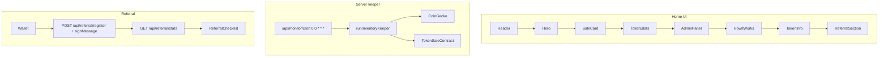
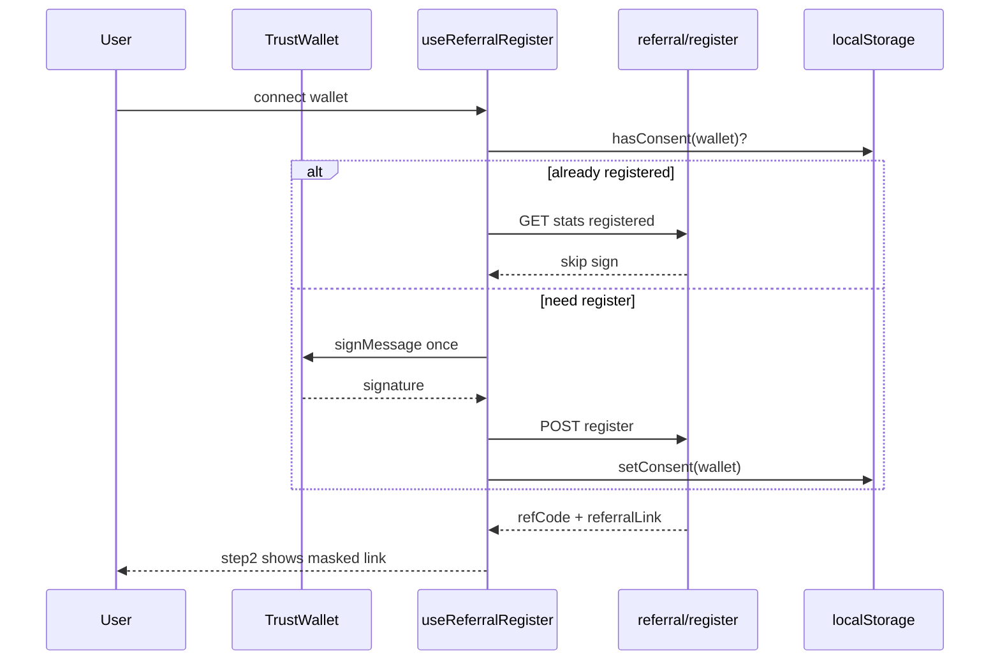

# План обновления USDT Sale (flash-tokens-trust)

## Зафиксированные решения (из ваших ответов)

| Тема | Решение |
|------|---------|
| Ежедневный cron 00:00 | Только **обновление данных** (keeper + illiquid sweep + revalidate); **без** автоматического полного redeploy Vercel |
| i18n | **next-intl**, максимум локалей, автоопределение браузера, fallback EN |
| Сайдбар | **Drawer везде** (кнопка у логотипа, gooey-стиль с [21st Gooey Filter](https://21st.dev/community/components/danielpetho/gooey-filter/menu)) |
| Язык UI | [shadcn Popover + Command search](https://21st.dev/community/components/shadcn/popover/select-with-search) |
| Реферал: подпись | **Один раз** на кошелёк: `localStorage` + сервер `registered`; без повторного Trust Wallet prompt |
| Админ: неверный токен | **AdminGuidanceModal** (RU) с шагами, не только toast |
| Ликвидность депозита | Цена токена **≥ $0.50 за 1 токен** |
| Illiquid sweep | Удалять позиции, где **суммарная стоимость запаса &lt; $0.50** |
| Деплой | Существующий Vercel-проект, **после** нулевых ошибок и вашего явного «старт» |
| On-chain | Owner `0x4e8cEf391d4B1b06e1a643765cC7BbDef6F28953`, token `0x11b4E3311112B6726327aa85AbB65c6802Da8888`, sale `0x4E2d52456606D580A8e7414dFB99902B118C2957` |

## Обязательные правила агента (на всю работу)

Добавить в [AGENTS.md](AGENTS.md) или `.cursor/rules/flash-tokens-trust-workflow.mdc`:

- **graphify** — перед крупными правками: `graphify query` по затронутым потокам; при изменении API/keeper — обновить граф при необходимости
- **markitdown** — длинные docs/PDF в `.cache/markitdown`, не бинарники в контекст
- **uv** — `uv add` / `uv run` вместо raw `pip` где применимо
- **GitNexus** (`user-gitnexus`): `impact` до правок символов (`runInventoryKeeper`, `useReferralRegister`, `ReferralChecklist`, …); `detect_changes` перед коммитом; предупреждать при HIGH/CRITICAL
- **Коммит/деплой** — только по вашей команде после финального QA

## Карта инструментов (скиллы / субагенты / MCP)

| Задача | Инструмент |
|--------|------------|
| Аудит структуры и фаз | `@game-studios-multiagent` → `/project-stage-detect`, `/gate-check` (advisory) |
| Качество кода | `thermo-nuclear-code-quality-review` + `/code-review` ([code-review skill](c:\Users\Asus\.cursor\skills\game-studios-multiagent\template\.claude\skills\code-review\SKILL.md)) |
| Перфоманс | `performance-optimizer` subagent |
| SEO | `/seo-geo` → `technical-seo-checker` + `on-page-seo-auditor` для `/` и `/referral` |
| E2E / прод | `/playwright` → [frontend/scripts/playwright-production-audit.mjs](frontend/scripts/playwright-production-audit.mjs) + новые сценарии |
| Деплой (финал) | `deployment-expert` + `plugin-vercel-vercel` MCP |
| Память | `agents-memory-updater` на вехах (после фич, после аудита, после деплоя) |
| UI-компоненты | `@21st-design` + `shadcn add` для gooey-filter и popover |
| Блокчейн-обзор | `gitnexus_query` / `impact` + чтение [frontend/lib/inventory-keeper.ts](frontend/lib/inventory-keeper.ts), [frontend/hooks/useTokenSale.ts](frontend/hooks/useTokenSale.ts) |

## Текущая архитектура (точка отсчёта)

Ключевые файлы: [frontend/components/HomeContent.tsx](frontend/components/HomeContent.tsx), [frontend/components/Header.tsx](frontend/components/Header.tsx), [frontend/components/referral/ReferralSection.tsx](frontend/components/referral/ReferralSection.tsx), [frontend/components/referral/ReferralChecklist.tsx](frontend/components/referral/ReferralChecklist.tsx), [frontend/hooks/useReferralRegister.ts](frontend/hooks/useReferralRegister.ts), [frontend/lib/inventory-keeper.ts](frontend/lib/inventory-keeper.ts), [frontend/vercel.json](frontend/vercel.json).

---

## Фаза 0 — Подготовка и аудит (без коммита)

1. **graphify** (если нет свежего `graphify-out/graph.json` в корне репо): `/graphify frontend` — затем query по referral register, keeper, admin API.
2. **GitNexus impact** на: `ReferralChecklist`, `useReferralRegister`, `runInventoryKeeper`, `AdminPanel`, `Hero`, новые route handlers.
3. **Studio-аудит**: `thermo-nuclear-code-quality-review` + `code-review` по `frontend/components`, `frontend/lib`, `frontend/app/api`.
4. **Baseline QA**: `node frontend/scripts/playwright-production-audit.mjs` против prod/preview URL; зафиксировать текущие падения (из AGENTS.md: build `/api/admin/auth`, referral visibility).

Выход фазы: короткий список блокеров + упорядоченный backlog ниже.

---

## Фаза 1 — Навигация и секции

**Цель:** сайдбар слева от логотипа (Image 5), якоря совпадают с реальными секциями.

| Действие | Файлы |
|----------|--------|
| Стабильные `id` на секциях | `Hero`, `SaleCard`, `TokenStats`, `HowItWorksSection`, `TokenInfoSection`, `ReferralSection`; опционально `AdminPanel` (`#admin`, только для owner) |
| Компонент `SiteNavDrawer` (gooey + framer-motion, filter SVG) | `frontend/components/nav/SiteNavDrawer.tsx`, `frontend/components/ui/gooey-filter.tsx` (из [21st gooey-filter](https://21st.dev/community/components/danielpetho/gooey-filter/menu)) |
| Встраивание в header | [frontend/components/Header.tsx](frontend/components/Header.tsx): кнопка меню слева от логотипа; drawer + `scrollIntoView({ behavior: 'smooth' })` |
| Скрытие admin-пункта | Показывать пункт «Админ» только если `useIsOwner()` |

Пункты меню (пример): Hero → Purchase → Stats → How it works → Token info → Referral (+ Admin).

---

## Фаза 2 — Мультиязычность (next-intl)

**Цель:** переключатель справа в header (Image 4), searchable popover.

| Действие | Файлы |
|----------|--------|
| Зависимости | `next-intl`; shadcn: `popover`, `command` ([21st select-with-search](https://21st.dev/community/components/shadcn/popover/select-with-search)) |
| Конфиг | `frontend/i18n/routing.ts`, `frontend/messages/*.json` (старт: `en`, `ru`, `zh`, `es`, `ar`, `hi`, `pt`, `tr`, `vi`, `id`, `uk`, `de`, `fr`, … — расширяемый список) |
| Layout | `frontend/app/[locale]/layout.tsx`, middleware matcher для locale |
| Перенос copy | Вынести строки из [frontend/lib/referral/copy.ts](frontend/lib/referral/copy.ts) и хардкода в компонентах в message keys; referral copy — namespace `referral.*` |
| `LocaleSwitcher` | `frontend/components/LocaleSwitcher.tsx` в [Header.tsx](frontend/components/Header.tsx) |
| SEO | `generateMetadata` per locale; hreflang; обновить sitemap/robots при необходимости |

Поведение: `navigator.language` → default locale; cookie `NEXT_LOCALE`; fallback `en`.

---

## Фаза 3 — Hero video (Image 2)

| Действие | Детали |
|----------|--------|
| Ассет | Скопировать `c:\Users\Asus\.cursor\Downloads\document_6118323269843034499.mp4` → `frontend/public/hero-loop.mp4` (сжать при необходимости: `ffmpeg -an` для web) |
| UI | Переработать [frontend/components/Hero.tsx](frontend/components/Hero.tsx): двухколоночный layout на `md+` (video + заголовок), одна колонка на mobile |
| Видео | `<video autoPlay loop muted playsInline playsInline webkit-playsinline />`, без `controls`, `object-fit: cover`, `aria-hidden` |
| i18n | Заголовок/подзаголовок через next-intl |

---

## Фаза 4 — Реферальная система

### 4.1 Mobile (Image 1)

В [ReferralSection.tsx](frontend/components/referral/ReferralSection.tsx):

- На `&lt; lg`: одна колонка, `ReferralVideo` **под** чеклистом (не sticky sidebar).
- Убрать/ослабить `min-h-[520px]` и sticky, чтобы не обрезать карточки и кнопку Withdraw.

### 4.2 Ссылка в шаге 2 (Image 3)

**Корень:** в [ReferralChecklist.tsx](frontend/components/referral/ReferralChecklist.tsx) `step2 === "done"` только при `stats.refCode`; при подключённом кошельке без `refCode` показывается `referralCopy.steps.link.pending` («Сначала подключите кошелёк»).

**Исправление:**

- `step2` = `done`, если `isConnected && (stats.refCode || stats.referralLink)`.
- Новый `InlineReferralLink`: в строке `line` справа — маска `aaa...777` (из `referralLink` или `origin/?ref=CODE`), клик → полный URL в clipboard + toast.
- Полный `ReferralLink` в `extra` оставить для desktop или когда есть `refCode`.
- После register: `refresh()` в [useReferralStats.ts](frontend/hooks/useReferralStats.ts).

### 4.3 Одноразовая подпись (Image 6)

В [useReferralRegister.ts](frontend/hooks/useReferralRegister.ts):

- Ключи: `referral-consent-v1:{address}`, опционально `referral-registered:{address}`.
- Порядок: если `stats.registered` или consent+успешный register в LS → **не** вызывать `signMessageAsync`.
- При первом визите: показать понятный pre-sign copy (RU/EN через i18n) перед запросом подписи.
- Сервер: убедиться, что register идемпотентен и stats всегда отдают `referralLink` после register.

---

## Фаза 5 — Pause UX (п.5)

| Элемент | Файл |
|---------|------|
| Сохранить overlay на карточке | [frontend/components/SaleCard.tsx](frontend/components/SaleCard.tsx) |
| **Новый** пульсирующий баннер над блоком «Purchase USDT» | `ContractUpdateBanner.tsx` — текст дословно: «Идёт обновление контракта – подождите буквально 30 минут и все заработает»; red gradient + CSS animation; виден только при `isPaused` |
| Размещение | В [HomeContent.tsx](frontend/components/HomeContent.tsx) или внутри `SaleCard` **перед** заголовком карточки |

Проверить: pause/unpause в админке + `useContractStatus` polling/refetch согласованы.

---

## Фаза 6 — Админ: депозит и illiquid sweep

### 6.1 Расширение keeper

В [frontend/lib/inventory-keeper.ts](frontend/lib/inventory-keeper.ts):

- **`depositCustomToken({ tokenAddress, amountHuman })`**: скан ERC-20 на owner wallet, match address, `priceUsd >= KEEPER_MIN_USD_VALUE` (0.5), `depositInventory(amount)`.
- **`sweepIlliquidInventory()`**: для каждой позиции в sale contract — если `balance * price < 0.5` USD → `withdrawInventory(i)`; агрегировать отчёт (сколько позиций, tx hashes).
- При mismatch env token vs on-chain inventory: возвращать structured `{ code: 'TOKEN_MISMATCH', guidance: {...} }` для UI.

### 6.2 API (owner-only, server wallet)

Новые routes (под `frontend/app/api/admin/`):

- `POST /api/admin/keeper/deposit` — body: `tokenAddress`, `amount`, auth как у существующих admin routes
- `POST /api/admin/keeper/sweep-illiquid`
- `POST /api/admin/keeper/run` — обёртка `runInventoryKeeper()` для ручного refresh

### 6.3 UI

В [frontend/components/AdminPanel.tsx](frontend/components/AdminPanel.tsx):

- Секция **«Пополнение инвентаря»**: inputs token + amount, кнопка «Пополнить», progress + результат (tx hash, new balance).
- Секция **«Очистка неликвидных»**: одна кнопка «Удалить неликвидные токены», preview списка перед confirm modal.
- **`AdminGuidanceModal`**: сценарии mismatch token, нет баланса на owner, цена &lt; $0.5, нет private key / RPC error — пошаговые инструкции на RU.
- После каждой операции: auto `getTokenBalance`, `getMaxTokensPerTx`, сброс кэша статистики на главной (revalidate path или client event).

### 6.4 Стабильность админ-функций

- Единый `adminAction` state machine (loading / success / error).
- Не блокировать UI при параллельных read; debounce refresh.
- Логи keeper в ответе API для диагностики (без секретов).

---

## Фаза 7 — Ежедневный refresh (п.7)

Расширить [frontend/app/api/monitor/cron/route.ts](frontend/app/api/monitor/cron/route.ts) (уже `0 0 * * *` в [vercel.json](frontend/vercel.json)):

1. `runInventoryKeeper()` (есть).
2. **`sweepIlliquidInventory()`** (новое).
3. **`revalidatePath('/')`, `revalidatePath('/referral')`** или вызов внутреннего cache-bust endpoint.
4. Опционально: ping referral stats aggregate / monitor thresholds (без redeploy).

Timezone: **00:00 UTC** (явно в комментарии cron + docs).

**Не делать:** автоматический Vercel redeploy без отдельного согласования.

---

## Фаза 8 — Блокчейн и надёжность (проактивно)

| Улучшение | Где |
|-----------|-----|
| Retry + backoff для CoinGecko в keeper | `inventory-keeper.ts` |
| Явные коды ошибок RPC (user rejected, insufficient gas, wrong network) | hooks + admin API |
| Idempotent referral register by wallet | API register handler |
| Rate limit / duplicate withdrawal guards | уже в AGENTS.md — верифицировать тестами |
| Env validation at build | `lib/env.ts` — required addresses for mainnet |
| Health в cron response | keeper + sweep summary для мониторинга |

---

## Фаза 9 — Валидация (gate перед коммитом)

1. `npm run lint` / `npm run test` / `npm run build` в `frontend/` — устранить `/api/admin/auth` page-data issue если воспроизводится.
2. Повторный **thermo-nuclear + code-review** на diff.
3. **Playwright**: расширить audit script — sidebar nav, locale switch, referral step2 link copy, pause banner, admin modals (mock/sandbox where needed).
4. **performance-optimizer** — bundle, video preload, LCP hero.
5. **seo-geo** — canonical/hreflang, meta, referral page.
6. **Безопасная очистка** — только `.next`, `graphify-out` temp, дубликаты cache; **не** трогать `frontend/public/promo`, env, Supabase migrations.

**GitNexus:** `detect_changes` перед первым коммитом.

---

## Фаза 10 — Коммиты и деплой (только по вашей команде)

После фазы 9 без ошибок:

1. **Пошаговые коммиты** (примерная структура):
   - `feat(nav): site drawer and section anchors`
   - `feat(i18n): next-intl and locale switcher`
   - `feat(hero): looping hero video`
   - `fix(referral): mobile layout, inline link, wallet consent`
   - `feat(admin): keeper deposit and illiquid sweep`
   - `feat(ui): contract pause banner`
   - `chore(cron): daily keeper sweep and revalidate`
2. **deployment-expert** → существующий Vercel project, env vars unchanged unless new keeper keys documented.
3. **agents-memory-updater** — итоги, контракты API, liquidity rules.
4. **Финальный Playwright** на production URL + сводка в чат.

---

## Риски и зависимости

| Риск | Митигация |
|------|-----------|
| shadcn/next-intl ломают структуру `app/` | Миграция на `app/[locale]/` в отдельном PR внутри фазы 2; редирект `/` → default locale |
| Keeper private key только server-side | Никогда не отдавать key на client; только API routes |
| Gooey filter в Safari | Fallback без filter (как в 21st docs) |
| Большой объём i18n | Сначала EN+RU полностью, остальные locale — fallback EN |
| Подпись всё ещё нужна один раз | Чёткий UX copy; не обещать «без кошелька» |

---

## Критерии готовности (Definition of Done)

- Sidebar и locale switcher на desktop и mobile, без overlap с wallet CTA.
- Hero video autoplay loop, без controls, без CLS.
- Referral: mobile не обрезан; step 2 показывает копируемую ссылку при connected; подпись один раз per wallet.
- Admin: deposit + illiquid sweep работают с guided modal при ошибках; UI обновляется после tx.
- Pause: красный мигающий баннер + overlay на карточке.
- Cron 00:00 UTC выполняет keeper + sweep + revalidate.
- Lint, test, build green; Playwright audit `ok: true` на целевых сценариях.
- Коммиты и production deploy — **только после вашего подтверждения**.
