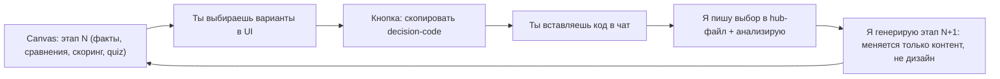

# Startup Lab — интерактивная лаборатория идеи micro-SaaS

Цель: за 1–2 дня прийти к одной финальной идее под реализацию, двигаясь от широкого диапазона к узкому. Формат — интерактивный canvas-лендинг (quiz) + hub-состояние. Скоринг идей взвешен по твоим приоритетам: скорость до денег (TTP), минимальные затраты, использование активов MELO, вирусность на старте.

## Как устроен цикл

Честная оговорка про механику: canvas в Cursor работает на клиенте (нет сети и обратной записи к агенту). Поэтому «передача в hub» реализуется так: в canvas есть панель «Итог этапа» с кнопкой копирования короткого decision-code; ты вставляешь его в чат одним сообщением, я записываю в hub и собираю следующий этап. Дизайн-структура и стиль между этапами не меняются — меняется только контент.

## Формат подачи (что ты увидишь)

- Единый визуальный каркас на все этапы: шапка с прогрессом этапов, левая колонка «контекст/факты», правая — «выбор/quiz», нижняя панель «итог + decision-code».
- Наглядность: прямые факты с источниками, сравнения «было/стало», мини-таблицы карточками, скоринг-баллы, короткие примеры вместо воды.
- Плоский минимализм по канону canvas (без градиентов/теней/эмодзи), акцент-цветом выделяется только главное.
- Язык интерфейса — русский.

## Файлы

- Canvas (управляемая Cursor папка): `canvases/startup-lab.canvas.tsx` — единственный файл артефакта, данные встроены инлайн. Точный путь управляемой папки подтвержу при сборке.
- Hub-состояние: [ai-tracking/startup-lab/hub.json](c:\Users\Asus\.cursor\projects\Fast-Money\ai-tracking\startup-lab\hub.json) — машинное состояние (этап, веса, выбранные идеи, ответы quiz).
- Журнал решений: [ai-tracking/startup-lab/decisions.md](c:\Users\Asus\.cursor\projects\Fast-Money\ai-tracking\startup-lab\decisions.md) — человекочитаемая история «что решили и почему».

## Модель скоринга

Каждая идея оценивается 1–5 по 4 осям с твоими весами: TTP, затраты, MELO-fit, вирусность. Показываю взвешенный балл + одну строку «почему» и «главный риск». Веса можно подправить прямо в quiz этапа 1.

## Этапы

### Этап 1 — Широкий диапазон (обзор рынка + shortlist направлений)
- Реальные, не «жёлтые» факты по Молдове с источниками (население и эмиграция, платёжеспособность, RU/RO раскол, концентрация тех-грамотности в Кишинёве, налоги и льготный режим IT Park, проникновение карт/онлайн-оплат). Отмечаю, где оценка, где точные данные.
- 8–10 направлений SaaS: твои 5 идей-сидов + мои добавления на базе активов MELO. Каждое: одна строка сути, ICP, тип монетизации, TTP, затраты, MELO-fit, вирусность, скоринг.
- Кандидаты (черновой пул для оценки, буду дополнять): микро-автоматизации для SMB с ИИ и интеграциями; upskilling «Duolingo для сложных сфер»; молдавская ИИ-лента/локальный ChatGPT; надстройка над Telegram-барахолками и разбор пробелов 999.md; платформа входа тинейджеров/студентов в трендовые ИИ-профессии (синергия с квалификацией лидов MELO); плюс мои: ИИ-автоответчик и запись для SMB без сайта (ниша MELO — стоматологии/салоны/авто) в WhatsApp/TG/Instagram DM; self-serve конструктор лендинг-quiz воронок с ИИ (продуктизация услуги MELO); ИИ-генератор офферов/карточек для TG-реселлеров.
- Quiz: отметить «резонирует / убить», подправить веса, выбрать 3–4 в следующий круг.

### Этап 2 — Сужение до 3 финалистов (глубокий разбор)
- По каждому финалисту: teardown конкурентов (в т.ч. предметный разбор 999.md и текущих инструментов), точный ICP, «клин» входа, канал первых 100 пользователей через MELO/TG, гипотеза цены в MDL/EUR, самый рискованный тезис для проверки.
- Quiz: выбрать 1 идею-победителя и снять открытые развилки.

### Этап 3 — Фиксация идеи + бизнес-модель
- Полная спецификация одной идеи: value prop, ICP, JTBD, объём MVP на 14–31 день, монетизация (freemium / usage-based / подписка), GTM с вирусной петлёй и каналом MELO, тарифы, прикидка юнит-экономики, путь расширения (RF/RO), риски и снятие.
- Quiz: подтвердить объём MVP и модель монетизации.

### Этап 4 — Архитектура и план сборки
- Самый дешёвый стек (напр. Next.js + Vercel, Supabase free t, один LLM-провайдер), модель данных, ИИ-интеграции, список фич MVP vs «потом», понедельный план соло при ~18 ч/нед на 2–4 недели, таблица ежемесячных затрат, чек-лист запуска.
- Переход из идеации в разработку.

## Что произойдёт после подтверждения плана
1. Создам hub-файлы и соберу первый canvas (этап 1) с реальными данными и скорингом.
2. Дам ссылку на canvas — откроешь рядом с чатом, пройдёшь quiz, пришлёшь decision-code.
3. По твоему выбору соберу этап 2, и так далее до архитектуры.

## Оговорки
- Факты рынка на этапе 1 подкреплю источниками при сборке; спорные — помечу как оценку.
- Монетизация остаётся обсуждаемой до этапа 3.
- Никакого кода продукта