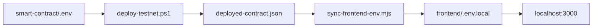

# Testnet deploy с вашими ключами

## Важно по безопасности

- Вы отправили **PRIVATE_KEY в чат** — это риск утечки. После тестов рекомендую **создать новый testnet-кошелёк** или не использовать этот ключ для mainnet/реальных средств.
- В git **не коммитим** [`smart-contract/.env`](c:\Users\Asus\.cursor\flash-tokens-trust\smart-contract\.env) и [`frontend/.env.local`](c:\Users\Asus\.cursor\flash-tokens-trust\frontend\.env.local) — они уже в [`.gitignore`](c:\Users\Asus\.cursor\flash-tokens-trust\.gitignore).

## Проблема с форматом ключа

Hardhat/ethers ожидает:

```env
PRIVATE_KEY=0x<64 hex символа>
```

Присланные значения выглядят как **base64** (`/`, `+`), не как hex. Перед деплоем выполним проверку:

1. Если строка — валидный hex (64 символа) → добавить префикс `0x`.
2. Иначе попробовать **base64-decode**; если получилось ровно **32 байта** → записать как `0x` + hex.
3. Если ни то ни другое — остановиться и запросить у вас экспорт **Private Key (hex)** из Trust Wallet (не seed phrase).

`BSCSCAN_API_KEY` формат корректный — запишем как есть.

## Шаг 1 — Записать секреты (только локально)

Обновить [`smart-contract/.env`](c:\Users\Asus\.cursor\flash-tokens-trust\smart-contract\.env):

```env
PRIVATE_KEY=<нормализованный hex>
BSCSCAN_API_KEY=FHQRUCB5TJPU7YQIDMZ6WHBEV42AEF3AQQ
TOKEN_ADDRESS=0x327D87678A2f1d67048b34a048Bb6D68e6168888
USE_MOCK_TOKEN=true
DEPOSIT_AMOUNT=1000000
```

## Шаг 2 — Деплой на BSC Testnet (97)

Из [`smart-contract/`](c:\Users\Asus\.cursor\flash-tokens-trust\smart-contract):

```powershell
cd smart-contract
.\scripts\deploy-testnet.ps1
```

Скрипт [`deploy-testnet.ps1`](c:\Users\Asus\.cursor\flash-tokens-trust\smart-contract\scripts\deploy-testnet.ps1) выполнит:

- Deploy `MockERC20` + `TokenSale` (`USE_MOCK_TOKEN=true`)
- Mint + deposit `1_000_000` токенов в контракт продажи
- BscScan verify (если API key валиден)
- Сохранение адресов в `deployed-contract.json` (файл в `.gitignore`)

**Проверки после деплоя:**

- Баланс deployer BNB > 0 на testnet
- `deployed-contract.json` содержит `chainId: 97`, `tokenSale`, `token`
- `npx.cmd hardhat run scripts/deposit.ts --network bscTestnet` — только если deposit в deploy не прошёл

## Шаг 3 — Синхронизация frontend

```powershell
cd c:\Users\Asus\.cursor\flash-tokens-trust
node scripts/sync-frontend-env.mjs
```

Обновит [`frontend/.env.local`](c:\Users\Asus\.cursor\flash-tokens-trust\frontend\.env.local):

- `NEXT_PUBLIC_TOKEN_SALE_CONTRACT` → реальный адрес с testnet
- `NEXT_PUBLIC_TOKEN_CONTRACT` → адрес MockERC20 на testnet
- `NEXT_PUBLIC_CHAIN_ID=97`

Сейчас в `.env.local` стоит заглушка `0x...0001` — это **блокирует реальные покупки** до синхронизации.

## Шаг 4 — Перезапуск локального dev-сервера

- Остановить текущий `npm run dev` (порт 3000)
- Запустить заново, чтобы подхватить новый `.env.local`
- URL для теста: **http://localhost:3000**

## Шаг 5 — Smoke-проверка (read-only + browser)

| Проверка | Ожидание |
|----------|----------|
| Connect Wallet | BSC Testnet (97), Trust Wallet / WalletConnect |
| TokenStats | Available > 0, rate отображается |
| Buy 0.005 BNB | tx успешна, USDT на кошельке |
| Admin (owner) | Pause → buy blocked → Unpause |



## Что НЕ делаем сейчас (по вашему прошлому решению)

- Vercel / production deploy
- Mainnet deploy
- Git commit с секретами

## Если деплой упадёт

| Ошибка | Действие |
|--------|----------|
| Invalid private key | Запросить hex private key из Trust Wallet |
| Insufficient funds | Пополнить testnet BNB на адрес deployer |
| RPC timeout | Повторить deploy, проверить RPC BSC testnet |
| Verify failed | Продажа работает; verify можно повторить позже |

## После вашего теста

Когда подтвердите, что всё ок на testnet — по отдельной команде: Vercel preview и/или mainnet (без mock token, реальный `TOKEN_ADDRESS`).
