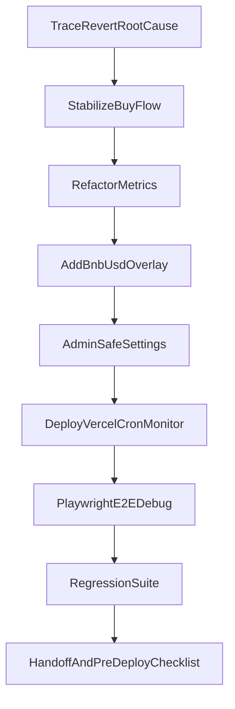

# План полного debug системы покупки

## Границы и зафиксированные решения
- Приоритет: сначала **core debug покупки**.
- `Available USDT` берём из **баланса owner wallet**.
- 24/7 мониторинг: **server_worker на Vercel Cron**.
- Курс BNB→USD: **CoinGecko API**.
- Блок `private key в UI` **исключён** (по security-политике).

## Этап 1 — Root-cause аудит revert
- Пройти цепочку: UI input → парсинг → `buyTokens(value)` → calldata → on-chain revert reason.
- Проверить формат чисел (`0,005` vs `0.005`), округления, min/max guards, адрес текущего контракта и цепь 97.
- Зафиксировать автотестом воспроизводимость ошибок.

Ключевые файлы:
- [frontend/components/SaleCard.tsx](frontend/components/SaleCard.tsx)
- [frontend/hooks/useTokenSale.ts](frontend/hooks/useTokenSale.ts)
- [frontend/lib/utils.ts](frontend/lib/utils.ts)
- [smart-contract/contracts/TokenSale.sol](smart-contract/contracts/TokenSale.sol)

## Этап 2 — Исправление покупки «идеально стабильно»
- Нормализовать ввод/вывод суммы BNB для транзакций (machine-safe string).
- Временно снять минимум до `1 token` (как вы попросили), но оставить явный pre-deploy reminder вернуть `500`.
- Проверить, что UI и контракт используют одинаковую бизнес-логику.

Ключевые файлы:
- [smart-contract/contracts/TokenSale.sol](smart-contract/contracts/TokenSale.sol)
- [smart-contract/test/TokenSale.test.ts](smart-contract/test/TokenSale.test.ts)
- [frontend/lib/constants.ts](frontend/lib/constants.ts)

## Этап 3 — Рефактор метрик и витрины
- `Available USDT` = реальный баланс owner wallet (автообновление).
- `Sold USDT` заменить на **Количество покупок** (счётчик транзакций покупки).
- Добавить **суточные продажи** и убрать `NaN%` в прогрессе.
- В блоке токена показывать полный адрес контракта; поле `Decimals` заменить на `Токены живут: N дней`.

Ключевые файлы:
- [frontend/components/TokenStats.tsx](frontend/components/TokenStats.tsx)
- [frontend/hooks/useTokenBalance.ts](frontend/hooks/useTokenBalance.ts)
- [frontend/hooks/useContractBalance.ts](frontend/hooks/useContractBalance.ts)
- [frontend/components/TokenInfoSection.tsx](frontend/components/TokenInfoSection.tsx)

## Этап 4 — Цена в USD и UX улучшения
- В блоке `К оплате` добавить вторую строку `≈ $...` по CoinGecko.
- Кэш/фолбэк курса, graceful degradation при недоступности API.
- Проверить readability и mobile/desktop UX.

Ключевые файлы:
- [frontend/components/SaleCard.tsx](frontend/components/SaleCard.tsx)
- [frontend/hooks/useTokenSale.ts](frontend/hooks/useTokenSale.ts)

## Этап 5 — Админка (безопасно) + персонализация
- Добавить удобные настройки адресов/параметров под BEP-20 в admin UI.
- Секреты (private key) только на сервере через env/secrets; UI управляет безопасными полями.
- Прописать в интерфейсе, какие поля требуют server-side env update.

Ключевые файлы:
- [frontend/components/AdminPanel.tsx](frontend/components/AdminPanel.tsx)
- [scripts/sync-frontend-env.mjs](scripts/sync-frontend-env.mjs)

## Этап 6 — 24/7 мониторинг на Vercel Cron
- Создать серверные endpoint/worker для периодического чтения:
  - owner wallet token balance,
  - покупки за сутки,
  - агрегаты для фронтенда.
- Настроить cron schedule, retry, простую телеметрию и health-check.

Ожидаемые файлы (будут добавлены):
- `frontend/app/api/monitor/*`
- `vercel.json` (если нужен cron конфиг)
- server-side storage helper (для daily aggregates)

## Этап 7 — Полный e2e debug через Playwright
- Сценарии:
  - покупка `1 token` (временный минимум),
  - покупка `500` и `1000` токенов,
  - edge/error cases,
  - обновление всех метрик после покупок.
- Артефакты: скриншоты/лог ошибок/результаты шагов.

## Этап 8 — Регрессия и handoff
- Контракты: `hardhat test`.
- Фронт: `npm run lint`, `npm run test`, `npm run build`.
- Финальный чеклист + список обязательных pre-deploy параметров.



## Шаблон данных для вставки (когда начнём выполнять)
Вставьте эти значения одним блоком, я подставлю в нужные места:

```txt
VERCEL_PROJECT_ID=
VERCEL_TEAM_ID=
VERCEL_TOKEN=
OWNER_WALLET_ADDRESS=
BSC_TESTNET_RPC=
COINGECKO_API_KEY= (optional)
TOKEN_CONTRACT_ADDRESS=
TOKEN_DECIMALS=
```

## Обязательный reminder перед deploy
- Сейчас минимум покупок будет временно `1 token`.
- Перед production deploy вернуть минимум на `500 tokens`.