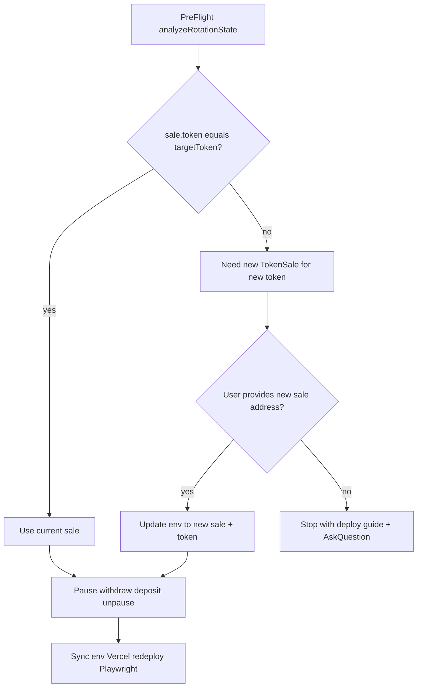

# Token Rotation — автоматизация и Cursor-команда

## Контекст

Сейчас ротация **не автоматизирована**:
- [`frontend/lib/inventory-keeper.ts`](c:\Users\Asus\.cursor\flash-tokens-trust\frontend\lib\inventory-keeper.ts) — `sweepIlliquidInventory()` и `previewIlliquidInventory()` **заглушки**
- Есть только `withdrawRemainingTokens` (admin UI) и `depositCustomToken` (API)
- [`smart-contract/deployed-contract.json`](c:\Users\Asus\.cursor\flash-tokens-trust\smart-contract\deployed-contract.json) **отсутствует** → env refresh падает
- Новый токен: `0x4670C8B56005C15B7F2013160eA1543A7B8D8888` (старый env: `0x11b4…8888`)

## Оптимальная стратегия sale-контракта

Sale привязан к одному `token()` — **сменить токен на существующем sale нельзя** (в ABI нет `setToken`).



**Выбор:** при новом токене — **новый sale-контракт** (или уже задеплоенный адрес от пользователя). Старый sale: pause → withdraw → env переключение → deposit в новый sale.

> Solidity/Hardhat в репо отсутствует — **авто-deploy sale из репо не делаем**. Pre-flight обнаружит mismatch и спросит адрес нового sale через `AskQuestion`; без него — остановка с инструкцией.

## Что создаём

### 1. Ядро: `frontend/lib/token-rotation.ts`

Единый orchestrator с типами и dry-run:

| Функция | Назначение |
|---------|------------|
| `analyzeRotationState()` | RPC snapshot: sale inventory, `sale.token()`, env token/sale, owner balances (old + target token), paused, BNB gas, guidance codes |
| `runTokenRotation(opts)` | Полный pipeline с `{ dryRun, depositAmount, targetToken, targetSale, pause: true }` |

**Шаги `runTokenRotation` (live):**
1. Validate `KEEPER_PRIVATE_KEY` = `sale.owner()`
2. `pause()` на **текущем** sale (если не paused)
3. `withdrawRemainingTokens()` — вычистка inventory (sweep)
4. Если `targetSale` ≠ текущий env sale → обновить [`smart-contract/deployed-contract.json`](c:\Users\Asus\.cursor\flash-tokens-trust\smart-contract\deployed-contract.json) + [`frontend/.env.local`](c:\Users\Asus\.cursor\flash-tokens-trust\frontend\.env.local) (без коммита секретов)
5. `approve` + `depositTokens(amount)` на **target sale** с **target token**
6. `unpause()` на target sale
7. Вернуть JSON-отчёт (tx hashes, balances before/after)

**Реализовать заглушки** в [`inventory-keeper.ts`](c:\Users\Asus\.cursor\flash-tokens-trust\frontend\lib\inventory-keeper.ts):
- `previewIlliquidInventory()` → делегирует в `analyzeRotationState`
- `sweepIlliquidInventory()` → `withdrawRemainingTokens` через keeper wallet

### 2. CLI: `scripts/token-rotation.mjs`

```bash
node scripts/token-rotation.mjs --dry-run
node scripts/token-rotation.mjs --execute --amount 60000 --token 0x4670... --sale 0x...
```

- Читает env из `frontend/.env.local`
- `--dry-run` — только `analyzeRotationState` + JSON в stdout
- `--execute` — требует явные `--amount`, `--token`, `--sale` (или подтверждение через agent)
- Exit code 0/1 для CI/agent
- Лог в `memory/rotation/YYYY-MM-DD-HHmm.json`

### 3. Post-rotation pipeline (встроено в CLI флаг `--full`)

Последовательность после on-chain:
1. `node scripts/refresh-vercel-production-env.mjs` — требует `deployed-contract.json`
2. `cd frontend && npx vercel deploy --prod --yes`
3. `npm run audit:playwright`
4. `GET /api/monitor` — inventory ≈ deposit amount, chainId 56

### 4. `deployed-contract.json` — шаблон + runtime update

Создать [`smart-contract/deployed-contract.json.example`](c:\Users\Asus\.cursor\flash-tokens-trust\smart-contract\deployed-contract.json.example) (в git).  
Runtime-файл генерируется rotation script из подтверждённых адресов:

```json
{
  "chainId": 56,
  "token": "0x4670C8B56005C15B7F2013160eA1543A7B8D8888",
  "tokenSale": "<NEW_SALE_ADDRESS>",
  "deployedAt": "<ISO>",
  "paymentRecipient": "0x4e8cEf391d4B1b06e1a643765cC7BbDef6F28953"
}
```

Добавить `deployed-contract.json` в [`.gitignore`](c:\Users\Asus\.cursor\flash-tokens-trust\.gitignore) (локальный runtime, не секреты).

### 5. Cursor-команда: `.cursor/commands/token-rotation.md`

Путь: [`flash-tokens-trust/.cursor/commands/token-rotation.md`](c:\Users\Asus\.cursor\flash-tokens-trust\.cursor\commands\token-rotation.md)

**Workflow для агента (при `/token-rotation`):**

1. `cd c:\Users\Asus\.cursor\flash-tokens-trust`
2. `node scripts/token-rotation.mjs --dry-run` — прочитать JSON
3. **AskQuestion** (динамически из pre-flight):
   - Сумма депозита (всегда спрашивать, без дефолта)
   - Подтверждение target token (предзаполнить `0x4670…8888` если баланс найден)
   - Адрес **нового sale** (обязателен при mismatch `sale.token()`)
   - Подтверждение full pipeline (env + deploy + playwright)
4. `--execute --full` с подтверждёнными параметрами
5. Обновить [`AGENTS.md`](c:\Users\Asus\.cursor\flash-tokens-trust\AGENTS.md) + `memory/rotation/` log
6. **Никогда** не коммитить ключи; `KEEPER_PRIVATE_KEY` только из env

### 6. API route (опционально, для admin UI)

`POST /api/admin/keeper/rotate` — обёртка над `runTokenRotation` с admin session auth (как [`keeper/deposit`](c:\Users\Asus\.cursor\flash-tokens-trust\frontend\app\api\admin\keeper\deposit\route.ts)).

### 7. Тесты

- Vitest unit test для `analyzeRotationState` parsing/guidance codes (mock provider)
- Smoke: `node scripts/token-rotation.mjs --dry-run` в QA

### 8. Первый запуск (сразу после реализации, без повторного спроса о «делать ли»)

После создания команды агент **автоматически**:
1. Dry-run
2. AskQuestion **только** по обязательным полям (amount, new sale address если нет в env)
3. Execute full pipeline
4. Playwright confirm `ok: true`

## Безопасность

- Dry-run обязателен перед execute
- Pause во время ротации (подтверждено)
- Проверка owner wallet + min BNB gas (0.001 BNB)
- Проверка owner token balance ≥ deposit amount
- Tx hashes в rotation log для audit trail

## Файлы (изменения)

| Файл | Действие |
|------|----------|
| `frontend/lib/token-rotation.ts` | **новый** — orchestrator |
| `frontend/lib/inventory-keeper.ts` | реализовать sweep/preview |
| `scripts/token-rotation.mjs` | **новый** — CLI |
| `smart-contract/deployed-contract.json.example` | **новый** |
| `.gitignore` | + `deployed-contract.json` |
| `.cursor/commands/token-rotation.md` | **новый** — Cursor command |
| `frontend/app/api/admin/keeper/rotate/route.ts` | **новый** — admin API |
| `AGENTS.md` | rotation workflow note |
| `memory/rotation/` | runtime logs |

## Риски и mitigations

| Риск | Mitigation |
|------|------------|
| Нет адреса нового sale | Pre-flight + AskQuestion; stop с guide |
| `deployed-contract.json` missing | Script создаёт из confirmed params |
| Keeper key ≠ owner | `NOT_OWNER` guidance, abort |
| Vercel env refresh fail | On-chain всё равно done; warn + manual redeploy |

## Критический блокер для первого запуска

Для токена `0x4670…8888` **нужен адрес нового TokenSale**. При реализации pre-flight покажет mismatch; в AskQuestion запросим адрес. Если sale ещё не задеплоен — команда выдаст пошаговый guide (deploy sale → повторить rotation).
