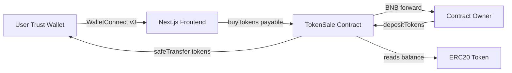

# Token Sale DApp — Production Build Plan

## Current state

- Workspace [`c:\Users\Asus\.cursor\flash-tokens-trust`](c:\Users\Asus\.cursor\flash-tokens-trust) is **empty** (no `package.json`, no git init in this folder).
- User logo exists in Cursor assets: copy to [`frontend/public/logo.png`](frontend/public/logo.png) from `C:\Users\Asus\.cursor\projects\c-Users-Asus-cursor-flash-tokens-trust\assets\...\photo_6102482357173555677_y-77ba9dfd-dda4-42a2-a47c-4d832ec5e41d.png`.
- **Your choices:** MockERC20 on testnet; `NEXT_PUBLIC_CHAIN_ID=97` for first deploy.

## Target architecture



**Purchase math (must match spec exactly):**

- `tokenAmount = (bnbWei * rate) / 1e18`
- Initial `rate = 120728760000000000000000` (~120,728.76 tokens per 1 BNB)
- Initial `maxTokensPerTx = 20000000000000000000000` (20,000 × 10^18)
- `MIN_BNB = 0.005 ether`

---

## Phase 1 — Smart contract (`smart-contract/`)

### 1.1 Scaffold Hardhat + dependencies

Create [`smart-contract/package.json`](smart-contract/package.json) with:

- `hardhat`, `@nomicfoundation/hardhat-toolbox`, `@nomicfoundation/hardhat-verify`, `solidity-coverage`, `hardhat-gas-reporter`, `dotenv`, `typescript`
- **`@openzeppelin/contracts@4.9.6`** — matches spec import paths (`security/ReentrancyGuard`, `security/Pausable`, `access/Ownable`)

Root [`.gitignore`](.gitignore) at repo root: `.env`, `node_modules`, `artifacts`, `cache`, `coverage`, `typechain`, `deployed-contract.json` (optional: commit testnet addresses only via `deployed-contract.example.json`).

### 1.2 Contracts

| File | Purpose |
|------|---------|
| [`smart-contract/contracts/TokenSale.sol`](smart-contract/contracts/TokenSale.sol) | Full implementation per spec: `buyTokens`, admin (`setRate`, `setMaxTokensPerTx`, `pause`/`unpause`, withdrawals), views, `receive()` revert, NatSpec on all public/external functions |
| [`smart-contract/contracts/MockERC20.sol`](smart-contract/contracts/MockERC20.sol) | OZ `ERC20` + `mint` for testnet/local tests (name/symbol/decimals match prod: Tether USD / USDT / 18) |

**TokenSale implementation notes:**

- Use `SafeERC20` for all token transfers.
- **CEI order in `buyTokens`:** validate → update `totalSold` / `purchased` → `safeTransfer` tokens → forward BNB to `owner()` (reentrancy guarded).
- `getMaxPurchase()` view: derive max BNB from `maxTokensPerTx` and `rate`: `(maxTokensPerTx * 1e18) / rate`.
- `emergencyWithdrawBNB()` onlyOwner; no extra event beyond spec (spec lists `EmergencyWithdrawal` for token withdraw only).

### 1.3 Hardhat config

[`smart-contract/hardhat.config.ts`](smart-contract/hardhat.config.ts):

- Solidity `0.8.19`, optimizer `runs: 200`
- Networks: `bscTestnet` (chainId 97), `bscMainnet` (chainId 56), `hardhat` for unit tests
- `etherscan` customChains for BscScan (mainnet + testnet)
- Gas reporter + coverage plugins

### 1.4 Scripts

| Script | Behavior |
|--------|----------|
| [`scripts/deploy.ts`](smart-contract/scripts/deploy.ts) | Deploy `TokenSale` with `TOKEN_ADDRESS`, rate, max; on testnet optionally deploy `MockERC20` if `USE_MOCK_TOKEN=true`; write [`deployed-contract.json`](smart-contract/deployed-contract.json) `{ network, tokenSale, token, rate, maxTokensPerTx, deployedAt }`; auto-verify if `BSCSCAN_API_KEY` set |
| [`scripts/deposit.ts`](smart-contract/scripts/deposit.ts) | Read amount from env `DEPOSIT_AMOUNT`; check allowance; approve if needed; `depositTokens` |
| [`scripts/verify.ts`](smart-contract/scripts/verify.ts) | `hardhat verify` using saved constructor args from `deployed-contract.json` |

### 1.5 Test suite

[`smart-contract/test/TokenSale.test.ts`](smart-contract/test/TokenSale.test.ts) using **local Hardhat + MockERC20** (not live testnet):

- Deployment: token, rate, max, owner, `MIN_BNB`
- `depositTokens` / `buyTokens` happy path
- Limits: below min BNB, above `maxTokensPerTx`, insufficient contract balance
- Admin: `setRate`, `setMaxTokensPerTx`, pause blocks buy, unpause restores
- Withdrawals: `withdrawRemainingTokens`, `emergencyWithdrawBNB`
- Access control: non-owner reverts on all admin functions
- `receive()` reverts
- Reentrancy: malicious contract attempt on `buyTokens` (attacker receives tokens but cannot re-enter profitably)
- View helpers: `calculateTokenAmount`, `getMaxPurchase`, `isPaused`

**Gate:** `npx.cmd hardhat test` 100% pass; `npx.cmd hardhat coverage` target **>90%** line coverage on `TokenSale.sol`.

### 1.6 Env template

[`smart-contract/.env.example`](smart-contract/.env.example):

```
PRIVATE_KEY=
BSCSCAN_API_KEY=
TOKEN_ADDRESS=0x327D87678A2f1d67048b34a048Bb6D68e6168888
USE_MOCK_TOKEN=true
DEPOSIT_AMOUNT=1000000
```

---

## Phase 2 — Frontend (`frontend/`)

### 2.1 Scaffold Next.js 14

- `create-next-app` with App Router, TypeScript **strict**, Tailwind 3.4, ESLint
- Dependencies: `ethers@6.11`, `@rainbow-me/rainbowkit@2`, `wagmi@2`, `viem@2`, `@tanstack/react-query@5`, `framer-motion@11`, `react-hot-toast@2`, `clsx`, `tailwind-merge`

### 2.2 Config layer

| File | Content |
|------|---------|
| [`frontend/config/chains.ts`](frontend/config/chains.ts) | `bsc` + `bscTestnet` viem definitions |
| [`frontend/config/rainbow.ts`](frontend/config/rainbow.ts) | `projectId: b13552d74dff1fb7a0d3e6008e0e9412`, dark theme, `accentColor: #00ffa3` |
| [`frontend/config/contracts.ts`](frontend/config/contracts.ts) | Full `TokenSale` ABI (from artifact); addresses map `{ 97: testnetAddress, 56: mainnetAddress }` from env + `deployed-contract.json` sync helper comment |
| [`frontend/lib/constants.ts`](frontend/lib/constants.ts) | Mainnet token `0x327D...`, display rate string, min BNB, branding |
| [`frontend/lib/utils.ts`](frontend/lib/utils.ts) | `formatEther`, `parseEther`, `formatUnits`, shorten address, debounce helper |

**Chain resolution:** `getContractAddress(chainId)` throws friendly error if address missing for connected chain.

### 2.3 Providers

[`frontend/app/providers.tsx`](frontend/app/providers.tsx) — client component:

- `WagmiProvider` + `QueryClientProvider` + `RainbowKitProvider`
- `ssr: true` pattern for Next.js (dynamic import of ConnectButton where needed)

[`frontend/app/layout.tsx`](frontend/app/layout.tsx) — Inter via `next/font`, metadata, `<Toaster />`, dark `bg-[#0a0a0a]`.

[`frontend/app/globals.css`](frontend/app/globals.css) — glass utilities, emerald glow, honeychain-inspired minimal layout (centered hero + single sale card; no heavy marketing sections).

### 2.4 Hooks (wagmi `useReadContract` / `useWriteContract` + ethers formatters)

| Hook | Reads / writes |
|------|----------------|
| `useTokenSale.ts` | All sale interactions + formatted getters |
| `useTokenBalance.ts` | User ERC20 `balanceOf` |
| `useContractBalance.ts` | Sale contract token balance |
| `useIsOwner.ts` | `owner()` vs `useAccount().address` |
| `useContractStatus.ts` | `isPaused()` |

`useTokenSale.buyTokens`: parse BNB → `writeContract({ functionName: 'buyTokens', value })` → wait → toast.

Polling: `TokenStats` refetch interval **10s** via `refetchInterval` on read queries.

### 2.5 Components

| Component | Key behavior |
|-----------|--------------|
| `Header.tsx` | Fixed glass nav, logo + "USDT Sale", RainbowKit `ConnectButton`, red **PAUSED** badge when paused |
| `Hero.tsx` | Gradient headline "Buy Tether USD", subtext |
| `SaleCard.tsx` | BNB input (min 0.005), debounced `calculateTokenAmount` (300ms), rate/limits display, emerald CTA, disabled states, pause overlay |
| `TokenStats.tsx` | 3-col grid: available / sold / your balance; sold % progress bar; max per tx |
| `AdminPanel.tsx` | Owner-only; 4 sections with **confirm modal** before each tx: pause/resume, rate, max limit, withdraw tokens |
| `ui/Button.tsx`, `Input.tsx`, `Card.tsx` | Shared glass styling |

[`frontend/app/page.tsx`](frontend/app/page.tsx) — compose Header → Hero → SaleCard → TokenStats → AdminPanel.

### 2.6 Env

[`frontend/.env.example`](frontend/.env.example):

```
NEXT_PUBLIC_WALLET_CONNECT_PROJECT_ID=b13552d74dff1fb7a0d3e6008e0e9412
NEXT_PUBLIC_TOKEN_SALE_CONTRACT=
NEXT_PUBLIC_TOKEN_CONTRACT=0x327D87678A2f1d67048b34a048Bb6D68e6168888
NEXT_PUBLIC_CHAIN_ID=97
```

On testnet with mock token: set `NEXT_PUBLIC_TOKEN_CONTRACT` to deployed MockERC20 address from `deployed-contract.json`.

### 2.7 Frontend tests (lightweight)

- Add Vitest + `@testing-library/react` (optional but satisfies “preferred”):
  - Unit test `lib/utils.ts` formatters
  - Smoke render `SaleCard` with mocked wagmi provider

**Gate:** `npm run build` zero TS errors; `npm run lint` clean.

---

## Phase 3 — Testnet deploy & Vercel

### 3.1 Testnet sequence (agent runs after you add secrets)

1. Fund deployer with testnet BNB ([faucet](https://testnet.bnbchain.org/faucet-smart))
2. `cd smart-contract && npx.cmd hardhat run scripts/deploy.ts --network bscTestnet` with `USE_MOCK_TOKEN=true`
3. Mint + `deposit.ts` large mock balance into `TokenSale`
4. `npx.cmd hardhat run scripts/verify.ts --network bscTestnet` (if API key present)
5. Copy addresses into `frontend/.env.local` and `contracts.ts` map for chain `97`
6. Manual smoke: connect Trust Wallet → buy min BNB → admin pause → buy blocked → unpause

### 3.2 Mainnet (after testnet sign-off)

- Redeploy `TokenSale` with **real** `TOKEN_ADDRESS=0x327D...` (no mock)
- Owner deposits real inventory via `deposit.ts`
- Update `NEXT_PUBLIC_CHAIN_ID=56` and mainnet sale address on Vercel production env

### 3.3 Vercel

- Project root: [`frontend/`](frontend/)
- Add [`frontend/vercel.json`](frontend/vercel.json) if needed (framework preset Next.js)
- Env vars in Vercel dashboard mirror `.env.local` per environment (Preview → 97, Production → 56 when ready)

### 3.4 CI (recommended)

[`.github/workflows/test.yml`](.github/workflows/test.yml):

- Job 1: `smart-contract` — `npm ci`, `hardhat test`, `hardhat coverage` (fail if coverage &lt; 90% on TokenSale)
- Job 2: `frontend` — `npm ci`, `lint`, `build`

---

## Phase 4 — Documentation

[`README.md`](README.md) at repo root:

- Monorepo layout (`smart-contract/`, `frontend/`)
- Install commands (`npx.cmd` on Windows)
- Local test: `hardhat test`
- Testnet deploy + verify + deposit checklist
- Mainnet promotion steps
- Vercel deploy + env var table
- **Admin guide:** pause, rate, max tx, withdraw, emergency BNB
- Troubleshooting: wrong chain, insufficient sale inventory, Trust Wallet connection

---

## Security checklist (built into implementation)

- No private keys in source; `.env*` gitignored
- `ReentrancyGuard` on `buyTokens`
- `Pausable` emergency stop
- `onlyOwner` on admin paths
- Frontend: validate min/max before send; surface contract revert reasons in toasts
- User must confirm admin actions in modal

---

## Execution order (implementation session)

1. Root `.gitignore` + `README.md` skeleton
2. `TokenSale.sol` + `MockERC20.sol`
3. Hardhat config, scripts, full test suite → **tests green + coverage**
4. Copy logo → `frontend/public/logo.png`
5. Scaffold frontend + config/ABI
6. Hooks → components → `page.tsx` / `layout.tsx`
7. Fill `.env.example` files; document deploy commands
8. Testnet deploy (with your `PRIVATE_KEY` in local `.env` only)
9. `npm run build` + Vercel deploy instructions / optional `vercel` CLI

---

## Risks / notes

- **Branding vs reality:** UI labels "Tether USD / USDT" per spec; on testnet the sold asset is **MockERC20**, not mainnet USDT — document clearly in README.
- **OpenZeppelin v5:** Not used; v4.9 paths required by spec.
- **Honeychain clone:** Reference site timed out during planning; UI follows your written tokens (dark `#0a0a0a`, emerald `#00ffa3`, glass card, centered sale) — visual pass with browser screenshot after first build.
- **Mainnet token:** Production uses `0x327D87678A2f1d67048b34a048Bb6D68e6168888`; owner must hold and approve inventory before sales go live.
